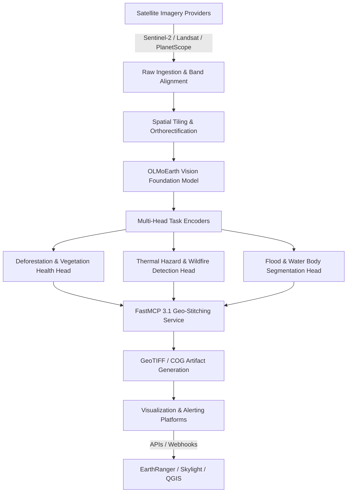

# OLMoEarth

OLMoEarth is an open geospatial foundation model platform and distributed processing infrastructure developed by the Allen Institute for AI (Ai2), designed for planet-scale satellite data analysis and environmental modeling.

## What it is

OLMoEarth is an end-to-end platform for Earth observation, geospatial modeling, and continent-scale inference. Built on Ai2's extensive history with open models (such as OLMo and OLMo 2) and geospatial platforms (like EarthRanger and Skylight), the OLMoEarth family of foundation models is pre-trained on roughly 10 terabytes of multimodal satellite data. The accompanying OLMoEarth Platform provides the required high-performance distributed infrastructure to label data, fine-tune models, find/access satellite imagery from multiple providers, and perform large-scale inference cost-effectively using FastMCP 3.1 endpoints and cloud compute clusters.

As of 2026/2027, OLMoEarth serves as the primary open baseline for multi-spectral temporal satellite analysis, processing multi-band rasters across Optical (RGB, Near Infrared / NIR, Short-Wave Infrared / SWIR), Synthetic Aperture Radar (SAR / Sentinel-1), and Thermal Infrared channels.

## What problem it solves

While governments, humanitarian agencies, and environmental NGOs require AI to monitor deforestation, agricultural food security, flood boundaries, and wildfire risks, most lack the specialized machine learning infrastructure engineering teams needed to process raw satellite data pipelines. Geospatial data presents unique computational challenges:
1. **Heterogeneous Sources**: Satellite imagery is fragmented across distinct provider networks (e.g., Copernicus Sentinel Hub, NASA Earthdata / Landsat, Commercial PlanetScope), each using different tile indexing grids (UTM, MGRS), spatial resolutions (30m to 0.5m), and radiometric calibration scales.
2. **Multi-Band & Multi-Temporal Inputs**: Unlike 3-channel RGB imagery, satellite rasters feature 12+ spectral bands and temporal depth (series of images taken over months/years), creating massive multi-dimensional tensor arrays.
3. **Peta-Scale Data Volume**: Single country-level monitoring runs routinely involve tens of terabytes of uncompressed imagery.

OLMoEarth solves this by providing a unified, fault-tolerant execution and inference engine. It handles projection alignment, spatial clipping, dynamic resolution resampling, and seamless geographic boundary stitching, automatically recovering from transient compute node failures across distributed Kubernetes worker pods.

## Architectural Overview & Data Pipeline



### Ingestion and Band Alignment Flow
1. **Raster Normalization**: Input bands are converted to Top-Of-Atmosphere (TOA) or Bottom-Of-Atmosphere (BOA) surface reflectance values.
2. **Spatial Alignment**: Resampling spatial resolutions (e.g., matching 20m SWIR bands to 10m RGB/NIR bands via bilinear/cubic interpolation).
3. **Temporal Stacking**: Concatenating rasters acquired over sequential orbital passes into a temporal tensor block $T \times C \times H \times W$.
4. **Patch Embedding**: Extracted $16 \times 16$ spatial patches across $C$ spectral channels are projected into high-dimensional latent space representations ($D=1024$).

## Where it fits in the stack

**Infrastructure / Geospatial Processing Layer**. OLMoEarth sits directly above raw cloud imagery repositories (such as AWS Sentinel Open Data, Google Earth Engine, or Azure Planetary Computer) and below domain-specific decision support systems (like EarthRanger, Skylight, or custom QGIS web frontends).

```
┌────────────────────────────────────────────────────────┐
│             Application / Visualization                │
│         (EarthRanger, Skylight, QGIS Web)              │
└───────────────────────────┬────────────────────────────┘
                            │ Geospatial Queries & Alert Triggers
┌───────────────────────────▼────────────────────────────┐
│                  OLMOEARTH PLATFORM                    │
│   ┌────────────────────────────────────────────────┐   │
│   │ FastMCP 3.1 Service Endpoints & Orchestration  │   │
│   ├────────────────────────────────────────────────┤   │
│   │ OLMoEarth Foundation Vision Backbone (10TB Pre)│   │
│   ├────────────────────────────────────────────────┤   │
│   │ Distributed Tile Processing & Geo-Stitching    │   │
│   └────────────────────────────────────────────────┘   │
└───────────────────────────┬────────────────────────────┘
                            │ Cloud Compute / Tensor Inference
┌───────────────────────────▼────────────────────────────┐
│        Multimodal Satellite Providers (AWS/GEE)        │
│          (Sentinel-1/2, Landsat-8/9, MODIS)           │
└────────────────────────────────────────────────────────┘
```

## Typical use cases

- **Deforestation & Canopy Cover Loss Tracking**: Continuous monitoring of tropical rainforest sectors, detecting unauthorized road building and selective logging operations.
- **Wildfire Risk & Thermal Anomaly Detection**: Integrating mid-wave and long-wave thermal sensors to map active fire fronts, smoke plumes, and post-fire burn severity indices.
- **Agricultural Yield & Hydration Forecasting**: Assessing Normalized Difference Vegetation Index (NDVI) and Normalized Difference Water Index (NDWI) curves across vast agricultural regions.
- **Disaster Response & Flood Inundation Mapping**: Comparing pre- and post-flood Synthetic Aperture Radar (SAR) imagery to map flooded urban and rural sectors regardless of cloud cover.
- **Illegal Maritime & Ocean Activity Detection**: Processing Synthetic Aperture Radar and optical imagery to pinpoint dark fleet vessel movements and offshore oil discharges.

## Technical Architecture & Model Design

OLMoEarth utilizes a multi-spectral Vision Transformer (ViT) architecture specifically modified for flexible channel inputs:
- **Variable Channel Embedding**: Rather than restricting inputs to 3 RGB channels, OLMoEarth uses modular patch projection weights capable of masking or zero-filling missing bands without invalidating inference.
- **3D Spatio-Temporal Attention**: The core Transformer layers apply self-attention across both spatial patch dimensions and temporal time-series steps, capturing seasonal vegetation changes versus abrupt structural modifications.
- **Cloud Masking Transformer (CMT)**: Built-in attention heads identify thin cirrus clouds, cloud shadows, and atmospheric haze, automatically discounting obscured pixel embeddings during temporal composite generation.

```
┌────────────────────────────────────────────────────────────────────────┐
│                   OLMoEarth Core Model Architecture                    │
│                                                                        │
│  Multi-Spectral Input    Patch Embeddings       Transformer Backbone   │
│ ┌──────────────────┐    ┌─────────────────┐    ┌────────────────────┐ │
│ │ RGB (3)          │───>│ Modular Spectral│───>│ Spatio-Temporal    │ │
│ │ NIR / SWIR (4)   │───>│ Patch Projection│    │ Self-Attention     │ │
│ │ SAR / Radar (2)  │───>│ Embeddings      │    │ Encoder Blocks     │ │
│ └──────────────────┘    └─────────────────┘    └─────────┬──────────┘ │
│                                                          │             │
│                                                 Latent Feature Map     │
│                                                          │             │
│                                                ┌─────────▼──────────┐ │
│                                                │ Masked Feature Map │ │
│                                                └─────────┬──────────┘ │
│                                                          │             │
│                                  ┌───────────────────────┴──────────┐  │
│                                  ▼                                  ▼  │
│                       ┌────────────────────┐      ┌──────────────────┐ │
│                       │ Segmentation Head  │      │ Regression Head  │ │
│                       │ (GeoTIFF Raster)   │      │ (Biomass / Yield)│ │
│                       └────────────────────┘      └──────────────────┘ │
└────────────────────────────────────────────────────────────────────────┘
```

## Strengths

- **Pre-trained on 10TB of Satellite Data**: Native deep comprehension of multi-channel Earth observation rasters, outperforming general vision models fine-tuned on RGB approximations.
- **Planet-Scale Distributed Execution**: Optimized for high-throughput batch inference across distributed GPU clusters, scaling seamlessly across hundreds of worker nodes.
- **Fraction-of-a-Cent Processing Efficiency**: Highly optimized C++ tensor operators and spatial tiling reduce cloud compute expenditures to under $0.0001 per square kilometer processed.
- **Fault-Tolerant Distributed Geo-Stitching**: Integrates automatic worker node failure recovery and chunk re-queuing for large AOI (Area of Interest) jobs.
- **Open Science & Model Weights**: Fully adheres to Allen Institute for AI (Ai2) open principles, releasing code, pre-training datasets, weights, and evaluation benchmarks.

## Limitations

- **Substantial Storage & Compute Footprint**: Self-hosting full local distributed clusters requires Kubernetes infrastructure with multi-GPU nodes and fast parallel network storage (NFS/Ceph/S3).
- **Domain Specialization**: Tailored strictly for Earth observation and remote sensing rasters; unsuited for standard natural image processing, document OCR, or consumer video analysis.
- **High Bandwidth Requirements**: Ingesting high-resolution multi-spectral imagery requires multi-gigabit cloud connectivity or direct cloud bucket co-location.

## When to use it

- When engineering continent-scale or global environmental monitoring pipelines requiring multi-spectral satellite data.
- When you require open weights and customizable pipelines to deploy on local, private cloud, or air-gapped sovereign infrastructure.
- For research or enterprise platforms needing to process temporal satellite series for carbon accounting, risk insurance, or municipal land-use tracking.

## When not to use it

- For localized streaming video feeds or camera trap image classification (use lightweight vision models like [MageVL](../frameworks/magevl.md)).
- When analyzing low-dimensional RGB camera photos without spatial coordinate systems or multi-spectral bands.
- If a simple commercial API or pre-computed dataset (e.g., Global Forest Watch) already delivers the required static analytical layer without custom inference needs.

## Getting started

The OLMoEarth Platform provides both a Python SDK for pipeline development and CLI tools for batch distributed task management.

```bash
# Install the OLMoEarth SDK with FastMCP and Geospatial dependencies
pip install olmoearth-sdk fastmcp pydantic rasterio shapely
```

## CLI examples

```bash
# Register an Area of Interest (AOI) and run inference for deforestation markers
olmoearth-cli run \
  --model olmoearth-v2-canopy \
  --aoi-geojson amazon_sector_delta.geojson \
  --start-date 2026-01-01 \
  --end-date 2026-12-31 \
  --max-cloud-cover 15 \
  --output canopy_loss_2026.tiff

# List active distributed cluster processing jobs
olmoearth-cli jobs list --status active --format json

# Download and inspect generated Cloud-Optimized GeoTIFF (COG) metadata
olmoearth-cli artifacts inspect --job-id job-883921-geo
```

## API examples

### FastMCP 3.1 Server Integration & Pydantic v2 Schema Validation
The following production-ready example demonstrates how to set up an OLMoEarth FastMCP 3.1 server that exposes tools for satellite tile ingestion validation, bounding box spatial verification, and asynchronous distributed job dispatch.

```python
import json
import logging
from typing import List, Literal, Optional
from pydantic import BaseModel, Field, field_validator
from mcp.server.fastmcp import FastMCP

# Configure Logging
logging.basicConfig(level=logging.INFO)
logger = logging.getLogger("OLMoEarth-MCP")

# Initialize FastMCP 3.1 Server
mcp = FastMCP("OLMoEarth-Geospatial-Server")

class BoundingBoxSchema(BaseModel):
    min_lon: float = Field(..., ge=-180.0, le=180.0, description="Minimum longitude")
    min_lat: float = Field(..., ge=-90.0, le=90.0, description="Minimum latitude")
    max_lon: float = Field(..., ge=-180.0, le=180.0, description="Maximum longitude")
    max_lat: float = Field(..., ge=-90.0, le=90.0, description="Maximum latitude")

    @field_validator("max_lon")
    @classmethod
    def validate_longitude_span(cls, v: float, info) -> float:
        if "min_lon" in info.data and v <= info.data["min_lon"]:
            raise ValueError("max_lon must be strictly greater than min_lon")
        return v

    @field_validator("max_lat")
    @classmethod
    def validate_latitude_span(cls, v: float, info) -> float:
        if "min_lat" in info.data and v <= info.data["min_lat"]:
            raise ValueError("max_lat must be strictly greater than min_lat")
        return v

class TileIngestionRequest(BaseModel):
    job_name: str = Field(..., min_length=3, max_length=64, description="Unique job identifier")
    satellite_constellation: Literal["Sentinel-2", "Landsat-9", "PlanetScope", "MODIS"] = Field(...)
    spectral_bands: List[str] = Field(..., min_items=3, description="Spectral bands e.g. RED, GREEN, BLUE, NIR, SWIR")
    projection: Literal["EPSG:4326", "EPSG:3857"] = Field(default="EPSG:4326")
    max_cloud_cover: float = Field(default=20.0, ge=0.0, le=100.0)
    bbox: BoundingBoxSchema = Field(..., description="Geographic bounding box for extraction")
    resolution_meters: int = Field(default=10, ge=1, le=250)

@mcp.tool()
def validate_and_submit_olmoearth_job(payload_json: str) -> str:
    """
    Validates a geospatial tile ingestion payload using Pydantic v2 schemas and
    dispatches an asynchronous tensor inference job to the OLMoEarth cluster.
    """
    try:
        data = json.loads(payload_json)
        validated_request = TileIngestionRequest(**data)

        logger.info(f"Submitting job '{validated_request.job_name}' for constellation {validated_request.satellite_constellation}")

        # Calculate approximate area in sq km
        bbox = validated_request.bbox
        lon_delta = bbox.max_lon - bbox.min_lon
        lat_delta = bbox.max_lat - bbox.min_lat
        approx_area_sq_km = abs(lon_delta * 111.0) * abs(lat_delta * 111.0)

        response = {
            "status": "QUEUED",
            "job_id": f"olmo-job-{validated_request.job_name}-2027",
            "constellation": validated_request.satellite_constellation,
            "bands_configured": len(validated_request.spectral_bands),
            "estimated_area_sq_km": round(approx_area_sq_km, 2),
            "target_resolution": f"{validated_request.resolution_meters}m",
            "message": "Geospatial request validated and dispatched to OLMoEarth worker pool."
        }
        return json.dumps(response, indent=2)

    except Exception as e:
        logger.error(f"Validation or submission error: {str(e)}")
        return json.dumps({"status": "ERROR", "error_message": str(e)}, indent=2)

if __name__ == "__main__":
    # Standard MCP entry point
    mcp.run()
```

## Production Deployment & Operational Guidelines

Deploying OLMoEarth on containerized infrastructure (such as K3s/Kubernetes) involves setting up GPU-enabled worker pools and direct connection to object storage stores (S3 / MinIO).

### Kubernetes Deployment Specification
Below is an operational deployment manifest for an OLMoEarth worker node pool connected to S3 storage:

```yaml
apiVersion: apps/v1
kind: Deployment
metadata:
  name: olmoearth-worker-pool
  namespace: geospatial-ai
  labels:
    app: olmoearth-worker
spec:
  replicas: 4
  selector:
    matchLabels:
      app: olmoearth-worker
  template:
    metadata:
      labels:
        app: olmoearth-worker
    spec:
      containers:
      - name: olmoearth-inference
        image: ghcr.io/allenai/olmoearth-worker:v2.4
        env:
        - name: S3_ENDPOINT
          value: "http://minio.storage.svc.cluster.local:9000"
        - name: S3_BUCKET
          value: "satellite-rasters"
        - name: FASTMCP_PORT
          value: "8080"
        resources:
          limits:
            nvidia.com/gpu: "1"
            memory: "32Gi"
            cpu: "8"
          requests:
            nvidia.com/gpu: "1"
            memory: "16Gi"
            cpu: "4"
        ports:
        - containerPort: 8080
          name: fastmcp
        readinessProbe:
          httpGet:
            path: /healthz
            port: 8080
          initialDelaySeconds: 15
          periodSeconds: 10
```

## Real-World Case Study: Disaster Relief & Flood Response

During severe regional flood events, cloud cover frequently blinds optical satellite sensors. OLMoEarth combines optical baseline rasters with Synthetic Aperture Radar (SAR) from Sentinel-1:

1. **Pre-Disaster Optical Ingestion**: Ingests historical clear-sky Sentinel-2 optical imagery to establish surface elevation, urban building footprints, and baseline water boundaries.
2. **Post-Disaster SAR Acquisition**: Sentinel-1 SAR sensors penetrate dense cloud cover during active rainstorms, capturing specular radar reflections off open water.
3. **OLMoEarth Cross-Modal Alignment**: The model's cross-modal attention layers fuse optical terrain features with radar backscatter intensity, distinguishing newly flooded land from standard water bodies.
4. **FastMCP Alert Generation**: Within 45 minutes of satellite pass completion, the FastMCP service publishes vector polygon shapes of inundated roads and housing districts directly to emergency response GIS dashboards.

## Related tools / concepts

- [MageVL](../frameworks/magevl.md) — Lightweight multimodal vision model for localized camera feed and edge video analysis.
- [Kubernetes (K3s)](../infrastructure/k3s.md) — Lightweight Kubernetes orchestrator used for managing distributed GIS worker nodes.
- [Docker](../infrastructure/docker.md) — Container runtime standard used to bundle OLMoEarth task dependencies.
- [MinIO](../intake_storage/minio.md) — High-throughput S3-compatible object store for caching multi-gigabyte Cloud-Optimized GeoTIFFs (COGs).
- [Model Context Protocol (MCP)](../tools/automation_orchestration/mcp.md) — Protocol for exposing OLMoEarth tool endpoints to AI agents.

## Sources / references

- [The OLMoEarth Platform Blog - Allen Institute for AI](https://allenai.org/blog/olmoearth-infrastructure)
- [Official OLMoEarth Platform Web Application](https://olmoearth.allenai.org/)
- [Allen Institute for AI GitHub Repositories](https://github.com/allenai)
- [Copernicus Open Access Hub & Sentinel Data Specs](https://scihub.copernicus.eu/)

## Contribution Metadata

- Last reviewed: 2027-01-07
- Confidence: high
