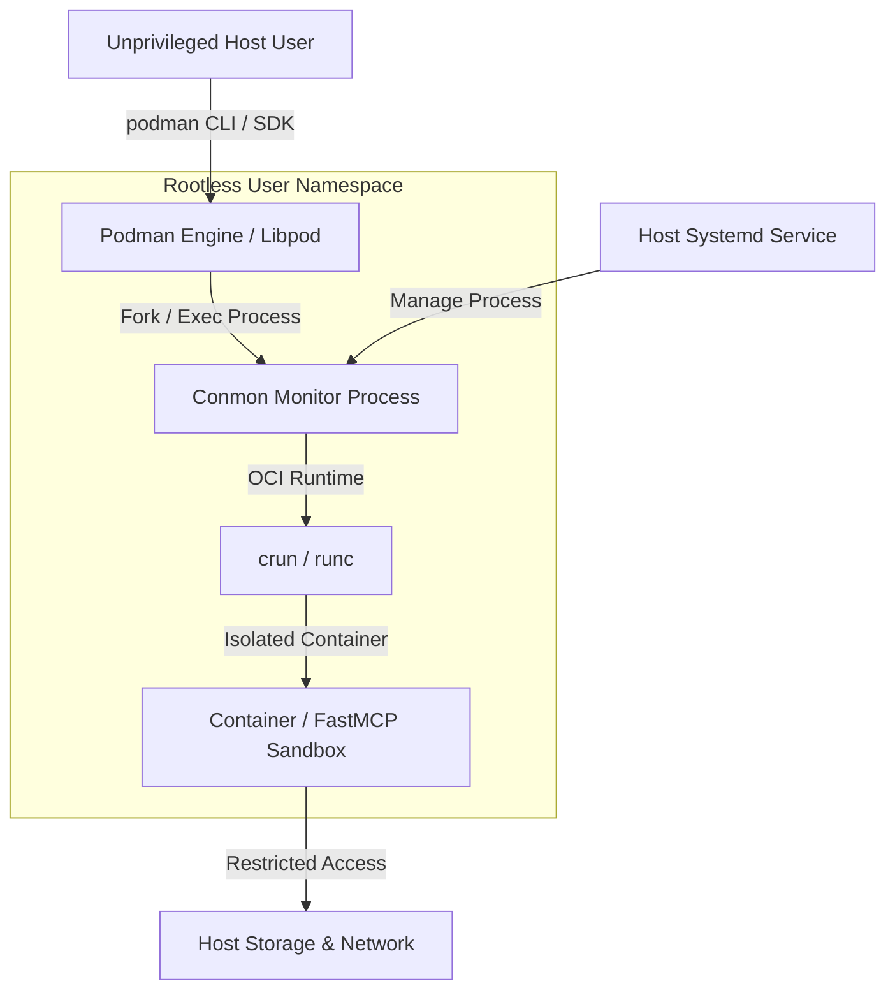

# Podman

## What it is
Podman (Pod Manager) is a daemonless, open-source Linux container engine designed to develop, manage, and run Open Container Initiative (OCI) containers and container pods. Developed originally by Red Hat, Podman offers a drop-in command-line replacement for Docker (`alias docker=podman`) while operating entirely without a central root-privileged daemon process.

By leveraging native Linux kernel features—such as user namespaces, cgroups v2, SELinux, and Seccomp—Podman enables rootless container execution where unprivileged users can build, run, and manage isolated workloads without administrative privileges.

## What problem it solves
Traditional container runtimes rely on a centralized, root-privileged daemon process (e.g., `dockerd`), which introduces significant security vulnerabilities, single-point-of-failure risks, and administrative friction in enterprise and multi-tenant environments. A compromise of the Docker daemon grants attackers full root access to the host operating system.

Podman solves this security risk by adopting a daemonless architecture. Containers are launched directly as child processes of the invoking user shell or systemd service, constrained within unprivileged Linux user namespaces. This ensures that even if a containerized process is compromised, the attacker remains an unprivileged user on the host system.

## Where it fits in the stack
**Infrastructure / Container Runtime**. It serves as an enterprise-grade container runtime for local development, secure AI agent sandboxing, rootless container deployments, edge devices, and Kubernetes-compatible local pod execution.



## Typical use cases
- **Rootless Container Execution**: Running secure, isolated workloads in multi-tenant environments and corporate workstations without granting root privileges.
- **AI Agent Sandboxing**: Executing untrusted AI code, FastMCP tool servers, or dynamic code interpreters inside non-root containers with strict SELinux and Seccomp profiles.
- **Kubernetes Pod Simulation**: Creating, testing, and exporting local Kubernetes-compatible pods (`podman generate kube` and `podman play kube`) prior to cluster deployment.
- **Systemd Service Integration**: Managing containerized home-lab services as native systemd unit files (`podman generate systemd` or systemd quadlets).

## Strengths
- **Daemonless Architecture**: Directly executes containers as child processes, improving auditing, process isolation, and system reliability.
- **Rootless Security**: Enhances host security by isolating containerized workloads inside unprivileged Linux user namespaces.
- **Docker CLI Compatibility**: Near 100% command-line flag compatibility with Docker (`podman run`, `podman build`, `podman compose`).
- **Native Pod Support**: Supports grouping containers into pods that share network namespaces and IPC volumes, mirroring Kubernetes pods.
- **Systemd Quadlet Integration**: Native declaratively configured systemd integration for robust auto-restarting services on boot.

## Limitations
- **Docker Socket Bindings**: Third-party developer tools expecting direct socket access to `/var/run/docker.sock` require active `podman.socket` service emulation.
- **Platform Emulation Layer**: Operates natively on Linux; requires a lightweight VM (QEMU/VFKit via `podman machine`) on macOS and Windows workstations.
- **Rootless Networking Constraints**: Rootless networking (via `slirp4netns` or `pasta`) introduces minor networking latency and distinct port-binding rules compared to traditional rootful bridge networks.

## When to use it
- When container security and rootless execution are strict enterprise or compliance requirements.
- In multi-tenant HPC or corporate IT environments where users do not have `sudo` access.
- When prototyping workloads intended for Kubernetes deployment using native pod definitions.
- When building secure agent execution sandboxes for running untrusted LLM-generated code.

## When not to use it
- If your development workflow relies heavily on desktop GUI tools built exclusively for Docker Desktop without Podman Desktop configured.
- When running legacy automation scripts that hardcode direct access to host root Docker socket endpoints without socket emulation.

## Getting started

### Installation
On Fedora/RHEL:
```bash
sudo dnf install -y podman
```
On Ubuntu/Debian:
```bash
sudo apt-get update && sudo apt-get install -y podman
```
On macOS (via Homebrew):
```bash
brew install podman
podman machine init
podman machine start
```

### Basic Workflow
Run an isolated Nginx web server rootlessly:

```bash
podman run -d --name test-nginx -p 8080:80 nginx:alpine
```

## CLI examples

```bash
# 1. List active rootless containers
podman ps

# 2. Create a Kubernetes-style pod containing multiple containers
podman pod create --name ai-pod -p 8000:8000

# 3. Run a service inside the created pod
podman run -d --pod ai-pod --name inference-engine vllm/vllm-openai:latest

# 4. Generate Kubernetes YAML definition from a running pod
podman generate kube ai-pod > ai-pod.yaml

# 5. Launch a Kubernetes manifest directly in local Podman
podman play kube ai-pod.yaml
```

## API examples

### 1. Connecting to Podman REST API via Python SDK
```python
# Connecting to Podman REST API service via podman-py SDK
import podman

# Establish connection with user-level Podman Unix socket
client = podman.PodmanClient(base_url="unix:///run/user/1000/podman/podman.sock")

# List active containers
containers = client.containers.list()
print("Active containers:", [c.name for c in containers])
```

### 2. FastMCP 3.1 Containerized Sandbox Execution Tool
```python
from typing import Dict, Any
from mcp.server.fastmcp import FastMCP
import subprocess
import json

mcp = FastMCP("podman-sandbox-runner")

@mcp.tool()
def execute_in_podman_sandbox(code: str, language: str = "python") -> Dict[str, Any]:
    """Executes untrusted code safely inside a rootless Podman container sandbox."""
    if language != "python":
        return {"status": "error", "message": "Only Python language supported in this sandbox."}

    cmd = [
        "podman", "run", "--rm",
        "--network", "none",  # Air-gapped network isolation
        "--memory", "512m",   # RAM limit
        "--cpus", "1.0",      # CPU cap
        "python:3.11-slim",
        "python3", "-c", code
    ]

    try:
        result = subprocess.run(cmd, capture_output=True, text=True, timeout=15)
        return {
            "status": "completed",
            "exit_code": result.returncode,
            "stdout": result.stdout,
            "stderr": result.stderr
        }
    except subprocess.TimeoutExpired:
        return {"status": "error", "message": "Execution timed out (limit: 15s)"}
    except Exception as e:
        return {"status": "error", "message": str(e)}

if __name__ == "__main__":
    mcp.run()
```

### 3. Pydantic v2 Schema for Podman Container Manifest
```python
from typing import List, Dict, Optional
from pydantic import BaseModel, ConfigDict, Field

class ContainerPortBinding(BaseModel):
    model_config = ConfigDict(extra="forbid")

    host_port: int = Field(..., ge=1, le=65535, description="Host interface port")
    container_port: int = Field(..., ge=1, le=65535, description="Internal container port")

class PodmanContainerSpec(BaseModel):
    model_config = ConfigDict(extra="forbid")

    name: str = Field(..., description="Unique container instance name")
    image: str = Field(..., description="OCI image tag or digest")
    rootless: bool = Field(True, description="Enforce rootless execution mode")
    memory_limit_mb: int = Field(512, ge=128, description="Container RAM memory ceiling in MB")
    environment: Dict[str, str] = Field(default_factory=dict, description="Environment variables")
    ports: List[ContainerPortBinding] = Field(default_factory=list, description="Port mappings")
    command: Optional[List[str]] = Field(None, description="Container entrypoint command")

if __name__ == "__main__":
    spec = PodmanContainerSpec(
        name="fastmcp-worker",
        image="quay.io/homelab/fastmcp-server:latest",
        ports=[ContainerPortBinding(host_port=8080, container_port=8000)],
        environment={"LOG_LEVEL": "DEBUG"}
    )
    print("Podman Container Spec Validated:\n", spec.model_dump_json(indent=2))
```

## Related tools / concepts
- **[Docker](docker.md)**: Classical container engine runtime.
- **[Docker Compose](docker-compose.md)**: Declarative multi-container deployment tool.
- **[K3s](k3s.md)**: Lightweight Kubernetes cluster distribution for home labs.
- **[Ramalama](ramalama.md)**: Container-native tool for running local AI models on Podman.

## Sources / references
- [Podman Official Site](https://podman.io/?ref=2026-09-21-audit)
- [Podman Documentation & Guides](https://docs.podman.io/)

---
## Contribution Metadata
- Last reviewed: 2027-01-07
- Confidence: high
