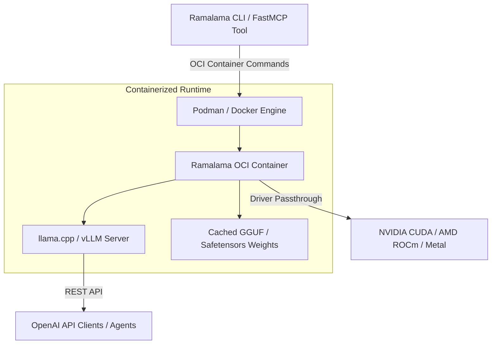

# Ramalama

## What it is
Ramalama is an open-source, container-native tool for running, serving, and managing local AI models using Open Container Initiative (OCI) containers (Podman, Docker) and execution runtimes like vLLM, llama.cpp, or Ollama. Developed as part of the Red Hat / Fedora ecosystem, Ramalama treats local AI models as containerized, versioned OCI workloads, providing unified orchestration for offline inference.

By pairing container runtimes with hardware acceleration drivers (CUDA, ROCm, Metal, OneAPI), Ramalama enables reproducible, isolated model execution across Linux workstations, macOS devices, edge nodes, and Kubernetes clusters.

## What problem it solves
Managing local AI model binaries, dependencies, Python virtual environments, CUDA/ROCm driver incompatibilities, and runtime versions manually creates environment drift, security vulnerabilities, and deployment friction across home-lab nodes and edge hardware. Different models often require conflicting C++ library versions or distinct backend execution engines.

Ramalama solves this problem by packaging local model execution into standard OCI container images. It isolates runtime dependencies inside containers, handles automatic GPU driver detection, and standardizes local model serving across any Linux, macOS, or Kubernetes node without requiring manual host environment modifications.

## Where it fits in the stack
**Infrastructure / Model Runners**. Ramalama serves as a container-native model orchestration runtime, acting as a bridge between OCI container engines (Podman, Docker) and local inference engines (vLLM, llama.cpp, Ollama).



## Typical use cases
- **Containerized Air-Gapped Model Serving**: Spawning rootless Podman/Docker containers to serve local GGUF or Safetensors models in air-gapped home-lab networks.
- **K3s / Kubernetes Pod Deployment**: Serving LLMs on home-lab Kubernetes clusters without creating complex custom dockerfiles or runtime images.
- **CLI & REST API Model Execution**: Serving OpenAI-compatible API endpoints directly from containerized runtimes with isolated memory footprints.
- **Rootless AI Sandboxing**: Running untrusted open-weight model code inside unprivileged containers to isolate host file systems.

## Strengths
- **OCI Standard Native**: Leverages standard Podman/Docker image registries, container storage formats, and OCI artifact layers.
- **Rootless & Secure**: Integrates directly with Podman for unprivileged, rootless container execution without root daemons.
- **Hardware Acceleration Passthrough**: Auto-detects NVIDIA CUDA, AMD ROCm, Apple Metal, and Intel OneAPI GPU hardware drivers on the host.
- **Zero Host Contamination**: Keeps host operating systems clean by encapsulating all C++ and Python inference dependencies inside container layers.
- **Standardized REST Endpoints**: Exposes standard OpenAI-compatible `/v1/chat/completions` API endpoints out of the box.

## Limitations
- **Ecosystem Adoption**: Emerging tool compared to established single-binary runners like Ollama or direct `llama.cpp` binaries.
- **Linux & Podman Optimization**: Primarily tailored for Red Hat, Fedora, and Linux container ecosystems; requires `podman machine` on macOS or Windows.
- **Container Layer Overhead**: Pulling container base images introduces initial download bandwidth overhead compared to running single C++ binaries.

## When to use it
- When deploying local AI models as containerized workloads using Podman or Docker.
- When serving models in air-gapped Linux or Kubernetes (K3s) home-lab nodes where reproducibility is required.
- When leveraging rootless container execution for model inference security and isolation.
- When standardizing AI workload orchestration alongside existing DevOps container pipelines.

## When not to use it
- When preferring simple single-binary CLI wrappers on non-containerized Windows or macOS workstations.
- When using managed cloud inference endpoints (OpenAI, Anthropic, Together AI) where local model execution is unnecessary.

## Getting started

### Installation
Install Ramalama via `pip` or Fedora package manager (`dnf install ramalama`):

```bash
pip install ramalama
```

### Basic Execution
Launch an interactive local model chatbot session containerized via Podman or Docker:

```bash
# Run interactive chatbot session inside isolated container runtime
ramalama run granite-3.1-dense
```

## CLI examples

```bash
# 1. Run a containerized AI model chatbot in interactive terminal mode
ramalama run granite-3.1-dense

# 2. Serve an OpenAI-compatible REST API endpoint on port 8080 using container runtime
ramalama serve -p 8080 granite-3.1-dense

# 3. List all cached local model images and OCI container artifacts
ramalama list

# 4. Remove a cached model image from local container storage
ramalama rm granite-3.1-dense
```

## API examples

### 1. Direct Python REST Request to Served Ramalama Endpoint
```python
import json
import urllib.request

url = "http://localhost:8080/v1/chat/completions"
payload = {
    "model": "granite-3.1-dense",
    "messages": [
        {"role": "system", "content": "You are a helpful home-lab assistant."},
        {"role": "user", "content": "How do I configure rootless Podman?"}
    ],
    "temperature": 0.7
}

req = urllib.request.Request(
    url,
    data=json.dumps(payload).encode("utf-8"),
    headers={"Content-Type": "application/json"}
)

with urllib.request.urlopen(req) as response:
    result = json.loads(response.read().decode("utf-8"))
    answer = result["choices"][0]["message"]["content"]
    print("Ramalama Response:\n", answer)
```

### 2. FastMCP 3.1 Ramalama Container Orchestration Integration
```python
from typing import Dict, Any
from mcp.server.fastmcp import FastMCP
import subprocess
import json

mcp = FastMCP("ramalama-container-manager")

@mcp.tool()
def serve_ramalama_model(model_tag: str, port: int = 8080) -> Dict[str, Any]:
    """Spawns a containerized Ramalama model server on the target port."""
    cmd = ["ramalama", "serve", "-p", str(port), model_tag]
    try:
        proc = subprocess.Popen(cmd, stdout=subprocess.PIPE, stderr=subprocess.PIPE)
        return {
            "status": "started",
            "model": model_tag,
            "port": port,
            "pid": proc.pid
        }
    except Exception as e:
        return {"status": "error", "message": str(e)}

@mcp.tool()
def list_cached_models() -> Dict[str, Any]:
    """Lists all cached local OCI model artifacts managed by Ramalama."""
    try:
        res = subprocess.run(["ramalama", "list"], capture_output=True, text=True, check=True)
        return {"status": "success", "output": res.stdout}
    except Exception as e:
        return {"status": "error", "message": str(e)}

if __name__ == "__main__":
    mcp.run()
```

### 3. Pydantic v2 Schema for Ramalama Execution Parameters
```python
from typing import Optional
from pydantic import BaseModel, ConfigDict, Field

class RamalamaServeConfig(BaseModel):
    model_config = ConfigDict(extra="forbid")

    model_tag: str = Field(..., description="OCI model tag or reference (e.g., granite-3.1-dense)")
    port: int = Field(8080, ge=1024, le=65535, description="Host port for OpenAI API server")
    runtime: str = Field("podman", description="OCI container engine runtime (podman or docker)")
    gpu_backend: Optional[str] = Field("cuda", description="Hardware acceleration backend (cuda, rocm, metal)")
    vram_limit_gb: Optional[float] = Field(None, ge=1.0, description="Optional VRAM memory limit")

if __name__ == "__main__":
    cfg = RamalamaServeConfig(
        model_tag="granite-3.1-dense",
        port=8080,
        runtime="podman",
        gpu_backend="cuda"
    )
    print("Ramalama Config Validated:\n", cfg.model_dump_json(indent=2))
```

## Related tools / concepts
- [Ollama](../../services/ollama.md) — Popular local model runner.
- [vLLM](vllm.md) — High-throughput local model serving engine.
- [Podman](podman.md) — Daemonless rootless container runtime infrastructure.
- [Docker](docker.md) — Standard container runtime infrastructure.
- [K3s Cluster Setup](../../playbooks/k3s-cluster-setup.md) — Kubernetes deployment playbook.

## Sources / references
- [Ramalama GitHub Repository](https://github.com/containers/ramalama)
- [Containers.ai Documentation](https://containers.ai/)

---
## Contribution Metadata
- Last reviewed: 2027-01-07
- Confidence: high
