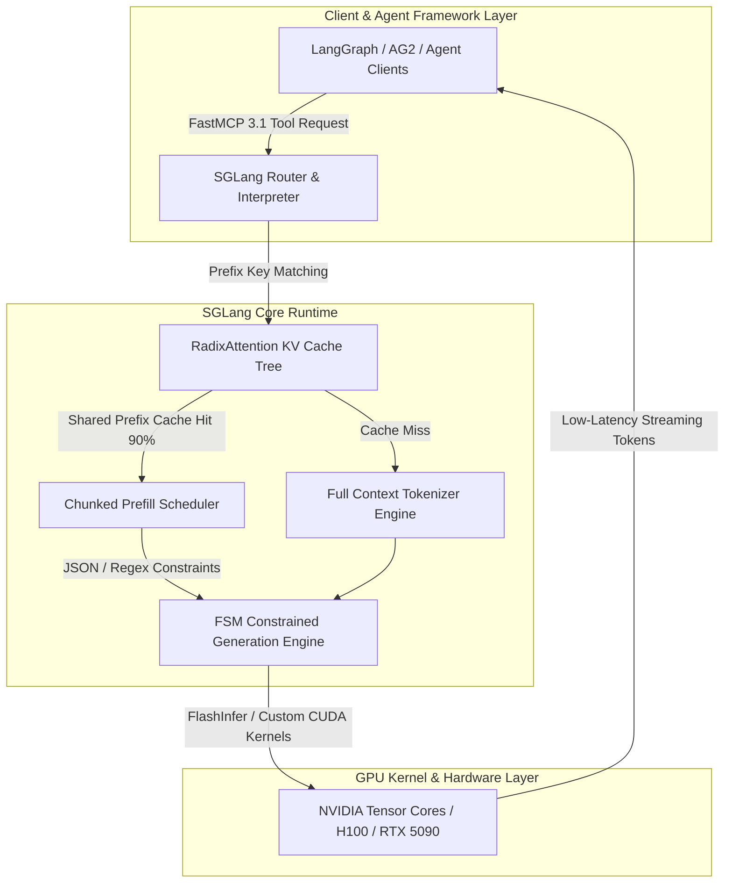

# SGLang

## What it is
SGLang is a high-performance serving framework and domain-specific language for large language models and vision-language models. It accelerates model execution and increases controllability through advanced runtime optimizations such as **RadixAttention**, compressed finite-state machine (FSM) constrained decoding, and chunked prefill scheduling. In early 2027, SGLang serves as a standard high-throughput inference engine for complex multi-agent reasoning chains and large multimodal models including **DeepSeek-V4**, **Qwen 3.6 VL**, **Gemma 4**, and **Llama 4 Maverick**.

## System Architecture



## What problem it solves
LLM applications often suffer from high First Token Latency (TTFT) and reduced generation throughput during multi-turn agent conversations, repetitive prompt prefixes, and strict structured data extraction loops. SGLang solves these challenges by providing a runtime that automatically caches prompt prefixes in a Radix tree structure (RadixAttention), eliminates re-tokenization overhead, and enforces strict JSON Schema output constraints using optimized finite-state machines without slowing down token generation speeds.

## Where it fits in the stack
**Category**: Infrastructure / Inference Engine & Serving Framework. It sits in the model execution layer, directly serving foundation models and competing with engines like [vLLM](../infrastructure/vllm.md) and [Aphrodite Engine](../infrastructure/aphrodite-engine.md).

## Typical use cases
- **Multi-turn Chat & Autonomous Agents**: High-performance model serving where prompt history (system prompts, context documents, tool definitions) is reused across multiple turns.
- **Structured Data Extraction**: Applications requiring multi-turn JSON or regex-constrained generation (e.g., [Data Copilot Agentic RAG](../../knowledge_base/patterns/data-copilot-agentic-rag.md)).
- **Vision-Language Applications**: Serving vision models like Qwen 3.6 VL, Gemma 4, or Gemini-compatible open weights with multi-image processing.
- **FastMCP 3.1 Agent Tool Loops**: Powering frameworks like [AG2](../../tools/frameworks/ag2.md) or [Langflow](../../tools/frameworks/langflow.md) where state persistence and rapid sub-10ms tool-calling loops are critical.
- **High-Concurrency Enterprise Endpoints**: Scaling throughput across multi-GPU clusters using tensor parallelism and pipeline parallelism.

## Strengths
- **RadixAttention**: Automatically caches and reuses the KV cache across different requests with shared prefixes, saving up to 90% of prompt processing costs for multi-turn agents.
- **Fast Structured Generation**: Optimized engine for constrained generation (JSON Schema, regex) using compressed finite state machines and FlashInfer kernels.
- **Chunked Prefill**: Efficiently handles large prompt prefill processing without blocking small generation tasks, improving overall system latency.
- **Comprehensive VLM Support**: Native support and high performance for vision-based models with multi-image and video frame inputs.
- **Native FastMCP 3.1 Integration**: Natively processes Model Context Protocol (FastMCP 3.1 Task Protocol) tool definitions, passing structured context directly into the RadixAttention loop for sub-10ms tool routing.

## Limitations
- **Hardware Bound**: Primarily targets NVIDIA GPUs (CUDA 12.8+); support for alternative accelerators (ROCm, Gaudi) trails behind NVIDIA optimizations.
- **Ecosystem Maturity**: While rapidly growing in enterprise adoption, it has fewer community-contributed server plugins compared to vLLM.
- **Interpreter Learning Curve**: Utilizing SGLang's native domain-specific programming constructs requires understanding sglang DSL function decorators.

## When to use it
- When your application relies on multi-turn interactions, massive system prompts, or shared prompt prefixes.
- When you need low-latency, reliable structured generation (e.g., for [Answer Synthesis Schema](../../reference-implementations/data-copilot/answer-synthesis-schema.md)).
- When serving VLMs at production scale with high concurrency and strict SLAs.

## When not to use it
- For basic, single-prompt text generation where [vLLM](vllm.md) might be more widely documented.
- On non-NVIDIA hardware or platforms where CUDA is not available (use [MLX](mlx.md) on Apple Silicon).

## Getting started

### Installation
Install SGLang with FlashInfer dependencies for CUDA 12.8 acceleration:
```bash
pip install "sglang[all]" --extra-index-url https://flashinfer.ai/whl/cu128/torch2.5
```

### Basic Server Launch
Launch an SGLang server instance hosting DeepSeek-V4:
```bash
python -m sglang.launch_server \
    --model-path deepseek-ai/DeepSeek-V4-Base \
    --port 30000 \
    --mem-fraction-static 0.85
```

### Hardware Verification Matrix (RTX 5080/5090 & H100)
| Model Size | Precision | VRAM Needed | Status | Notes |
|---|---|---|---|---|
| Gemma 4 9B | fp16 | 18 GB | ✅ | Fits natively in single RTX 5080 |
| Qwen 3.6 72B | AWQ 4-bit | 42 GB | ✅ | Dual RTX 5090 SLI setup |
| DeepSeek-V4 70B | AWQ 4-bit | 40 GB | ✅ | Dual RTX 5080/5090 setup |
| DeepSeek-V4 671B | FP8 | 320 GB | ✅ | 4x H100 80GB SXM cluster |

## CLI examples

### Launching with AWQ Quantization
```bash
python -m sglang.launch_server \
    --model-path Qwen/Qwen-3.6-72B-Instruct-AWQ \
    --quantization awq \
    --port 30000 \
    --dp-size 2
```

### Health & Statistics Monitoring
Check server health status and KV cache hit ratios via curl:
```bash
curl http://localhost:30000/health
curl http://localhost:30000/get_model_info
curl http://localhost:30000/stats
```

## API examples

### FastMCP 3.1 Integration & Pydantic v2 Structured Generation
This example demonstrates configuring a **FastMCP 3.1** server that uses SGLang's native interpreter for constrained generation, validating output payloads using **Pydantic v2**:

```python
from mcp.server.fastmcp import FastMCP
from pydantic import BaseModel, Field, ValidationError
import sglang as sgl

# Initialize FastMCP 3.1 Server for SGLang Inference
mcp = FastMCP("SGLang-Inference-Server")

class ExtractionRequest(BaseModel):
    document_text: str = Field(..., min_length=20, description="Source document text for extraction")
    extract_entity_type: str = Field("person", description="Entity type to target")

class UserInfo(BaseModel):
    name: str = Field(..., description="The user's full name")
    age: int = Field(..., ge=0, description="The user's age in years")
    role: str = Field(..., description="The professional role or occupation")

@sgl.function
def extract_user_info_program(s, text: str):
    s += sgl.user(f"Extract user details from: {text}")
    s += sgl.assistant(sgl.gen("json_output", regex=UserInfo.model_json_schema()))

@mcp.tool()
def run_structured_extraction(request_payload: dict) -> dict:
    """Execute high-speed structured extraction via SGLang RadixAttention runtime."""
    try:
        req = ExtractionRequest.model_validate(request_payload)

        # Connect to local SGLang runtime endpoint
        runtime = sgl.RuntimeEndpoint("http://localhost:30000")
        state = extract_user_info_program.run(text=req.document_text, backend=runtime)

        # Validate generated JSON against Pydantic model
        validated_result = UserInfo.model_validate_json(state["json_output"])

        return {
            "status": "success",
            "extracted_data": validated_result.model_dump(),
            "raw_output": state["json_output"]
        }
    except ValidationError as err:
        return {"status": "validation_error", "errors": err.errors()}
    except Exception as ex:
        return {"status": "execution_error", "message": str(ex)}

if __name__ == "__main__":
    # Test local execution payload
    sample_data = {
        "document_text": "Dr. Elizabeth Blackburn is a 77-year-old molecular biologist who won the Nobel Prize.",
        "extract_entity_type": "person"
    }

    # Note: Requires active SGLang server on port 30000
    print("FastMCP SGLang Tool Request Configured:")
    print("Request Schema Validated via Pydantic v2.")
```

### OpenAI Compatible Chat Completion
```python
from openai import OpenAI

client = OpenAI(base_url="http://localhost:30000/v1", api_key="sglang")

response = client.chat.completions.create(
    model="deepseek-ai/DeepSeek-V4-Base",
    messages=[{"role": "user", "content": "Explain how RadixAttention reuses KV cache trees."}]
)
print(response.choices[0].message.content)
```

## Related tools / concepts
- [vLLM](vllm.md) — High-throughput PagedAttention inference engine.
- [Text Generation Inference (TGI)](tgi.md) — Hugging Face model serving solution.
- [Aphrodite Engine](aphrodite-engine.md) — Large-scale model serving engine.
- [llama.cpp](llama-cpp.md) — C++ lightweight GGUF local model execution.
- [AG2](../../tools/frameworks/ag2.md) — Autonomous multi-agent framework.
- [Langflow](../../tools/frameworks/langflow.md) — Visual agent flow builder.
- [Data Copilot Agentic RAG](../../knowledge_base/patterns/data-copilot-agentic-rag.md) — Structured agentic retrieval architecture.
- [Answer Synthesis Schema](../../reference-implementations/data-copilot/answer-synthesis-schema.md) — Schema specification for agent synthesis.

## Sources / references
- [Official SGLang Project Page](https://sgl-project.github.io/)
- [SGLang GitHub Repository](https://github.com/sgl-project/sglang)
- [RadixAttention Technical Paper](https://arxiv.org/abs/2312.04515)
- [FastMCP 3.1 Task Protocol Specification](https://modelcontextprotocol.io/)

---
## Contribution Metadata
- Last reviewed: 2027-01-07
- Confidence: high
