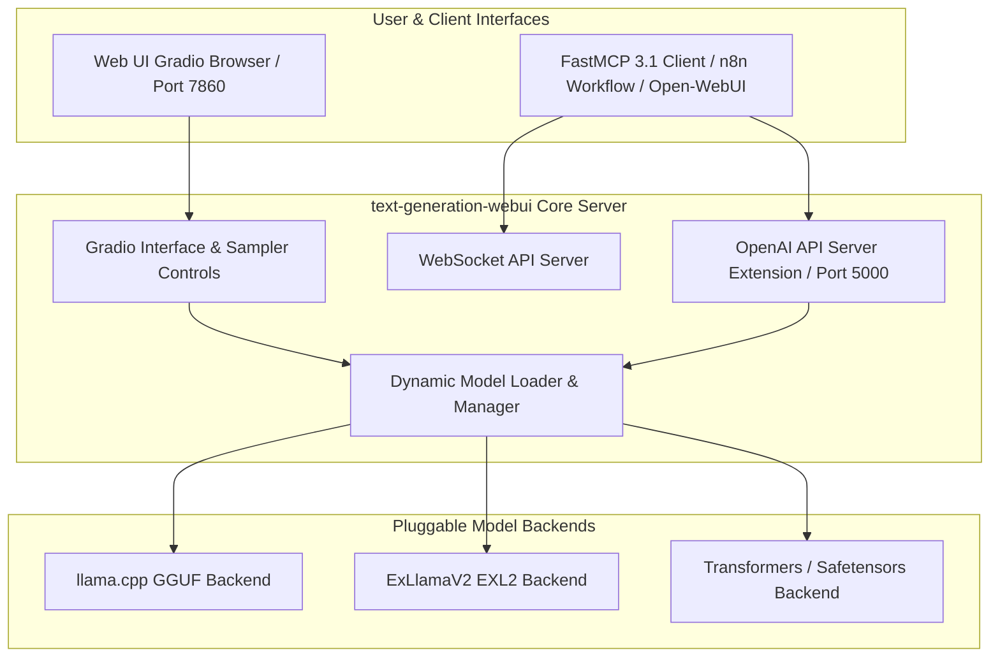

# text-generation-webui

## What it is
text-generation-webui (commonly known as Oobabooga) is a flexible, open-source Gradio web interface and inference server for hosting, inspecting, and serving local large language models. Designed as a power-user alternative to consumer desktop runners, it provides multi-backend execution supporting `llama.cpp` (GGUF), `ExLlamaV2` (EXL2), `Transformers` (Safetensors), `AutoGPTQ`, `AutoAWQ`, and `Hugging Face` model formats.

In early 2027, text-generation-webui continues to serve as an essential local inference laboratory and micro-service host for home-lab builders, multi-agent developers, and researchers requiring hyperparameter tuning (XTC, DRY samplers, RoPE scaling) combined with dual OpenAI-compatible (`/v1`) and native WebSocket streaming API endpoints.



## What problem it solves
Local LLM power users, AI researchers, and home-lab automation engineers frequently encounter significant limitations when using simplified, monolithic model runners (such as Ollama or desktop wrappers):
- **Restricted Model Loader Access**: Simplified tools often restrict users to GGUF format, preventing execution of high-speed EXL2 quantizations, unquantized Safetensors, or specialized GPTQ/AWQ weights.
- **Inflexible Sampler Controls**: Advanced sampling techniques (such as DRY repetition penalty, XTC token trimming, Top-A, and custom temperature curves) are frequently exposed only via command-line flags rather than real-time interactive sliders.
- **Dynamic Model Swapping Constraints**: Changing models programmatically via local API calls during automated multi-agent tasks often causes crashes or requires full server restarts in simplified wrappers.
- **Extension & Modal Disconnect**: Integrating Text-to-Speech (TTS), Whisper speech-to-text, vector context memory, and custom web search extensions into a single local server requires modular architecture.

text-generation-webui addresses these limitations by providing unified parameter controls across six inference loaders, dynamic model swapping endpoints, interactive notebook/chat modes, and extension hooks.

## Where it fits in the stack
**Infrastructure / Model Runners & User Interfaces**. text-generation-webui serves as a power-user inference hub and interactive laboratory for multi-backend local model execution, bridging open-weights models with downstream agent frameworks and automation pipelines.

```
+-----------------------------------------------------------------------+
|                    Application & Workflow Layer                       |
|           (Open-WebUI, FastMCP 3.1 Servers, n8n, LangChain)           |
+-----------------------------------------------------------------------+
                                   |
+-----------------------------------------------------------------------+
|            >>>> text-generation-webui Serving Hub <<<<                |
|    (Gradio UI, OpenAI /v1 API Endpoint, Extension Ecosystem)          |
+-----------------------------------------------------------------------+
                                   |
+-----------------------------------------------------------------------+
|                  Pluggable Inference Loader Backends                  |
|          (llama.cpp, ExLlamaV2, Transformers, AutoAWQ, GPTQ)          |
+-----------------------------------------------------------------------+
```

## Typical use cases
- **Multi-Backend Local Model Testing**: Comparing performance and token generation speeds of GGUF models on llama.cpp versus EXL2 models on ExLlamaV2.
- **OpenAI-Compatible Home Automation Endpoint**: Hosting local LLMs as an OpenAI API provider (`http://localhost:5000/v1/chat/completions`) for home-assistant agents and n8n workflows.
- **Hyperparameter & Sampler Optimization**: Experimenting with novel samplers (DRY, XTC, Top-K, Min-P) and RoPE context extension parameters in interactive notebook mode.
- **LoRA Adapter Evaluation**: Dynamically applying and testing custom fine-tuned LoRA adapters over base foundation models without restarting server processes.

## Strengths
- **Comprehensive Backend Support**: Native loader integration for `llama.cpp`, `ExLlamaV2_HF`, `Transformers`, `AutoGPTQ`, and `AutoAWQ`.
- **Dual API Support**: Exposes both standard OpenAI-compatible `/v1` endpoints and high-speed native WebSocket APIs.
- **Rich Sampler Selection**: Offers fine-grained controls for DRY, XTC, Min-P, Top-P, Temperature, and Repetition Penalty.
- **Extensible Plugin Ecosystem**: Built-in extensions for Whisper speech recognition, Silero/Coqui TTS, vector memory, and web search context.
- **Active Community Maintenance**: Continuous updates incorporating cutting-edge sampler techniques and GPU loader optimizations.

## Limitations
- **Configuration Complexity**: Power-user interface with hundreds of parameter dials can be overwhelming for non-technical users compared to Ollama.
- **Python Environment Memory Footprint**: Requires a dedicated Python virtual environment and Gradio stack, consuming slightly higher system RAM than single C++ binaries.

## When to use it
- When requiring fine-grained control over model loaders (e.g., ExLlamaV2 max_seq_len, llama.cpp n_gpu_layers, rope_alpha, custom tensor offloading).
- When self-hosting a multi-purpose local LLM server providing both a rich web UI and an OpenAI-compatible API for multi-agent systems.
- When loading non-GGUF model formats such as EXL2, raw Safetensors, or specialized GPTQ/AWQ weights.
- When evaluating custom LoRA adapters and novel sampler combinations.

## When not to use it
- When seeking a zero-config, single-binary local runner on non-technical desktop workstations (use Ollama or LM Studio instead).
- When deploying enterprise-grade multi-GPU production inference clusters requiring paged-attention batching (use vLLM or SGLang instead).

## Getting started
To set up text-generation-webui on a Linux or GPU-enabled server:

```bash
# Clone the repository
git clone https://github.com/oobabooga/text-generation-webui.git
cd text-generation-webui

# Execute automated environment installer
./start_linux.sh

# Launch server with OpenAI API extension enabled
python server.py --api --listen --model-menu
```

Python usage connecting to the text-generation-webui OpenAI-compatible API endpoint:

```python
import openai

# Connect to text-generation-webui API extension on port 5000
client = openai.OpenAI(
    base_url="http://localhost:5000/v1",
    api_key="not-needed"
)

response = client.chat.completions.create(
    model="llama-3-8b-instruct",
    messages=[{"role": "user", "content": "Explain local LLM inference backends."}],
    temperature=0.7
)

print(response.choices[0].message.content)
```

## CLI examples

### 1. Launching with ExLlamaV2 Loader and API
```bash
python server.py \
  --model Meta-Llama-3-8B-Instruct-EXL2 \
  --loader ExLlamaV2_HF \
  --api \
  --listen \
  --listen-port 7860 \
  --api-port 5000
```

### 2. Launching GGUF Model with llama.cpp GPU Offloading
```bash
python server.py \
  --model llama-3-8b.Q4_K_M.gguf \
  --loader llama.cpp \
  --n_gpu_layers 35 \
  --n_ctx 8192 \
  --api
```

### 3. Launching in Headless Mode with Custom Samplers
```bash
python server.py \
  --model mistral-7b-v0.3 \
  --loader Transformers \
  --api \
  --disable-ui
```

## API examples

### 1. Pydantic v2 Schema for text-generation-webui Launch Configuration
```python
from typing import Optional, List
from pydantic import BaseModel, ConfigDict, Field, field_validator

class WebUIStartConfig(BaseModel):
    model_config = ConfigDict(extra="forbid")

    model: str = Field(..., description="Target model directory or filename in models/")
    loader: str = Field(default="llama.cpp", description="Loader backend (llama.cpp, ExLlamaV2_HF, Transformers)")
    listen: bool = Field(default=True, description="Expose web UI to network")
    listen_port: int = Field(default=7860, ge=1024, le=65535)
    api: bool = Field(default=True, description="Enable OpenAI-compatible API extension")
    api_port: int = Field(default=5000, ge=1024, le=65535)
    gpu_layers: Optional[int] = Field(default=None, ge=0, description="GPU offloaded layers for llama.cpp")
    context_size: int = Field(default=8192, ge=512, le=131072)

    @field_validator("loader")
    @classmethod
    def validate_loader_name(cls, v: str) -> str:
        valid_loaders = {"llama.cpp", "ExLlamaV2_HF", "ExLlamaV2", "Transformers", "AutoGPTQ", "AutoAWQ"}
        if v not in valid_loaders:
            raise ValueError(f"Loader {v} must be one of {valid_loaders}")
        return v

class WebUIModelLoadPayload(BaseModel):
    model_config = ConfigDict(extra="forbid")

    model_name: str
    args: WebUIStartConfig

if __name__ == "__main__":
    cfg = WebUIStartConfig(
        model="Llama-3.3-70B-Instruct-GGUF",
        loader="llama.cpp",
        gpu_layers=80,
        context_size=16384
    )
    print(f"Server Configured for '{cfg.model}' with loader '{cfg.loader}' (Context: {cfg.context_size}).")
```

### 2. FastMCP 3.1 Task Protocol Integration
```python
from typing import Dict, Any
from mcp.server.fastmcp import FastMCP

mcp = FastMCP("textgen-webui-controller")

@mcp.tool()
def load_model_instance(
    model_name: str,
    loader: str = "llama.cpp",
    gpu_layers: int = 35
) -> Dict[str, Any]:
    """Dynamically loads or swaps a model in text-generation-webui via internal API.

    Args:
        model_name: Name of the model directory inside models/ folder.
        loader: Target loader backend (llama.cpp, ExLlamaV2_HF, Transformers).
        gpu_layers: Number of GPU offloaded layers for GGUF backends.
    """
    return {
        "status": "loaded",
        "model": model_name,
        "loader": loader,
        "gpu_layers": gpu_layers,
        "api_endpoint": "http://localhost:5000/v1",
        "web_ui_url": "http://localhost:7860"
    }

@mcp.tool()
def query_webui_server_status() -> Dict[str, Any]:
    """Checks the health, loaded model, and active extensions of text-generation-webui."""
    return {
        "status": "online",
        "active_model": "Llama-3-8B-Instruct-EXL2",
        "loader": "ExLlamaV2_HF",
        "vram_usage_mb": 6144,
        "api_enabled": True,
        "active_extensions": ["openai_api", "whisper_stt"]
    }

if __name__ == "__main__":
    mcp.run()
```

## Related tools / concepts
- [ExLlamaV2](exllamav2.md) — High-performance GPU loader backend used by text-generation-webui.
- [llama.cpp](llama-cpp.md) — C++ GGUF inference backend.
- [LM Studio](lm-studio.md) — Desktop GUI local model runner alternative.
- [Ollama](../../services/ollama.md) — Consumer-friendly CLI model runner.
- [vLLM](vllm.md) — Production multi-GPU throughput inference engine.

## Sources / references
- [text-generation-webui GitHub Repository](https://github.com/oobabooga/text-generation-webui)
- [text-generation-webui Official Documentation & Wiki](https://github.com/oobabooga/text-generation-webui/wiki)
- [Gradio Framework Documentation](https://www.gradio.app/)

---
## Contribution Metadata
- Last reviewed: 2027-01-07
- Confidence: high
