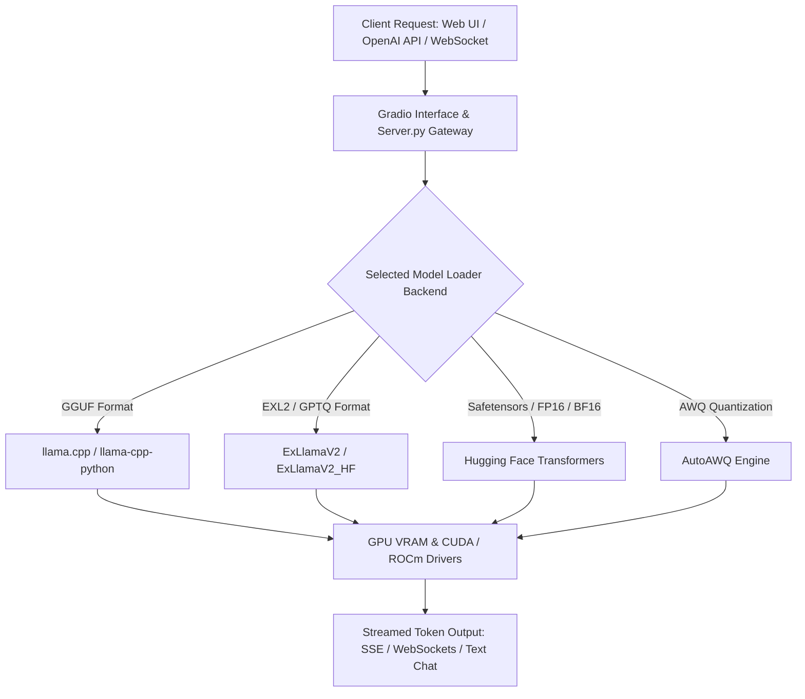

# text-generation-webui

## What it is
text-generation-webui (commonly known as Oobabooga) is a flexible, open-source Gradio web interface and inference server for hosting and interacting with local large language models. Designed as a power-user alternative to consumer desktop runners, it supports a wide variety of backend backends including `llama.cpp`, `ExLlamaV2`, `Transformers`, `AutoGPTQ`, `AutoAWQ`, and `Hugging Face`.



## What problem it solves
Local LLM power users and home-lab builders often need to run and compare models in diverse formats (GGUF, EXL2, AWQ, HF Safeguards/Safetensors) with deep control over sampling parameters, extension plugins, and API integration. Monolithic apps often constrain backend parameters. text-generation-webui solves this by providing unified parameter controls, chat and notebook interfaces, dynamic model swapping, and dual OpenAI/TGI-compatible API endpoints for home automation integration.

## Where it fits in the stack
**Infrastructure / Model Runners & User Interfaces**. text-generation-webui acts as a self-hosted inference hub and interactive laboratory for multi-backend local model execution.

## Architecture & Technical Deep Dive
text-generation-webui features a modular Python architecture designed around dynamic loader wrappers and extension hooks:
1. **Multi-Backend Loader Layer**: Wraps multiple specialized C++/CUDA inference engines under a unified Python API (`modules/models.py`). Users can switch loaders (e.g., from `llama.cpp` for CPU+GPU offloading to `ExLlamaV2` for maximum VRAM token streaming speed) without restarting the web container.
2. **Advanced Sampler Pipeline**: Exposes state-of-the-art sampling parameters unavailable in basic runners, including DRY (Don't Repeat Yourself) repetition penalty, XTC (Excluding Top Choices), Min-P, Mirostat, and dynamic temperature scaling.
3. **Extension Architecture (`extensions/`)**: Plugin system supporting real-time text-to-speech (XTTS, Coqui), speech-to-text (Whisper), long-term vector memory (ChromaDB integrations), and automated API model switching via custom FastMCP or n8n hooks.

## Typical use cases
- **Multi-Backend Inference Hosting**: Running GGUF models via llama.cpp or high-speed EXL2 models via ExLlamaV2 on local GPUs.
- **API Endpoint Provider**: Exposing OpenAI-compatible (`/v1/chat/completions`) and native WebSocket APIs for home lab agents and n8n workflows.
- **Model Evaluation & Fine-Tuning Sandbox**: Testing custom prompts, sampler configurations (DRY, XTC, Top-P, Temperature), and LoRA adapters.

## Strengths
- **Broad Backend Support**: Native loader integration for llama.cpp, ExLlamaV2, Transformers, Hf, and AWQ.
- **Rich Extension Ecosystem**: Modular extensions for TTS, Whisper speech recognition, vector memory, and web search.
- **Dual Interface Modes**: Supports interactive Chat mode, Instruct mode, Default notebook mode, and headless API mode.

## Limitations
- **Configuration Complexity**: Power-user interface with numerous hyperparameter dials can be overwhelming for beginners compared to simplified apps like Ollama or LM Studio.
- **Resource Footprint**: Gradio UI and Python environment require higher baseline RAM compared to C++ single binaries.

## When to use it
- When requiring fine-grained control over model loaders (e.g., ExLlamaV2 max_seq_len, llama.cpp n_gpu_layers, rope_alpha).
- When self-hosting a multi-purpose local LLM server providing both a web UI and an OpenAI-compatible API for home automation.
- When loading non-GGUF model formats (EXL2, GPTQ, AWQ, raw Safetensors).

## When not to use it
- When seeking a zero-config, single-binary local runner on non-technical desktop workstations (use Ollama or LM Studio instead).
- When deploying enterprise-grade multi-GPU batching inference clusters (use vLLM or SGLang instead).

## Getting started
To set up text-generation-webui on a local Linux or GPU-enabled server:

```bash
# Clone the repository
git clone https://github.com/oobabooga/text-generation-webui.git
cd text-generation-webui

# Execute automated start script
./start_linux.sh

# Start headless with OpenAI API extension enabled
python server.py --api --listen --model-menu
```

## CLI examples

```bash
# Launch with specific model and ExLlamaV2 loader
python server.py --model llama-3-8b-exl2 --loader ExLlamaV2_HF --api --port 7860

# Launch with GGUF model via llama.cpp loader and GPU offloading
python server.py --model llama-3-8b.gguf --loader llama.cpp --n_gpu_layers 35 --api

# Launch in headless API mode with custom context length and RoPE scaling
python server.py --model Mistral-Nemo-12B --loader ExLlamaV2 --max_seq_len 32768 --rope_alpha 2.5 --headless --api
```

## API examples

### 1. Pydantic v2 Schema for text-generation-webui Launch Parameters
```python
from typing import Optional, List, Dict
from pydantic import BaseModel, ConfigDict, Field, field_validator

class SamplerSettings(BaseModel):
    model_config = ConfigDict(extra="forbid")

    temperature: float = Field(default=0.7, ge=0.0, le=2.0)
    top_p: float = Field(default=0.9, ge=0.0, le=1.0)
    min_p: float = Field(default=0.05, ge=0.0, le=1.0)
    repetition_penalty: float = Field(default=1.15, ge=1.0, le=2.0)
    dry_multiplier: float = Field(default=0.8, ge=0.0, description="DRY sampler penalty multiplier")
    dry_base: float = Field(default=1.75, ge=1.0, description="DRY sampler base exponent")

class ServerLaunchConfig(BaseModel):
    model_config = ConfigDict(extra="forbid")

    model: str = Field(..., description="Target model folder or filename inside models/")
    loader: str = Field(default="llama.cpp", description="Inference backend loader")
    listen: bool = Field(default=True, description="Expose web server to local network")
    listen_port: int = Field(default=7860, ge=1024, le=65535)
    api: bool = Field(default=True, description="Enable OpenAI-compatible API extension")
    api_port: int = Field(default=5000, ge=1024, le=65535)
    gpu_layers: Optional[int] = Field(default=None, ge=0, description="Offloaded GPU layers for llama.cpp loader")
    max_seq_len: int = Field(default=8192, ge=512, le=131072)
    default_samplers: SamplerSettings = Field(default_factory=SamplerSettings)
    extensions: List[str] = Field(default_factory=lambda: ["openai", "superboogav2"])

    @field_validator("loader")
    @classmethod
    def validate_loader_type(cls, v: str) -> str:
        valid_loaders = ["llama.cpp", "ExLlamaV2", "ExLlamaV2_HF", "Transformers", "AutoGPTQ", "AutoAWQ"]
        if v not in valid_loaders:
            raise ValueError(f"loader must be one of {valid_loaders}")
        return v

if __name__ == "__main__":
    cfg = ServerLaunchConfig(
        model="Meta-Llama-3-8B-Instruct",
        loader="ExLlamaV2_HF",
        gpu_layers=35,
        max_seq_len=16384,
        default_samplers=SamplerSettings(temperature=0.6, dry_multiplier=1.0)
    )
    print(f"Launching text-generation-webui for model '{cfg.model}' using loader '{cfg.loader}' (Context: {cfg.max_seq_len}).")
```

### 2. FastMCP 3.1 Task Protocol Integration
```python
from mcp.server.fastmcp import FastMCP, Context
import time

mcp = FastMCP("textgen-webui-controller")

@mcp.tool()
async def load_webui_model(
    ctx: Context,
    model_name: str,
    loader: str = "llama.cpp",
    gpu_layers: int = 35
) -> dict:
    """Loads a model dynamically in a text-generation-webui server instance."""
    ctx.info(f"Triggering WebUI model load for '{model_name}' via loader '{loader}' ({gpu_layers} GPU layers)")

    start_time = time.time()
    # Simulate API orchestration call to WebUI endpoint
    time.sleep(0.05)
    elapsed = time.time() - start_time

    return {
        "status": "loaded",
        "model": model_name,
        "loader": loader,
        "gpu_layers": gpu_layers,
        "load_time_seconds": round(elapsed, 3),
        "api_endpoint": "http://localhost:5000/v1"
    }

@mcp.tool()
async def update_samplers(
    ctx: Context,
    temperature: float = 0.7,
    dry_multiplier: float = 0.8,
    repetition_penalty: float = 1.15
) -> dict:
    """Dynamically updates generation sampler settings on the running WebUI session."""
    ctx.info(f"Updating samplers: Temp={temperature}, DRY={dry_multiplier}, RepPen={repetition_penalty}")
    return {
        "status": "updated",
        "active_samplers": {
            "temperature": temperature,
            "dry_multiplier": dry_multiplier,
            "repetition_penalty": repetition_penalty
        }
    }
```

## Related tools / concepts
- [ExLlamaV2](exllamav2.md) — High-performance GPU inference loader backend.
- [llama.cpp](llama-cpp.md) — C++ GGUF inference backend.
- [LM Studio](lm-studio.md) — Desktop GUI local model runner alternative.

## Sources / references
- [text-generation-webui GitHub Repository](https://github.com/oobabooga/text-generation-webui)

---
## Contribution Metadata
- Last reviewed: 2027-01-07
- Confidence: high
