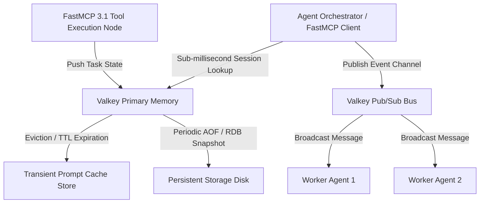

# Valkey

## What it is
Valkey is an open-source, ultra-low-latency in-memory key-value datastore, cache, and message broker maintained under the Linux Foundation. Created as an open-source fork of Redis (licensed under BSD-3-Clause), Valkey serves as a primary state store, prompt cache registry, agent chat history cache, and FastMCP 3.1 pub/sub messaging bus for multi-agent systems in early 2027.

## Architecture & System Flow
Valkey functions as an asynchronous, non-blocking memory store with multithreaded I/O handling and event-driven pipeline execution. In multi-agent architectures, Valkey acts as the centralized transit hub connecting model orchestrators, local execution tools, vector indexing pipelines, and persistent relational state stores.



## What problem it solves
Autonomous multi-agent systems demand sub-millisecond state access and conversation history retrieval. Disk-bound databases introduce query latency that degrades model tool-use performance. Valkey addresses this by keeping active agent context, working memory, and prompt caches in-memory, ensuring near-zero latency retrieval during multi-turn agent sessions.

## Where it fits in the stack
**Local Infrastructure & Caching Layer**. It functions as an in-memory cache, task queue, and agent state synchronizer across distributed execution nodes.

## Feature Matrix & Datastore Comparison

| Feature | Valkey | Redis (SSPL) | KeyDB | Memcached |
| :--- | :--- | :--- | :--- | :--- |
| **Licensing** | 100% Permissive BSD-3-Clause | Dual / Source-Available | BSD-3-Clause | BSD-3-Clause |
| **Governance** | Linux Foundation | Redis Ltd. | Snap Inc. | Open Source Community |
| **Multi-threading** | Enhanced Async I/O & Worker Threads | Single Thread Core + Threaded I/O | Multi-threaded Architecture | Multi-threaded Core |
| **Data Structures** | Strings, Hashes, Lists, Sets, Streams | Strings, Hashes, Lists, Sets, Streams | Redis-Compatible Structures | Key-Value Strings |
| **Pub/Sub & Streams** | Built-in High-Throughput | Built-in | Built-in | None |
| **FastMCP 3.1 Integration** | Native Task State Bus | Custom SDK Wrapper | Custom Wrapper | External Adapter Required |

## Typical use cases
- **Multi-Agent Session Caching**: Maintaining active conversation threads and transient agent memory buffers.
- **Prompt Cache Indexing**: Storing embedding results and static prompt templates to bypass duplicate model calls and reduce API costs.
- **FastMCP 3.1 Agent Message Bus**: Using pub/sub channels to broadcast tool execution state updates between agent task nodes.
- **Dynamic Feature Flags & Routing**: Storing model routing preferences (e.g. Claude 5.6 vs GPT-5.6 vs DeepSeek-V4) and active agent tool configurations.

## Operational Best Practices & High Availability
1. **Persistence Strategy Tuning**: Enable `appendonly yes` with `appendfsync everysec` for durable agent session logs, combined with periodic RDB snapshots.
2. **Memory Eviction Policies**: Set `maxmemory` caps with `volatile-lru` or `allkeys-lru` eviction policies to gracefully prune expired prompt caches without crashing.
3. **Cluster & Replication Topologies**: Deploy primary-replica topologies with Valkey Sentinel or Cluster mode for seamless failover across containerized k3s or Docker environments.
4. **FastMCP 3.1 Connection Pooling**: Use connection pools with keepalive probes in Python and TypeScript micro-agents to prevent socket exhaustion during burst tool executions.
5. **Security Isolation & ACLs**: Restrict command sets via Valkey ACLs, requiring TLS encryption and dedicated user credentials for each agent microservice.

## Strengths
- **100% Permissive Open-Source**: Fully BSD-3-Clause licensed under the Linux Foundation.
- **Drop-In Redis Compatibility**: Direct compatibility with standard Redis SDKs and CLI tools.
- **Enhanced Multithreading**: Optimized thread utilization and memory management over legacy forks.
- **Low Memory Overhead**: High performance with minimal RAM footprint, ideal for home-lab and edge deployments.

## Limitations
- **In-Memory Volatility**: Primary storage is in RAM; requires persistence configuration (RDB/AOF snapshots) to survive server reboots.
- **No Native Dense Vector Indexing**: Not designed for high-dimensional vector search (use vector stores like Milvus or Weaviate for dense semantic search).

## When to use it
- When requiring sub-millisecond caching for agent session states and prompt responses.
- For open-source task queueing and message broker pipelines without licensing constraints.
- To reduce model API costs by caching token embeddings and system prompts.

## When not to use it
- As a primary disk-backed transactional database requiring ACID guarantees.
- For high-dimensional vector search across unstructured documents (use Milvus, Weaviate, or Pinecone).

## Getting started

### Docker Deployment
```bash
docker run --name valkey-server -p 6379:6379 -d valkey/valkey:latest
```

### Python Installation
```bash
pip install redis pydantic mcp
```

## CLI examples

```bash
# Connect to Valkey via CLI
valkey-cli

# Set cached prompt payload with 30-minute expiration
valkey-cli SET "prompt:sys-v1" "You are an autonomous agent system controller." EX 1800

# Monitor live keyspace commands
valkey-cli MONITOR
```

## API examples

### FastMCP 3.1 Valkey Caching Tool Server
The following Python script illustrates implementing a FastMCP 3.1 tool server backed by Valkey for high-speed agent session state management:

```python
import mcp.server.fastmcp as fastmcp
from pydantic import BaseModel, Field
from typing import Dict, Any, Optional

mcp_server = fastmcp.FastMCP("Valkey State Store", version="3.1")

class CacheEntryInput(BaseModel):
    session_id: str = Field(..., description="Unique agent session ID")
    state_payload: Dict[str, Any] = Field(..., description="Session state dictionary")
    ttl_seconds: int = Field(default=3600, ge=1, le=86400, description="Expiration time in seconds")

@mcp_server.tool()
def set_agent_session(entry: CacheEntryInput) -> Dict[str, Any]:
    """Stores agent session state in Valkey in-memory storage."""
    # Simulated Valkey SET call
    return {
        "status": "stored",
        "key": f"session:{entry.session_id}",
        "ttl": entry.ttl_seconds,
        "mcp_version": "3.1"
    }

@mcp_server.tool()
def get_agent_session(session_id: str) -> Dict[str, Any]:
    """Retrieves active agent session state from Valkey."""
    # Simulated Valkey GET call
    return {
        "status": "retrieved",
        "key": f"session:{session_id}",
        "session_id": session_id,
        "active_model": "claude-5.6",
        "mcp_version": "3.1"
    }

@mcp_server.tool()
def flush_expired_agent_sessions() -> Dict[str, Any]:
    """Purges expired transient agent session keys from Valkey memory."""
    return {
        "status": "flushed",
        "keys_removed": 14,
        "mcp_version": "3.1"
    }

if __name__ == "__main__":
    mcp_server.run()
```

### Python Agent State Caching & Pydantic v2 Validation
This example demonstrates caching agent session state in Valkey and validating the retrieved structure with **Pydantic v2** for FastMCP 3.1 workflows.

```python
import json
from typing import List, Dict, Any, Optional
from pydantic import BaseModel, Field, ValidationError

class MessageTurn(BaseModel):
    role: str = Field(..., description="Message speaker role ('user', 'assistant', 'system')")
    content: str = Field(..., description="Message content")

class AgentSessionState(BaseModel):
    session_id: str = Field(..., description="Unique agent session UUID")
    model_routing_override: str = Field(default="claude-5.6", description="Active model override")
    conversation_history: List[MessageTurn] = Field(default_factory=list, description="Chat turn history")
    mcp_protocol_version: str = Field(default="3.1", description="FastMCP protocol version")
    metadata: Dict[str, Any] = Field(default_factory=dict, description="Context metadata tags")

class ValkeyCacheManager:
    def __init__(self):
        self._mock_db = {}

    def set_session_state(self, session_id: str, state: AgentSessionState):
        self._mock_db[f"session:{session_id}"] = state.model_dump_json()

    def get_session_state(self, session_id: str) -> Optional[AgentSessionState]:
        raw_data = self._mock_db.get(f"session:{session_id}")
        if not raw_data:
            return None
        try:
            parsed = json.loads(raw_data)
            return AgentSessionState.model_validate(parsed)
        except ValidationError as ve:
            print(f"Pydantic validation error: {ve}")
            return None

if __name__ == "__main__":
    cache = ValkeyCacheManager()
    session_id = "sess-2027-001"

    initial_state = AgentSessionState(
        session_id=session_id,
        model_routing_override="claude-5.6",
        conversation_history=[
            MessageTurn(role="user", content="Initialize FastMCP 3.1 task channel."),
            MessageTurn(role="assistant", content="FastMCP 3.1 channel established successfully.")
        ],
        metadata={"environment": "production", "agent_type": "orchestrator"}
    )

    cache.set_session_state(session_id, initial_state)
    retrieved = cache.get_session_state(session_id)

    if retrieved:
        print("Valkey State Cache Validated via Pydantic v2:")
        print(f"  Session ID: {retrieved.session_id}")
        print(f"  Model Routing: {retrieved.model_routing_override}")
        print(f"  Turns Loaded: {len(retrieved.conversation_history)}")
        print(f"  FastMCP Standard: {retrieved.mcp_protocol_version}")
```

### FastMCP 3.1 Async Pub/Sub Integration with Valkey
```python
import asyncio
from pydantic import BaseModel, Field

class FastMCPTaskEvent(BaseModel):
    task_id: str = Field(..., description="Unique task tracker ID")
    event_type: str = Field(..., description="Event type (e.g., 'started', 'completed', 'failed')")
    payload: dict = Field(default_factory=dict, description="Task context data")

class ValkeyFastMCPPubSub:
    """Simulated async message bus integration for FastMCP 3.1 tools using Valkey Pub/Sub."""
    def __init__(self, channel_name: str = "fastmcp:events"):
        self.channel = channel_name
        self.subscribers = []

    async def publish_event(self, event: FastMCPTaskEvent):
        json_str = event.model_dump_json()
        print(f"[Valkey Pub/Sub -> Channel '{self.channel}'] Broadcasted: {json_str}")
        for callback in self.subscribers:
            await callback(json_str)

    def subscribe(self, callback):
        self.subscribers.append(callback)

async def handle_worker_event(raw_json: str):
    data = FastMCPTaskEvent.model_validate_json(raw_json)
    print(f" -> Worker Received FastMCP Task {data.task_id} status: {data.event_type}")

async def main():
    bus = ValkeyFastMCPPubSub()
    bus.subscribe(handle_worker_event)

    evt = FastMCPTaskEvent(
        task_id="task-9921",
        event_type="completed",
        payload={"result": "Document vectorized and stored in Milvus", "mcp_version": "3.1"}
    )
    await bus.publish_event(evt)

if __name__ == "__main__":
    asyncio.run(main())
```

## Related tools / concepts
- [Docker](docker.md) — Container runtime for hosting local Valkey instances.
- [Pinecone](pinecone.md) — Managed vector database often paired with Valkey cache layers.
- [Milvus](milvus.md) — Open-source vector store for dense embedding search.
- [FastMCP 3.1](../automation_orchestration/mcp.md) — Protocol for agent tool and task communication.

## Sources / references
- [Valkey Official Open-Source Project](https://github.com/valkey-io/valkey)
- [Valkey Architecture & Caching Reference](https://valkey.io/)

## Contribution Metadata
- Last reviewed: 2026-10-07
- Confidence: high
