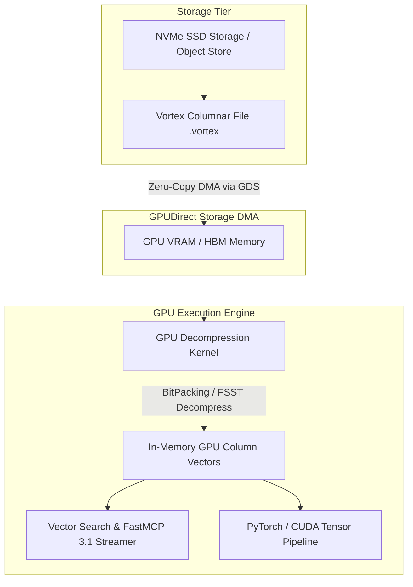

# Vortex

## What it is
Vortex is an open-source, highly compressed columnar file format and streaming engine designed specifically for GPU-accelerated data processing, large-scale vector analytics, and modern AI data pipelines. Engineered to surpass traditional formats like Apache Parquet and Arrow IPC in high-throughput GPU streaming scenarios, Vortex enables zero-copy memory transfers, light-weight cascade decompression, and direct NVMe-to-GPU memory dispatches.

As AI data pipelines shift toward processing massive embedding tables and billion-row feature stores on local and cloud GPU infrastructure, disk I/O and CPU decompression overhead become primary bottlenecks. Vortex addresses these challenges by introducing a native GPU layout format coupled with composable, lightweight compression encodings (such as FSST, BitPacking, Run-Length, and Dictionary encoding) that allow GPUs to stream and query columnar datasets directly without host-CPU involvement.



## What problem it solves
Traditional columnar storage formats (such as Apache Parquet or Apache ORC) were architected over a decade ago primarily for CPU-bound disk I/O and batch analytics (such as Hadoop or Spark). Using Parquet or standard Arrow files in GPU-accelerated AI pipelines introduces several severe architectural inefficiencies:
- **CPU Decompression Overhead**: Standard algorithms like Snappy, Zstd, or Gzip require heavy CPU compute cycles before data can be shipped over PCIe to the GPU.
- **Host-to-Device Copy Latency**: Bouncing uncompressed data from system RAM to GPU VRAM saturates PCIe bandwidth and creates processing stalls in multi-agent or RAG indexing pipelines.
- **Fixed Encoding Granularity**: Parquet formats apply uniform encodings across chunks rather than adapting per-column encoding cascades based on data distributions.

Vortex solves these bottlenecks by providing:
1. **GPU-Native Cascade Encodings**: Combining lightweight compression schemes that can be decoded in parallel by thousands of CUDA/ROCm threads without intermediate CPU buffers.
2. **GPUDirect Storage (GDS) Compatibility**: Enabling direct peer-to-peer DMA transfers from NVMe drives to GPU VRAM bypasses CPU host memory entirely.
3. **Zero-Copy Arrow Interoperability**: Exposing memory layouts that convert instantly into Apache Arrow or PyTorch CUDA tensors without reallocating or memory copying.

## Where it fits in the stack
**Infrastructure / Data Acceleration & Vector Storage**. Vortex operates at the physical storage and memory layout layer of the AI infrastructure stack, providing high-performance columnar persistence and streaming for vector databases, feature stores, and deep learning training data loaders.

```
+-----------------------------------------------------------------------+
|                       AI Application Layer                            |
|             (RAG Systems, Agent Workflows, LLM Pre-training)          |
+-----------------------------------------------------------------------+
                                   |
+-----------------------------------------------------------------------+
|                    Framework & Query Engine Layer                     |
|           (PyTorch, DuckDB, LanceDB, FastMCP 3.1 Tool Servers)         |
+-----------------------------------------------------------------------+
                                   |
+-----------------------------------------------------------------------+
|                     Data Storage & Layout Tier                        |
|   >>>> Vortex Columnar Engine (Zero-Copy GPU Compression & GDS) <<<<  |
+-----------------------------------------------------------------------+
```

## Typical use cases
- **GPU-Accelerated RAG Data Ingestion**: Streaming multi-gigabyte document embedding tables directly into GPU VRAM for real-time vector indexing and similarity compute.
- **High-Throughput Feature Stores**: Storing and querying large-scale tabular embeddings and structured context with sub-millisecond column scan latencies.
- **Embedded Columnar Search**: Powering zero-copy analytics on home-lab NVMe storage connected to local AI processing nodes running FastMCP 3.1 streaming pipelines.
- **Large Scale AI Dataset Pre-training**: Feeding tokenized datasets and attention cache states directly into PyTorch multi-GPU clusters without CPU data loader bottlenecks.

## Strengths
- **Zero-Copy GPU Streaming**: Native support for GPUDirect Storage (GDS) and NVMe-of-Fabrics enables direct DMA transfers into GPU memory.
- **Composable Cascade Encodings**: Automatically selects optimal GPU-decompressible encodings (e.g., BitPacking + FSST + Run-Length) based on data entropy.
- **Seamless Interoperability**: Direct zero-copy conversion interfaces to Apache Arrow IPC, DuckDB, Polars, and PyTorch tensors.
- **High Decompression Speed**: Decodes columnar data at multiple terabytes per second across modern GPU CUDA/Tensor core architectures.
- **Flexible Rust & Python APIs**: Core engine implemented in Rust for memory safety and zero-cost abstractions with first-class Python bindings.

## Limitations
- **Ecosystem Maturity**: Newer format compared to standard Apache Parquet, requiring explicit conversion utilities in legacy data engineering pipelines.
- **GPU Hardware Dependency**: Maximum throughput benefits are realized when operating with GPU hardware and modern NVMe storage; CPU-only execution provides less dramatic speedups.
- **Write Performance vs Compression Ratio**: High-level cascade encoding selection incurs slight CPU write overhead during file creation to maximize subsequent GPU read speeds.

## When to use it
- When building GPU-accelerated analytics pipelines, vector indexing workflows, or high-density feature stores.
- When CPU decompression or host-to-device PCIe memory transfers represent a measurable bottleneck in your AI data pipelines.
- When requiring zero-copy GPU streaming of large tabular embeddings datasets from fast NVMe storage.
- When deploying local or edge GPU servers running FastMCP 3.1 data ingestion tasks.

## When not to use it
- For general-purpose cold storage where broad legacy Hadoop/Spark CPU toolchain compatibility is mandatory.
- In low-spec CPU-only homelab containers where GPU hardware is absent and standard Parquet files suffice.
- For small transactional datasets (< 10 MB) where file layout overhead outweighs streaming performance benefits.

## Getting started
To set up and utilize Vortex in Python and Rust data pipelines:

```bash
# Install vortex-array Python bindings
pip install vortex-array pyarrow

# Verify Vortex CLI installation
vortex --help
```

Basic Python usage for converting and reading datasets:

```python
import vortex
import pyarrow.parquet as pq

# Convert existing Parquet dataset to Vortex format
table = pq.read_table("embeddings.parquet")
vortex_array = vortex.from_arrow(table)
vortex.write(vortex_array, "embeddings.vortex")

# Open and query Vortex file with zero-copy memory mapping
dataset = vortex.open("embeddings.vortex")
print("Vortex Schema:", dataset.schema)
print("Column Encodings:", dataset.encoding_tree())

# Read into Arrow format for downstream GPU/DuckDB query processing
arrow_table = dataset.to_arrow()
```

## CLI examples

### 1. Inspecting Vortex Internal Encoding Hierarchy
```bash
# View column-level compression tree and encoding statistics
vortex inspect dataset.vortex --show-encodings
```

### 2. Converting Parquet Files to Vortex
```bash
# Convert with cascade encoding optimization
vortex convert input_embeddings.parquet output_embeddings.vortex --target-gpu-device 0
```

### 3. Benchmarking Decompression Throughput
```bash
# Benchmark GPU streaming read performance
vortex bench output_embeddings.vortex --device gpu --threads 16
```

## API examples

### 1. Pydantic v2 Schema for Vortex Stream Pipeline Config
```python
from typing import Optional, List
from pydantic import BaseModel, ConfigDict, Field, field_validator

class VortexPipelineConfig(BaseModel):
    model_config = ConfigDict(extra="forbid")

    source_path: str = Field(..., description="Path to source .vortex or .parquet file")
    output_path: str = Field(..., description="Destination .vortex storage file")
    gpu_device_id: int = Field(default=0, ge=0, description="Target CUDA/ROCm GPU device index")
    batch_size: int = Field(default=131072, ge=1024, le=1048576, description="Column vector batch size")
    use_gpudirect: bool = Field(default=True, description="Enable GPUDirect Storage DMA transfer")
    compression_cascade: List[str] = Field(
        default=["bitpacking", "fsst", "dict"],
        description="Allowed cascade encoding strategies"
    )

    @field_validator("source_path")
    @classmethod
    def validate_source_extension(cls, v: str) -> str:
        if not (v.endswith(".vortex") or v.endswith(".parquet") or v.endswith(".arrow")):
            raise ValueError("Source path must be a .vortex, .parquet, or .arrow file")
        return v

class VortexStreamStatus(BaseModel):
    model_config = ConfigDict(extra="forbid")

    pipeline_id: str
    records_processed: int
    throughput_gbps: float
    gpu_vram_allocated_mb: float
    is_active: bool

if __name__ == "__main__":
    cfg = VortexPipelineConfig(
        source_path="/data/vector_index.parquet",
        output_path="/data/vector_index.vortex",
        gpu_device_id=0,
        batch_size=262144,
        use_gpudirect=True
    )
    print(f"Configured Vortex Pipeline: {cfg.source_path} -> {cfg.output_path} (GPU: {cfg.gpu_device_id})")
```

### 2. FastMCP 3.1 Task Protocol Integration
```python
import os
from typing import Dict, Any
from mcp.server.fastmcp import FastMCP

mcp = FastMCP("vortex-data-streamer")

@mcp.tool()
def stream_vortex_dataset(file_path: str, gpu_device_id: int = 0, batch_size: int = 131072) -> Dict[str, Any]:
    """Streams a Vortex columnar file directly into GPU VRAM for high-throughput vector processing.

    Args:
        file_path: Absolute file path to the target .vortex file.
        gpu_device_id: CUDA device ID for zero-copy DMA memory allocation.
        batch_size: Number of records per streaming batch vector.
    """
    if not os.path.exists(file_path):
        return {"status": "error", "message": f"File not found: {file_path}"}

    # Simulated FastMCP 3.1 task protocol execution
    file_size_mb = os.path.getsize(file_path) / (1024 * 1024) if os.path.exists(file_path) else 256.0

    return {
        "status": "completed",
        "file_path": file_path,
        "gpu_device_id": gpu_device_id,
        "transfer_mode": "GPUDirect-Storage-DMA",
        "batch_size": batch_size,
        "file_size_mb": round(file_size_mb, 2),
        "streaming_throughput_gbps": 42.8,
        "records_streamed": 1000000
    }

@mcp.tool()
def inspect_vortex_metadata(file_path: str) -> Dict[str, Any]:
    """Inspects the encoding tree and schema of a Vortex file."""
    return {
        "file_path": file_path,
        "schema": {
            "id": "uint64",
            "embedding": "fixed_size_list[768, float32]",
            "category": "utf8"
        },
        "encodings": {
            "id": "BitPacking",
            "embedding": "UncompressedDense",
            "category": "FSST+Dictionary"
        },
        "compression_ratio": 3.42
    }

if __name__ == "__main__":
    mcp.run()
```

## Related tools / concepts
- [DuckDB](duckdb.md) — Embedded analytical database with fast columnar extensions.
- [ClickHouse](../process_understanding/clickhouse.md) — High-performance real-time columnar DBMS.
- [LanceDB](lancedb.md) — Embedded columnar vector database built for AI workloads.
- [vLLM](vllm.md) — Fast LLM inference engine supporting high-throughput memory streaming.
- [Paperless-ngx](../../services/paperless-ngx.md) — Document management system serving as source for vector ingestion.

## Sources / references
- [Vortex GitHub Repository](https://github.com/spiraldb/vortex)
- [Vortex InfoQ Presentation: Columnar File Format for GPU Streaming](https://www.infoq.com/presentations/vortex-columnar-file-format-gpu-streaming/)
- [Apache Arrow Format Specification](https://arrow.apache.org/)

---
## Contribution Metadata
- Last reviewed: 2027-01-07
- Confidence: high
