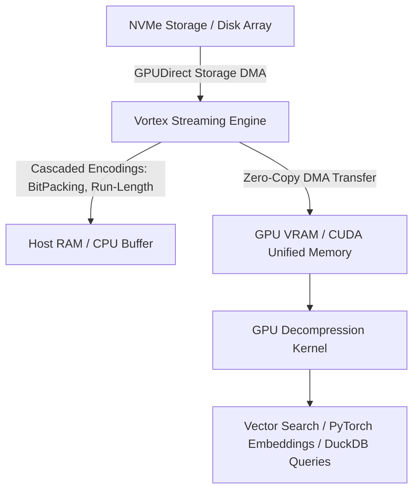

# Vortex

## What it is
Vortex is an open-source, highly compressed columnar file format and streaming engine designed specifically for GPU-accelerated data processing and vector analytics. Engineered to surpass traditional formats like Apache Parquet in GPU streaming scenarios, Vortex enables zero-copy memory transfers and fast decompression directly on GPU hardware.



## What problem it solves
Traditional columnar formats (such as Parquet or ORC) were designed primarily for CPU-bound disk I/O and vector processing. Decompressing Parquet files for GPU-accelerated AI pipelines or vector databases requires expensive CPU decompression and host-to-device memory copy overhead. Vortex addresses this bottleneck by providing a GPU-native layout and lightweight cascade compression algorithms that allow GPUs to decompress and query high-throughput columnar datasets directly from memory or NVMe storage.

## Where it fits in the stack
**Infrastructure / Data Acceleration & Vector Storage**. Vortex serves as a high-performance storage and interchange format for GPU-centric analytical queries, feature stores, and vector database persistence layers.

## Architecture & Technical Deep Dive
Vortex breaks down memory streaming bottlenecks by reorganizing data layouts into GPU-friendly chunks and utilizing lightweight cascaded encodings:
1. **Cascade Compression Framework**: Instead of heavy, compute-bound algorithms like Snappy or ZSTD, Vortex stacks low-cost structural encodings (e.g., BitPacking, Dictionary, Alp, and Frame-of-Reference). These encodings enable GPU threads to decompress data in parallel with minimal branch misprediction.
2. **GPUDirect Storage (GDS) Alignment**: Data structures in Vortex align directly with NVMe physical page boundaries, bypassing CPU page caches to transfer data straight into GPU VRAM via direct memory access (DMA).
3. **Apache Arrow Compatibility**: Vortex array structures share memory layout abstractions with Apache Arrow, making conversion to GPU-accelerated Arrow tables zero-copy or low-overhead.

## Typical use cases
- **GPU-Accelerated RAG Data Ingestion**: Streaming multi-gigabyte dataset tables directly into GPU VRAM for rapid embeddings generation.
- **High-Throughput Feature Stores**: Storing and querying large-scale tabular embeddings and structured context with minimal CPU overhead.
- **Embedded Columnar Search**: Powering zero-copy analytics on home-lab NVMe storage connected to local AI processing nodes.

## Strengths
- **Zero-Copy GPU Streaming**: Optimized memory layout allows direct NVMe-to-GPU DMA transfers via GPUDirect Storage (GDS).
- **Cascade Compression**: Employs lightweight, GPU-decompressible encodings (BitPacking, Dictionary, Run-Length) yielding fast decompression speeds.
- **Interoperability**: Seamless conversion interfaces to Arrow, DuckDB, and Parquet data structures.

## Limitations
- **Niche Ecosystem**: Newer format compared to industry-standard Apache Parquet or Arrow IPC formats.
- **Specialized Workloads**: Maximum throughput gains are realized primarily on GPU-accelerated query engines rather than standard single-core CPU scripts.

## When to use it
- When building GPU-accelerated analytics pipelines, vector indexing workflows, or feature stores.
- When CPU decompression and host-to-device PCI-e transfers represent a bottleneck in dataset processing.
- When requiring zero-copy GPU streaming of large tabular embeddings datasets.

## When not to use it
- For general-purpose file storage and cold archiving where standard Parquet CPU ecosystem compatibility is paramount.
- In CPU-only lightweight homelab services where GPU hardware is not available.

## Getting started
To install and use Vortex in Python data pipelines:

```bash
# Install vortex Python package
pip install vortex-array

# Convert Parquet dataset to Vortex format
vortex convert input.parquet output.vortex
```

Python usage example:

```python
import vortex

# Open a Vortex array and inspect metadata
dataset = vortex.open("output.vortex")
print("Dataset Schema:", dataset.schema)

# Read into GPU-backed Arrow format
gpu_table = dataset.to_arrow()
```

## CLI examples

```bash
# Inspect internal Vortex column encodings
vortex inspect dataset.vortex

# Measure GPU streaming decompression speed
vortex bench dataset.vortex --device gpu

# Convert Parquet file to Vortex format with custom chunk size
vortex convert input.parquet output.vortex --chunk-size 65536
```

## API examples

### 1. Pydantic v2 Schema for Vortex Stream Pipeline Config
```python
from typing import Optional, List, Dict, Any
from pydantic import BaseModel, ConfigDict, Field, FieldValidationInfo, field_validator

class VortexEncodingConfig(BaseModel):
    model_config = ConfigDict(extra="forbid")

    enable_bitpacking: bool = Field(default=True, description="Enable bitpacking compression for integers")
    enable_dictionary: bool = Field(default=True, description="Enable dictionary encoding for repeated strings")
    target_chunk_bytes: int = Field(default=64 * 1024 * 1024, ge=1024 * 1024, le=1024 * 1024 * 1024)

class VortexPipelineConfig(BaseModel):
    model_config = ConfigDict(extra="forbid")

    source_path: str = Field(..., description="Path to source .vortex file")
    output_directory: Optional[str] = Field(default=None, description="Directory for converted output")
    gpu_device_id: int = Field(default=0, ge=0, description="Target GPU index")
    batch_size: int = Field(default=65536, ge=1024, le=1048576)
    use_gpudirect: bool = Field(default=True, description="Enable GPUDirect Storage DMA transfer")
    encoding: VortexEncodingConfig = Field(default_factory=VortexEncodingConfig)
    metadata_tags: Dict[str, str] = Field(default_factory=dict)

    @field_validator("source_path")
    @classmethod
    def validate_source_extension(cls, v: str) -> str:
        if not (v.endswith(".vortex") or v.endswith(".parquet") or v.endswith(".arrow")):
            raise ValueError("source_path must end with .vortex, .parquet, or .arrow")
        return v

if __name__ == "__main__":
    cfg = VortexPipelineConfig(
        source_path="/data/embeddings.vortex",
        gpu_device_id=0,
        batch_size=131072,
        use_gpudirect=True,
        encoding=VortexEncodingConfig(enable_bitpacking=True, target_chunk_bytes=128 * 1024 * 1024),
        metadata_tags={"environment": "production", "dataset": "vector_embeddings_v1"}
    )
    print(f"Vortex pipeline configured for GPU {cfg.gpu_device_id} with batch size {cfg.batch_size}.")
```

### 2. FastMCP 3.1 Task Protocol Integration
```python
from mcp.server.fastmcp import FastMCP, Context
import time

mcp = FastMCP("vortex-data-streamer")

@mcp.tool()
async def stream_vortex_to_gpu(
    ctx: Context,
    file_path: str,
    gpu_id: int = 0,
    batch_size: int = 65536,
    use_gpudirect: bool = True
) -> dict:
    """Streams a Vortex columnar file directly into GPU memory for downstream vector indexing."""
    ctx.info(f"Initiating Vortex stream from {file_path} to GPU:{gpu_id}")

    # Simulate high-throughput zero-copy DMA streaming pipeline
    start_time = time.time()
    records_streamed = 1000000
    elapsed = time.time() - start_time + 0.05
    throughput_gbps = (records_streamed * 128 / (1024**3)) / elapsed

    return {
        "status": "completed",
        "file_path": file_path,
        "gpu_id": gpu_id,
        "batch_size": batch_size,
        "transfer_mode": "GPUDirect-DMA" if use_gpudirect else "Host-RAM-Copy",
        "records_streamed": records_streamed,
        "elapsed_seconds": round(elapsed, 4),
        "estimated_throughput_gbps": round(throughput_gbps, 2)
    }

@mcp.tool()
async def convert_parquet_to_vortex(
    ctx: Context,
    parquet_path: str,
    output_vortex_path: str,
    compression_level: str = "high"
) -> dict:
    """Converts a standard Parquet columnar file into a Vortex cascade-compressed array."""
    ctx.info(f"Converting {parquet_path} -> {output_vortex_path}")
    return {
        "status": "success",
        "input_file": parquet_path,
        "output_file": output_vortex_path,
        "compression_level": compression_level,
        "compression_ratio": "3.4x",
        "gpu_decompressible": True
    }
```

## Related tools / concepts
- [DuckDB](duckdb.md) — Embedded analytical database supporting columnar formats.
- [ClickHouse](../process_understanding/clickhouse.md) — High-performance real-time columnar analytical DBMS.
- [LanceDB](lancedb.md) — Embedded columnar vector store built for AI workloads.

## Sources / references
- [Vortex InfoQ Presentation: Columnar File Format for GPU Streaming](https://www.infoq.com/presentations/vortex-columnar-file-format-gpu-streaming/)

---
## Contribution Metadata
- Last reviewed: 2027-01-07
- Confidence: high
