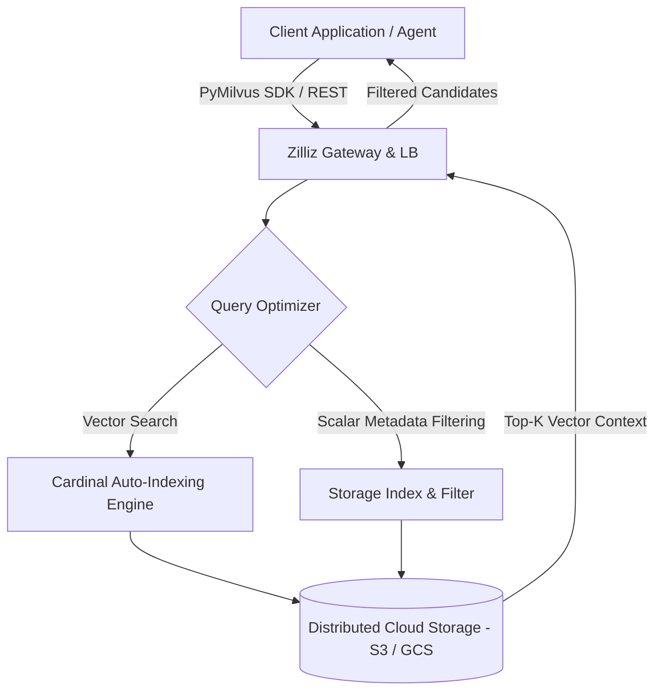

# Zilliz

## What it is
Zilliz (Zilliz Cloud) is a fully managed, cloud-native vector database platform built on top of open-source **Milvus**. Engineered specifically for enterprise-scale vector similarity search, unstructured data retrieval, and retrieval-augmented generation (RAG) applications, Zilliz Cloud abstracts the complex infrastructure management of distributed vector databases into a high-throughput, serverless database service.



## What problem it solves
Operating large-scale self-hosted Milvus clusters requires significant DevOps resources to manage Kubernetes deployments, tune vector index algorithms (HNSW, IVF_FLAT, DiskANN), configure memory allocation, and balance compute/storage nodes independently under fluctuating workloads. Zilliz Cloud solves these operational burdens by offering a fully managed, auto-scaling vector database equipped with Cardinal indexing—a proprietary auto-tuning engine that optimizes vector search speed, memory footprint, and recall accuracy without requiring manual index parameter configuration.

## Where it fits in the stack
**Infrastructure / Vector Database**. Zilliz functions as the enterprise-grade, managed vector memory layer for LLM applications, RAG pipelines, and autonomous AI agents. It stores dense embeddings, sparse vectors, and rich metadata for fast semantic lookup across multi-cloud environments.

## Typical use cases
- **Enterprise-Scale RAG Pipelines**: Storing and searching millions to billions of document embeddings with sub-10ms query latencies across AWS, GCP, and Azure.
- **Agentic Long-Term Memory**: Serving as persistent semantic memory for multi-agent systems, storing multi-turn conversation logs and episodic agent experience.
- **Hybrid Search Applications**: Executing unified queries combining dense semantic vector search, BM25 sparse keyword matching, and strict metadata field filtering.
- **Visual & Multimodal Search**: Storing image, audio, and video vector representations generated by multimodal embedding models.

## Strengths
- **100% Milvus Compatibility**: Native API and SDK compatibility with open-source PyMilvus, allowing seamless migration between self-hosted Milvus and Zilliz Cloud.
- **Automated Cardinal Indexing**: Proprietary indexing technology that dynamically optimizes memory and disk utilization while maintaining high recall.
- **Serverless Auto-Scaling**: Pay-as-you-go serverless architecture that scales compute and vector storage independently based on query volume.
- **Enterprise Security & Compliance**: SOC 2 Type II, ISO 27001, and HIPAA compliant with support for RBAC, encryption at rest/in transit, and PrivateLink (VPC peering).

## Limitations
- **Cloud Proprietary Service**: While fully API-compatible with open-source Milvus, Zilliz Cloud operates as a commercial managed service with usage-based cloud billing.
- **Network Latency**: Remote managed cloud database queries incur network round-trip time compared to local embedded vector engines (e.g., LanceDB, DuckDB).

## When to use it
- When you require production Milvus capabilities without the operational complexity of managing Kubernetes clusters and index tuning.
- For enterprise RAG and agent applications scaling beyond tens or hundreds of millions of high-dimensional vector embeddings.
- When enterprise compliance (SOC 2, PrivateLink, multi-region deployment) and 99.99% SLA guarantees are mandatory.

## When not to use it
- For lightweight, local-first applications where embedded in-memory vector stores (e.g., LanceDB, Chroma, Qdrant local) are sufficient.
- When full air-gapped on-premises or sovereign cloud deployment is required without external cloud internet connectivity (use self-hosted Milvus).

## Getting started

### Installation
Install the official PyMilvus SDK (compatible with Zilliz Cloud instances):

```bash
pip install pymilvus
```

### Connection Example
Initialize a connection to your Zilliz Cloud cluster using your instance URI and API token:

```python
from pymilvus import MilvusClient

client = MilvusClient(
    uri="https://in01-123456789.api.gcp-us-west1.zillizcloud.com",
    token="YOUR_ZILLIZ_API_KEY"
)

# Create a collection with auto-indexing
client.create_collection(
    collection_name="enterprise_knowledge_base",
    dimension=1536  # OpenAI text-embedding-3-large vector dimension
)
```

## CLI examples

```bash
# Install the Milvus / Zilliz CLI tool
pip install milvus-cli

# Connect to a managed Zilliz Cloud cluster
milvus-cli connect -h https://in01-123456789.api.gcp-us-west1.zillizcloud.com -t YOUR_ZILLIZ_API_KEY

# List active vector collections
milvus-cli list collections

# Inspect collection metadata schema
milvus-cli describe collection -c enterprise_knowledge_base
```

## API examples

### Python FastMCP 3.1 & Pydantic v2 Zilliz Search Tool
The following code snippet demonstrates integrating Zilliz Cloud into a FastMCP 3.1 server with Pydantic v2 schemas:

```python
from typing import List, Dict, Any, Optional
from pydantic import BaseModel, Field
from pymilvus import MilvusClient
from mcp.server.fastmcp import FastMCP

# Define Pydantic v2 schemas for Zilliz search requests and responses
class VectorSearchRequest(BaseModel):
    collection_name: str = Field(..., description="Target Zilliz vector collection name.")
    vector: List[float] = Field(..., description="High-dimensional query embedding vector.")
    limit: int = Field(default=5, ge=1, le=100, description="Top-K nearest neighbors to retrieve.")
    filter_expression: Optional[str] = Field(default=None, description="Scalar boolean filter expression (e.g., category == 'tech').")

class SearchResultItem(BaseModel):
    id: Any = Field(..., description="Unique entity ID in Zilliz.")
    distance: float = Field(..., description="Vector similarity distance score.")
    entity: Dict[str, Any] = Field(default_factory=dict, description="Retrieved metadata fields.")

class VectorSearchResponse(BaseModel):
    collection_name: str = Field(..., description="Collection searched.")
    results: List[SearchResultItem] = Field(default_factory=list, description="List of matching vector entities.")

# Initialize FastMCP 3.1 server
mcp = FastMCP("zilliz-vector-search-server")

ZILLIZ_URI = "https://in01-123456789.api.gcp-us-west1.zillizcloud.com"
ZILLIZ_TOKEN = "YOUR_ZILLIZ_API_KEY"

@mcp.tool()
async def search_zilliz_vectors(request: VectorSearchRequest) -> VectorSearchResponse:
    """Executes a similarity search against a managed Zilliz Cloud vector database collection."""
    client = MilvusClient(uri=ZILLIZ_URI, token=ZILLIZ_TOKEN)

    search_params = {"metric_type": "COSINE"}
    search_res = client.search(
        collection_name=request.collection_name,
        data=[request.vector],
        limit=request.limit,
        filter=request.filter_expression,
        search_params=search_params,
        output_fields=["title", "category", "source_url"]
    )

    items = []
    if search_res and len(search_res) > 0:
        for hit in search_res[0]:
            items.append(SearchResultItem(
                id=hit.get("id"),
                distance=hit.get("distance", 0.0),
                entity=hit.get("entity", {})
            ))

    return VectorSearchResponse(collection_name=request.collection_name, results=items)

if __name__ == "__main__":
    mcp.run()
```

## Related tools / concepts
- [Milvus](milvus.md) — Open-source distributed vector database engine.
- [Qdrant](qdrant.md) — High-performance Rust vector database.
- [Pinecone](pinecone.md) — Serverless cloud vector platform.
- [LanceDB](lancedb.md) — Embedded developer-friendly vector database.

## Sources / references
- [Zilliz Official Site](https://zilliz.com/?ref=2026-09-21-audit)
- [Zilliz Cloud Documentation](https://docs.zilliz.com/)

## Contribution Metadata
- Last reviewed: 2027-01-07
- Confidence: high
