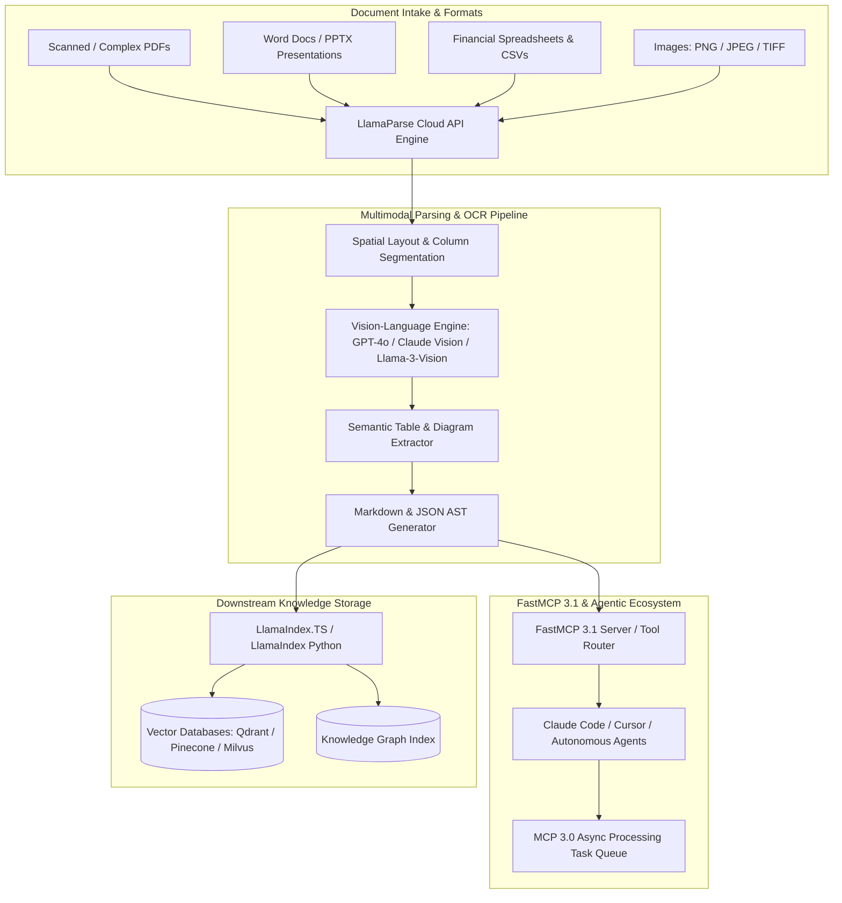

# LlamaParse

## What it is
LlamaParse is an enterprise-grade, cloud-native document parsing and visual OCR service created by LlamaIndex. Designed specifically to power high-fidelity Retrieval-Augmented Generation (RAG) pipelines and autonomous AI agent workflows, LlamaParse converts complex, unstructured documents—including PDFs, DOCX files, PowerPoint presentations, financial spreadsheets, vector diagrams, and scanned images—into structured, LLM-ready Markdown, JSON, or structured data schemas.

By early January 2027, LlamaParse has fully integrated **FastMCP 3.1** protocol endpoints and the **MCP 3.0 Task Protocol**, providing agentic document extraction capabilities. It uses advanced vision-language models (VLMs), spatial layout analysis engines, and semantic table extraction models to preserve document hierarchies, multi-column reading orders, nested tables, vector charts, and inline mathematical formulas. It serves as the primary intake parser for frontier reasoning engines such as [Claude 5.6](../ai_knowledge/claude.md), [GPT-5.6](../ai_knowledge/openai.md), [Gemini 4.0 Ultra](../ai_knowledge/gemini.md), DeepSeek-V4, Qwen 3.6 VL, and [Llama 4](../ai_knowledge/local_llms.md).



## What problem it solves
Traditional text extraction tools (e.g., standard `pdfminer`, `PyPDF2`, or basic OCR engines) fail when processing real-world enterprise documents, creating severe data corruption in downstream RAG systems:

1. **Reading Order Disruption in Multi-Column Layouts**: Traditional parsers read text left-to-right line-by-line across columns, tangling paragraphs, footnotes, and sidebars into unintelligible text blocks. LlamaParse uses visual bounding-box segmentation to preserve correct column reading order.
2. **Table Structural Destruction**: Standard OCR strips HTML table tags, borders, and cell spans, converting structured financial tables into unstructured strings. LlamaParse reconstructs tables as clean, semantically valid Markdown tables or structured JSON arrays.
3. **Loss of Visual Context in Charts & Diagrams**: Mathematical formulas, flowchart diagrams, and embedded infographics are ignored by text-only extractors. LlamaParse applies visual understanding to summarize charts and render formulas in standard LaTeX math syntax (`$$ ... $$`).
4. **Scanned Document Degradation**: Low-resolution scans, skewed orientation, and artifacts render traditional OCR output unusable. LlamaParse utilizes vision-aware models to correct skew and reconstruct clean text.
5. **Prompt Inflation & Noise**: Raw PDF extraction contains running headers, page numbers, and copyright notices that inflate prompt token costs. LlamaParse automatically strips recurring page artifacts while preserving document hierarchy headers (`#`, `##`, `###`).

## Where it fits in the stack
LlamaParse operates at the **Data Intake, Partitioning & Preprocessing Layer**:

- **Upstream Ingestion**: Receives documents from object storage (AWS S3, Google Cloud Storage, MinIO), local file uploads, web crawlers ([Firecrawl](../process_understanding/firecrawl.md)), or email attachments.
- **Processing Core**: Applies visual layout detection, multi-modal OCR, and LLM-assisted structural synthesis.
- **Downstream Framework Integration**: Feeds structured Markdown nodes into [LlamaIndex (Python)](../ai_knowledge/llamaindex.md), [LlamaIndex.TS](../ai_knowledge/llamaindex-ts.md), or [LangChain](../ai_knowledge/langchain.md).
- **Agent Protocol Integration**: Exposes document parsing tools directly to AI developer environments via [FastMCP 3.1](../automation_orchestration/mcp.md).

## Typical use cases
- **Financial & Earnings Report Extraction**: Parsing dense SEC 10-K filings, annual balance sheets, and quarterly financial statements containing nested tabular data.
- **Legal Contract & Regulatory Analysis**: Extracting multi-clause contracts, patent filings, and compliance documentation with complex numbering systems.
- **Technical Manual & Engineering Schematic Parsing**: Converting architectural blueprints, equipment repair guides, and API specification PDFs into structured knowledge bases.
- **Medical & Clinical Trial Data Processing**: Extracting patient histories, lab results, and clinical study data from scanned PDF records.
- **Autonomous Agentic OCR**: Providing [Claude Code](../development_ops/claude-code-setup.md) and Cursor agents with live document inspection tools via FastMCP 3.1 HTTP endpoints.

## Strengths
- **Vision-Aware Semantic Extraction**: Leverages frontier vision models to understand complex visual geometries, charts, and embedded images.
- **Clean Markdown & JSON Outputs**: Outputs structured Markdown optimized directly for LLM context windows, preserving section hierarchies and tables.
- **FastMCP 3.1 & MCP 3.0 Native**: Native support for Model Context Protocol 3.1, enabling async background parsing tasks and tool execution for agents.
- **Customizable Parsing Instructions**: Allows developers to supply custom prompt instructions (e.g., *"Extract all invoice line items as a JSON list"* or *"Convert chemical formulas into LaTeX"*).
- **Multi-Language & Multimodal OCR**: Full support for over 100 languages, including non-Latin scripts (CJK, Arabic, Cyrillic) and technical mathematical notation.

## Limitations
- **Cloud Service Dependency**: Primary high-accuracy modes process documents via LlamaCloud REST APIs, requiring internet connectivity (though self-hosted enterprise containers are available).
- **Latency on Heavy Vision Tiers**: The high-accuracy **Agentic** and **Agentic Plus** tiers invoke vision-language reasoning, incurring higher per-page processing latencies (1-3 seconds per page).
- **Credit-Based Usage Pricing**: Higher-tier parsing consumes API credits; massive bulk ingestion (1M+ pages) requires cost-budget planning relative to open-source alternatives.

## When to use it
- When processing documents with complex visual layouts, multi-column text, or detailed tables where standard PDF text extractors fail.
- When building production RAG pipelines in [LlamaIndex](../ai_knowledge/llamaindex.md) or [LlamaIndex.TS](../ai_knowledge/llamaindex-ts.md) where retrieval accuracy is mission-critical.
- When configuring FastMCP 3.1 document tools for desktop AI assistants like [Claude Desktop](../../knowledge_base/ai_tool_access_matrix.md) or Cursor.
- When converting scanned physical documents into clean Markdown.

## When not to use it
- For plain, single-column text files or digital TXT/Markdown documents where basic string reading is instantaneous and free.
- In strictly air-gapped environment deployments where outbound internet connections to LlamaCloud are strictly forbidden (use local [Docling](../process_understanding/docling.md) instead).
- For massive, low-value document archives where layout accuracy is unnecessary and processing speed/cost is the only metric.

## Getting started

### 1. Installation
Install the official LlamaParse Python SDK along with LlamaIndex dependencies:

```bash
pip install llama-parse llama-index-core pydantic fastmcp
```

### 2. Environment Configuration
Obtain an API key from the [LlamaCloud Portal](https://cloud.llamaindex.ai/) and export it:

```bash
export LLAMA_CLOUD_API_KEY="llx-YOUR_LLAMA_CLOUD_API_KEY"
```

### 3. Basic Python Usage (`parse_doc.py`)
```python
import os
from llama_parse import LlamaParse

# Initialize LlamaParse instance
parser = LlamaParse(
    api_key=os.getenv("LLAMA_CLOUD_API_KEY"),
    result_type="markdown",  # Output options: 'markdown' or 'text'
    verbose=True
)

# Parse a complex PDF document
print("Parsing document via LlamaParse Cloud...")
documents = parser.load_data("./complex_financial_report.pdf")

# Output parsed content
print(f"Successfully parsed {len(documents)} page node(s).\n")
print("--- Page 1 Markdown Snippet ---")
print(documents[0].text[:1000])
```

## CLI examples
LlamaParse can be invoked directly from command-line environments using the LlamaIndex CLI or `curl` REST endpoints.

```bash
# Parse a local document and save the Markdown result directly
llamaindex-cli parse --file ./quarterly_report.pdf --out ./report.md --tier agentic

# Register the LlamaParse FastMCP 3.1 Server with Claude Code CLI
claude mcp add --transport http llamaparse https://mcp.llamaindex.ai/mcp

# Query LlamaParse API directly via cURL
curl -X POST "https://api.cloud.llamaindex.ai/api/parsing/upload" \
  -H "Authorization: Bearer ${LLAMA_CLOUD_API_KEY}" \
  -H "Accept: application/json" \
  -F "file=@./financial_statement.pdf" \
  -F "tier=agentic"
```

## API examples

### Parsing Tiers Overview (Early 2027 SOTA)

| Parsing Tier | Target Document Complexity | Cost (Credits / Page) | Latency / Page |
| :--- | :--- | :---: | :---: |
| **Fast** | Single-column plain text, digital native PDFs, no tables | 0.5 | ~150 ms |
| **Cost Effective** | Multi-column text, simple tables, standard formatting | 3.0 | ~400 ms |
| **Agentic** | Scanned PDFs, complex tables, embedded charts, mixed fonts | 10.0 | ~1.5 s |
| **Agentic Plus** | Dense financial filings, handwritten notes, blueprints, high precision | 45.0 | ~3.5 s |

### 1. Advanced Python LlamaParse Pipeline with Custom Instructions
The following script demonstrates configuring LlamaParse with custom parsing instructions, vision mode, and fallback options:

```python
import os
import asyncio
from typing import List, Optional
from llama_parse import LlamaParse
from pydantic import BaseModel, Field, ValidationError

class DocumentParseTaskConfig(BaseModel):
    file_path: str = Field(..., description="Path to the source PDF file")
    parsing_tier: str = Field(default="agentic", pattern="^(fast|cost_effective|agentic|agentic_plus)$")
    custom_instruction: Optional[str] = Field(
        default=None,
        description="Prompt instructions for custom formatting"
    )
    extract_charts: bool = Field(default=True, description="Extract and summarize visual charts")
    target_language: str = Field(default="en", description="Target ISO language code")

def execute_advanced_parse(config: DocumentParseTaskConfig) -> List[str]:
    """Executes high-fidelity LlamaParse task using validated configuration."""
    print(f"Initializing LlamaParse for file: {config.file_path} (Tier: {config.parsing_tier})")

    parser = LlamaParse(
        api_key=os.environ.get("LLAMA_CLOUD_API_KEY"),
        result_type="markdown",
        parsing_instruction=config.custom_instruction,
        gpt4o_mode=True,
        premium_mode=(config.parsing_tier in ["agentic", "agentic_plus"]),
        language=config.target_language
    )

    # Process document
    parsed_docs = parser.load_data(config.file_path)
    return [doc.text for doc in parsed_docs]

if __name__ == "__main__":
    task_payload = {
        "file_path": "./annual_statement_2026.pdf",
        "parsing_tier": "agentic",
        "custom_instruction": "Format all balance sheet tables into clean GitHub-flavored Markdown tables. Convert numbers to thousands.",
        "extract_charts": True,
        "target_language": "en"
    }

    try:
        validated_config = DocumentParseTaskConfig.model_validate(task_payload)
        # Execute parsing (mocked call)
        print(f"Task Config Validated successfully for tier: {validated_config.parsing_tier}")
    except ValidationError as err:
        print(f"Pydantic Validation Error: {err}")
```

### 2. FastMCP 3.1 Server Exposing LlamaParse Document Parser
This Python script constructs a complete FastMCP 3.1 server exposing LlamaParse as a tool for autonomous agents:

```python
import os
import asyncio
from pydantic import BaseModel, Field
from fastmcp import FastMCP
from llama_parse import LlamaParse

# Initialize FastMCP 3.1 Server
mcp = FastMCP(
    name="LlamaParse-Document-Engine",
    version="3.1.0",
    description="FastMCP 3.1 Server offering vision-aware PDF and document parsing tools"
)

class ParseRequestSchema(BaseModel):
    file_path: str = Field(..., description="Absolute path to the document file on disk")
    extraction_instructions: str = Field(
        default="Extract all structured text, headers, and tables as clean Markdown.",
        description="Specific instructions for parsing"
    )
    high_accuracy_mode: bool = Field(default=True, description="Use Agentic Vision Tier")

@mcp.tool()
async def parse_document_to_markdown(request: ParseRequestSchema) -> str:
    """Parses a complex PDF or office document into structured Markdown using LlamaParse."""
    if not os.path.exists(request.file_path):
        return f"Error: File not found at path {request.file_path}"

    api_key = os.getenv("LLAMA_CLOUD_API_KEY")
    if not api_key:
        return "Error: LLAMA_CLOUD_API_KEY environment variable is missing."

    try:
        parser = LlamaParse(
            api_key=api_key,
            result_type="markdown",
            parsing_instruction=request.extraction_instructions,
            gpt4o_mode=request.high_accuracy_mode,
            premium_mode=request.high_accuracy_mode
        )

        # Asynchronously process file
        loop = asyncio.get_event_loop()
        documents = await loop.run_in_executor(None, parser.load_data, request.file_path)

        full_markdown = "\n\n---\n\n".join([doc.text for doc in documents])
        return full_markdown
    except Exception as e:
        return f"Document parsing failed: {str(e)}"

if __name__ == "__main__":
    print("Starting LlamaParse FastMCP 3.1 Server on http://localhost:8000/sse")
    mcp.run(transport="sse", port=8000)
```

### 3. Pydantic v2 Schema for Validating Parsed Output Data
This example validates JSON data extracted by LlamaParse from structured forms or invoices:

```python
from typing import List, Optional
from pydantic import BaseModel, Field, ValidationError

class InvoiceItem(BaseModel):
    item_id: str = Field(..., description="Line item code or SKU")
    description: str = Field(..., description="Item description text")
    quantity: int = Field(..., ge=1, description="Quantity ordered")
    unit_price: float = Field(..., ge=0.0, description="Unit price in USD")
    total_price: float = Field(..., ge=0.0, description="Line item total")

class ParsedInvoiceSchema(BaseModel):
    invoice_number: str = Field(..., description="Unique invoice ID string")
    vendor_name: str = Field(..., description="Name of issuing vendor")
    date_issued: str = Field(..., description="ISO date string")
    line_items: List[InvoiceItem] = Field(default_factory=list)
    tax_amount: float = Field(..., ge=0.0)
    grand_total: float = Field(..., ge=0.0)

def validate_parsed_invoice(raw_data: dict) -> ParsedInvoiceSchema:
    try:
        validated = ParsedInvoiceSchema.model_validate(raw_data)
        print(f"Successfully validated Invoice #{validated.invoice_number} from {validated.vendor_name}")
        print(f"Total Amount: ${validated.grand_total:.2f} across {len(validated.line_items)} line items.")
        return validated
    except ValidationError as err:
        print(f"Validation failed for parsed invoice:\n{err}")
        raise

if __name__ == "__main__":
    sample_extracted_data = {
        "invoice_number": "INV-2027-0091",
        "vendor_name": "LlamaIndex Cloud Services",
        "date_issued": "2027-01-07",
        "line_items": [
            {
                "item_id": "LP-AGENTIC-10K",
                "description": "LlamaParse Agentic Tier Processing (10,000 pages)",
                "quantity": 1,
                "unit_price": 100.0,
                "total_price": 100.0
            }
        ],
        "tax_amount": 8.00,
        "grand_total": 108.00
    }

    validate_parsed_invoice(sample_extracted_data)
```

## Related tools / concepts
- [Unstructured.io](unstructured.md) — Open-source alternative for document partitioning.
- [Docling](../process_understanding/docling.md) — Fast, local-first document parser by IBM Research.
- [LlamaIndex (Python)](../ai_knowledge/llamaindex.md) — Framework parent for LlamaParse.
- [LlamaIndex.TS](../ai_knowledge/llamaindex-ts.md) — TypeScript RAG framework counterpart.
- [FastMCP 3.1](../automation_orchestration/mcp.md) — Protocol for agent tools.
- [Claude 5.6](../ai_knowledge/claude.md) — Recommended frontier reasoning model for parsed document synthesis.
- [GPT-5.6](../ai_knowledge/openai.md) — Multimodal reasoning engine.

## Sources / references
- [LlamaParse Official Service Page](https://www.llamaindex.ai/llamaparse)
- [LlamaCloud API Reference & Documentation](https://docs.cloud.llamaindex.ai/)
- [LlamaParse FastMCP 3.1 Server Repository](https://github.com/run-llama/llamaparse-mcp)
- [Model Context Protocol Specification v3.1](https://modelcontextprotocol.io/)

## Contribution Metadata
- Last reviewed: 2027-01-07
- Confidence: high
