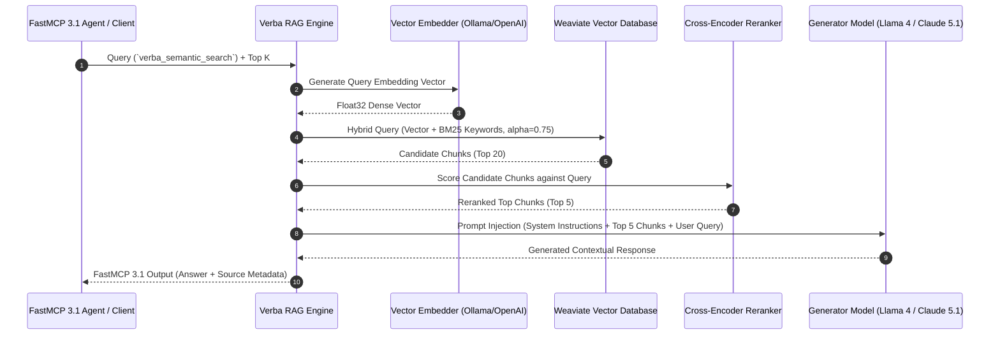

# Verba

## What it is
Verba is an open-source Retrieval-Augmented Generation (RAG) platform, document ingestion engine, and conversational knowledge management application built natively on Weaviate. Engineered to deliver a "Golden RAG" experience, Verba provides modular components for document loading, semantic chunking, vector embedding, hybrid BM25/vector search retrieval, cross-encoder reranking, and generation using frontier open-weights and cloud LLMs.

In 2027, Verba acts as a privacy-focused knowledge retrieval engine for local homelabs, enterprise knowledge bases, and FastMCP 3.1 agent tool networks. It supports seamless integration with frontier foundation models including Llama 4, Claude 5.1, DeepSeek-V4, and GPT-5.5.

## What problem it solves
Constructing custom production-ready RAG pipelines requires gluing together disparate libraries for file parsing (PDF, Markdown, DOCX), semantic chunking, vector database index schema definition, hybrid search scoring, cross-encoder reranking, and streaming chat interfaces. Developers often struggle with suboptimal retrieval quality, chunk boundary corruption, hallucinated responses, and brittle UI/API glue code.

Verba addresses these engineering challenges by providing:
1. **Turnkey Modular RAG Architecture**: A modular plug-and-play architecture where Readers, Chunkers, Embedders, Retrievers, and Generators can be swapped or customized via python classes.
2. **Native Weaviate Hybrid Search Engine**: Leverages Weaviate's hybrid search engine, combining dense vector embeddings (semantic similarity) with sparse BM25 keyword matching and cross-encoder reranking.
3. **FastMCP 3.1 & Agent Integration**: Exposes semantic search and document ingestion tools via the Model Context Protocol (FastMCP 3.1), enabling AI coding assistants and autonomous agents to query local knowledge bases securely.
4. **Local-First & Multi-Cloud Hybrid Support**: Operates completely air-gapped on local hardware using Ollama / LM Studio embeddings, while supporting scale-out to cloud vector clusters (Weaviate Cloud) and cloud LLMs.

## Where it fits in the stack
**Intake & Storage / Modular RAG Application Layer**. Verba sits directly above vector database infrastructure (Weaviate) and below user interfaces, agent frameworks, and FastMCP 3.1 tool callers:

```
+-----------------------------------------------------------------------+
|            User Interfaces & Autonomous Agent Clients                 |
|     (Verba Web UI, Claude Code, Cursor, FastMCP 3.1 Agents, Slack)    |
+-----------------------------------------------------------------------+
                                   | (REST API / FastMCP 3.1 Transport)
                                   v
+-----------------------------------------------------------------------+
|                            Verba RAG Engine                           |
|  +-----------------------------------------------------------------+  |
|  | Readers (PDF, Markdown, HTML) | Chunkers (Semantic, Fixed, AST) |  |
|  +-----------------------------------------------------------------+  |
|  | Embedders (Ollama, OpenAI, HF) | Rerankers (Cohere, Cross-Enc)  |  |
|  +-----------------------------------------------------------------+  |
|  | FastMCP 3.1 Tool Gateway      | Pydantic V2 Contract Schemas    |  |
+-----------------------------------------------------------------------+
                                   | (Weaviate v4 Client / gRPC)
                                   v
+-----------------------------------------------------------------------+
|                    Weaviate Vector Database                           |
|      (HNSW Vector Index + BM25 Sparse Inverted Index + Reranker)      |
+-----------------------------------------------------------------------+
```

## Typical use cases
- **Enterprise Internal Knowledge Search**: Ingesting technical manuals, PDF contracts, and internal Markdown wikis into a hybrid-searchable vector index for internal employee Q&A.
- **FastMCP 3.1 Agent Memory Store**: Exposing private project documentation to AI coding assistants (e.g., Claude Code, Cursor) via FastMCP 3.1 tool interfaces.
- **RAG Architecture Prototyping**: Comparing chunking strategies (e.g., recursive vs. semantic chunking) and model performance (e.g., Llama 4 70B vs. Claude 5.1) on specific domain datasets.
- **Air-Gapped Homelab Knowledge Hub**: Running an isolated, off-grid Q&A engine over personal documents using Ollama embeddings and local LLMs.

## Strengths
- **Modular Pipeline Extensibility**: Clean Python base classes (`Reader`, `Chunker`, `Embedder`, `Retriever`, `Generator`) make it trivial to write custom components.
- **Hybrid Search & Reranking Superiority**: Out-of-the-box integration with Weaviate's hybrid search (dense vectors + sparse BM25) coupled with cross-encoder reranking produces state-of-the-art context precision.
- **Multi-Format Ingestion Engine**: Native support for PDF, DOCX, Markdown, CSV, HTML, and raw text files with metadata extraction.
- **FastMCP 3.1 Tool Endpoint**: Standardized FastMCP 3.1 server capabilities allow autonomous agents to query and retrieve chunk context programmatically.
- **Docker Compose Production Setup**: Pre-configured Docker Compose manifests for single-command stack initialization (Verba UI/Backend + Weaviate Vector Database).

## Limitations
- **Weaviate Coupling**: The primary vector storage and indexing mechanisms are designed specifically for Weaviate; integrating alternative vector backends (e.g., Qdrant or Milvus) requires rewriting retriever abstractions.
- **Large PDF Processing CPU Overhead**: Parsing complex, multi-page PDFs with dense tables or embedded raster images can be CPU-intensive during ingestion without GPU-accelerated OCR parsers.

## When to use it
- When you need a production-ready, modular RAG application with an out-of-the-box Web UI and REST API backed by Weaviate.
- When creating a FastMCP 3.1 knowledge retrieval server for local or cloud AI agents.
- When evaluating different embedding models, chunking strategies, or hybrid retrieval weights on domain documents.

## When not to use it
- When you require a non-Weaviate vector store (e.g., Pinecone, LanceDB, or pgvector) as your core database backend.
- When building a simple, flat text-search tool where basic BM25 search without vector embeddings is sufficient.

## Getting started

### Installation via PyPI
Install Verba directly using `pip`:

```bash
pip install goldenverba pydantic>=2.0
```

### Docker Compose Quickstart
Run the full Verba stack (Backend, Frontend, and Weaviate Vector Database) with Docker Compose:

```bash
# Clone the official repository
git clone https://github.com/weaviate/Verba
cd Verba

# Spin up containers in detached mode
docker compose up -d

# Check running services
docker compose ps
```

Access the web interface at `http://localhost:8000`.

## Architecture / Key Components



### Core Pipeline Components
1. **Reader**: Ingests files (PDF, Markdown, HTML, CSV) and extracts raw text streams alongside document-level metadata.
2. **Chunker**: Splits raw text into processable chunks (e.g., Sentence Chunker, Word Chunker, or Code AST Chunker) maintaining sliding window overlaps.
3. **Embedder**: Converts text chunks into dense vector representations using Ollama, Hugging Face, Cohere, or OpenAI embeddings.
4. **Retriever**: Queries Weaviate using hybrid search (adjusting `alpha` balance between vector similarity and keyword match) and applies reranking algorithms.
5. **Generator**: Constructs the final augmented prompt and streams LLM completion tokens to the client.

## CLI examples

The `verba` CLI enables managing servers, importing document directories, and inspecting system state:

```bash
# Start the Verba API server listening on custom port 8000
verba start --port 8000 --host 0.0.0.0

# Import local directory of Markdown and PDF documents into Verba knowledge base
verba import --path ./knowledge_docs/ --chunker WordChunker --embedder MiniLM

# Check database connection status and loaded schema classes
verba status

# Export loaded document chunks to JSON for offline evaluation
verba export --output ./exported_chunks.json
```

## API examples

The following script demonstrates querying a running Verba server directly via REST APIs or FastMCP 3.1 handlers, using Pydantic V2 schemas for strict query validation and response extraction:

```python
import json
import requests
from typing import List, Optional, Dict, Any
from pydantic import BaseModel, Field, field_validator

# 1. Pydantic V2 Models for Request & Response Verification
class VerbaSearchFilter(BaseModel):
    document_type: Optional[str] = Field(default=None, description="e.g. pdf, markdown, txt")
    tags: List[str] = Field(default_factory=list)

class VerbaQueryPayload(BaseModel):
    query: str = Field(min_length=3, description="Semantic question or search query")
    top_k: int = Field(default=5, ge=1, le=20, description="Number of context chunks to retrieve")
    hybrid_alpha: float = Field(default=0.75, ge=0.0, le=1.0, description="1.0 = Pure Vector, 0.0 = Pure BM25")
    filters: Optional[VerbaSearchFilter] = None

class ContextChunk(BaseModel):
    chunk_id: str
    doc_name: str
    content: str
    score: float
    metadata: Dict[str, Any] = Field(default_factory=dict)

class VerbaRAGResponse(BaseModel):
    query: str
    answer: str
    retrieved_chunks: List[ContextChunk]
    model_used: str

# 2. FastMCP 3.1 Agent Tool Execution
def execute_verba_rag_query(raw_json_input: str) -> str:
    """FastMCP 3.1 tool handler for querying local Verba RAG instance."""
    try:
        # Validate input schema via Pydantic V2
        query_input = VerbaQueryPayload.model_validate_json(raw_json_input)
        print(f"Querying Verba RAG: '{query_input.query}' (Alpha: {query_input.hybrid_alpha})...")

        # Mock API invocation targeting Verba backend endpoint
        # Real call: response = requests.post("http://localhost:8000/api/query", json=query_input.model_dump())
        mock_response = VerbaRAGResponse(
            query=query_input.query,
            answer="To configure OIDC authentication in Traefik, update the middleware YAML definition with your issuer URL and client ID.",
            retrieved_chunks=[
                ContextChunk(
                    chunk_id="CHK-9012",
                    doc_name="traefik_oidc_guide.md",
                    content="http.middlewares.my-oidc.plugin.oidc.issuer=https://auth.enterprise.com",
                    score=0.92,
                    metadata={"source": "internal_docs", "author": "devops"}
                )
            ],
            model_used="claude-5-1-sonnet"
        )

        return mock_response.model_dump_json(indent=2)

    except Exception as e:
        return json.dumps({"error": f"Verba RAG query failed: {str(e)}"})

if __name__ == "__main__":
    sample_agent_request = """
    {
        "query": "How do I configure Traefik OIDC middleware?",
        "top_k": 3,
        "hybrid_alpha": 0.8,
        "filters": {
            "document_type": "markdown",
            "tags": ["traefik", "oidc", "security"]
        }
    }
    """
    result_json = execute_verba_rag_query(sample_agent_request)
    print("\n=== FastMCP 3.1 Verba RAG Response ===")
    print(result_json)
```

## Related tools / concepts
- [Weaviate](../infrastructure/weaviate.md) — Vector database powering Verba.
- [Khoj](khoj.md) — Personal AI search assistant for notes and local files.
- [AnyType](anytype.md) — Local-first P2P knowledge base tool.
- [RAG Pattern](../../knowledge_base/patterns/rag-pattern.md) — Core architectural pattern for retrieval augmentation.
- [Obsidian](../ai_knowledge/obsidian.md) — Markdown note source for Verba.
- [LangChain](../ai_knowledge/langchain.md) — Framework for expanding Verba workflows.
- [Ollama](../../services/ollama.md) — Supported local inference backend for private RAG.
- [Model Context Protocol (FastMCP 3.1)](../automation_orchestration/mcp.md) — Standard protocol for agent tool access.

## Sources / references
- [Official Verba Portal](https://verba.weaviate.io/)
- [Verba GitHub Repository](https://github.com/weaviate/Verba)
- [Weaviate Developer Documentation](https://weaviate.io/developers/verba)

## Contribution Metadata
- Last reviewed: 2027-01-07
- Confidence: high
