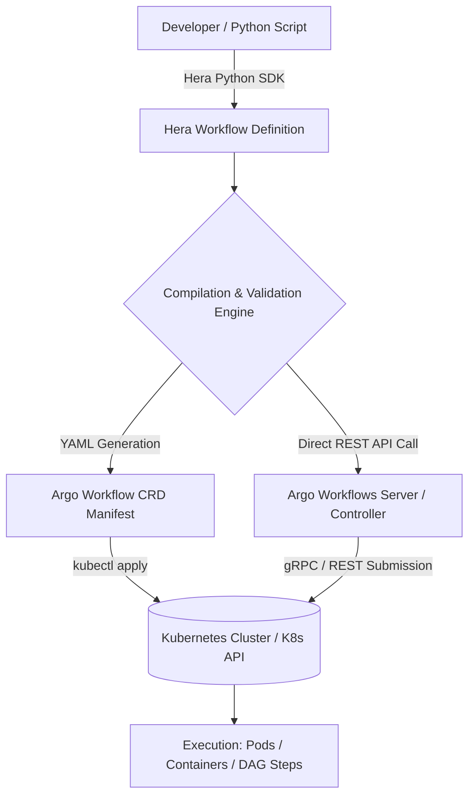

# Hera Python SDK

## What it is
Hera (Hera Workflows) is an open-source, strongly-typed Python SDK for **Argo Workflows**. It empowers data engineers, MLOps architects, and software developers to construct, validate, programmatically compile, and submit complex Kubernetes-native workflows using pure Python code instead of managing thousands of lines of raw Kubernetes YAML Custom Resource Definitions (CRDs).



## What problem it solves
Argo Workflows is a highly capable Kubernetes-native engine for orchestrating parallel containerized tasks, but defining workflows directly in Kubernetes YAML CRDs can be verbose, error-prone, challenging to modularize, and difficult to test within standard Python CI/CD pipelines. Hera solves these issues by offering a Pythonic abstraction layer featuring native type annotations, IDE autocompletion, context managers, decorator-based script generation, and direct client submission to Argo Server APIs.

## Where it fits in the stack
**Orchestration / Workflow Engine SDK**. Hera functions as the developer SDK interface sitting directly above Argo Workflows. It translates high-level Python workflow specifications (DAGs, steps, loops, artifacts, volume claims) into valid Kubernetes Argo Custom Resources or submits them via REST endpoints.

## Typical use cases
- **MLOps & Model Training Pipelines**: Orchestrating multi-node LLM fine-tuning, embedding batch generation, evaluation loops, and model deployment on Kubernetes.
- **Dynamic Workflows**: Programmatically generating directed acyclic graphs (DAGs) whose task dependencies and execution steps depend on runtime parameters or external API payloads.
- **Data Engineering & ETL**: Building containerized, scalable data extraction, transformation, and chunking pipelines with explicit step dependencies and volume mounts.
- **FastMCP Agent Workflow Execution**: Triggering asynchronous Kubernetes container jobs from agentic platforms via FastMCP 3.1 task protocols.

## Strengths
- **Native Python Syntax**: Defines complex workflows using standard Python functions, context managers (`with Workflow(...)`), and type hints.
- **Pre-Submission Type Safety**: Leverages Pydantic models to validate task parameters, inputs, outputs, and volume configurations before making requests to the cluster.
- **Direct API & YAML Compilation**: Supports both direct programmatic submission to Argo Server endpoints and offline compilation to native Argo YAML manifests.
- **Comprehensive Feature Parity**: Full support for advanced Argo constructs including DAGs, Steps, loops (`with_items`), memoization, volume claims, metrics, and exit handlers.

## Limitations
- **Argo Workflows Engine Dependency**: Requires an active Kubernetes cluster with an operational Argo Workflows controller installed.
- **CRD Feature Propagation**: Newly released cutler features in raw Argo Workflows YAML may occasionally experience a short lag before being added to Hera Python bindings.

## When to use it
- When your engineering team prefers writing clean, testable Python code over authoring and maintaining large Kubernetes YAML manifests.
- For data pipelines or AI workflows where DAG topologies and parameters are generated dynamically at runtime.
- When building Python applications or MCP servers that programmatically trigger and monitor Kubernetes jobs.

## When not to use it
- If your infrastructure uses non-Kubernetes workflow orchestrators (e.g., Prefect, Dagster, Apache Airflow) without Argo Workflows.
- For basic single-host task scheduling where simple cron jobs or local shell scripts are sufficient.

## Getting started

### Installation
Install the Hera Workflows SDK using pip:

```bash
pip install hera-workflows
```

### Basic DAG Definition & YAML Compilation Example
Define a workflow with dependent script tasks and print the compiled Kubernetes YAML manifest:

```python
from hera.workflows import DAG, Script, Workflow

def extract_data(source_id: str):
    print(f"Extracting data from source: {source_id}")

def process_data():
    print("Processing extracted data in container...")

with Workflow(
    generate_name="hera-etl-pipeline-",
    entrypoint="main-dag",
) as w:
    with DAG(name="main-dag"):
        task1 = Script(name="extract-task", source=extract_data, inputs={"source_id": "s3-bucket-2026"})
        task2 = Script(name="process-task", source=process_data)
        task1 >> task2  # Set execution dependency: task1 must finish before task2 starts

# Output compiled Kubernetes Argo Workflow YAML manifest
print(w.to_yaml())
```

## CLI examples

```bash
# Export Hera workflow script to native Argo Workflow YAML manifest
python my_hera_pipeline.py > argo_workflow.yaml

# Submit generated workflow manifest using Argo CLI
argo submit -n argo argo_workflow.yaml --watch

# List running Argo workflows in the cluster
argo list -n argo
```

## API examples

### Python FastMCP 3.1 & Pydantic v2 Hera Submission Tool
The following code snippet demonstrates submitting Argo Workflows programmatically via Hera inside a FastMCP 3.1 server with Pydantic v2 schemas:

```python
from typing import List, Optional
from pydantic import BaseModel, Field
from hera.shared import global_config
from hera.workflows import Workflow, Container
from mcp.server.fastmcp import FastMCP

# Define Pydantic v2 schemas for Hera workflow submission requests and responses
class ContainerTaskConfig(BaseModel):
    task_name: str = Field(..., description="Name of the container execution task.")
    image: str = Field(..., description="Docker/OCI container image to run.")
    command: List[str] = Field(..., description="Entrypoint command list.")
    args: List[str] = Field(default_factory=list, description="Arguments to pass to the container command.")

class WorkflowSubmitRequest(BaseModel):
    workflow_name_prefix: str = Field(..., description="Prefix for generated Kubernetes workflow instance name.")
    namespace: str = Field(default="argo", description="Target Kubernetes namespace.")
    tasks: List[ContainerTaskConfig] = Field(..., description="List of container tasks to execute sequentially.")

class WorkflowSubmitResponse(BaseModel):
    workflow_name: str = Field(..., description="Name of the submitted Argo workflow instance.")
    namespace: str = Field(..., description="Kubernetes namespace where workflow was spawned.")
    status: str = Field(..., description="Initial submission status.")

# Initialize FastMCP 3.1 server
mcp = FastMCP("hera-argo-orchestrator")

# Configure global Hera Argo Server endpoint
global_config.host = "https://argo.mycompany.org"
global_config.token = "YOUR_ARGO_SERVER_BEARER_TOKEN"

@mcp.tool()
async def submit_container_workflow(request: WorkflowSubmitRequest) -> WorkflowSubmitResponse:
    """Submits a sequential multi-container Argo workflow to Kubernetes via the Hera SDK."""
    with Workflow(
        generate_name=f"{request.workflow_name_prefix}-",
        namespace=request.namespace,
        entrypoint="container-steps"
    ) as w:
        for task in request.tasks:
            c = Container(
                name=task.task_name,
                image=task.image,
                command=task.command,
                args=task.args
            )
            w.add_child(c)

    # Submit workflow directly to the Argo REST API server
    created_workflow = w.create()

    return WorkflowSubmitResponse(
        workflow_name=created_workflow.metadata.name,
        namespace=request.namespace,
        status="Submitted"
    )

if __name__ == "__main__":
    mcp.run()
```

## Related tools / concepts
- [Argo Workflows](argo-workflows.md) — Kubernetes-native workflow orchestration engine.
- [Prefect](prefect.md) — Python data workflow orchestration platform.
- [Dagster](../development_ops/dagster.md) — Data assets orchestration framework.
- [Kubernetes](../infrastructure/k3s.md) — Container orchestration substrate.

## Sources / references
- [Hera GitHub Repository](https://github.com/argoproj-labs/hera?ref=2026-09-21-audit)
- [Hera Documentation](https://hera.readthedocs.io/)

## Contribution Metadata
- Last reviewed: 2027-01-07
- Confidence: high
