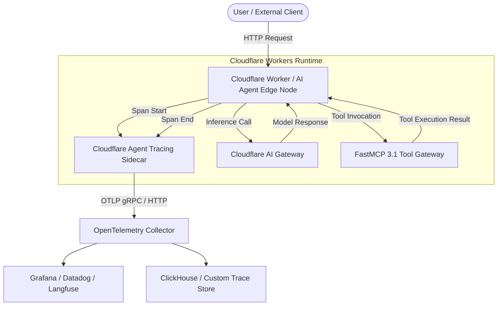

# Cloudflare Agent Tracing

## What it is
**Cloudflare Agent Tracing** is an end-to-end observability, telemetry, and distributed tracing capability natively integrated into Cloudflare Workers AI, Cloudflare AI Gateway, and the Cloudflare Workers platform. As of early 2027, it provides real-time multi-agent workflow monitoring, prompt-response logging, execution timeline tracking, and latency profiling across 300+ edge data centers globally.

By leveraging OpenTelemetry (OTLP) standards, Cloudflare Agent Tracing allows engineers to inspect agent tool invocations, LLM reasoning spans, asynchronous node handoffs, and token consumption metrics with sub-millisecond overhead directly at the network edge.



## What problem it solves
Multi-agent systems executing across serverless edge networks often suffer from "black box" execution failures, hidden token latency spikes, and complex tool call debugging across asynchronous nodes. Cloudflare Agent Tracing provides low-overhead, distributed telemetry using OpenTelemetry standards, allowing developers to inspect tool invocations, agent state transitions, and LLM API calls with sub-millisecond precision directly at the edge.

Without edge-native tracing, debugging asynchronous agent swarms requires aggregating fragmented server logs or introducing heavy HTTP sidecars that add non-trivial latency to edge requests. Cloudflare Agent Tracing embeds directly into the Workers V8 isolate, capturing span contexts automatically.

## Where it fits in the stack
**Category**: Process Understanding / AI Observability & Tracing. It sits at the **Telemetry & Observability Layer**, integrating with [OpenTelemetry Collector](opentelemetry-collector.md), [Datadog](datadog.md), and Cloudflare Workers AI pipelines to stream trace logs to central observability dashboards.

- **Inference Layer**: Monitors requests passing through Cloudflare AI Gateway, Workers AI, and third-party providers (OpenAI, Anthropic, Moonshot).
- **Tool & Agent Layer**: Tracks function execution within [FastMCP 3.1](../automation_orchestration/mcp.md) servers and edge-hosted agent runners.
- **Observability Export**: Connects edge events to central analytics databases like Grafana, Datadog, Sentry, or ClickHouse.

## Typical use cases
- **Multi-Agent Orchestration Debugging**: Tracking state handoffs between planning, execution, and verification agents in edge-hosted loops.
- **Token Cost & Latency Profiling**: Auditing token usage and execution bottlenecks across distributed Workers and LLM endpoints.
- **Tool Execution Auditing**: Logging external API payloads, database lookups, and MCP tool invocations with strict data privacy compliance.
- **Failover & Error Inspection**: Pinpointing unhandled exceptions or malformed JSON responses in multi-tier agent chains.

## Strengths
- **Native Edge Integration**: Zero-latency sidecar tracing running directly inside Cloudflare Workers runtime without additional HTTP proxy overhead.
- **OpenTelemetry Standard Compliant**: Fully exportable via standard OTLP protocols to Grafana, Datadog, Langfuse, or custom OTLP endpoints.
- **Built-in Prompt & Tool Capture**: Automatically captures prompt context, tool parameters, token counts, and model completion metrics.
- **Global Distribution**: Observability collected across 300+ global edge locations without egress bottlenecks or cross-region telemetry relaying.
- **Unified Gateway Analytics**: Correlates edge worker execution traces with AI Gateway rate limiting, caching, and fallback metrics.

## Limitations
- **Platform Lock-In**: Deepest auto-instrumentation capabilities require hosting agent runners within Cloudflare Workers or Cloudflare AI Gateway.
- **Storage Retention Limits**: High-volume trace storage within Cloudflare platform requires external exporter configuration for long-term retention beyond standard audit windows.
- **Payload Redaction Complexity**: Strict PII masking and field-level encryption require explicit configuration hooks prior to span exporting.

## When to use it
- When hosting AI agents or tool servers on Cloudflare Workers, AI Gateway, or edge serverless architecture.
- When requiring low-latency OpenTelemetry span generation for distributed multi-agent systems.
- When needing real-time visual inspection of agent reasoning steps on global edge networks.

## When not to use it
- For monolithic on-premise agent deployments operating entirely offline or without edge network routes.
- When pure local file logging or desktop tracing tools (e.g., [Claude Desktop](../ai_knowledge/claude-desktop.md)) are sufficient.

## Getting started

### Installation
Install Cloudflare Wrangler and the tracing SDK:

```bash
npm install -g wrangler
npm install @cloudflare/agent-tracing @opentelemetry/api
```

### Configuration in wrangler.toml
Enable tracing in your Worker configuration:

```toml
name = "agent-tracing-worker"
main = "src/index.ts"
compatibility_date = "2026-01-01"

[vars]
OTEL_EXPORTER_OTLP_ENDPOINT = "https://telemetry.cloudflare.com/v1/traces"
ENVIRONMENT = "production"

[ai]
binding = "AI"
```

## CLI examples

### Deploy Worker with Tracing Active
```bash
npx wrangler deploy --var ENVIRONMENT:production
```

### Tail Live Agent Tracing Logs
```bash
npx wrangler tail --format=json | grep "agent.trace"
```

### Query Edge Telemetry Spans via Wrangler
```bash
npx wrangler telemetry status
```

## API examples

### TypeScript Agent Tracing Wrapper
The following snippet demonstrates wrapping an edge agent loop with Cloudflare Agent Tracing spans:

```typescript
import { trace, SpanStatusCode } from "@opentelemetry/api";

const tracer = trace.getTracer("cloudflare-agent-tracing");

export interface AgentTaskRequest {
  taskId: string;
  taskPrompt: string;
}

export interface AgentTaskResult {
  status: string;
  result: string;
  executionMs: number;
}

export async function executeAgentTask(req: AgentTaskRequest): Promise<AgentTaskResult> {
  const startTime = Date.now();
  return tracer.startActiveSpan("agent.execute_task", async (span) => {
    span.setAttribute("agent.task_id", req.taskId);
    span.setAttribute("agent.prompt", req.taskPrompt);

    try {
      // Execute agent reasoning step
      const result = `Processed task [${req.taskId}]: ${req.taskPrompt}`;
      span.setAttribute("agent.result", result);
      span.setStatus({ code: SpanStatusCode.OK });

      const executionMs = Date.now() - startTime;
      span.setAttribute("agent.execution_ms", executionMs);

      return { status: "success", result, executionMs };
    } catch (err: any) {
      span.recordException(err);
      span.setStatus({ code: SpanStatusCode.ERROR, message: err.message });
      throw err;
    } finally {
      span.end();
    }
  });
}
```

### FastMCP 3.1 Python Telemetry Integration
The following Python server captures agent tracing data via FastMCP 3.1 and validates incoming OTLP span events:

```python
from mcp.server.fastmcp import FastMCP
from pydantic import BaseModel, Field, ValidationError
from typing import List, Dict, Any
import time

mcp = FastMCP("cloudflare-tracing-bridge")

class SpanAttribute(BaseModel):
    key: str = Field(..., description="Attribute key identifier")
    value: Any = Field(..., description="Attribute scalar value")

class AgentSpan(BaseModel):
    trace_id: str = Field(..., description="Unique OpenTelemetry trace identifier")
    span_id: str = Field(..., description="Span identifier")
    name: str = Field(..., description="Agent step name")
    attributes: Dict[str, Any] = Field(default_factory=dict, description="Captured trace metadata")
    duration_ms: float = Field(..., ge=0.0, description="Span duration in milliseconds")

class CloudflareAgentTracePayload(BaseModel):
    worker_name: str = Field(..., description="Cloudflare Worker source identifier")
    environment: str = Field(default="production", description="Deployment environment")
    spans: List[AgentSpan] = Field(..., description="Collection of recorded spans")

@mcp.tool(name="record_agent_trace", description="Records and validates Cloudflare Agent Tracing OTLP payload")
def record_agent_trace(raw_trace: Dict[str, Any]) -> str:
    """Validates and processes an edge agent trace event using Pydantic v2."""
    try:
        payload = CloudflareAgentTracePayload.model_validate(raw_trace)
        total_spans = len(payload.spans)
        return f"Successfully processed {total_spans} spans for worker '{payload.worker_name}' in '{payload.environment}'."
    except ValidationError as ve:
        return f"Trace schema validation failed: {ve}"

if __name__ == "__main__":
    mcp.run()
```

### Python OTLP Trace Verification with Pydantic v2
Python validation script to parse exported agent trace payloads:

```python
from pydantic import BaseModel, Field, ValidationError
from typing import List, Dict, Any

class TraceSpan(BaseModel):
    trace_id: str = Field(..., description="Unique OpenTelemetry trace identifier")
    span_id: str = Field(..., description="Span identifier")
    name: str = Field(..., description="Name of the agent execution step")
    attributes: Dict[str, Any] = Field(default_factory=dict, description="Span attributes including prompts and model names")

class CloudflareAgentTracePayload(BaseModel):
    resource_spans: List[TraceSpan] = Field(..., description="List of recorded trace spans")

def validate_trace_event(raw_json: dict) -> CloudflareAgentTracePayload:
    """Parses raw JSON trace events from Cloudflare Workers AI pipeline."""
    return CloudflareAgentTracePayload.model_validate(raw_json)

if __name__ == "__main__":
    sample_trace = {
        "resource_spans": [
            {
                "trace_id": "4bf92f3577b34da6a3ce929d0e0e4736",
                "span_id": "00f067aa0ba902b7",
                "name": "agent.tool_call.search",
                "attributes": {"tool_name": "google_search", "latency_ms": 42.5, "edge_datacenter": "SFO"}
            }
        ]
    }
    validated = validate_trace_event(sample_trace)
    print(f"Validated Trace ID: {validated.resource_spans[0].trace_id}")
    print(f"Span Action: {validated.resource_spans[0].name}")
```

## Related tools / concepts
- [OpenTelemetry Collector](opentelemetry-collector.md) — Agnostic telemetry processor and exporter.
- [Datadog](datadog.md) — Enterprise observability platform.
- [Helicone](helicone.md) — LLM observability and gateway proxy.
- [Grafana Cloud](grafana-cloud.md) — Visualization engine for metric and trace dashboards.
- [Cloudflare Pages](../development_ops/cloudflare-pages.md) — Jamstack deployment platform with edge function binding.
- [FastMCP](../automation_orchestration/mcp.md) — Model Context Protocol 3.1 Python framework.

## Sources / references
- [Cloudflare Agent Tracing News Announcement](https://www.infoq.com/news/2026/08/cloudflare-agent-tracing/)
- [Cloudflare Workers AI Documentation](https://developers.cloudflare.com/workers-ai/)
- [OpenTelemetry Specification](https://opentelemetry.io/docs/)

---
## Contribution Metadata
- Last reviewed: 2027-01-07
- Confidence: high
