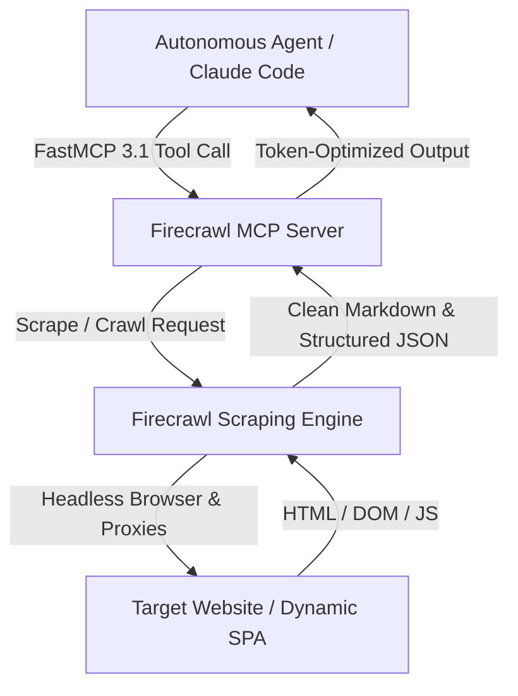

# Firecrawl

## What it is
Firecrawl is an API-first web scraping, crawling, and extraction engine engineered to convert websites into clean, structured, and LLM-ready formats (Markdown or JSON). In early 2027, it serves as a core ingestion gateway for frontier AI systems including **Claude 5.1**, **GPT-5.5 / GPT-5.6**, and **Gemini 4.0**, reliably handling shadow DOM elements, dynamic JavaScript execution, complex pagination, and advanced anti-bot protections.

Available as both a cloud managed SaaS and an open-source self-hosted solution, Firecrawl translates complex DOM structures into token-optimized Markdown that can be fed directly into context windows, vector indexes, or autonomous agent tool pipelines.

## What problem it solves
It eliminates the heavy infrastructure and maintenance burden of self-managed scraping pipelines. Instead of managing complex Playwright or Puppeteer browser pools, proxy rotation networks, and custom HTML sanitization heuristics, developers invoke simple API endpoints to retrieve high-fidelity Markdown optimized directly for RAG (Retrieval-Augmented Generation) and agentic workflows.

In autonomous multi-agent environments, agents frequently encounter JavaScript-heavy single-page applications (SPAs) or Cloudflare-protected sites. Firecrawl handles headless rendering, cookie persistence, and DOM cleanup transparently, returning sanitized content via native **FastMCP 3.1** protocol bindings.

## Where it fits in the stack
**Category**: Process Understanding / Ingestion & Scraping. It acts as an autonomous web data acquisition gateway, allowing agents to interact with the real-time web by providing clean, structured text representations natively integrated via **FastMCP 3.1 / Model Context Protocol**.



## Operational Architecture & Ingestion Flow

```
┌─────────────────────────────────────────────────────────────────────────┐
│                        Autonomous Agent / Client                        │
│                     (Claude Code / FastMCP 3.1)                         │
└────────────────────────────────────┬────────────────────────────────────┘
                                     │
                                     ▼
┌─────────────────────────────────────────────────────────────────────────┐
│                        Firecrawl Scraping Engine                        │
│ ┌──────────────────────┐ ┌──────────────────────┐ ┌───────────────────┐ │
│ │ Stealth Browser Fleet│ │ Anti-Bot Bypass Mesh │ │  DOM Sanitizer &  │ │
│ │  (Playwright Pool)   │ │ (Cloudflare/Akamai)  │ │ Markdown Engine   │ │
│ └──────────────────────┘ └──────────────────────┘ └───────────────────┘ │
└────────────────────────────────────┬────────────────────────────────────┘
                                     │
                 ┌───────────────────┼───────────────────┐
                 ▼                   ▼                   ▼
      ┌────────────────────┐┌──────────────────┐┌──────────────────┐
      │   Target Web Page  ││  Site Map Crawler││ Pydantic v2 JSON │
      │   (Dynamic SPA)    ││  (URL Discovery) ││ Extraction Engine│
      └────────────────────┘└──────────────────┘└──────────────────┘
```

## Typical use cases
- **Real-Time Agent Search**: Enabling FastMCP-compatible agents to instantly crawl and extract live technical documentation, research papers, or news.
- **RAG Pipeline Ingestion**: Orchestrating scheduled batch crawls across web domains to continuously update vector database indices.
- **Structured Schema Extraction**: Converting unstructured product pages, financial reports, or job postings into validated, structured JSON formats using Pydantic v2 schemas.
- **Site Mapping & URL Discovery**: Performing rapid site mapping across domain hierarchies without triggering unnecessary full-page downloads.

## Feature Comparison Matrix

| Feature / Metric | Firecrawl | Crawl4AI | BeautifulSoup / Scrapy |
| :--- | :--- | :--- | :--- |
| **Output Format** | Clean Markdown / Pydantic JSON | Markdown / Raw HTML | Raw HTML DOM Nodes |
| **Anti-Bot Bypass** | Automatic (Cloudflare / Datadome) | Browser Context Rotation | Manual Proxy Management |
| **FastMCP 3.1 Server** | Native Built-in | Community Server | Custom Implementation |
| **JS Rendering Engine** | Dynamic Headless Fleet | Local Playwright | Async HTTP / Optional Playwright |
| **Deployment Mode** | Cloud SaaS & Self-Hosted | Open-Source Self-Hosted | Python Library |

## Strengths
- **Clean Markdown Native**: Output is specifically cleansed to minimize token consumption while preserving table layouts, headers, and code snippets.
- **FastMCP 3.1 Compliance**: Native Model Context Protocol servers enable zero-config tool registration across modern AI development environments.
- **Anti-Bot Defense**: Built-in, high-efficiency proxy rotation and browser rendering capable of bypassing advanced Cloudflare, Akamai, and Datadome protections.
- **Scalable Asynchronous Crawling**: Native endpoints support high-concurrency background crawls with webhook-based status callbacks and rate limiting.
- **Pydantic v2 Integration**: Direct support for LLM-powered structured extraction using Pydantic JSON schemas.

## Limitations
- **Processing Latency**: Deep multi-page crawls introduce network latency bounds unsuitable for millisecond-critical synchronous responses.
- **Operational Costs**: Cloud-hosted tiers can become cost-prohibitive for high-frequency, multi-gigabyte continuous ingestion pipelines.
- **Self-Hosting Dependencies**: Running the open-source version locally requires a robust self-hosted infrastructure (Docker, Redis, and PostgreSQL).

## When to use it
- When your AI agents require real-time web access but need strict token consumption management.
- When you need to retrieve complex web content as highly accurate, clean Markdown while preserving table structures and link formatting.
- When utilizing FastMCP 3.1 compatible agent tools like [Claude Code](../development_ops/claude-code.md), Zed, or custom orchestrators.
- When converting messy unstructured web pages into validated Pydantic v2 data models.

## When not to use it
- For retrieving data from websites that offer clean, public REST APIs (e.g., GitHub, Slack, or official API endpoints).
- For lightweight, single-page local scraping operations where simple libraries like `BeautifulSoup` or native `httpx` can fetch content immediately.

## Getting started

### Installation
Install the official Python SDK using `pip`:

```bash
pip install firecrawl-py pydantic mcp
```

### Basic Scrape (Python)
Authenticate and scrape a website to clean Markdown using the SDK:

```python
import os
from firecrawl import FirecrawlApp

# Initialize the application with your API credentials
app = FirecrawlApp(api_key=os.getenv("FIRECRAWL_API_KEY", "fc-YOUR_API_KEY"))

# Scrape a target URL to clean Markdown
scrape_result = app.scrape_url("https://example.com", params={"formats": ["markdown"]})
print(scrape_result.get("markdown", ""))
```

## CLI examples
The `firecrawl` CLI enables terminal-based web scraping, mapping, and testing.

```bash
# Install the command line tool globally via NPM
npm install -g firecrawl-cli

# Scrape a website and output the raw Markdown to standard output
firecrawl scrape https://docs.firecrawl.dev

# Map a website to discover all sub-URLs
firecrawl map https://firecrawl.dev

# Query the web and return top search results in clean Markdown format
firecrawl search "FastMCP 3.1 architecture" --limit 3 --format markdown
```

## API examples

### Python FastMCP 3.1 Tool Server & Structured Pydantic v2 Extraction
Using Firecrawl's JSON extraction capabilities powered by LLMs (such as Claude 5.1 or GPT-5.5) to parse web pricing tables into validated Pydantic v2 models within a FastMCP 3.1 tool server:

```python
import os
from typing import List, Optional
from firecrawl import FirecrawlApp
from pydantic import BaseModel, Field
from mcp.server.fastmcp import FastMCP

# Initialize FastMCP 3.1 Server for Web Data Acquisition
mcp = FastMCP("Firecrawl Scraping Engine")

class PricingTier(BaseModel):
    tier_name: str = Field(description="The name of the pricing plan")
    price_usd: float = Field(description="Monthly cost in USD")
    features: List[str] = Field(description="List of features included in this tier")

class PricingSchema(BaseModel):
    product_name: str
    tiers: List[PricingTier]

@mcp.tool()
def extract_website_pricing(target_url: str) -> str:
    """Scrape web page and extract structured pricing tier schema via Firecrawl."""
    api_key = os.getenv("FIRECRAWL_API_KEY", "fc-YOUR_API_KEY")
    app = FirecrawlApp(api_key=api_key)

    extraction_data = app.scrape_url(
        target_url,
        params={
            "formats": ["json"],
            "jsonOptions": {
                "schema": PricingSchema.model_json_schema()
            }
        }
    )

    parsed_json = extraction_data.get("json", {})
    structured_pricing = PricingSchema.model_validate(parsed_json)
    return structured_pricing.model_dump_json(indent=2)

if __name__ == "__main__":
    # Test structured schema extraction logic
    mock_response = {
        "product_name": "Firecrawl Cloud",
        "tiers": [
            {
                "tier_name": "Hobby",
                "price_usd": 16.0,
                "features": ["3,000 credits/mo", "FastMCP server access"]
            },
            {
                "tier_name": "Standard",
                "price_usd": 99.0,
                "features": ["100,000 credits/mo", "Priority support"]
            }
        ]
    }
    validated = PricingSchema.model_validate(mock_response)
    print(f"Validated Product: {validated.product_name} ({len(validated.tiers)} tiers)")
```

## Production Operational Best Practices
- **Webhook Integration**: For batch jobs or continuous monitoring, utilize asynchronous crawl jobs (`app.crawl_url_async`) combined with webhook callbacks to handle high-volume scraping without blocking agent execution loops.
- **Credit Optimization**: Set strict `maxDepth` and domain whitelist filters during full site crawls to prevent credit exhaustion on irrelevant external links.
- **Cache Reuse**: Enable response caching for static documentation sites to accelerate agent reasoning loops during multi-step development sessions.

## Related tools / concepts
- [Crawl4AI](crawl4ai.md) - High-performance local-first open-source web scraper.
- [Docling](docling.md) - Layout-aware document and PDF parser.
- [Docling MCP](docling-mcp.md) - Document processing service leveraging Model Context Protocol.
- [Model Context Protocol](../automation_orchestration/mcp.md) - Standard protocol for agent-to-tool integration.
- [Claude Code](../development_ops/claude-code.md) - CLI agent tool leveraging FastMCP 3.1.
- [RAGFlow](ragflow.md) - Visual RAG pipeline orchestrator.
- [Browser Use](../automation_orchestration/browser-use.md) - Vision-aware agentic web browser automation engine.

## Sources / references
- [Firecrawl Documentation Portal](https://docs.firecrawl.dev/)
- [Firecrawl Open-Source GitHub Repository](https://github.com/mendableai/firecrawl)
- [Official MCP Server for Firecrawl](https://github.com/firecrawl/mcp-server-firecrawl)

---
## Contribution Metadata
- Last reviewed: 2027-01-07
- Confidence: high
