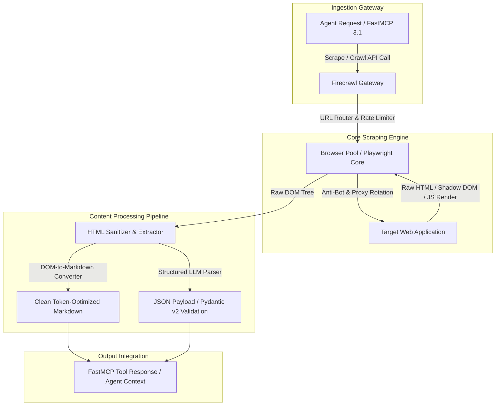

# Firecrawl

## What it is
Firecrawl is an API-first web scraping, crawling, and extraction engine engineered to convert websites into clean, structured, and LLM-ready formats (Markdown or JSON). In early 2027, it serves as a core ingestion gateway for frontier AI systems including **Claude 5.1**, **GPT-5.5 / GPT-5.6**, and **Gemini 4.0**, reliably handling shadow DOM elements, dynamic JavaScript execution, complex pagination, and advanced anti-bot protections.



## What problem it solves
It eliminates the heavy infrastructure and maintenance burden of self-managed scraping pipelines. Instead of managing complex Playwright or Puppeteer browser pools, proxy rotation networks, and custom HTML sanitization heuristics, developers invoke simple API endpoints to retrieve high-fidelity Markdown optimized directly for RAG (Retrieval-Augmented Generation) and agentic workflows.

## Where it fits in the stack
**Category**: Process Understanding / Web Scraping & Ingestion Engine. It operates at the **Data Acquisition & Content Pipeline Layer**, serving as an autonomous web data acquisition gateway that allows AI agents to interact with the real-time web by providing clean, structured text representations natively integrated via **FastMCP 3.1 / Model Context Protocol**.

## Typical use cases
- **Real-Time Agent Search**: Enabling FastMCP-compatible agents to instantly crawl and extract live technical documentation, research papers, or news.
- **RAG Pipeline Ingestion**: Orchestrating scheduled batch crawls across web domains to continuously update vector database indices.
- **Structured Schema Extraction**: Converting unstructured product pages, financial reports, or job postings into validated, structured JSON formats using Pydantic v2 schemas.
- **Site Mapping & URL Discovery**: Performing rapid site mapping across domain hierarchies without triggering unnecessary full-page downloads.
- **Document & PDF Parsing**: Converting embedded PDF links and complex multi-column web pages into unified Markdown streams.

## Strengths
- **Clean Markdown Native**: Output is specifically cleansed to minimize token consumption while preserving table layouts, headers, and code snippets.
- **FastMCP 3.1 Compliance**: Native Model Context Protocol servers enable zero-config tool registration across modern AI development environments.
- **Anti-Bot Defense**: Built-in, high-efficiency proxy rotation and browser rendering capable of bypassing advanced Cloudflare, Akamai, and Datadome protections.
- **Scalable Asynchronous Crawling**: Native endpoints support high-concurrency background crawls with webhook-based status callbacks and rate limiting.
- **Structured Extraction via JSON Schema**: Direct generation of Pydantic v2 validated JSON entities without maintaining custom CSS selectors.

## Limitations
- **Processing Latency**: Deep multi-page crawls introduce network latency bounds unsuitable for millisecond-critical synchronous responses.
- **Operational Costs**: Cloud-hosted tiers can become cost-prohibitive for high-frequency, multi-gigabyte continuous ingestion pipelines.
- **Self-Hosting Dependencies**: Running the open-source version locally requires a robust self-hosted infrastructure (Docker, Redis, and PostgreSQL).

## When to use it
- When your AI agents require real-time web access but need strict token consumption management.
- When you need to retrieve complex web content as highly accurate, clean Markdown while preserving table structures and link formatting.
- When utilizing FastMCP 3.1 compatible agent tools like [Claude Code](../development_ops/claude-code.md), Zed, or custom orchestrators.
- When extracting structured JSON entities from dynamic web pages without writing fragile scraping scripts.

## When not to use it
- For retrieving data from websites that offer clean, public REST APIs (e.g., GitHub, Slack, or official API endpoints).
- For lightweight, single-page local scraping operations where simple libraries like `BeautifulSoup` or native `httpx` can fetch content immediately.
- When sub-100ms response latencies are mandatory.

## Getting started

### Installation
Install the official Python SDK using `pip`:

```bash
pip install firecrawl-py pydantic fastmcp
```

### Basic Scrape (Python)
Authenticate and scrape a website to clean Markdown using the SDK:

```python
import os
from firecrawl import FirecrawlApp

# Initialize the application with your API credentials
app = FirecrawlApp(api_key=os.getenv("FIRECRAWL_API_KEY", "fc-YOUR_API_KEY"))

# Scrape a target URL to clean Markdown
scrape_result = app.scrape_url("https://example.com", params={"formats": ["markdown"]})
print(scrape_result.get("markdown", ""))
```

## CLI examples
The `firecrawl` CLI enables terminal-based web scraping, mapping, and testing.

```bash
# Install the command line tool globally via NPM
npm install -g firecrawl-cli

# Scrape a website and output the raw Markdown to standard output
firecrawl scrape https://docs.firecrawl.dev

# Map a website to discover all sub-URLs
firecrawl map https://firecrawl.dev

# Query the web and return top search results in clean Markdown format
firecrawl search "FastMCP 3.1 architecture" --limit 3 --format markdown
```

## API examples

### Structured Data Extraction with Pydantic v2
Using Firecrawl's JSON extraction capabilities powered by LLMs to parse web pricing tables into validated Pydantic v2 models:

```python
import os
from typing import List, Optional
from firecrawl import FirecrawlApp
from pydantic import BaseModel, Field

class PricingTier(BaseModel):
    tier_name: str = Field(description="The name of the pricing plan")
    price_usd: float = Field(description="Monthly cost in USD")
    features: List[str] = Field(description="List of features included in this tier")
    is_custom_quote: bool = Field(False, description="True if pricing requires sales contact")

class PricingSchema(BaseModel):
    product_name: str
    tiers: List[PricingTier]
    currency: str = Field("USD", description="Currency symbol or code")

app = FirecrawlApp(api_key=os.getenv("FIRECRAWL_API_KEY", "fc-YOUR_API_KEY"))

def extract_product_pricing(target_url: str) -> PricingSchema:
    extraction_data = app.scrape_url(
        target_url,
        params={
            "formats": ["json"],
            "jsonOptions": {
                "schema": PricingSchema.model_json_schema()
            }
        }
    )

    parsed_json = extraction_data.get("json", {})
    return PricingSchema.model_validate(parsed_json)

if __name__ == "__main__":
    structured_pricing = extract_product_pricing("https://firecrawl.dev/pricing")
    print(f"Parsed Product: {structured_pricing.product_name} with {len(structured_pricing.tiers)} tiers")
```

### FastMCP 3.1 Server Tool Integration Pattern
This FastMCP 3.1 integration exposes Firecrawl scraping and crawling capabilities as native tools for AI agents:

```python
from fastmcp import FastMCP
import os
from firecrawl import FirecrawlApp
from typing import Dict, Any, List, Optional

mcp = FastMCP("FirecrawlScraperProvider")

def get_firecrawl_client() -> FirecrawlApp:
    api_key = os.getenv("FIRECRAWL_API_KEY", "fc-YOUR_API_KEY")
    return FirecrawlApp(api_key=api_key)

@mcp.tool()
def scrape_webpage_to_markdown(url: str, only_main_content: bool = True) -> Dict[str, Any]:
    """Scrape a target URL and return token-optimized Markdown.

    Args:
        url: Full web URL to scrape
        only_main_content: Exclude navigation bars and footers if True
    """
    app = get_firecrawl_client()
    result = app.scrape_url(url, params={
        "formats": ["markdown"],
        "onlyMainContent": only_main_content
    })

    return {
        "url": url,
        "markdown": result.get("markdown", ""),
        "metadata": result.get("metadata", {})
    }

@mcp.tool()
def map_website_structure(url: str, limit: int = 50) -> Dict[str, Any]:
    """Discover sub-URLs across a website domain hierarchy without downloading full pages.

    Args:
        url: Root domain URL to map
        limit: Max URLs to discover
    """
    app = get_firecrawl_client()
    map_result = app.map_url(url, params={"limit": limit})

    return {
        "root_url": url,
        "discovered_urls": map_result.get("urls", []),
        "count": len(map_result.get("urls", []))
    }

if __name__ == "__main__":
    mcp.run()
```

## Related tools / concepts
- [Crawl4AI](crawl4ai.md) - High-performance local-first open-source web scraper.
- [Docling](docling.md) - Layout-aware document and PDF parser.
- [Docling MCP](docling-mcp.md) - Document processing service leveraging Model Context Protocol.
- [Model Context Protocol](../automation_orchestration/mcp.md) - Standard protocol for agent-to-tool integration.
- [Claude Code](../development_ops/claude-code.md) - CLI agent tool leveraging FastMCP 3.1.
- [RAGFlow](ragflow.md) - Visual RAG pipeline orchestrator.
- [Browser Use](../automation_orchestration/browser-use.md) - Vision-aware agentic web browser automation engine.

## Sources / references
- [Firecrawl Documentation Portal](https://docs.firecrawl.dev/)
- [Firecrawl Open-Source GitHub Repository](https://github.com/mendableai/firecrawl)
- [Official MCP Server for Firecrawl](https://github.com/firecrawl/mcp-server-firecrawl)

---
## Contribution Metadata
- Last reviewed: 2027-01-07
- Confidence: high
