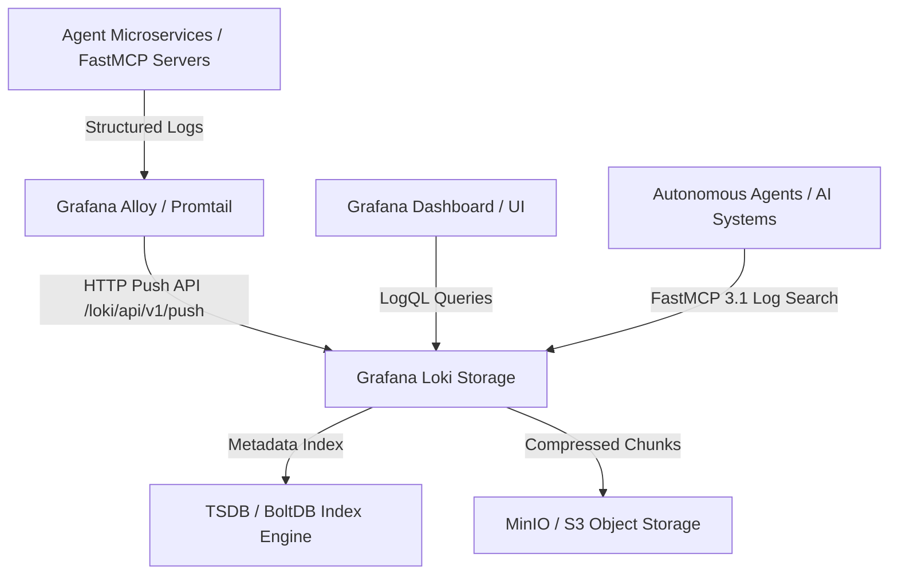

# Grafana Loki

## What it is
**Grafana Loki** is a horizontally scalable, highly available, multi-tenant log aggregation system inspired by Prometheus. Unlike traditional log engines that index full-text log content, Loki indexes only metadata labels (e.g., service, environment, container name), leaving the log message unindexed in compressed chunk storage.

In early 2027, Loki stands as a core telemetry backend across enterprise AI infrastructures and cloud-native Kubernetes environments, powering agent execution tracking, LLM latency tracing correlation, and real-time anomaly detection.

## What problem it solves
Full-text log indexing platforms (e.g., Elasticsearch, OpenSearch) incur substantial RAM and storage overhead, scaling exponentially with log volume. Grafana Loki solves this by indexing metadata tags rather than raw text, dramatically reducing storage costs, simplifying index management, and allowing seamless query correlation between Prometheus metrics, Grafana traces ([Tempo](tempo.md)), and logs via LogQL.

In autonomous AI agent setups, agents generate massive volumes of structured JSON logs per step. Loki indexes key agent execution tags (`agent_id`, `task_type`, `status_code`) while storing payload dumps in high-compression object storage (MinIO, S3), preventing index explosion while maintaining full auditability.

## Where it fits in the stack
**Category**: Process Understanding / Log Aggregation & Observability. It operates at the **Telemetry & Observability Layer**, serving as the centralized log storage and query engine within the Grafana LGTM stack (Loki, Grafana, Tempo, Mimir) for serverless nodes, Kubernetes clusters, and AI agent services.



## Typical use cases
- **Centralized Infrastructure Log Storage**: Aggregating logs from systemd services, Docker containers, and Kubernetes pods across home-lab nodes and production clusters.
- **LLM Agent Pipeline Inspection**: Correlating high-volume execution logs and API responses with OpenTelemetry traces across agent tool calls.
- **Security Audit & Error Alerting**: Querying real-time authentication logs and setting alert rules via Grafana or Prometheus Alertmanager.
- **Microservice Diagnostics**: Filtering structured JSON log streams using LogQL label matchers during operational incidents and automated agent error recovery routines.

## Strengths
- **Low Storage & Compute Overhead**: Indexing labels only results in tiny index sizes and reduced memory consumption compared to full-text engines.
- **Prometheus-Native Design**: Shares label formats and service discovery mechanisms with Prometheus, enabling unified dashboard creation.
- **Cost-Effective Object Storage**: Stores compressed log chunks directly in S3, MinIO, or local filesystem block storage.
- **Powerful LogQL Query Language**: Supports label filtering, regex parsing, rate aggregation, and metric extraction from raw log lines.
- **FastMCP 3.1 Tool Compatibility**: Clean REST API endpoints allow AI agents to run LogQL queries programmatically for self-debugging.

## Limitations
- **Full-Text Query Latency**: Searching across unindexed log bodies over long time ranges requires scanning chunk files, which can be slower than full-text engines without proper label filtering.
- **Label Cardinality Sensitivity**: High-cardinality labels (e.g., unique user IDs, request UUIDs, or raw IP addresses as labels) degrade index performance.
- **Configuration Tuning Requirement**: Fine-tuning chunk size, flush intervals, and retention policies requires initial operational setup and memory management.

## When to use it
- When deploying a lightweight, cost-effective log aggregation system alongside Prometheus and Grafana.
- When collecting logs from Kubernetes clusters, Docker hosts, or system services with structured label metadata.
- When building unified observability dashboards correlating metrics, logs, and traces.
- When providing LLM agents with real-time log query capabilities via LogQL APIs.

## When not to use it
- When instant, complex full-text search over non-labeled historical logs is the primary operational requirement (consider [ClickHouse](clickhouse.md) or OpenSearch).
- When simple local file rotation or cloud-managed logging services require zero maintenance.

## Getting started

### Installation via Helm (Kubernetes)
Deploy Grafana Loki and Alloy/Promtail collector using Helm:
```bash
helm repo add grafana https://grafana.github.io/helm-charts
helm repo update
helm install loki grafana/loki-stack --set promtail.enabled=true,loki.persistence.enabled=true
```

### Installation via Docker Compose
Minimal Docker Compose snippet for running Loki and Grafana locally:
```yaml
version: "3.8"
services:
  loki:
    image: grafana/loki:3.0.0
    ports:
      - "3100:3100"
    command: -config.file=/etc/loki/local-config.yaml
  grafana:
    image: grafana/grafana:latest
    ports:
      - "3000:3000"
    environment:
      - GF_SECURITY_ADMIN_PASSWORD=admin
```

## CLI examples

### Querying Loki via LogCLI
Install `logcli` and query logs matching specific label selectors:
```bash
export LOKI_ADDR=http://localhost:3100
logcli query '{job="docker", container="paperless-ngx"}' --limit=50
```

### Tail Live Log Stream
```bash
logcli tail '{app="agent-runner"}'
```

### LogQL Rate Calculation
Calculate the rate of log lines matching error regex over a 5-minute window:
```bash
logcli query 'sum(rate({app="agent-runner"} |= "error" [5m])) by (component)'
```

## API examples

### Python Log Ingestion, Querying & FastMCP 3.1 Tool Pattern with Pydantic v2
The following code demonstrates pushing structured JSON logs formatted for Loki collection, querying logs via LogQL REST endpoints, and serving a FastMCP 3.1 tool interface for AI agents:

```python
import json
import time
import requests
from pydantic import BaseModel, Field
from typing import Dict, Any, List, Optional
from mcp.server.fastmcp import FastMCP

# Initialize FastMCP 3.1 Server for Loki Observability Tools
mcp = FastMCP("Loki Observability Engine")

class LokiLogStream(BaseModel):
    stream: Dict[str, str] = Field(..., description="Label set identifying the stream")
    values: List[List[str]] = Field(..., description="List of [nanosecond_timestamp, log_message] entries")

class LokiPushPayload(BaseModel):
    streams: List[LokiLogStream] = Field(..., description="List of log streams to push")

class LogQueryResult(BaseModel):
    timestamp: str = Field(..., description="Nanosecond timestamp of log line")
    message: str = Field(..., description="Raw or JSON log string")
    labels: Dict[str, str] = Field(..., description="Stream labels associated with entry")

class LokiQueryResponse(BaseModel):
    status: str = Field(..., description="Query execution status")
    total_entries: int = Field(..., description="Number of returned log entries")
    results: List[LogQueryResult] = Field(..., description="List of matched log records")

@mcp.tool()
def query_loki_logs(loki_url: str, logql: str, limit: int = 20) -> str:
    """Query Loki logs using LogQL syntax and return formatted JSON string."""
    params = {
        "query": logql,
        "limit": limit
    }
    response = requests.get(f"{loki_url}/loki/api/v1/query_range", params=params)
    if response.status_code != 200:
        return f"Error querying Loki: {response.status_code} - {response.text}"

    raw_data = response.json()
    entries = []
    matrix_or_streams = raw_data.get("data", {}).get("result", [])

    for stream_data in matrix_or_streams:
        labels = stream_data.get("stream", {})
        for val in stream_data.get("values", []):
            entries.append(LogQueryResult(
                timestamp=val[0],
                message=val[1],
                labels=labels
            ))

    query_res = LokiQueryResponse(
        status=raw_data.get("status", "success"),
        total_entries=len(entries),
        results=entries
    )
    return query_res.model_dump_json(indent=2)

def push_log_to_loki(loki_url: str, app_name: str, message: str, level: str = "info") -> bool:
    nanosecond_ts = str(int(time.time() * 1e9))
    log_entry = {
        "event": message,
        "severity": level,
        "component": "agent_service"
    }

    payload = LokiPushPayload(
        streams=[
            LokiLogStream(
                stream={"app": app_name, "environment": "production"},
                values=[[nanosecond_ts, json.dumps(log_entry)]]
            )
        ]
    )

    validated_payload = payload.model_dump()
    response = requests.post(
        f"{loki_url}/loki/api/v1/push",
        json=validated_payload,
        headers={"Content-Type": "application/json"}
    )
    return response.status_code == 204

if __name__ == "__main__":
    # Test payload validation
    test_payload = {
        "streams": [
            {
                "stream": {"app": "agent-orchestrator", "env": "local"},
                "values": [[str(int(time.time() * 1e9)), '{"message": "Agent step initialized"}']]
            }
        ]
    }
    validated = LokiPushPayload.model_validate(test_payload)
    print(f"Validated Loki push payload for stream app: {validated.streams[0].stream['app']}")
```

## Related tools / concepts
- [Grafana Cloud](grafana-cloud.md)
- [Prometheus](prometheus.md)
- [Tempo](tempo.md)
- [OpenTelemetry Collector](opentelemetry-collector.md)
- [ClickHouse](clickhouse.md)

## Sources / references
- [Grafana Loki Official Documentation](https://grafana.com/docs/loki/latest/)
- [LogQL Reference Guide](https://grafana.com/docs/loki/latest/query/)
- [Grafana GitHub Repository](https://github.com/grafana/loki)

---
## Contribution Metadata
- Last reviewed: 2027-01-07
- Confidence: high
