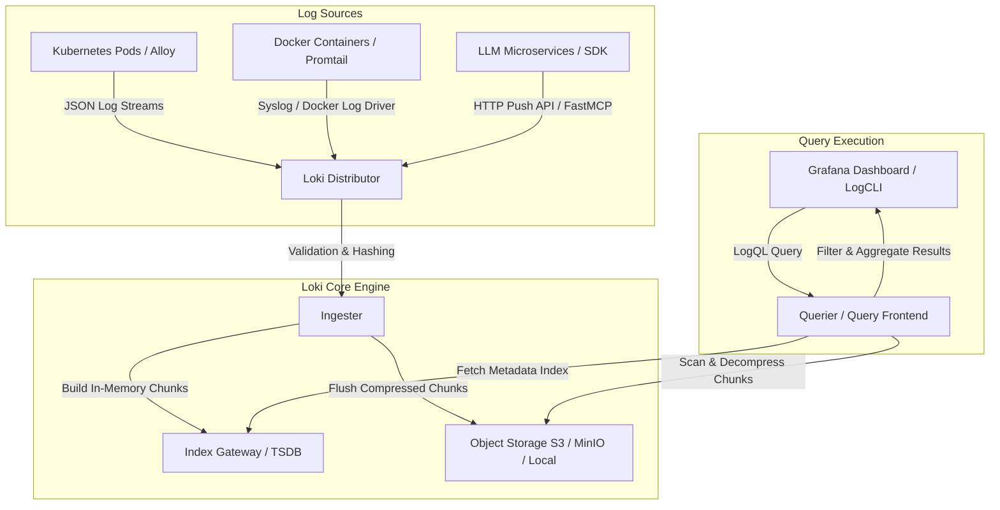

# Grafana Loki

## What it is
**Grafana Loki** is a horizontally scalable, highly available, multi-tenant log aggregation system inspired by Prometheus. Unlike traditional log engines that index full-text log content, Loki indexes only metadata labels (e.g., `service`, `environment`, `container_name`), leaving the log message body unindexed inside compressed chunk storage.

By focusing exclusively on metadata indexing, Loki achieves significantly lower memory and storage footprints compared to full-text search clusters. Loki seamlessly pairs with Prometheus metrics and Grafana Tempo distributed traces, enabling cross-telemetry correlation via standard LogQL queries.



## What problem it solves
Full-text log indexing platforms (e.g., Elasticsearch, OpenSearch) incur substantial RAM and storage overhead that scales exponentially with log volume. Operations teams frequently face high infrastructure bills and complex cluster management just to keep log retention windows active.

Grafana Loki solves this by indexing metadata tags rather than raw log text. This design choice dramatically reduces storage costs, simplifies index management, and allows seamless query correlation between Prometheus metrics, Grafana traces ([Tempo](tempo.md)), and application logs using a unified label model.

## Where it fits in the stack
**Category**: Process Understanding / Log Aggregation & Observability. It operates at the **Telemetry & Observability Layer**, serving as the centralized log storage and query engine within the Grafana LGTM stack (Loki, Grafana, Tempo, Mimir) for serverless nodes, Kubernetes clusters, and AI agent services.

In modern agentic AI deployments, Loki records structured execution traces, prompt/response telemetry, tool invocations, and system warning messages without imposing heavy indexing overhead on high-frequency log streams.

## Typical use cases
- **Centralized Infrastructure Log Storage**: Aggregating logs from systemd services, Docker containers, and Kubernetes pods across multi-cloud and home-lab nodes.
- **LLM Agent Pipeline Inspection**: Correlating high-volume execution logs and API responses with OpenTelemetry traces across agentic workflows.
- **Security Audit & Error Alerting**: Querying real-time authentication logs, detecting rate-limit breaches, and triggering alert rules via Grafana or Prometheus Alertmanager.
- **Microservice Diagnostics**: Filtering structured JSON log streams using LogQL label matchers and stage processors during operational incidents.
- **Cost-Constrained Long-Term Retention**: Storing compressed log chunks in cost-effective object storage (S3, MinIO, Azure Blob) for compliance auditing.

## Strengths
- **Low Storage & Compute Overhead**: Indexing labels only results in tiny index sizes and drastically reduced memory consumption compared to full-text search engines.
- **Prometheus-Native Design**: Shares label formats, relabeling rules, and service discovery mechanisms with Prometheus, enabling unified dashboard creation.
- **Cost-Effective Object Storage**: Stores compressed log chunks directly in S3, MinIO, GCS, or local filesystem block storage without heavy indexing database instances.
- **Powerful LogQL Query Language**: Supports label filtering, regex line parsing, JSON field extraction, rate aggregation, and metric generation from raw log streams.
- **Multi-Tenancy & Security**: Built-in multi-tenant isolation via `X-Scope-OrgID` header enforcement, preventing cross-organization log leakage.

## Limitations
- **Full-Text Query Latency**: Searching across unindexed log bodies over long time ranges requires scanning chunk files, which can be slower than full-text engines without proper label filtering.
- **Label Cardinality Sensitivity**: High-cardinality labels (e.g., unique user IDs, transaction IDs, or raw IP addresses as stream labels) degrade index performance and lead to out-of-memory errors.
- **Configuration Tuning Requirement**: Fine-tuning chunk size, flush intervals, compactor limits, and retention policies requires initial operational tuning.

## When to use it
- When deploying a lightweight, cost-effective log aggregation system alongside Prometheus and Grafana.
- When collecting logs from Kubernetes clusters, Docker hosts, or system services with structured label metadata.
- When building unified observability dashboards correlating metrics, logs, and traces.
- When log retention volumes are large and cost efficiency is prioritized over instant full-text searches on non-labeled historical logs.

## When not to use it
- When instant, complex full-text search over non-labeled historical logs is the primary operational requirement (consider [ClickHouse](clickhouse.md) or OpenSearch).
- When high-cardinality values must serve as primary index keys without pre-filtering by static stream labels.
- When simple local file rotation or cloud-managed logging services require zero operational maintenance.

## Getting started

### Installation via Helm (Kubernetes)
Deploy Grafana Loki and Alloy/Promtail collector using Helm:
```bash
helm repo add grafana https://grafana.github.io/helm-charts
helm repo update
helm install loki grafana/loki-stack \
  --set promtail.enabled=true \
  --set loki.persistence.enabled=true \
  --set loki.persistence.size=10Gi
```

### Installation via Docker Compose
Minimal Docker Compose setup for running Loki and Grafana locally:
```yaml
version: "3.8"
services:
  loki:
    image: grafana/loki:3.0.0
    ports:
      - "3100:3100"
    command: -config.file=/etc/loki/local-config.yaml
    volumes:
      - loki-data:/loki
  grafana:
    image: grafana/grafana:latest
    ports:
      - "3000:3000"
    environment:
      - GF_SECURITY_ADMIN_PASSWORD=admin
    depends_on:
      - loki

volumes:
  loki-data:
```

## CLI examples

### Querying Loki via LogCLI
Install `logcli` and query logs matching specific label selectors:
```bash
export LOKI_ADDR=http://localhost:3100
logcli query '{job="docker", container="paperless-ngx"}' --limit=50
```

### Tail Live Log Stream
```bash
logcli tail '{app="agent-runner", environment="production"}'
```

### Calculate Rate of Error Logs Over Time
```bash
logcli query 'sum(rate({app="agent-runner"} |= "ERROR" [5m])) by (component)'
```

## API examples

### LogQL Query & Push Schema Validation with Pydantic v2
The following script demonstrates generating structured JSON log payloads, validating log schemas using Pydantic v2, and executing LogQL queries against Loki's HTTP API:

```python
import json
import time
import requests
from pydantic import BaseModel, Field
from typing import Dict, Any, List, Optional

class LokiStreamLabel(BaseModel):
    app: str = Field(..., description="Application or service identifier")
    environment: str = Field("production", description="Deployment environment")
    component: Optional[str] = Field(None, description="Sub-system or agent component name")

class LokiLogStream(BaseModel):
    stream: Dict[str, str] = Field(..., description="Key-value pair labels for index stream")
    values: List[List[str]] = Field(..., description="List of [nanosecond_timestamp_str, log_message_str]")

class LokiPushPayload(BaseModel):
    streams: List[LokiLogStream] = Field(..., description="List of log streams in push payload")

class LokiQueryResponseResult(BaseModel):
    stream: Dict[str, str]
    values: List[List[str]]

class LokiQueryData(BaseModel):
    resultType: str
    result: List[LokiQueryResponseResult]

class LokiQueryResponse(BaseModel):
    status: str
    data: LokiQueryData

def push_log_to_loki(loki_url: str, labels: LokiStreamLabel, message: str, severity: str = "info") -> bool:
    nanosecond_ts = str(int(time.time() * 1e9))
    log_body = {
        "event": message,
        "level": severity,
        "timestamp_iso": time.strftime("%Y-%m-%dT%H:%M:%SZ", time.gmtime())
    }

    payload = LokiPushPayload(
        streams=[
            LokiLogStream(
                stream={k: v for k, v in labels.model_dump().items() if v is not None},
                values=[[nanosecond_ts, json.dumps(log_body)]]
            )
        ]
    )

    response = requests.post(
        f"{loki_url}/loki/api/v1/push",
        json=payload.model_dump(),
        headers={"Content-Type": "application/json"}
    )
    return response.status_code == 204

def query_loki_logs(loki_url: str, logql_query: str, limit: int = 10) -> LokiQueryResponse:
    params = {"query": logql_query, "limit": limit}
    res = requests.get(f"{loki_url}/loki/api/v1/query_range", params=params)
    res.raise_for_status()
    return LokiQueryResponse.model_validate(res.json())

if __name__ == "__main__":
    lbls = LokiStreamLabel(app="agent-orchestrator", environment="staging", component="planner")
    print(f"Validated stream labels: {lbls.model_dump()}")
```

### FastMCP 3.1 Integration Pattern
This FastMCP 3.1 server exposes Loki log searching and stream pushing as tools for agentic systems:

```python
from fastmcp import FastMCP
import requests
import json
import time
from typing import Dict, Any

mcp = FastMCP("GrafanaLokiProvider")

LOKI_BASE_URL = "http://localhost:3100"

@mcp.tool()
def search_loki_logs(logql_query: str, limit: int = 25) -> Dict[str, Any]:
    """Search Grafana Loki logs using a LogQL query string.

    Args:
        logql_query: Valid LogQL query e.g. '{app="agent-runner"} |= "ERROR"'
        limit: Maximum number of log lines to return
    """
    url = f"{LOKI_BASE_URL}/loki/api/v1/query_range"
    response = requests.get(url, params={"query": logql_query, "limit": limit}, timeout=10)
    response.raise_for_status()
    data = response.json()

    results = []
    for stream_item in data.get("data", {}).get("result", []):
        labels = stream_item.get("stream", {})
        for val in stream_item.get("values", []):
            timestamp_ns, log_line = val[0], val[1]
            results.append({
                "labels": labels,
                "timestamp_ns": timestamp_ns,
                "line": log_line
            })

    return {"query": logql_query, "count": len(results), "logs": results}

@mcp.tool()
def push_agent_telemetry_log(app: str, component: str, level: str, message: str) -> Dict[str, Any]:
    """Push a structured operational telemetry log entry to Grafana Loki.

    Args:
        app: Application name
        component: Agent component name
        level: Severity level (info, warning, error)
        message: Log event details
    """
    nanosecond_ts = str(int(time.time() * 1e9))
    payload = {
        "streams": [
            {
                "stream": {"app": app, "component": component, "level": level},
                "values": [[nanosecond_ts, json.dumps({"event": message, "severity": level})]]
            }
        ]
    }

    url = f"{LOKI_BASE_URL}/loki/api/v1/push"
    resp = requests.post(url, json=payload, headers={"Content-Type": "application/json"}, timeout=5)

    return {"success": resp.status_code == 204, "status_code": resp.status_code}

if __name__ == "__main__":
    mcp.run()
```

## Related tools / concepts
- [Grafana Cloud](grafana-cloud.md)
- [Prometheus](prometheus.md)
- [Tempo](tempo.md)
- [OpenTelemetry Collector](opentelemetry-collector.md)
- [ClickHouse](clickhouse.md)

## Sources / references
- [Grafana Loki Official Documentation](https://grafana.com/docs/loki/latest/)
- [LogQL Reference Guide](https://grafana.com/docs/loki/latest/query/)
- [Grafana GitHub Repository](https://github.com/grafana/loki)

---
## Contribution Metadata
- Last reviewed: 2027-01-07
- Confidence: high
