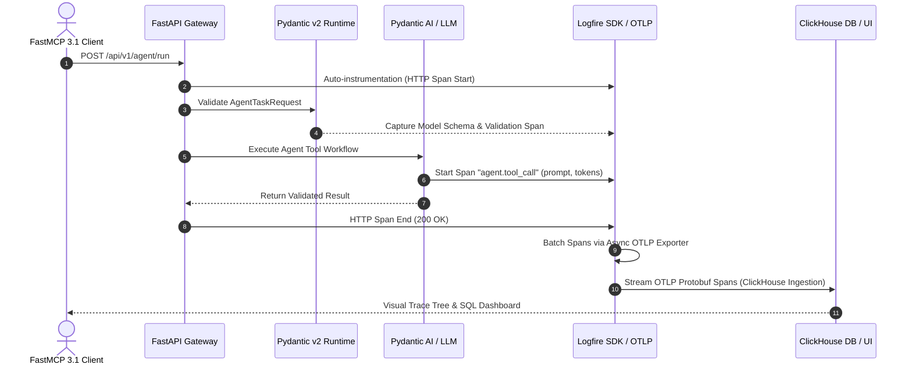

# Logfire

## What it is
**Logfire** is Pydantic's enterprise observability, structured tracing, and telemetry platform tailored specifically for Python applications, FastAPI microservices, and multi-agent LLM pipelines. Built natively on top of OpenTelemetry standards and backed by a high-performance, columnar ClickHouse database engine, Logfire provides zero-boilerplate, high-density visibility into Pydantic v2 data validation hierarchies, SQL database queries, HTTP client transactions, and agentic tool invocation spans.

Unlike traditional logging infrastructure that treats events as unstructured text strings or detached JSON objects, Logfire treats execution state as interactive, tree-structured span graphs. Every Pydantic model validation failure, LLM token chunk, vector database query, and FastMCP 3.1 protocol message is captured with microsecond precision and mapped to standard OpenTelemetry semantic conventions.

## What problem it solves
Modern multi-agent architectures and asynchronous microservices introduce deep visual complexity and failure opacity:
- **Nested Agent Execution Opacity**: Debugging multi-step agent loops, tool calling recursions, and fallback paths is notoriously difficult using standard text logs. Logfire automatically renders tool calls, LLM prompt payloads, and completion spans in an interactive hierarchy.
- **Data Schema & Validation Drift**: Debugging schema mismatch errors across API boundaries often requires logging sensitive payloads or writing custom exception middleware. Logfire instruments Pydantic v2 model instantiation directly, capturing exact validation error locations, input payloads, and schema diffs.
- **Telemetry Configuration Fatigue**: Configuring OpenTelemetry collectors, span processors, metric readers, and OTLP exporters usually demands hundreds of lines of boilerplate code. Logfire simplifies this down to `logfire.configure()` with automated library hooks.
- **Vendor Lock-in Risk**: Proprietary tracing SDKs trap observability data inside single SaaS silos. Logfire is 100% OpenTelemetry native; spans can be routed simultaneously to self-hosted Jaeger/Grafana instances, Datadog, or the Logfire Cloud console.

## Architecture & Data Flow



## Where it fits in the stack
**Category**: Process Understanding / Observability & Telemetry. Operating at the **Telemetry & Observability Layer**, Logfire acts as the central nervous system connecting Python execution runtimes, FastMCP 3.1 agent nodes, web frameworks ([FastAPI](fastapi.md)), and model orchestrators ([Pydantic AI](../frameworks/pydantic-ai.md), [Instructor](../frameworks/instructor.md)) to local or enterprise cloud dashboards.

## Key Features & Functional Modules
- **Auto-Instrumentation Matrix**: One-line hook support for `fastapi`, `httpx`, `requests`, `openai`, `anthropic`, `sqlalchemy`, `psycopg`, `asyncio`, and `pydantic`.
- **High-Performance SQL Search**: Query trace spans directly in the cloud console or local CLI using standard ANSI SQL syntax powered by ClickHouse.
- **Pydantic v2 Deep Inspection**: Inspect individual model fields, schema validation rules, default value overrides, and serialization timings.
- **OpenTelemetry Standard Compliance**: Export data seamlessly via standard OTLP over HTTP/Protobuf or gRPC to any OTLP-compliant collector.
- **FastMCP 3.1 Protocol Tracing**: Instrument Model Context Protocol servers to log client session handshakes, tool registrations, and resource requests.

## Typical use cases
- **Multi-Agent Execution Tracing**: Visualizing agent tool calling cascades, memory retrieval spans, and prompt token usage in real time.
- **API Schema Debugging**: Identifying real-time field validation errors and bad payload requests in FastAPI microservices.
- **Database Query Performance Auditing**: Tracking SQL query latency, parameter binding, and connection pool starvation across SQLAlchemy or AsyncPG sessions.
- **Production LLM Cost Tracking**: Aggregating input/output token counts and API costs across Anthropic, OpenAI, and local vLLM model routes.

## Strengths
- **Native Pydantic v2 Integration**: Captures rich validation telemetry without custom wrapper functions.
- **Zero-Boilerplate Setup**: Auto-configures standard library loggers (`logging`, `structlog`, `loguru`) to emit structured trace spans.
- **OpenTelemetry Native**: Guarantees zero vendor lock-in through standardized OTLP protocol formats.
- **Interactive Tree Visualization**: High-density UI designed specifically for software engineers and ML engineers.

## Limitations
- **Python Ecosystem Primacy**: Full auto-instrumentation capabilities are tailored primarily for Python runtimes.
- **SaaS Retention Limits**: Free cloud tiers enforce fixed rate limits and retention windows unless self-hosting or exporting via OTLP.
- **Sampling Strategy Configuration**: High-throughput distributed systems require explicit tail-sampling rules to avoid excess telemetry volume.

## When to use it
- When developing Python applications using Pydantic, Pydantic AI, FastAPI, or FastMCP 3.1.
- When requiring detailed validation error telemetry and nested span trees for AI workflows.
- When standardizing enterprise observability on OpenTelemetry-compliant infrastructure.

## When not to use it
- For non-Python software stacks (e.g., pure TypeScript/Node.js or Go microservices).
- When simple stdout file logging without trace aggregation or dashboard visualization meets all requirements.

## Configuration & Feature Summary

| Feature / Setting | Parameter / Env Variable | Default Value | Description |
| :--- | :--- | :--- | :--- |
| Project Identifier | `LOGFIRE_PROJECT_NAME` / `project_name` | None | Defines the destination project in the Logfire dashboard. |
| Write Token | `LOGFIRE_TOKEN` / `token` | None | Secret API write token for authentication. |
| OTLP Endpoint | `LOGFIRE_ADVANCED_OTLP_ENDPOINT` | Logfire Cloud | Custom OTLP collector URL for self-hosted Jaeger/Grafana setups. |
| Console Output | `console` | `ConsoleOptions()` | Controls terminal stdout/stderr rich output formatting. |
| Pydantic Plugin | `pydantic_plugin` | Enabled | Auto-instruments all Pydantic v2 model instantiations. |
| Code Source Logging | `code_source` | Enabled | Captures code line numbers and Git commit metadata with spans. |

## Getting started

### Installation
Install the Logfire SDK alongside Pydantic v2 and FastAPI dependencies:
```bash
pip install "logfire[fastapi,httpx,openai,pydantic]"
```

### Authentication & CLI Verification
Authenticate your development environment with your Logfire account:
```bash
logfire auth
```

### Initializing Logfire in Python
Initialize Logfire at the application entry point:
```python
import logfire

# Configure project and auto-instrumentation options
logfire.configure(
    project_name="enterprise-agent-core",
    send_to_logfire=True,
)
logfire.info("Logfire instrumentation initialized successfully.")
```

## CLI examples

### 1. Authenticate Environment
```bash
logfire auth
```

### 2. Verify Logfire Setup & Connectivity
```bash
logfire check
```

### 3. List Active Logfire Projects
```bash
logfire projects list
```

### 4. Query Spans via CLI SQL Interface
```bash
logfire query "SELECT span_name, duration_ms, attributes FROM spans WHERE duration_ms > 500 LIMIT 10"
```

## API examples

### 1. FastAPI & Pydantic v2 Model Validation Tracing
The following example demonstrates instrumenting a FastAPI application with Pydantic v2 validation schema tracking and custom span context:

```python
import logfire
from fastapi import FastAPI, HTTPException
from pydantic import BaseModel, Field, EmailStr
from typing import List, Optional

# Initialize Logfire
logfire.configure(project_name="agent-gateway-service")

app = FastAPI(title="Logfire-Instrumented Agent Gateway")
logfire.instrument_fastapi(app)
logfire.instrument_pydantic()

class TaskSpec(BaseModel):
    task_id: str = Field(..., description="Unique alphanumeric identifier")
    description: str = Field(..., min_length=5, max_length=500)
    priority: int = Field(default=1, ge=1, le=5)
    assignee_email: EmailStr

class WorkflowResult(BaseModel):
    task_id: str
    status: str
    processed_steps: int
    execution_time_sec: float

@app.post("/v1/tasks/run", response_model=WorkflowResult)
async def run_agent_task(payload: TaskSpec):
    with logfire.span("agent.task_execution", task_id=payload.task_id, priority=payload.priority) as span:
        logfire.info("Starting task execution for {email}", email=payload.assignee_email)

        if payload.priority == 5:
            logfire.warn("High priority task detected: {task_id}", task_id=payload.task_id)

        # Simulate business logic processing
        steps_completed = 4
        execution_time = 0.42

        span.set_attribute("steps_completed", steps_completed)
        span.set_attribute("execution_time", execution_time)

        return WorkflowResult(
            task_id=payload.task_id,
            status="completed",
            processed_steps=steps_completed,
            execution_time_sec=execution_time
        )

if __name__ == "__main__":
    import uvicorn
    uvicorn.run(app, host="127.0.0.1", port=8000)
```

### 2. FastMCP 3.1 Multi-Agent Tool Tracing & Pydantic AI Integration
This pattern illustrates tracing FastMCP 3.1 agent tool invocations, structured output schemas, and custom OTLP span metrics:

```python
import asyncio
import logfire
from pydantic import BaseModel, Field
from typing import Dict, Any

# Configure Logfire with custom OTLP exporter support
logfire.configure(
    project_name="fastmcp-agent-server",
    pydantic_plugin=logfire.PydanticPlugin(record="all")
)

class MCPToolParams(BaseModel):
    query: str = Field(..., description="Search query string")
    max_results: int = Field(default=5, ge=1, le=20)
    filters: Dict[str, str] = Field(default_factory=dict)

class MCPToolResponse(BaseModel):
    query: str
    matches_found: int
    data: list

class FastMCPObservableTool:
    def __init__(self, name: str):
        self.name = name

    async def execute_tool(self, raw_params: Dict[str, Any]) -> MCPToolResponse:
        with logfire.span("fastmcp.tool_invocation", tool_name=self.name) as span:
            # Validate parameters through Pydantic v2
            params = MCPToolParams.model_validate(raw_params)
            span.set_attribute("validated_query", params.query)
            span.set_attribute("max_results", params.max_results)

            logfire.info("Executing FastMCP 3.1 tool {name} with query: {query}", name=self.name, query=params.query)

            # Simulate external vector DB query
            await asyncio.sleep(0.05)

            results = ["doc_101", "doc_202", "doc_303"][:params.max_results]

            response = MCPToolResponse(
                query=params.query,
                matches_found=len(results),
                data=results
            )
            logfire.info("FastMCP tool completed successfully. Matches: {count}", count=response.matches_found)
            return response

async def main():
    tool = FastMCPObservableTool(name="kb_vector_search")
    payload = {"query": "OpenTelemetry Pydantic v2 integration", "max_results": 3, "filters": {"category": "docs"}}
    res = await tool.execute_tool(payload)
    print("Result:", res.model_dump_json(indent=2))

if __name__ == "__main__":
    asyncio.run(main())
```

## Related tools / concepts
- [Datadog](datadog.md) — Enterprise APM and log management platform.
- [OpenTelemetry Collector](opentelemetry-collector.md) — Standardized vendor-neutral telemetry proxy.
- [Pydantic AI](../frameworks/pydantic-ai.md) — Production agent framework built on Pydantic v2.
- [FastAPI](fastapi.md) — Asynchronous Python web framework.
- [Instructor](../frameworks/instructor.md) — Structured LLM outputs library powered by Pydantic.
- [W&B Weave](wandb-weave.md) — LLM evaluation and trace logging system.

## Sources / references
- [Pydantic Logfire Official Documentation](https://docs.pydantic.dev/logfire/)
- [Pydantic Logfire GitHub Repository](https://github.com/pydantic/logfire)
- [FastAPI Observability Guide with Logfire](https://fastapi.tiangolo.com/tutorial/telemetry/)
- [OpenTelemetry Python SDK Documentation](https://opentelemetry.io/docs/languages/python/)

---
## Contribution Metadata
- Last reviewed: 2027-01-07
- Confidence: high
