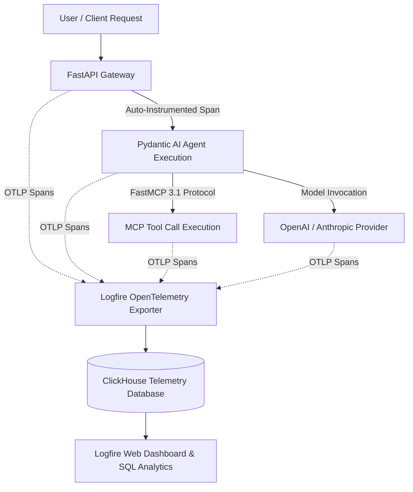

# Logfire

## What it is
**Logfire** is Pydantic's observability, tracing, and logging platform tailored specifically for Python applications, FastAPI microservices, and LLM agent pipelines. Built on top of OpenTelemetry standards and powered by a high-performance ClickHouse backend, Logfire provides deep, zero-overhead visibility into Pydantic v2 data validation, database queries, and multi-agent execution spans. In early 2027, Logfire serves as the primary telemetry substrate for FastMCP 3.1 task channels and distributed agentic orchestrations.



## What problem it solves
Traditional logging tools treat logs as flat text strings or detached JSON objects, making it difficult to visualize complex, nested LLM tool calls and Pydantic validation hierarchies. Logfire solves this by auto-instrumenting Pydantic models, FastAPI routes, HTTP clients (httpx/requests), and OpenAI/Anthropic/LangChain calls, presenting them as structured, interactive execution trees without requiring manual telemetry boilerplate.

Key operational problems solved include:
- **Nested Agent Execution Visibility**: Visualizing recursive sub-agent delegates and multi-turn tool calling without lost context.
- **Field-Level Validation Debugging**: pinpointing exact Pydantic v2 schema validation failures across multi-layer nested models in live production API routes.
- **Zero Lock-In Exporting**: Native OpenTelemetry (OTLP) compliance allows immediate redirection of spans to self-hosted Grafana Tempo, Datadog, or ClickHouse instances if required.

## Where it fits in the stack
**Category**: Process Understanding / Observability & Telemetry. It operates at the **Telemetry & Observability Layer**, connecting Python application runtimes, FastMCP 3.1 servers, and LLM orchestrators ([Pydantic AI](../frameworks/pydantic-ai.md), [Instructor](../frameworks/instructor.md)) to cloud or self-hosted observability backends.

## Typical use cases
- **LLM Agent & FastMCP 3.1 Tracing**: Visualizing nested tool invocations, prompt token counts, and model latencies in agentic loops.
- **Pydantic Validation Error Debugging**: Inspecting real-time validation failures, field schema mismatches, and data drift across backend endpoints.
- **FastAPI Endpoint Analytics**: Monitoring request latencies, status codes, and SQL query execution spans within API routes.
- **Distributed Python Microservice Telemetry**: Exporting OpenTelemetry spans across asynchronous worker nodes.

## Strengths
- **Native Pydantic v2 Integration**: Auto-traces model instantiations, schema validations, and serialization events out-of-the-box.
- **OpenTelemetry Native**: Native OTLP exporter support guarantees no vendor lock-in; traces can be redirected to Grafana, Datadog, or Jaeger.
- **Zero-Boilerplate Auto-Instrumentation**: Simple `logfire.configure()` instruments popular libraries (`fastapi`, `httpx`, `asyncio`, `openai`, `anthropic`, `sqlalchemy`).
- **Developer-Centric Dashboard**: High-speed SQL search over structured trace spans with rich tree-view rendering.

## Limitations
- **Python Ecosystem Focused**: Deepest auto-instrumentation hooks are currently exclusive to Python and Pydantic runtime environments.
- **Cloud SaaS Tier Retention**: Long-term historical telemetry retention on free cloud tiers requires upgrading or self-hosting OTLP collectors.
- **Sampling Overhead at Extreme Volume**: Ultra-high-frequency logging requires configuring tail-sampling rules to manage bandwidth.

## When to use it
- When developing Python LLM applications using Pydantic, Pydantic AI, FastAPI, or FastMCP 3.1.
- When requiring rich execution trees and field-level validation tracing for AI agent workflows.
- When standardizing on OpenTelemetry-compliant observability infrastructure.

## When not to use it
- For non-Python microservice stacks (e.g., pure Node.js/TypeScript or Go applications).
- When simple local file logging or lightweight stdout logging is sufficient without external dashboard management.

## Getting started

### Installation
Install the Logfire SDK via pip along with standard instrumentation modules:
```bash
pip install logfire fastapi httpx pydantic pydantic-ai uvicorn
```

### Authentication & Initial Configuration
Authenticate your local environment with the Logfire cloud service:
```bash
logfire auth
```

### Basic Setup in Python
Initialize Logfire tracing in your application entrypoint:
```python
import logfire

# Configure Logfire with project token or environment variables
logfire.configure(project_name="home-office-automations")
logfire.info("Logfire instrumentation initialized successfully.")
```

## CLI examples

### 1. CLI Environment Authentication
Authenticate your local shell with Logfire account credentials:
```bash
logfire auth
```

### 2. CLI Project Verification
Verify project configuration and active tokens:
```bash
logfire check
```

### 3. List Active Projects via CLI
Display all active Logfire workspace projects:
```bash
logfire projects list
```

## API examples

### FastAPI Auto-Instrumentation, FastMCP 3.1, and Pydantic v2 Tracing
The following code demonstrates auto-instrumenting a FastAPI application and a FastMCP 3.1 agent execution pipeline with Pydantic v2 model validation tracing using Logfire:

```python
import logfire
from fastapi import FastAPI
from pydantic import BaseModel, Field, field_validator
from typing import List, Dict, Any, Optional

# Initialize Logfire with OTLP auto-configuration
logfire.configure(
    project_name="agent-observability-pipeline",
    send_to_logfire=True,
)

app = FastAPI(title="Logfire-Instrumented Agent API")
logfire.instrument_fastapi(app)
logfire.instrument_httpx()

class FastMCPTaskPayload(BaseModel):
    task_id: str = Field(..., description="Unique FastMCP task UUID")
    agent_name: str = Field(..., description="Target autonomous agent")
    parameters: Dict[str, Any] = Field(default_factory=dict)
    timeout_seconds: int = Field(default=30, ge=1, le=300)

    @field_validator('agent_name')
    @classmethod
    def validate_agent_name(cls, v: str) -> str:
        allowed_agents = {'researcher', 'coder', 'reviewer', 'orchestrator'}
        if v not in allowed_agents:
            raise ValueError(f"Agent '{v}' not recognized. Must be one of {allowed_agents}")
        return v

class FastMCPTaskResult(BaseModel):
    task_id: str
    status: str
    execution_time_ms: float
    output: Dict[str, Any]

@app.post("/api/v1/mcp/execute", response_model=FastMCPTaskResult)
async def execute_mcp_task(payload: FastMCPTaskPayload):
    with logfire.span("mcp.task_execution", task_id=payload.task_id, agent=payload.agent_name):
        logfire.info("Executing FastMCP 3.1 task for agent '{agent}'", agent=payload.agent_name)

        # Nested span simulating sub-tool invocation
        with logfire.span("agent.tool_call", tool="database_query"):
            logfire.info("Querying local vector store for context")
            # Simulated tool processing
            query_results = {"matches": 5, "top_score": 0.94}

        with logfire.span("pydantic.output_validation"):
            result = FastMCPTaskResult(
                task_id=payload.task_id,
                status="success",
                execution_time_ms=142.5,
                output={"context": query_results, "model": "claude-5.6-sonnet"}
            )
            logfire.info("Task completion validated successfully.")
            return result

if __name__ == "__main__":
    import uvicorn
    uvicorn.run(app, host="127.0.0.1", port=8000)
```

## Related tools / concepts
- [Datadog](datadog.md)
- [OpenTelemetry Collector](opentelemetry-collector.md)
- [Pydantic AI](../frameworks/pydantic-ai.md)
- [Grafana Cloud](grafana-cloud.md)
- [Instructor](../frameworks/instructor.md)

## Sources / references
- [Pydantic Logfire Official Documentation](https://docs.pydantic.dev/logfire/)
- [Pydantic GitHub Repository](https://github.com/pydantic/logfire)
- [FastAPI Observability Guide with Logfire](https://fastapi.tiangolo.com/tutorial/telemetry/)

## Contribution Metadata
- Last reviewed: 2027-01-07
- Confidence: high
