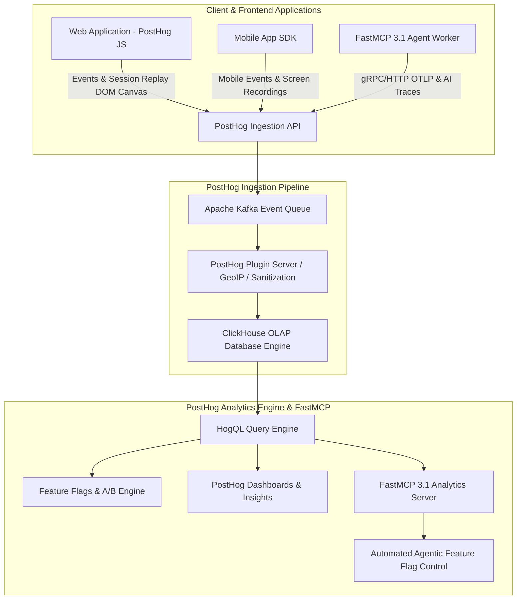

# PostHog

## What it is
PostHog is an open-source, all-in-one product telemetry platform that integrates product analytics, session replay, feature flagging, A/B testing, user survey collection, and AI observability into a unified ClickHouse-backed analytics OS. Designed to run self-hosted or via multi-tenant PostHog Cloud, PostHog provides end-to-end visibility into user interactions, agentic tool workflows, and frontend application behavior.

In multi-agent and LLM-powered application ecosystems, PostHog serves as the connective tissue linking user product funnels (retention, signups, drop-offs) directly with AI backend execution metrics (LLM inference latency, token expenditure, prompt versions, tool-calling chains, and FastMCP 3.1 agent session state). By correlating high-level frontend user sessions recorded via Session Replay with backend `$ai_generation` and `$ai_trace` spans, PostHog allows product and engineering teams to observe exactly how model responses, latency spikes, or agent hallucinations impact user conversion, retention, and satisfaction.



## What problem it solves
Engineering and product teams operating AI-native software face a multi-dimensional observability challenge: standalone LLM tracing tools capture prompt/completion token usage and latency but lack context on user retention or conversions; traditional product analytics tools track page views and signups but treat LLM model calls as opaque black boxes; standalone session replay tools record DOM events but cannot map user frustration clicks to background AI agent retries or FastMCP tool call failures.

PostHog solves this fragmentation through several key innovations:

- **Unified Product & AI Observability**: Correlates frontend user interactions with backend `$ai_generation` events, allowing teams to analyze how changing an LLM prompt or model version (e.g., swapping Claude 3.5 Sonnet for Gemma 4 or GPT-5) impacts trial conversion rates and user churn.
- **Session Replay for AI Interfaces**: Records real-time DOM mutations, user text inputs, mouse trajectories, and rendered Markdown/canvas outputs alongside AI backend execution traces. When an AI hallucination or UI rendering failure occurs, engineers can watch the exact video replay of the user's session linked to the underlying backend trace ID.
- **HogQL Custom Query Language**: Extends standard ANSI SQL directly against ClickHouse OLAP tables, enabling arbitrary ad-hoc queries over millions of events, JSON property extractions, funnel breakdowns, and cohort calculations with sub-second execution times.
- **Feature Flag & Multi-Variant Model Rollouts**: Facilitates zero-downtime canary deployments of new prompt templates, agentic tools, and LLM model backends using targeted user identity property targeting, percentage rollouts, and multivariate feature flags.
- **Privacy & Compliance First**: Offers local self-hosting via Docker or Kubernetes, row-level PII obfuscation, and complete data residency control for enterprise environments with strict regulatory compliance requirements.

## Where it fits in the stack
PostHog operates at the **Product Telemetry, User Analytics, Session Replay, Feature Flagging, and AI Observability Layer** of modern software architectures. It bridges the gap between user-facing web/mobile interfaces and backend AI agent orchestration systems.

```
+-----------------------------------------------------------------------------------+
|                        User Interface & Application Layer                         |
|           (React, Next.js, Vue, iOS, Android, Desktop Web Containers)             |
+-----------------------------------------------------------------------------------+
                                          |
                                          v (Events, Replays, Flags)
+-----------------------------------------------------------------------------------+
|                          PostHog JS / Python / FastMCP SDKs                       |
+-----------------------------------------------------------------------------------+
                                          |
                                          v (HTTP / gRPC Batch Capture)
+-----------------------------------------------------------------------------------+
|                           PostHog Telemetry Pipeline                              |
|  +--------------------+  +--------------------+  +-----------------------------+  |
|  | Kafka Event Queue  |  | Plugin Processor   |  | ClickHouse OLAP Store       |  |
|  +--------------------+  +--------------------+  +-----------------------------+  |
|  +-----------------------------------------------------------------------------+  |
|  |             HogQL Query Engine & FastMCP 3.1 Analytics Server               |  |
|  +-----------------------------------------------------------------------------+  |
+-----------------------------------------------------------------------------------+
                                          |
                                          v
+-----------------------------------------------------------------------------------+
|                   Data-Driven Action & Automated Control Layer                    |
|       (PostHog Dashboards, Feature Flag Adjustments, Agentic AI Workflows)        |
+-----------------------------------------------------------------------------------+
```

## Typical use cases
- **AI Feature A/B Testing & Evaluation**: Conducting randomized multi-variant experiments comparing alternative frontier models (e.g., Claude 3.7 Sonnet vs GPT-5.6 vs Gemma 4 31B) to evaluate user retention, chat length, and task success metrics.
- **Session Replay Debugging for Agentic Hallucinations**: Locating and viewing user session recordings where users gave negative feedback or rage-clicked following an erroneous AI agent tool call or invalid structured output generation.
- **FastMCP 3.1 Agent Tool Execution Tracking**: Tracking execution latency, failure rates, input payload sizes, and return status codes across custom FastMCP 3.1 tool calls within multi-step agent workflows.
- **Token Economics & Cost Allocation**: Utilizing HogQL queries to aggregate prompt token usage, completion token counts, and monetary costs per user tier, tenant account, or product feature.
- **Product Funnel & Cohort Analysis**: Identifying where users drop off in complex multi-step onboarding workflows that incorporate AI-assisted data entry or chat interactions.

## Strengths
- **Comprehensive Feature Set**: Integrates analytics, session recording, heatmaps, feature flags, A/B testing, surveys, and AI observability into a single platform, eliminating vendor fragmentation.
- **ClickHouse Performance**: Leverages ClickHouse for columnar storage and OLAP queries, yielding lightning-fast aggregation performance over billions of event records.
- **Powerful HogQL Engine**: Provides SQL query flexibility directly within PostHog dashboards and API endpoints, supporting full JSON path extraction and custom field transformations.
- **Open-Source & Self-Hostable**: Complete source code access with flexible self-hosted deployment options via Docker Compose or Helm for total data sovereignty.
- **Native FastMCP 3.1 & AI Extensions**: Built-in support for `$ai_generation`, `$ai_trace`, and FastMCP 3.1 agent protocols for seamless instrumentation of modern AI applications.

## Limitations
- **Ingestion & Indexing Delays in High-Volume Streams**: High-throughput event bursts may experience brief indexing latency (seconds to minutes) before events appear in real-time dashboards.
- **Resource Footprint for Self-Hosted ClickHouse**: Self-hosting a production ClickHouse and Kafka cluster requires non-trivial infrastructure overhead and ongoing database maintenance.
- **Session Replay Storage Volume**: High-volume DOM recording data can consume substantial disk space and bandwidth if sampling rules are not properly applied.

## When to use it
- When you require a single unified platform to analyze both end-user product usage and backend AI agent performance.
- When you want to watch video recordings of real user sessions linked directly to underlying LLM execution traces.
- When you need built-in feature flagging and A/B testing to rollout prompt modifications or model changes safely.
- When you prefer an open-source solution that can be self-hosted in your own cloud infrastructure for regulatory compliance.

## When not to use it
- If you only require low-level system CPU/memory infrastructure monitoring (where Prometheus or Grafana Cloud is better suited).
- For simple monolithic apps where a lightweight, static log viewer is sufficient.

## Getting started

### Installation
Install the official PostHog Python SDK alongside Pydantic v2 for structured telemetry validation:

```bash
pip install posthog pydantic>=2.0 requests
```

### Basic Setup & Event Capture
Initialize PostHog in Python and ship structured events to PostHog Cloud or a self-hosted instance:

```python
import posthog

# Configure PostHog client
posthog.project_api_key = "phc_your_project_api_key_here"
posthog.host = "https://us.i.posthog.com"  # Or "https://eu.i.posthog.com" or self-hosted URL

# Capture a user event with custom properties
posthog.capture(
    distinct_id="user_enterprise_9482",
    event="ai_agent_workflow_started",
    properties={
        "workflow_name": "automated_code_review",
        "agent_model": "claude-3.7-sonnet",
        "fastmcp_version": "3.1.0",
        "user_tier": "enterprise"
    }
)

# Ensure all pending events are flushed before exiting
posthog.flush()
```

## CLI examples

### Installing and Authenticating posthog-cli
The official `posthog-cli` enables developers to query events, manage feature flags, and trigger test events directly from terminal environments.

```bash
# Authenticate CLI with your PostHog instance
posthog-cli login --host https://us.i.posthog.com --key phc_your_api_key

# Verify active project settings
posthog-cli status
```

### Executing HogQL Queries via CLI
```bash
# Query event counts grouped by event name for the past 24 hours
posthog-cli query "
SELECT event, count() AS total_count
FROM events
WHERE timestamp > now() - INTERVAL 1 DAY
GROUP BY event
ORDER BY total_count DESC
LIMIT 10
"

# Extract AI token usage breakdown by model using HogQL
posthog-cli query "
SELECT
    properties.\$ai_model AS model,
    sum(toUInt64(properties.\$ai_input_tokens)) AS total_prompt_tokens,
    sum(toUInt64(properties.\$ai_output_tokens)) AS total_completion_tokens,
    avg(toFloat64(properties.\$ai_latency)) AS avg_latency_sec
FROM events
WHERE event = '\$ai_generation'
GROUP BY model
"
```

### Managing Feature Flags via CLI
```bash
# List all active feature flags in the project
posthog-cli flags list

# Enable an AI model experiment feature flag for 25% of users
posthog-cli flags update --key "use-claude-37-sonnet" --rollout-percentage 25
```

## API examples

### Pydantic v2 PostHog Payload & Event Validation
The following module provides strict Pydantic v2 schemas for validating PostHog telemetry payloads, AI generation traces, feature flag evaluations, and HogQL query requests prior to transmission.

```python
import time
import requests
from typing import Dict, Any, List, Optional, Literal
from pydantic import BaseModel, Field, field_validator, ConfigDict


class PostHogEventPayload(BaseModel):
    """Pydantic v2 schema for generic PostHog event capture."""
    model_config = ConfigDict(extra="forbid")

    distinct_id: str = Field(..., description="Unique user, tenant, or session identifier")
    event: str = Field(..., description="Event name identifier e.g. \$ai_generation, button_clicked")
    properties: Dict[str, Any] = Field(default_factory=dict, description="Custom event property key-value map")
    timestamp: Optional[str] = Field(default=None, description="ISO8601 string timestamp for historical events")

    @field_validator("event")
    @classmethod
    def validate_event_name(cls, v: str) -> str:
        if not v or len(v.strip()) == 0:
            raise ValueError("Event name cannot be empty.")
        return v.strip()


class PostHogAITracePayload(BaseModel):
    """Pydantic v2 schema for PostHog AI Observability (\$ai_generation) events."""
    model_config = ConfigDict(extra="forbid", populate_by_name=True)

    distinct_id: str = Field(..., description="User or session identifier")
    ai_model: str = Field(..., alias="$ai_model", description="Target model identifier e.g. claude-3.7-sonnet")
    ai_provider: str = Field(..., alias="$ai_provider", description="Model provider e.g. anthropic, openai, ollama")
    input_tokens: int = Field(..., alias="$ai_input_tokens", ge=0, description="Prompt token count")
    output_tokens: int = Field(..., alias="$ai_output_tokens", ge=0, description="Completion token count")
    latency_sec: float = Field(..., alias="$ai_latency", ge=0.0, description="Inference latency in seconds")
    cost_usd: float = Field(default=0.0, alias="$ai_cost", ge=0.0, description="Estimated total cost in USD")
    trace_id: str = Field(..., alias="$ai_trace_id", description="Distributed trace identifier")
    input_text: str = Field(..., alias="$ai_input", description="Prompt or system message text")
    output_text: str = Field(..., alias="$ai_output", description="LLM completion response text")
    mcp_version: str = Field(default="3.1", alias="$mcp_protocol_version")


class PostHogFeatureFlagEvaluation(BaseModel):
    """Pydantic v2 schema for evaluating feature flag status."""
    model_config = ConfigDict(extra="forbid")

    distinct_id: str = Field(..., description="Target user identifier")
    flag_key: str = Field(..., description="Feature flag key")
    person_properties: Dict[str, Any] = Field(default_factory=dict, description="User properties for flag targeting rules")


class PostHogHogQLQueryRequest(BaseModel):
    """Pydantic v2 schema for executing raw HogQL queries via PostHog API."""
    model_config = ConfigDict(extra="forbid")

    query: str = Field(..., description="HogQL query string")
    limit: int = Field(default=100, ge=1, le=10000)


def validate_and_capture():
    """Demonstrates validation of PostHog event payloads using Pydantic v2."""
    raw_ai_event = {
        "distinct_id": "usr_alpha_9921",
        "$ai_model": "claude-3.7-sonnet",
        "$ai_provider": "anthropic",
        "$ai_input_tokens": 1250,
        "$ai_output_tokens": 420,
        "$ai_latency": 1.42,
        "$ai_cost": 0.0082,
        "$ai_trace_id": "trc_8471928471029",
        "$ai_input": "Optimize the database query performance.",
        "$ai_output": "To optimize database queries, consider adding an index on...",
        "$mcp_protocol_version": "3.1"
    }

    validated_ai_trace = PostHogAITracePayload.model_validate(raw_ai_event)
    print("Validated PostHog AI Trace Payload:", validated_ai_trace.model_dump_json(by_alias=True, indent=2))


if __name__ == "__main__":
    validate_and_capture()
```

### FastMCP 3.1 Analytics & Feature Flag Server Implementation
The following FastMCP 3.1 server exposes tools for AI agents to query product analytics via HogQL, capture events, evaluate feature flags, and fetch user funnels from PostHog.

```python
import os
import requests
from typing import Dict, Any, List, Optional
from fastmcp import FastMCP, Context
from pydantic import BaseModel, Field

# Initialize FastMCP 3.1 Analytics Server
mcp = FastMCP(
    name="PostHogAnalyticsServer",
    version="3.1.0",
    description="FastMCP 3.1 Server for PostHog Product Analytics, HogQL, Feature Flags, and AI Tracing"
)

# PostHog API Configuration
POSTHOG_HOST = os.getenv("POSTHOG_HOST", "https://us.i.posthog.com")
POSTHOG_PROJECT_API_KEY = os.getenv("POSTHOG_PROJECT_API_KEY", "")
POSTHOG_PERSONAL_API_KEY = os.getenv("POSTHOG_PERSONAL_API_KEY", "")
POSTHOG_PROJECT_ID = os.getenv("POSTHOG_PROJECT_ID", "")


class CaptureEventInput(BaseModel):
    distinct_id: str = Field(..., description="User, tenant, or session identifier")
    event_name: str = Field(..., description="Event name e.g. agent_tool_executed")
    properties: Dict[str, Any] = Field(default_factory=dict, description="Event property dictionary")


class EvaluateFlagInput(BaseModel):
    distinct_id: str = Field(..., description="Target user identifier")
    flag_key: str = Field(..., description="Feature flag key identifier")


class ExecuteHogQLInput(BaseModel):
    query: str = Field(..., description="HogQL SQL query string to execute against PostHog ClickHouse store")


@mcp.tool(
    name="capture_event",
    description="Capture a structured product analytics event into PostHog."
)
async def capture_event(input_data: CaptureEventInput, ctx: Context) -> Dict[str, Any]:
    """Ships an event payload directly to PostHog's capture API."""
    ctx.info(f"Capturing PostHog event '{input_data.event_name}' for distinct_id '{input_data.distinct_id}'")

    endpoint = f"{POSTHOG_HOST}/capture/"
    payload = {
        "api_key": POSTHOG_PROJECT_API_KEY,
        "distinct_id": input_data.distinct_id,
        "event": input_data.event_name,
        "properties": input_data.properties
    }

    try:
        res = requests.post(endpoint, json=payload, timeout=5)
        res.raise_for_status()
        return {"status": "success", "message": "Event captured successfully"}
    except Exception as e:
        ctx.error(f"Event capture failed: {str(e)}")
        return {"status": "error", "message": str(e)}


@mcp.tool(
    name="evaluate_feature_flag",
    description="Evaluate a PostHog feature flag or experiment variant for a given user."
)
async def evaluate_feature_flag(input_data: EvaluateFlagInput, ctx: Context) -> Dict[str, Any]:
    """Evaluates feature flag status via PostHog API."""
    ctx.info(f"Evaluating feature flag '{input_data.flag_key}' for '{input_data.distinct_id}'")

    endpoint = f"{POSTHOG_HOST}/decide/?v=3"
    payload = {
        "api_key": POSTHOG_PROJECT_API_KEY,
        "distinct_id": input_data.distinct_id
    }

    try:
        res = requests.post(endpoint, json=payload, timeout=5)
        res.raise_for_status()
        data = res.json()
        flags = data.get("featureFlags", {})
        enabled = flags.get(input_data.flag_key, False)
        return {
            "flag_key": input_data.flag_key,
            "distinct_id": input_data.distinct_id,
            "is_enabled": bool(enabled),
            "variant": enabled if isinstance(enabled, str) else None
        }
    except Exception as e:
        ctx.error(f"Feature flag evaluation failed: {str(e)}")
        return {"status": "error", "message": str(e)}


@mcp.tool(
    name="execute_hogql_query",
    description="Execute an ad-hoc HogQL query against PostHog ClickHouse database."
)
async def execute_hogql_query(input_data: ExecuteHogQLInput, ctx: Context) -> Dict[str, Any]:
    """Executes HogQL queries via PostHog Personal API Key."""
    ctx.info(f"Executing HogQL query: {input_data.query}")

    if not POSTHOG_PROJECT_ID or not POSTHOG_PERSONAL_API_KEY:
        return {"status": "error", "message": "POSTHOG_PROJECT_ID and POSTHOG_PERSONAL_API_KEY must be configured"}

    endpoint = f"{POSTHOG_HOST}/api/projects/{POSTHOG_PROJECT_ID}/query/"
    headers = {
        "Authorization": f"Bearer {POSTHOG_PERSONAL_API_KEY}",
        "Content-Type": "application/json"
    }
    payload = {
        "query": {
            "kind": "HogQLQuery",
            "query": input_data.query
        }
    }

    try:
        res = requests.post(endpoint, json=payload, headers=headers, timeout=15)
        res.raise_for_status()
        return res.json()
    except Exception as e:
        ctx.error(f"HogQL query failed: {str(e)}")
        return {"status": "error", "message": str(e)}


if __name__ == "__main__":
    mcp.run()
```

## Related tools / concepts
- [Datadog](datadog.md) - Full-stack cloud infrastructure and application performance monitoring.
- [Sentry](sentry.md) - Application error tracking and real-time crash reporting.
- [Langfuse](langfuse.md) - Open-source engineering platform for LLM observability and evaluation.
- [AgentOps](agentops.md) - Benchmarking and monitoring framework for agentic workflows.
- [Arize AI](arize-ai.md) - Enterprise ML and LLM observability platform.
- [Helicone](helicone.md) - Lightweight LLM proxy for cost tracking and caching.
- [OpenRouter](../ai_knowledge/openrouter.md) - Unified API gateway for multi-provider LLM access.
- [MCP (Model Context Protocol)](../../knowledge_base/patterns/tool-calling-and-mcp.md) - Open protocol for model-to-tool context bridging.
- [Local LLMs (Gemma 4)](../ai_knowledge/local_llms.md) - On-premise open weights LLM inference.
- [Agentic Session Orchestration](../../knowledge_base/agent_protocols.md) - Framework for managing persistent agent state.

## Sources / references
- [PostHog Official Website](https://posthog.com/)
- [PostHog AI Observability Documentation](https://posthog.com/docs/ai-analytics)
- [HogQL Query Language Reference](https://posthog.com/docs/hogql)
- [PostHog Python SDK Repository](https://github.com/PostHog/posthog-python)
- [PostHog CLI Repository](https://github.com/PostHog/posthog-cli)

## Contribution Metadata
- Last reviewed: 2027-01-07
- Confidence: high
