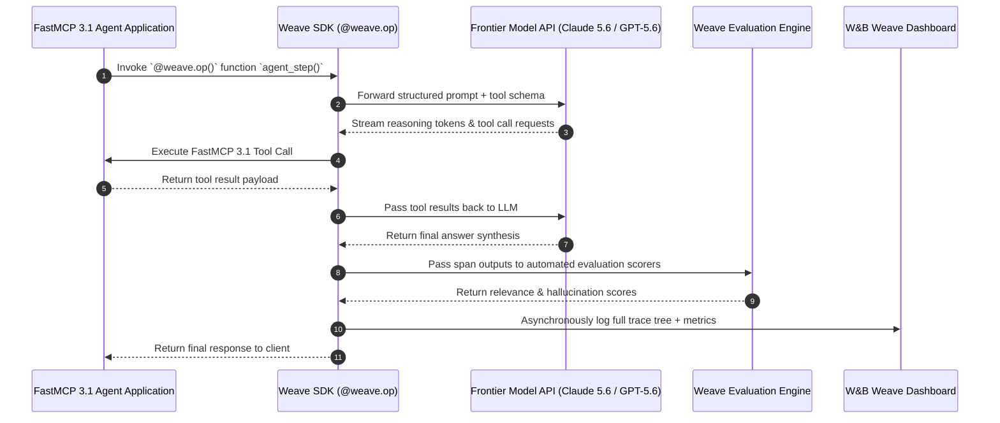
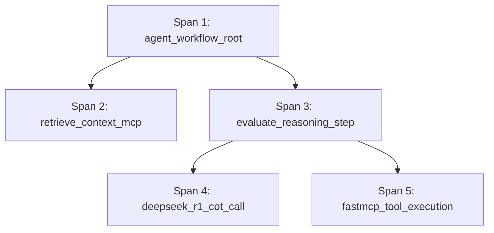

# W&B Weave

## What it is
W&B Weave is a lightweight, developer-first toolkit for building, tracing, versioning, and evaluating LLM applications, autonomous agent graphs, and multi-step tool pipelines, developed by Weights & Biases. Built for production AI observability in 2027, Weave captures execution trace trees, prompt versions, dataset evaluations, and cost metrics with zero-overhead decorators (`@weave.op()`).

Weave seamlessly integrates across agentic frameworks, frontier reasoning engines (such as **GPT-5.6**, **Claude 5.6**, **Gemini 4.0 Ultra**, and **DeepSeek R1**), and protocol standards including **FastMCP 3.1**. It automatically structures nested spans, tool parameters, token counts, and latent reasoning steps into clear hierarchical trees hosted on Weights & Biases cloud or self-hosted enterprise infrastructure.

```mermaid
graph TD
    A[Agent Application / FastMCP Client] -->|Calls @weave.op()| B[Weave Local SDK Instrumentation Engine]
    B --> C[Capture Prompt Inputs, Parameters & Tool Calls]
    C --> D[Stream Execution Spans]
    D --> E{Weave Telemetry Bus}
    E -->|Real-time Stream| F[W&B Enterprise / Cloud Dashboard]
    E -->|In-line Evaluation| G[Automated Custom Scorers & Guardrails]
    G --> H[Evaluation Scorecard & Benchmark Dataset]
    F --> I[Trace Visualizer & Root Cause Debugger]
    H --> I
```

## What problem it solves
Developing multi-agent systems and complex RAG workflows poses severe operational challenges:

1. **Opaque Multi-Step Reasoning & Silent Tool Failures**: In complex agent chains, identifying which specific tool call or sub-agent produced hallucinatory or incorrect outputs is nearly impossible without trace-level inspection. Weave records execution hierarchies down to individual function inputs and outputs.
2. **Evaluation Bottlenecks**: Developers frequently rely on ad-hoc manual prompts rather than systematically scoring performance against regression datasets. Weave provides a framework (`weave.Evaluation`) to continuously evaluate models and prompts across factual accuracy, latency, and cost dimensions.
3. **Prompt & Pipeline Version Drift**: Changes to system prompts or tool schemas can cause subtle regressions. Weave automatically versions prompt code, model parameters, and evaluation datasets, allowing instant rollbacks and side-by-side diffing across production environments.
4. **FastMCP 3.1 / MCP Tool Observability**: Modern agent architectures rely heavily on Model Context Protocol (MCP) server tools. Weave natively records MCP tool payloads, latency, and response schemas to audit enterprise tool security and reliability.

## Where it fits in the stack
**Category**: Process & Understanding / AI Observability, Tracing & Evaluation Platform.
Weave acts as the central telemetry and evaluation hub for agentic workflows, operating between user applications, orchestrators (e.g., CrewAI, LangChain, PydanticAI), and model hosting backends.



## Typical use cases
- **Agent Trace Auditing**: Visualizing the internal thinking steps, tool invocations, and memory lookups of autonomous agents powered by [DeepSeek R1](../ai_knowledge/deepseek-r1.md), Claude 5.6, or GPT-5.6.
- **LLM Application Debugging**: Pinpointing exact latency bottlenecks, token usage spikes, or exception triggers within complex RAG chains.
- **Continuous Automated Evaluations**: Running custom scoring functions (e.g., factual relevance, toxicity, format compliance, SQL correctness) against benchmark datasets on every git commit.
- **Prompt Engineering & A/B Testing**: Visualizing side-by-side output variations across different system prompt templates and temperature settings.
- **FastMCP 3.1 Enterprise Compliance**: Auditing Model Context Protocol tool execution payloads, user authorizations, and tool output fidelity.

## Architecture & Technical Deep Dive

### Trace Spans & Tree Data Model
Weave models every execution unit as a **Span**, which accumulates into a directed acyclic trace tree. A span captures:
- `name`: Function or tool call identifier.
- `inputs`: JSON-serializable dictionary of function arguments.
- `outputs`: Returned data, response objects, or thrown exceptions.
- `attributes`: Environmental metadata (e.g., git commit SHA, model ID, temperature).
- `summary`: Computed metrics including prompt tokens, completion tokens, latency, and total token costs.



### Automated Dataset Versioning & Evaluation Engine
Weave's `Evaluation` module decouples test datasets, target pipeline models, and scoring metrics. When `evaluation.evaluate(model)` is executed, Weave runs parallelized evaluation loops over the dataset, computes aggregate statistics (mean accuracy, variance, 95th percentile latency), and stores an immutable scorecard object in W&B.

## Strengths
- **Minimal Code Intrusion**: Decorate any standard Python function with `@weave.op()` to instantly capture traces without modifying core logic.
- **Hierarchical Trace Trees**: Organizes nested multi-step logs into clear, interactive visual trees.
- **Framework Agnostic**: Natively compatible with any model provider, custom Python code, or protocol stack (FastMCP 3.1, REST, gRPC).
- **Comprehensive Evaluation Suite**: Includes built-in evaluation templates alongside custom Python scorer functions.
- **Human-in-the-Loop Feedback**: Supports manual annotations, thumbs-up/down ratings, and textual corrections directly in the trace viewer UI.
- **First-Class Support for Frontier Models**: Optimized for capturing detailed reasoning traces from Claude 5.6, GPT-5.6, and DeepSeek R1.

## Limitations
- **Cloud/SaaS Preference**: Defaults to sending trace payloads to Weights & Biases SaaS cloud, requiring dedicated setup for air-gapped enterprise deployments.
- **Evolving SDK Surface**: Rapid feature development means newer versions occasionally deprecate experimental evaluation APIs.
- **Trace Payload Overhead**: High-throughput systems streaming massive audio or multimodal payloads require explicit masking or truncation parameters to prevent telemetry bloat.

## When to use it
- When building complex agentic systems requiring step-by-step reasoning transparency and tool call inspection.
- When establishing automated regression benchmarking for prompt updates or model transitions.
- If your organization already utilizes Weights & Biases for traditional machine learning and desires unified operational dashboards.
- For tracking FastMCP 3.1 tool call execution reliability and security compliance in production.

## When not to use it
- For trivial, single-prompt applications where simple loggers suffice.
- In strict, fully air-gapped environments without permission to run enterprise W&B instances.

## Getting started

### Installation
```bash
pip install weave wandb pydantic>=2.0 fastmcp
```

## CLI examples

### 1. Authenticate with Weights & Biases
```bash
# Log in to W&B using API key
wandb login sk-your-wandb-api-key-here
```

### 2. Initialize and Query Weave Project via CLI
```bash
# Initialize project workspace context
wandb init --project agent-observability-2027

# List active runs and evaluation benchmarks
wandb runs --project agent-observability-2027
```

### 3. Export Evaluation Scorecards via Weave CLI
```bash
# Export evaluation dataset results as JSONL for offline reporting
weave evaluate export --project agent-observability-2027 --output eval_report.jsonl
```

## API examples

### Basic Tracing with Decorators
```python
import weave
import openai

# Initialize Weave with project name
weave.init("agent-observability-2027")

@weave.op()
def call_reasoning_llm(prompt: str) -> str:
    client = openai.OpenAI()
    response = client.chat.completions.create(
        model="gpt-5.6",
        messages=[{"role": "user", "content": prompt}]
    )
    return response.choices[0].message.content

if __name__ == "__main__":
    # Automatically logged and visualizable in W&B dashboard
    result = call_reasoning_llm("Analyze distributed multi-region consensus in FastMCP 3.1.")
    print("Execution Output:", result)
```

### FastMCP 3.1 Instrumentation & Trace Server
This Python script demonstrates wrapping a **FastMCP 3.1** server with **Weave** tracing decorators and validating telemetry payloads using **Pydantic v2**:

```python
import weave
from pydantic import BaseModel, Field, ValidationError
from fastmcp import FastMCP

# Initialize Weave telemetry tracing context
weave.init("fastmcp-weave-tracing")

mcp = FastMCP("Weave Observability Server")

class MCPToolTelemetrySchema(BaseModel):
    tool_name: str = Field(..., pattern=r"^[a-z0-9_\-]+$")
    trace_id: str = Field(..., description="Unique Weave trace identifier")
    execution_time_ms: float = Field(..., ge=0.0)
    input_payload: dict = Field(default_factory=dict)
    output_payload: dict = Field(default_factory=dict)
    success: bool = Field(True)

@weave.op()
@mcp.tool()
def execute_database_query(sql_query: str) -> str:
    """Execute SQL query with full Weave trace observability."""
    # Simulated execution
    query_result = f"Query executed successfully: '{sql_query}'. 42 rows returned."

    # Construct telemetry verification object
    telemetry = {
        "tool_name": "execute_database_query",
        "trace_id": "trace_9988776655443322",
        "execution_time_ms": 42.5,
        "input_payload": {"sql_query": sql_query},
        "output_payload": {"result": query_result},
        "success": True
    }

    try:
        validated = MCPToolTelemetrySchema(**telemetry)
        return f"[Weave Traced] Result: {validated.output_payload['result']}"
    except ValidationError as e:
        return f"Telemetry Validation Error: {e.errors()}"

if __name__ == "__main__":
    mcp.run()
```

### Continuous Evaluation Engine with Strict Pydantic v2 Validation
This executable production example demonstrates defining a custom dataset, model class, and evaluation scorer in Weave, complete with strict **Pydantic v2** validation:

```python
import weave
from typing import List, Dict, Any, Optional
from pydantic import BaseModel, Field, field_validator

# 1. Initialize Weave project
weave.init("weave-evaluations-v2")

# 2. Define Pydantic v2 validation schema for trace evaluations
class WeaveScorerResult(BaseModel):
    scorer_name: str = Field(..., pattern=r"^[a-zA-Z0-9_\-]+$")
    score: float = Field(..., ge=0.0, le=1.0)
    passed: bool

class WeaveTraceSpan(BaseModel):
    span_id: str = Field(..., pattern=r"^span_[a-f0-9]{16}$")
    trace_id: str = Field(..., pattern=r"^trace_[a-f0-9]{16}$")
    model_id: str = Field("gpt-5.6")
    inputs: Dict[str, Any]
    outputs: Dict[str, Any]
    latency_sec: float = Field(..., ge=0.0)
    evaluation_scores: List[WeaveScorerResult] = Field(default_factory=list)

    @field_validator("latency_sec")
    @classmethod
    def check_unusual_latency(cls, v: float) -> float:
        if v > 10.0:
            print(f"[Warning] High execution latency recorded: {v}s")
        return v

# 3. Custom Evaluation Scorer Function
@weave.op()
def evaluate_factual_relevance(output: str, target: str) -> dict:
    """Custom scorer comparing generated output to ground truth target."""
    overlap = len(set(output.lower().split()) & set(target.lower().split()))
    score = min(1.0, overlap / max(1, len(target.split())))
    return {"factual_relevance": score, "passed": score >= 0.5}

if __name__ == "__main__":
    # Validate trace payload via Pydantic v2
    sample_trace_payload = {
        "span_id": "span_f8d7e6c5b4a39201",
        "trace_id": "trace_01928374abcdefab",
        "model_id": "claude-5.6-sonnet",
        "inputs": {"prompt": "Analyze log stream for FastMCP handshakes."},
        "outputs": {"response": "Handshake succeeded under protocol version 3.1."},
        "latency_sec": 1.42,
        "evaluation_scores": [
            {"scorer_name": "factual-relevance", "score": 0.98, "passed": True},
            {"scorer_name": "latency-budget", "score": 0.85, "passed": True}
        ]
    }

    try:
        span = WeaveTraceSpan(**sample_trace_payload)
        print(f"Validated Weave Trace Span {span.span_id} for Model: {span.model_id}")
        for scorer in span.evaluation_scores:
            print(f"  - Scorer: {scorer.scorer_name} | Score: {scorer.score * 100:.1f}% | Passed: {scorer.passed}")
    except ValidationError as err:
        print("Trace validation error:", err)
```

## Production Operational Playbook

### Trace Data Retention & Data Anonymization
When deploying W&B Weave in high-security enterprise environments (e.g., healthcare, finance), strict telemetry privacy controls must be applied:

1. **Input Payload Masking**: PII (Personally Identifiable Information) and sensitive bearer tokens should be scrubbed before passing into `@weave.op()` decorated calls.
2. **Sampling Rate Configuration**: For massive sub-second request volumes, configure sample rates (`sample_rate=0.1`) to capture 10% of standard requests while maintaining 100% trace capture for exception events (`status="error"`).
3. **Trace Export & Data Archival**: Export historical evaluation benchmarks into Amazon S3 / Google Cloud Storage using `weave.export()` scripts to comply with annual security audits.

## Related tools / concepts
- [Langfuse](langfuse.md) — Open-source LLM engineering and tracing platform.
- [AgentOps](agentops.md) — Dedicated observability for multi-agent framework orchestration.
- [Braintrust](braintrust.md) — Enterprise LLM evaluation and continuous integration platform.
- [Comet Opik](comet-opik.md) — Open-source evaluation and tracing solution for LLM apps.
- [OpenRouter](../ai_knowledge/openrouter.md) — Multi-provider gateway with direct Weave trace streaming.
- [Arize AI](arize-ai.md) — AI observability platform for ML and LLM models.
- [Ragas](ragas.md) — Framework for evaluating RAG pipelines.
- [DeepSeek R1](../ai_knowledge/deepseek-r1.md) — Open-weights reasoning model traced via Weave.

## Sources / references
- [W&B Weave Website](https://wandb.ai/site/weave/)
- [Weave Documentation](https://weave-docs.wandb.ai/)
- [OpenRouter Weave Integration Guide](https://openrouter.ai/docs/guides/features/broadcast/wandb-weave)
- [FastMCP 3.1 Protocol Specifications](https://modelcontextprotocol.io/fastmcp)

## Contribution Metadata
- Last reviewed: 2027-01-07
- Confidence: high
