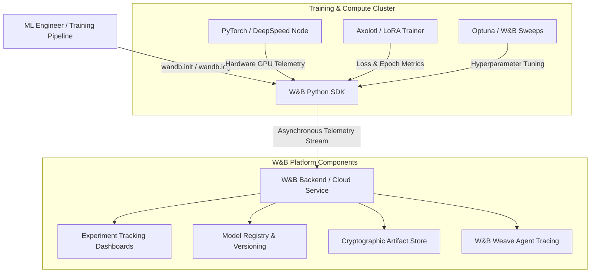

# Weights & Biases (Core)

## What it is
Weights & Biases (W&B Core) is an enterprise MLOps, experiment tracking, hyperparameter tuning, and model management platform. As of early January 2027, W&B Core serves as the foundational observability and model lifecycle backbone for machine learning teams training custom LLMs, fine-tuning open-weights models (such as Llama 4 and Gemma 4), and managing agentic evaluation datasets alongside [W&B Weave](wandb-weave.md).



## What problem it solves
Developing ML models and LLMs requires tracking thousands of hyperparameters, training curves, system metrics (GPU utilization, memory bandwidth), model checkpoints, and evaluation benchmarks:
- **Experiment Tracking**: Captures loss curves, gradients, hardware telemetry, and hyperparameters in real time with minimal overhead.
- **Model Registry & Versioning**: Manages model artifacts, lineage trees, and deployment stages (Staging, Production) across distributed teams.
- **Hyperparameter Optimization (Sweeps)**: Automates multi-GPU grid search, Bayesian optimization, and hyperband tuning across compute clusters.
- **Dataset Versioning (Artifacts)**: Tracks dataset mutations, pre-training corpora, and evaluation benchmarks with strict cryptographically verifiable hashes.
- **Agent & Model Observability**: Integrates seamlessly with FastMCP 3.1 task protocols and tracing frameworks for comprehensive ML operations.

## Where it fits in the stack
**Process Understanding / MLOps & Experiment Tracking**. W&B Core sits alongside training frameworks ([Axolotl](../frameworks/axolotl.md), [DeepSpeed](../frameworks/deepspeed.md), PyTorch, Ray) and evaluation toolkits ([W&B Weave](wandb-weave.md), [Langfuse](langfuse.md)).

## Typical use cases
- **LLM Pre-training & Fine-tuning**: Monitoring multi-node PyTorch and DeepSpeed training runs across NVIDIA H100/B200/GB200 clusters.
- **Automated Sweeps**: Finding optimal learning rates, batch sizes, and LoRA rank values using W&B Sweeps.
- **Model Lifecycle Governance**: Tracking model checkpoints from raw training artifacts to validated release packages in the W&B Model Registry.
- **Hardware Telemetry Monitoring**: Detecting GPU thermal throttling, memory bottlenecks, and distributed communication overhead during large-scale runs.

## Strengths
- **Framework Agnostic**: Integrates natively with PyTorch, TensorFlow, Hugging Face Transformers, Axolotl, Ray Train, and LightGBM.
- **Lightweight SDK**: Negligible latency overhead when logging metrics asynchronously via `wandb.log()`.
- **Collaborative Dashboards**: Customizable visual dashboards with live sharing, interactive plots, and team-wide experiment comparison.
- **Enterprise Security**: On-premise, air-gapped, and cloud-hosted enterprise deployments with RBAC, SOC2 compliance, and SAML SSO.

## Limitations
- **Cloud Storage Costs**: High-frequency artifact versioning and large checkpoint storage require managed storage lifecycle rules.
- **Distinct from Weave**: While W&B Core focuses on traditional MLOps, training metrics, and artifacts, LLM prompt tracing and evaluation are optimized in [W&B Weave](wandb-weave.md).

## When to use it
- When pre-training or fine-tuning machine learning models or open-weights LLMs.
- When running distributed hyperparameter sweeps across cloud GPU clusters.
- When requiring centralized artifact lineage and model registry tracking for enterprise AI compliance.

## When not to use it
- When you only need lightweight LLM prompt tracing, evaluation, or RAG debugging without model training or GPU tracking (use [W&B Weave](wandb-weave.md) or [Langfuse](langfuse.md) instead).
- When operating in completely offline environments without local enterprise W&B server deployments.

## Getting started
1. Install the `wandb` Python package: `pip install wandb pydantic`.
2. Authenticate with your API key: `wandb login`.
3. Initialize tracking in your script using `wandb.init()`.

## CLI examples

### Logging in via CLI
Authenticate your command line interface with W&B user or service account keys:
```bash
wandb login $WANDB_API_KEY
```

### Starting a Hyperparameter Sweep
Initialize and execute a multi-GPU hyperparameter sweep from a YAML configuration file:
```bash
wandb sweep sweep.yaml
wandb agent <SWEEP_ID>
```

### Syncing Offline Runs
Upload locally cached offline training runs to the W&B cloud dashboard once connectivity is restored:
```bash
wandb sync ./wandb/offline-run-*
```

## API examples

### Tracking a Model Fine-Tuning Run with Pydantic v2 Schema Validation
This script demonstrates initializing a W&B Core experiment run and validating training hyperparameters using Pydantic v2:

```python
import wandb
from pydantic import BaseModel, Field, field_validator
from typing import List, Dict, Any, Optional

class HyperparameterConfig(BaseModel):
    learning_rate: float = Field(..., gt=0, le=0.01, description="Base learning rate")
    batch_size: int = Field(..., ge=1, le=512)
    epochs: int = Field(default=5, ge=1, le=100)
    architecture: str = Field(..., description="Target model architecture")
    lora_rank: int = Field(default=16, ge=4, le=128)
    lora_alpha: int = Field(default=32, ge=8, le=256)

    @field_validator('architecture')
    @classmethod
    def validate_architecture(cls, v: str) -> str:
        allowed = {'Llama-4-7B', 'Llama-4-70B', 'Gemma-4-9B', 'DeepSeek-V4'}
        if v not in allowed:
            raise ValueError(f"Architecture '{v}' not supported. Must be in {allowed}")
        return v

def run_experiment(config_data: Dict[str, Any]):
    # Validate hyperparameters via Pydantic v2
    validated_config = HyperparameterConfig.model_validate(config_data)

    # Initialize W&B Core run with validated config
    run = wandb.init(
        project="llm-fine-tuning-2027",
        name=f"run-{validated_config.architecture.lower()}-lora",
        config=validated_config.model_dump()
    )

    # Simulated training loop logging metrics
    for epoch in range(1, validated_config.epochs + 1):
        simulated_loss = 2.5 / (epoch + 0.5)
        simulated_acc = 0.6 + (epoch * 0.07)

        # Log metrics to W&B dashboard
        wandb.log({
            "epoch": epoch,
            "train_loss": simulated_loss,
            "val_accuracy": simulated_acc,
            "gpu_memory_gb": 22.4,
            "gpu_utilization_pct": 96.5,
        })

    run.finish()
    print("Training run completed and metrics synced to W&B.")

if __name__ == "__main__":
    params = {
        "learning_rate": 0.0002,
        "batch_size": 32,
        "epochs": 5,
        "architecture": "Llama-4-7B",
        "lora_rank": 16,
        "lora_alpha": 32
    }
    run_experiment(params)
```

### Logging Model Artifacts to the W&B Registry
Logging cryptographically versioned model weights and LoRA adapters:

```python
import wandb

run = wandb.init(project="llm-fine-tuning-2027", job_type="model-publishing")

# Create a cryptographically versioned artifact
model_artifact = wandb.Artifact(
    name="llama4-7b-custom-adapter",
    type="model",
    description="Fine-tuned LoRA adapter weights for agentic tool use",
    metadata={"base_model": "Llama-4-7B", "framework": "Axolotl", "fastmcp_version": "3.1"}
)

# Add weight files to the artifact
model_artifact.add_file("adapter_model.bin")
model_artifact.add_file("adapter_config.json")

# Log artifact to W&B
run.log_artifact(model_artifact)
run.finish()
```

## Related tools / concepts
- [W&B Weave](wandb-weave.md)
- [Axolotl](../frameworks/axolotl.md)
- [DeepSpeed](../frameworks/deepspeed.md)
- [Comet Opik](comet-opik.md)
- [MLflow](mlflow.md)
- [Optuna](../development_ops/optuna.md)

## Sources / references
- [Weights & Biases Official Site](https://wandb.ai/)
- [W&B Core Documentation](https://docs.wandb.ai/)
- [W&B Sweeps Quickstart](https://docs.wandb.ai/guides/sweeps)

## Contribution Metadata
- Last reviewed: 2027-01-07
- Confidence: high
