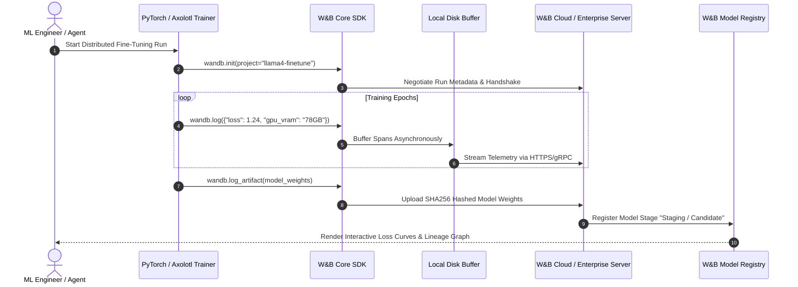

# Weights & Biases (Core)

## What it is
**Weights & Biases (W&B Core)** is an enterprise MLOps platform, experiment tracking engine, hyperparameter optimization framework, and model registry hub. Designed for high-throughput machine learning teams, ML research labs, and AI platform engineers, W&B Core serves as the foundational observability backbone for pre-training, fine-tuning, and evaluating foundation models (such as Llama 4, DeepSeek R1, and Qwen 3.5) alongside [W&B Weave](wandb-weave.md).

Built with lightweight, non-blocking asynchronous SDK hooks, W&B Core captures real-time loss trajectories, gradient norms, hardware telemetry (GPU/TPU thermal metrics, memory bandwidth, VRAM allocation), model weight artifacts, and hyperparameter search states with microsecond precision.

## What problem it solves
Developing foundation models and fine-tuning open-weights models introduces severe operational complexity and tracking fragmentation:
- **Experiment Dispersal & Memory Loss**: Tracking hyperparameter combinations, training loss curves, and evaluation checkpoints across multi-node GPU clusters often leads to lost runs and unreproducible experiments. W&B Core unifies all metrics into central, collaborative dashboards.
- **Hardware Telemetry & Cost Bottlenecks**: Distributed multi-GPU training runs (NVIDIA H100/B200/GB200) suffer from hidden memory leaks, thermal throttling, and NCCL communication bottlenecks. W&B Core streams system utilization metrics alongside training loss to expose compute waste.
- **Model Lineage & Cryptographic Versioning**: Tracking dataset mutations and model weight checkpoints across distributed teams is prone to human error. W&B Artifacts guarantees cryptographically hashed lineage trees for datasets, LoRA adapters, and full model weights.
- **Hyperparameter Tuning Complexity**: Manual grid searches across learning rates, LoRA ranks, and batch sizes waste expensive GPU compute. W&B Sweeps automates multi-GPU Bayesian optimization and Hyperband early stopping.

## Architecture & Data Flow



## Where it fits in the stack
**Category**: Process Understanding / MLOps & Experiment Tracking. Operating at the **MLOps & Evaluation Layer**, W&B Core sits alongside fine-tuning frameworks ([Axolotl](../frameworks/axolotl.md), [LLaMA Factory](../frameworks/llama-factory.md), [DeepSpeed](../frameworks/deepspeed.md), PyTorch) and agent evaluation suites ([W&B Weave](wandb-weave.md), [Comet Opik](comet-opik.md)).

## Key Features & Functional Modules
- **Real-Time Experiment Tracking**: Asynchronous logging of scalar metrics, gradients, images, audio, 3D meshes, and custom HTML widgets.
- **W&B Artifacts**: Immutable, SHA256-hashed dataset and model versioning with interactive directed acyclic graph (DAG) lineage visualization.
- **W&B Sweeps**: Scalable hyperparameter optimization supporting Bayesian search, random search, grid search, and Hyperband early-stopping rules.
- **W&B Model Registry**: Enterprise governance hub for tracking model lifecycle stages (Experimental, Staging, Production, Archived).
- **Automated Hardware Profiling**: System-level monitoring of GPU memory utilization, CUDA core load, PCIe throughput, and CPU/RAM strain.

## Typical use cases
- **LLM Pre-training & Fine-Tuning**: Monitoring multi-node PyTorch and DeepSpeed training runs across NVIDIA H100/B200 clusters.
- **Automated LoRA Hyperparameter Sweeps**: Sweeping optimal learning rates, LoRA rank (r), and alpha values using W&B Sweeps.
- **Model Lifecycle Governance**: Packaging model weights into versioned artifacts with cryptographically verified checksums for production release.
- **Multi-Agent Evaluation Benchmarking**: Tracking accuracy metrics, token latency distributions, and safety compliance across benchmark datasets.

## Strengths
- **Universal Framework Support**: Native integration with PyTorch, TensorFlow, Hugging Face Transformers, Axolotl, Ray Train, and LightGBM.
- **Zero-Overhead Asynchronous SDK**: Logging metrics via `wandb.log()` runs in background threads without blocking GPU compute loops.
- **Enterprise Security Compliance**: Available as single-tenant SaaS, AWS/GCP dedicated VPC, or air-gapped on-premise Kubernetes deployments with SAML/SSO and RBAC.
- **Collaborative Dashboards**: Shared team workspaces with live interactive plots, Markdown reports, and automated alert webhooks.

## Limitations
- **Storage Lifecycle Management**: Retaining high-frequency model checkpoints and large dataset artifacts requires managing retention rules to avoid cloud storage inflation.
- **Core vs. Weave Distinction**: While W&B Core optimizes model training and MLOps metrics, detailed prompt tracing and agentic RAG evaluations are delegated to [W&B Weave](wandb-weave.md).

## When to use it
- When pre-training foundation models or fine-tuning open-weights models (Llama 4, DeepSeek, Qwen).
- When running distributed hyperparameter sweeps across cloud GPU clusters.
- When requiring centralized artifact lineage, hardware telemetry, and model registry governance.

## When not to use it
- When requiring pure prompt tracing or lightweight RAG debugging without model training or hardware tracking (use [W&B Weave](wandb-weave.md) or [Langfuse](langfuse.md)).
- When operating in totally offline environments without a self-hosted W&B Enterprise server instance.

## Configuration & Feature Summary

| Feature / Setting | Parameter / Env Variable | Default Value | Description |
| :--- | :--- | :--- | :--- |
| API Key Authentication | `WANDB_API_KEY` | None | Secret user/service API key for W&B authentication. |
| Project Name | `WANDB_PROJECT` / `wandb.init(project=...)` | "uncategorized" | Target project workspace identifier. |
| Entity / Team | `WANDB_ENTITY` | Default User | Target team or organization workspace. |
| Offline Mode | `WANDB_MODE=offline` | "online" | Disables network sync; buffers run data locally for manual sync. |
| Base Host Endpoint | `WANDB_BASE_URL` | `https://api.wandb.ai` | Custom URL for self-hosted enterprise deployments. |
| Run Log Directory | `WANDB_DIR` | `./wandb` | Local disk directory for buffering run logs and artifacts. |

## Getting started

### Installation
Install the `wandb` SDK via pip:
```bash
pip install "wandb[pydantic,torch]"
```

### Authentication & Initial Configuration
Authenticate your shell session with your W&B API key:
```bash
wandb login $WANDB_API_KEY
```

### Basic Tracking in Python
Initialize tracking in your training script:
```python
import wandb

# Initialize run
run = wandb.init(
    project="llama4-7b-fine-tuning",
    name="run-lora-rank16-lr2e4",
    config={
        "learning_rate": 2e-4,
        "batch_size": 32,
        "epochs": 5,
        "lora_rank": 16,
        "base_model": "meta-llama/Llama-3.3-70B-Instruct"
    }
)

# Simulate metrics logging
for step in range(100):
    wandb.log({"train/loss": 2.5 / (step + 1), "train/accuracy": 0.5 + (step * 0.004)})

wandb.finish()
```

## CLI examples

### 1. CLI Login & Environment Verification
```bash
wandb login $WANDB_API_KEY
```

### 2. Launching an Automated Hyperparameter Sweep
```bash
wandb sweep sweep_config.yaml
wandb agent <SWEEP_ID>
```

### 3. Syncing Offline Runs to Cloud
```bash
wandb sync ./wandb/offline-run-*
```

### 4. Downloading Model Artifacts via CLI
```bash
wandb artifact get enterprise-org/llama4-fine-tuning/llama4-adapter-weights:v1
```

## API examples

### 1. Tracking Model Fine-Tuning with Pydantic v2 Configuration & Hardware Metrics
The following script demonstrates validating run configuration using Pydantic v2 and logging structured training telemetry to W&B Core:

```python
import wandb
import time
from pydantic import BaseModel, Field, HttpUrl
from typing import Dict, Any

class FineTuneConfig(BaseModel):
    project_name: str = Field(default="llm-fine-tuning-v4")
    model_id: str = Field(..., description="Hugging Face or local model path")
    learning_rate: float = Field(default=2e-4, ge=1e-6, le=1e-2)
    batch_size: int = Field(default=16, ge=1)
    lora_rank: int = Field(default=16, ge=4, le=128)
    use_gradient_checkpointing: bool = True

def run_fine_tuning_experiment(raw_config: Dict[str, Any]):
    # Validate configuration via Pydantic v2
    cfg = FineTuneConfig.model_validate(raw_config)

    run = wandb.init(
        project=cfg.project_name,
        name=f"run-{cfg.model_id.replace('/', '-')}-r{cfg.lora_rank}",
        config=cfg.model_dump()
    )

    log_data = {"learning_rate": cfg.learning_rate}

    # Simulate epoch iterations
    for step in range(1, 11):
        loss = 3.5 / (step + 0.5)
        vram_usage_gb = 18.2 + (step * 0.1)

        wandb.log({
            "step": step,
            "train/loss": loss,
            "system/vram_allocated_gb": vram_usage_gb,
            "train/throughput_tokens_per_sec": 1420.5
        })
        time.sleep(0.02)

    wandb.finish()

if __name__ == "__main__":
    sample_config = {
        "project_name": "enterprise-llama4-agent",
        "model_id": "meta-llama/Llama-4-7B",
        "learning_rate": 0.00015,
        "batch_size": 32,
        "lora_rank": 32
    }
    run_fine_tuning_experiment(sample_config)
```

### 2. Publishing Versioned Model Artifacts & FastMCP 3.1 Trace Registration
This pattern demonstrates uploading cryptographically versioned model weight artifacts and linking evaluation metadata:

```python
import wandb
import os
from pydantic import BaseModel, Field

class ModelArtifactMeta(BaseModel):
    artifact_name: str = Field(..., description="Name of the model artifact")
    base_model: str = Field(..., description="Base foundation model identifier")
    framework: str = Field(default="Axolotl")
    checksum_sha256: str = Field(..., description="SHA256 hash of model binary")

def publish_model_checkpoint(meta: ModelArtifactMeta, weights_path: str):
    run = wandb.init(project="model-registry-publishing", job_type="artifact-upload")

    # Create immutable W&B Artifact
    artifact = wandb.Artifact(
        name=meta.artifact_name,
        type="model",
        description="Fine-tuned LoRA adapter weights for agentic tool selection",
        metadata=meta.model_dump()
    )

    # Create dummy weight file if not exists
    if not os.path.exists(weights_path):
        with open(weights_path, "w") as f:
            f.write("DUMMY_LORA_WEIGHTS_BINARY_DATA")

    artifact.add_file(weights_path)
    run.log_artifact(artifact)
    print(f"Logged artifact {meta.artifact_name} to W&B Model Registry successfully.")
    run.finish()

if __name__ == "__main__":
    metadata = ModelArtifactMeta(
        artifact_name="llama4-tool-use-adapter",
        base_model="meta-llama/Llama-4-7B",
        framework="Axolotl/PyTorch",
        checksum_sha256="e3b0c44298fc1c149afbf4c8996fb92427ae41e4649b934ca495991b7852b855"
    )
    publish_model_checkpoint(metadata, "adapter_model.bin")
```

## Related tools / concepts
- [W&B Weave](wandb-weave.md) — Native prompt tracing and RAG evaluation platform.
- [Axolotl](../frameworks/axolotl.md) — Open-source LLM fine-tuning framework.
- [LLaMA Factory](../frameworks/llama-factory.md) — Unified multi-model fine-tuning suite.
- [DeepSpeed](../frameworks/deepspeed.md) — High-performance distributed training library.
- [Comet Opik](comet-opik.md) — Open-source LLM evaluation platform.
- [Optuna](../development_ops/optuna.md) — Autonomous hyperparameter optimization framework.

## Sources / references
- [Weights & Biases Official Site](https://wandb.ai/)
- [W&B Core Documentation](https://docs.wandb.ai/)
- [W&B Sweeps Developer Guide](https://docs.wandb.ai/guides/sweeps)
- [W&B Artifacts Versioning Reference](https://docs.wandb.ai/guides/artifacts)

---
## Contribution Metadata
- Last reviewed: 2027-01-07
- Confidence: high
