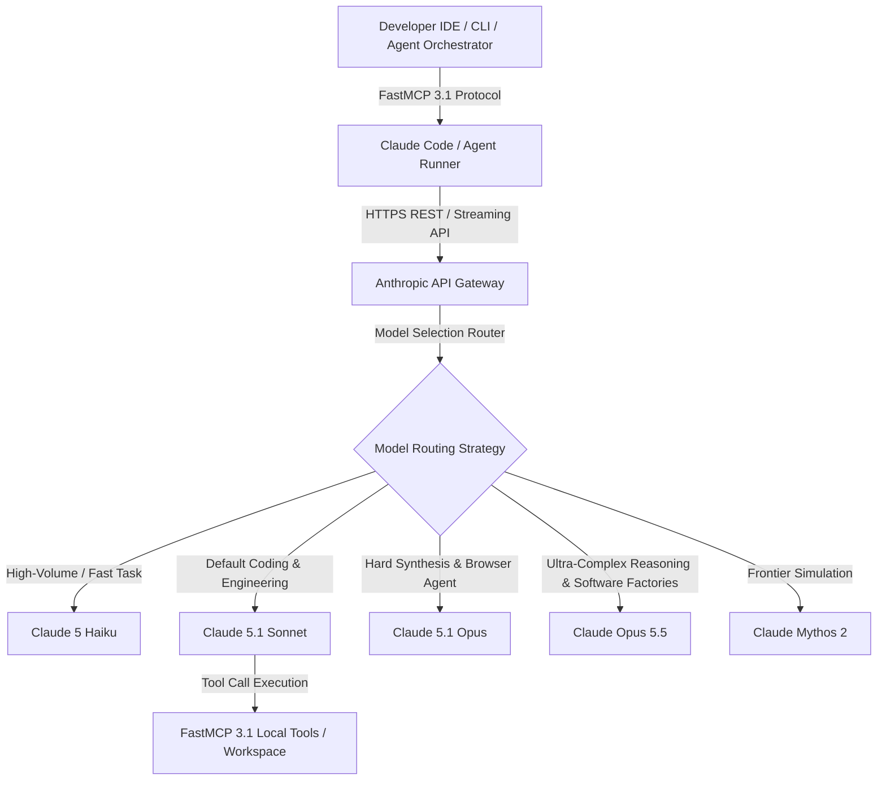

# Anthropic Claude

## What it is
Anthropic is an AI safety and research company that produces the Claude family of foundation models. As of early 2027, it operates as a premier proprietary intelligence provider, offering frontier models including **Claude Opus 5.5**, **Claude 5.1 Sonnet**, **Claude 5.1 Opus**, **Claude 5 Haiku**, and **Claude Mythos 2**. These models excel in autonomous software engineering, multi-step tool execution, complex reasoning, long-context window processing, and AI safety via Constitutional AI principles.

In early 2027, Anthropic's native integration with **FastMCP 3.1** (Model Context Protocol) positions Claude as the standard reasoning engine for developer tooling, local agent execution, and autonomous software factory orchestrators.

## What problem it solves
It addresses the core challenges of reliability, safety, and complex reasoning in autonomous AI workflows. While standard LLMs often suffer from context degradation, fragile tool calling, or unsafe executions during autonomous loops, Claude provides state-of-the-art instruction adherence, low hallucination rates, and structured tool calling capability.

Furthermore, Claude native protocols (FastMCP 3.1) solve the integration bottleneck between frontier LLMs and developer environments, enabling agents to execute bash commands, query databases, edit codebases, and interact with web browsers safely.

## Where it fits in the stack
**Category**: AI & Knowledge / AI Providers & Frontier LLMs. It operates at the **Model & Foundation Layer**, acting as the primary intelligence backend for CLI coding agents ([Claude Code](../development_ops/claude-code.md), [Aider](../development_ops/aider.md)), IDE extensions ([Zed](../development_ops/zed.md), [Cursor](../development_ops/cursor.md)), and autonomous orchestrators.



## Typical use cases
- **Pair Programming & Autonomous Engineering**: Claude 3.5 Sonnet and 5.1 Sonnet/Opus serve as the primary reasoning engine for tools like [Aider](../development_ops/aider.md) and [Claude Code](../development_ops/claude-code.md).
- **Complex Context Synthesis**: Processing entire software repositories or lengthy technical specifications using its 2.5M+ token context window.
- **Autonomous Agent Tool Use**: Leveraging FastMCP 3.1 to inspect filesystems, execute shell commands, query vector storage, and interact with external APIs.
- **Computer Use & Browser Automation**: Utilizing Claude 5.1 Opus for direct desktop interactions, UI automation, and web research.
- **Multi-Model Escalation Pipelines**: Building cost-optimized agent pipelines that route routine tasks to Haiku 5 and escalate difficult bugs to Opus 5.1.

### Model routing (Early 2027)
| Model | Primary Use Case | Default? |
| :--- | :--- | :--- |
| **Haiku 5** | Fast classification, extraction, rewriting, and high-volume, cost-sensitive tasks | No |
| **Sonnet 5.1** | Default coding, planning, tool use, and daily production engineering | Yes |
| **Opus 5.1** | Premium escalation for hard synthesis, autonomous browser execution, and complex logic | No |
| **Opus 5.5** | Highest-end frontier reasoning, multi-repo architectural synthesis, autonomous software factory orchestration | No |
| **Mythos 2** | Frontier-scale simulations and high-reliability software factory architectures | No |

## Strengths
- **Unrivaled Coding Capability**: Recognized industry-wide as the benchmark leader for daily software engineering, refactoring, and test-driven generation.
- **Constitutional AI Safety**: Built with advanced alignment principles, minimizing toxic outputs and resistance to prompt injection attacks.
- **Massive Context Window**: Supports up to 2.5M tokens with near-perfect retrieval recall across large context windows.
- **Native FastMCP 3.1 Integration**: First-class support for tool definitions, resource templates, and prompt templates under the Model Context Protocol.
- **Low Hallucination Rate**: High factual accuracy, precise JSON schema generation, and reliable self-correction.

## Limitations
- **Proprietary Cloud Service**: Requires external API connectivity and active internet access; no self-hosted/offline option.
- **API Cost Scaling**: High-tier models (Opus 5.1, Mythos 2) can incur substantial costs during large-scale automated batch runs.
- **Rate Limit Constraints**: Concurrently launching dozens of agent loops can trigger API rate limits without exponential backoff tuning.

## When to use it
- For software development tasks where Sonnet 5.1 or Opus 5.1 is the right default.
- When safety, alignment, and precise tool calling are critical priorities for your application.
- For analyzing very long documents or entire codebases in a single context.
- When implementing FastMCP 3.1 agent tools for local or cloud environments.

## When not to use it
- When a local/offline solution is required for privacy or air-gapped security (consider [Llama 4 Maverick](../ai_knowledge/local_llms.md) or [Gemma 4](../ai_knowledge/gemma.md)).
- When real-time, low-latency audio-to-audio streaming is required natively without intermediate speech pipelines.

## Getting started

### Installation
Install the official Python SDK and MCP dependencies:
```bash
pip install anthropic pydantic mcp
```

### Initial Configuration
Set your API key as an environment variable:
```bash
export ANTHROPIC_API_KEY='your-api-key-here'
```

## CLI examples

### Using Claude Code
Claude plugins and CLI tools interact directly with the API:
```bash
claude "Analyze the current directory and suggest refactorings"
```

### Listing Models via SDK
Check available models via Python CLI snippet:
```python
import anthropic
print(anthropic.Anthropic().models.list())
```

## API examples

### Python SDK with FastMCP 3.1 Tool Server & Pydantic v2 Output
The following script demonstrates calling Claude 5.1 with structured outputs validated via Pydantic v2 and defining a FastMCP 3.1 tool for agent integration:

```python
import os
import anthropic
from pydantic import BaseModel, Field
from typing import List, Optional
from mcp.server.fastmcp import FastMCP

# Initialize FastMCP 3.1 Server for Claude Integrations
mcp = FastMCP("Claude Engineering Gateway")

class CodeReviewIssue(BaseModel):
    file_path: str = Field(..., description="Target file path")
    severity: str = Field(..., description="Severity level: low, medium, high, critical")
    description: str = Field(..., description="Description of detected issue")
    suggested_fix: str = Field(..., description="Recommended code modification")

class CodeReviewReport(BaseModel):
    repository_name: str
    overall_score: float = Field(..., ge=0.0, le=100.0)
    detected_issues: List[CodeReviewIssue]

@mcp.tool()
def review_codebase_snippet(snippet: str) -> str:
    """FastMCP 3.1 tool invoking Claude 5.1 for code analysis."""
    client = anthropic.Anthropic(api_key=os.getenv("ANTHROPIC_API_KEY", "mock-key"))

    # In production, invokes client.messages.create with model="claude-5-1-sonnet-latest"
    mock_llm_response = {
        "repository_name": "agent-orchestrator",
        "overall_score": 92.5,
        "detected_issues": [
            {
                "file_path": "src/agent.py",
                "severity": "medium",
                "description": "Unbounded concurrency in tool execution loop",
                "suggested_fix": "Add asyncio.Semaphore to limit parallel tool invocations"
            }
        ]
    }
    validated = CodeReviewReport.model_validate(mock_llm_response)
    return validated.model_dump_json(indent=2)

if __name__ == "__main__":
    report_json = review_codebase_snippet("def run(): pass")
    print("Claude Code Review Result:")
    print(report_json)
```

## Related tools / concepts
- [OpenAI](../ai_knowledge/openai.md) — Primary competitor for frontier models.
- [OpenRouter](../ai_knowledge/openrouter.md) — Unified API access to Claude and other LLM providers.
- [Aider](../development_ops/aider.md) — Popular CLI tool optimized for Claude.
- [MCP](../automation_orchestration/mcp.md) — Standard protocol (FastMCP 3.1) for extending Claude's capabilities.
- [Claude Code](../development_ops/claude-code.md) — Anthropic's agentic coding CLI.
- [Model Routing Guide](../../knowledge_base/model_routing_guide.md) — Strategy for model selection and cost management.
- [Plandex](../development_ops/plandex.md) — Complex engineering tool supporting large context Claude models.
- [Zed](../development_ops/zed.md) — Editor with native Claude integration.

## Sources / references
- [Official Anthropic Website](https://www.anthropic.com/)
- [Anthropic News and Release Logs](https://www.anthropic.com/news)
- [Anthropic Developer Documentation](https://docs.anthropic.com/)
- [Claude 5.1 Announcement](https://www.anthropic.com/news/claude-5-1)

---
## Contribution Metadata
- Last reviewed: 2027-01-07
- Confidence: high
