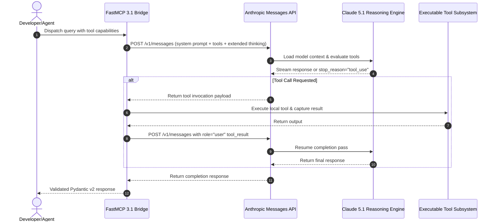

# Anthropic Claude

## What it is
Anthropic is an AI safety and research company that produces the Claude family of LLMs. As of early January 2027, it is a proprietary service offering high-performance models known for strong reasoning, coding excellence, agentic workflows, and alignment. Pricing is usage-based with a free testing tier available via the Anthropic Console and developer API.



## What problem it solves
It offers a high-performance alternative to OpenAI with a focus on "Constitutional AI" (safety) and exceptional performance in coding, long-form document analysis, multi-step tool execution, and complex reasoning tasks. It provides a reliable engine for autonomous agents via native [Model Context Protocol (FastMCP 3.1)](../automation_orchestration/mcp.md) support.

## Where it fits in the stack
**Category**: Providers / LLM & Reasoning Engine. It serves as the primary intelligence layer for coding agents, autonomous task orchestrators, and complex document synthesis workflows across the homelab and enterprise stacks.

## Typical use cases
- **Pair Programming & Autonomous Engineering**: Claude 3.5 Sonnet, 5.1 Sonnet/Opus are the preferred models for tools like [Aider](../development_ops/aider.md) and [Claude Code](../development_ops/claude-code.md).
- **Complex Analysis**: Summarizing long technical documentation or codebases using its 2.5M+ token context window.
- **Strict Adherence**: Workflows requiring high precision in following complex formatting, JSON schemas, or reasoning rules.
- **Autonomous Engineering**: Leveraging FastMCP 3.1 to enable Claude to interact with local and remote tools seamlessly.
- **Computer Use & Browser Automation**: Utilizing Claude 5.1 Opus for direct interaction with operating systems and web browsers.

### Model routing (Early 2027)
| Model | Primary Use Case | Default? |
| :--- | :--- | :--- |
| **Haiku 5** | Fast classification, extraction, rewriting, and high-volume, cost-sensitive tasks | No |
| **Sonnet 5.1** | Default coding, planning, tool use, and daily production engineering | Yes |
| **Opus 5.1** | Premium escalation for hard synthesis, autonomous browser execution, and complex logic | No |
| **Mythos 2** | Frontier-scale simulations and high-reliability software factory architectures | No |

## Strengths
- **Coding Excellence**: Widely regarded as one of the strongest daily-driver model families for software engineering and automated refactoring.
- **Safety Focus**: Built with Constitutional AI principles for better alignment and reduced harmful outputs.
- **Large Context**: Ability to handle up to 2.5M tokens in [Plandex](../development_ops/plandex.md) and long-context integrations.
- **Low Hallucination**: Exhibits high factual accuracy, self-correction, and honesty in complex reasoning.
- **Native FastMCP 3.1 Support**: Seamless integration with the Model Context Protocol (FastMCP 3.1) for extensible tool use.

## Limitations
- **Cloud Dependency**: Requires external API access; no official local/offline version.
- **Rate Limits**: Tier limits can be restrictive during peak enterprise usage or large parallel jobs.
- **Cost**: High-end models like Opus 5.1 are significantly more expensive than smaller models.

## When to use it
- For software development tasks where Sonnet 5.1 or Opus 5.1 is the right default.
- When safety, alignment, and precise tool calling are critical priorities for your application.
- For analyzing very long documents or entire codebases in a single context.
- When implementing a multi-tier routing strategy using the [Model Routing Guide](../../knowledge_base/model_routing_guide.md).

## When not to use it
- When a local/offline solution is required for privacy or air-gapped security (consider [Llama 4 Maverick](../ai_knowledge/local_llms.md)).
- If you need native DALL-E 3 style image generation in the same API call.

## Getting started

### Installation
Install the official Python SDK:
```bash
pip install anthropic pydantic fastmcp
```

### Initial Configuration
Set your API key as an environment variable:
```bash
export ANTHROPIC_API_KEY='your-api-key-here'
```

## CLI examples

### Using Claude Code
Claude plugins and CLI tools interact directly with the API:
```bash
claude "Analyze the current directory and suggest refactorings"
```

### Listing Models via SDK
Check available models via Python CLI snippet:
```python
import anthropic
print(anthropic.Anthropic().models.list())
```

## API examples

### Basic Message Creation (Python with Pydantic v2)
Using Python and Pydantic v2 to validate Claude's completion metadata programmatically under early 2027 standards:

```python
import anthropic
from pydantic import BaseModel, Field
from typing import List, Optional

class ClaudeUsageMetrics(BaseModel):
    input_tokens: int = Field(..., ge=0)
    output_tokens: int = Field(..., ge=0)
    cache_creation_input_tokens: Optional[int] = Field(0)
    cache_read_input_tokens: Optional[int] = Field(0)

class ClaudeCompletion(BaseModel):
    id: str
    model_used: str
    response_text: str = Field(..., min_length=1)
    usage: ClaudeUsageMetrics
    stop_reason: Optional[str] = None

client = anthropic.Anthropic()

message = client.messages.create(
    model="claude-5-1-sonnet-20261031",
    max_tokens=1024,
    messages=[
        {"role": "user", "content": "Explain the advantages of FastMCP 3.1 for autonomous agents."}
    ]
)

response_data = ClaudeCompletion(
    id=message.id,
    model_used=message.model,
    response_text=message.content[0].text,
    usage=ClaudeUsageMetrics(
        input_tokens=message.usage.input_tokens,
        output_tokens=message.usage.output_tokens,
        cache_creation_input_tokens=getattr(message.usage, "cache_creation_input_tokens", 0),
        cache_read_input_tokens=getattr(message.usage, "cache_read_input_tokens", 0)
    ),
    stop_reason=message.stop_reason
)
print(response_data.model_dump_json(indent=2))
```

### Streaming Responses
```python
with client.messages.stream(
    model="claude-5-1-sonnet-latest",
    max_tokens=1024,
    messages=[{"role": "user", "content": "Write a detailed architectural overview of multi-agent routing."}]
) as stream:
    for text in stream.text_stream:
        print(text, end="", flush=True)
```

### FastMCP 3.1 Claude Bridge Tool Pattern
This FastMCP 3.1 server exposes an Anthropic Claude message completion tool for automated multi-agent orchestrators:

```python
from fastmcp import FastMCP
import anthropic
import os
from typing import Dict, Any, Optional

mcp = FastMCP("AnthropicClaudeBridge")

def get_anthropic_client() -> anthropic.Anthropic:
    return anthropic.Anthropic(api_key=os.getenv("ANTHROPIC_API_KEY"))

@mcp.tool()
def execute_claude_reasoning(
    prompt: str,
    model: str = "claude-5-1-sonnet-20261031",
    system_prompt: Optional[str] = None,
    max_tokens: int = 2048,
    temperature: float = 0.2
) -> Dict[str, Any]:
    """Execute a reasoning pass via Anthropic Claude API.

    Args:
        prompt: User message prompt
        model: Claude model name (e.g. claude-5-1-sonnet-20261031, claude-5-1-opus)
        system_prompt: Optional system instruction
        max_tokens: Maximum completion output tokens
        temperature: Sampling temperature
    """
    client = get_anthropic_client()
    kwargs = {
        "model": model,
        "max_tokens": max_tokens,
        "temperature": temperature,
        "messages": [{"role": "user", "content": prompt}]
    }
    if system_prompt:
        kwargs["system"] = system_prompt

    response = client.messages.create(**kwargs)

    text_content = ""
    for block in response.content:
        if getattr(block, "type", "") == "text":
            text_content += block.text

    return {
        "message_id": response.id,
        "model": response.model,
        "text": text_content,
        "stop_reason": response.stop_reason,
        "input_tokens": response.usage.input_tokens,
        "output_tokens": response.usage.output_tokens
    }

if __name__ == "__main__":
    mcp.run()
```

## Related tools / concepts
- [OpenAI](../ai_knowledge/openai.md) — Primary competitor for frontier models.
- [OpenRouter](../ai_knowledge/openrouter.md) — Unified API access to Claude and other LLM providers.
- [Aider](../development_ops/aider.md) — Popular CLI tool optimized for Claude.
- [MCP](../automation_orchestration/mcp.md) — Standard protocol (FastMCP 3.1) for extending Claude's capabilities.
- [Claude Code](../development_ops/claude-code.md) — Anthropic's agentic coding CLI.
- [Model Routing Guide](../../knowledge_base/model_routing_guide.md) — Strategy for model selection and cost management.
- [Agentic Workflows](../../knowledge_base/patterns/agentic-workflows.md) — Patterns for autonomous execution.
- [Plandex](../development_ops/plandex.md) — Complex engineering tool supporting large context Claude models.
- [Zed](../development_ops/zed.md) — Editor with native Claude integration.

## Sources / references
- [Official Anthropic Website](https://www.anthropic.com/)
- [Anthropic News and Release Logs](https://www.anthropic.com/news)
- [Anthropic Developer Documentation](https://docs.anthropic.com/)
- [Claude 5.1 Announcement](https://www.anthropic.com/news/claude-5-1)

---
## Contribution Metadata
- Last reviewed: 2027-01-07
- Confidence: high
