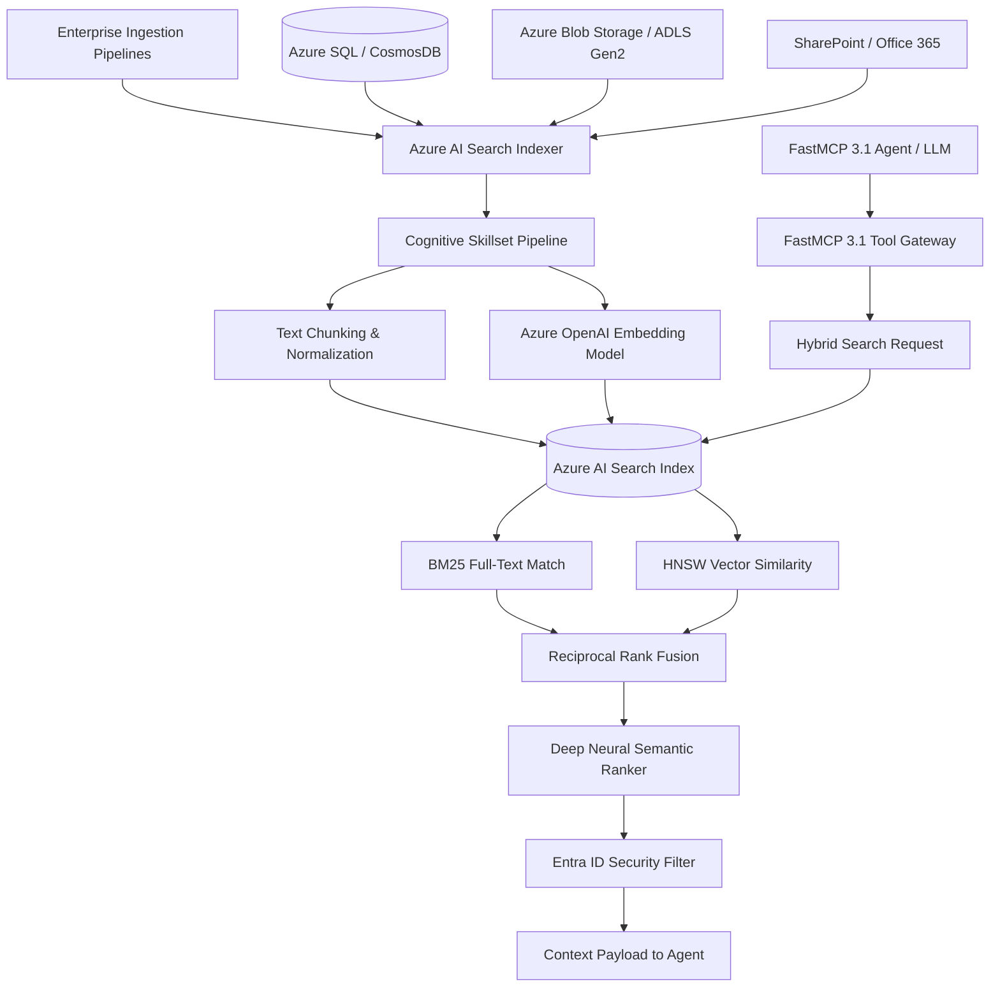

# Azure AI Search

## What it is
Azure AI Search (formerly Azure Cognitive Search) is Microsoft's enterprise-grade cloud retrieval and vector indexing platform designed for Retrieval-Augmented Generation (RAG), cognitive search, and multi-agent knowledge routing in modern AI architectures. Operating under early 2027 standards, Azure AI Search acts as a high-density vector store, full-text inverted index engine, and semantic re-ranking gateway. It bridges structured database assets, blob stores, and enterprise file systems directly into agentic reasoning frameworks powering frontier LLMs such as **Claude 5.6**, **GPT-5.6**, **Gemini 4.0 Ultra**, **Llama 4 Maverick**, **DeepSeek-V4**, and **Qwen 3.6 VL**.

Through native integration with the **FastMCP 3.1 Task Protocol**, Azure AI Search serves as an agentic tool endpoint that allows distributed AI agents to discover, search, extract, and re-rank high-dimensional document chunks while enforcing enterprise identity, Role-Based Access Control (RBAC), and Microsoft Entra ID document-level access boundaries.



## What problem it solves
Managing enterprise retrieval at scale involves balancing sub-second query latency, complex multi-modal data ingestion, hybrid precision (keyword matching + semantic concept vector search), and strict organizational access control. Standard standalone vector databases often lack robust full-text search capabilities (such as fuzziness, proximity matching, stemming, and regex filters), while traditional search engines struggle with dense embeddings and high-dimensional semantic clustering.

Azure AI Search eliminates these operational friction points through:
- **Hybrid Keyword & Vector Synergy**: Merging BM25 full-text keyword retrieval with dense HNSW (Hierarchical Navigable Small World) vector indexing, combined using Reciprocal Rank Fusion (RRF).
- **Deep Neural Semantic Re-ranking**: Utilizing cross-encoder neural models trained on Microsoft Bing search data to re-rank candidate search results based on true semantic intent, boosting retrieval precision by up to 40% in RAG applications.
- **Push and Pull Data Ingestion**: Providing native indexers that automatically crawl, extract, chunk, embed, and index content directly from Azure SQL, Cosmos DB, Azure Blob Storage, Data Lake Storage Gen2, and SharePoint without requiring external ETL glue code.
- **Enterprise Identity & Document-Level Security**: Applying Microsoft Entra ID (formerly Azure AD) security trimming filters dynamically during query execution to guarantee users and AI agents only receive documents they are explicitly authorized to view.

## Where it fits in the stack
**Category**: [Providers & Vector Databases](index.md) / Enterprise Retrieval Engine.

In enterprise knowledge management architectures, Azure AI Search functions as the central knowledge retrieve-and-rank layer. It sits between storage repositories (Azure Blob Storage, SharePoint, SQL databases) and agent orchestration frameworks (such as [Vercel AI SDK](../development_ops/vercel-ai-sdk.md), [Haystack](../frameworks/haystack.md), [Pydantic AI](../frameworks/pydantic-ai.md), or [Claude Code](../development_ops/claude-code.md)).

```
+-----------------------------------------------------------------------+
|                         Agent Orchestration                           |
|      (Claude 5.6 / GPT-5.6 / FastMCP 3.1 Task Protocol Clients)       |
+-----------------------------------------------------------------------+
                                    |
                                    v (FastMCP 3.1 Hybrid Search Tool)
+-----------------------------------------------------------------------+
|                           Azure AI Search                             |
|  +-----------------------+  +-------------------+  +---------------+  |
|  |  HNSW Vector Engine   |  |  BM25 Text Engine |  | Semantic Rank |  |
|  +-----------------------+  +-------------------+  +---------------+  |
|  +-----------------------------------------------------------------+  |
|  |       Entra ID Security Trimming & Document-Level RBAC          |  |
|  +-----------------------------------------------------------------+  |
+-----------------------------------------------------------------------+
                                    ^
                                    | (Pull Indexing & Cognitive Skillsets)
+-----------------------------------------------------------------------+
|                    Enterprise Data Infrastructure                     |
|      (Azure Blob, Data Lake Gen2, SharePoint, Azure SQL, Cosmos)      |
+-----------------------------------------------------------------------+
```

## Typical use cases
- **Multi-Tenant Enterprise Knowledge RAG**: Indexing millions of technical specifications, contracts, and internal policies across corporate units while ensuring strict tenant isolation and security trimming.
- **Agentic Document & Code Search**: Supplying high-precision context chunks to autonomous developer agents ([Aider](../development_ops/aider.md), [Windsurf](../development_ops/windsurf.md), [OpenCode](../development_ops/opencode.md)) searching across legacy codebase repositories and documentation hubs.
- **Multimodal Visual & Text Retrieval**: Searching across combined text embeddings, optical character recognition (OCR) image chunks, and multi-language document sets in automated workflow pipelines.
- **Automated Support Ticket Resolution**: Empowering customer support agents to instantly retrieve precise policy clauses and past ticket resolutions using hybrid vector-keyword matching.

## Strengths
- **State-of-the-Art Hybrid Search**: Combines full-text BM25, dense vector HNSW, and deep cross-encoder semantic re-ranking in a single managed service call.
- **Native Managed Ingestion Pipelines**: Automated document extraction, OCR, text chunking, and Azure OpenAI vector embedding via built-in Cognitive Skillsets.
- **FastMCP 3.1 Protocol Ready**: Directly exposes search endpoints, index management, and chunk retrieval tools to FastMCP 3.1 multi-agent workflows.
- **Enterprise Infrastructure & Compliance**: Out-of-the-box compliance with SOC 2, HIPAA, FedRAMP, and ISO certifications, backed by private network endpoints and customer-managed keys (CMK).
- **Scalable Multilingual Processing**: Native support for over 50 natural language tokenizers, custom stemmers, and language-specific semantic rankers.

## Limitations
- **Cost Overhead at Scale**: Dedicated search units (S1/S2/S3 tiers) and continuous Semantic Ranker usage introduce notable monthly operational expenses.
- **Azure Ecosystem Lock-in**: Deepest capabilities (such as seamless managed indexers and cognitive skillsets) require hosting primary data assets within Azure cloud regions.
- **Index Re-creation Latency**: Substantial changes to field schema definitions or vector dimension configurations frequently require rebuilding search indexes from scratch.

## When to use it
- When building enterprise production RAG systems that demand the highest retrieval accuracy by combining vector similarity with keyword precision and semantic re-ranking.
- When managing complex multi-tenant environments where security filters and Entra ID RBAC must be applied at the search query layer.
- When data sources reside primarily within Azure Blob Storage, Data Lake Storage, Azure SQL, or SharePoint.

## When not to use it
- For simple, single-user or local-first edge deployments where open-source vector engines like [Chroma](../infrastructure/chroma.md) or [Qdrant](../infrastructure/weaviate.md) are sufficient.
- When working on lightweight, low-budget prototypes where dedicated cloud search unit costs are prohibitive.
- If your workload requires pure in-memory vector storage without complex text tokenization or metadata filtering.

## Getting started

### Prerequisites and Installation
To manage Azure AI Search and build FastMCP 3.1 RAG integrations, install the Azure SDK, Azure Identity, and FastMCP tools:

```bash
pip install azure-search-documents azure-identity fastmcp pydantic httpx
```

### Environment Configuration
Configure your service authentication environment variables using Entra ID or Admin API keys:

```bash
export AZURE_SEARCH_SERVICE_ENDPOINT="https://your-search-service.search.windows.net"
export AZURE_SEARCH_INDEX_NAME="enterprise-knowledge-index"
export AZURE_CLIENT_ID="your-entra-client-id"
export AZURE_CLIENT_SECRET="your-entra-client-secret"
export AZURE_TENANT_ID="your-entra-tenant-id"
```

### Basic Connection and Index Inspection
Verify connectivity to your search service instance using Python and Azure Identity:

```python
import os
from azure.identity import DefaultAzureCredential
from azure.search.documents.indexes import SearchIndexClient

endpoint = os.getenv("AZURE_SEARCH_SERVICE_ENDPOINT", "https://demo-search.search.windows.net")
credential = DefaultAzureCredential()

client = SearchIndexClient(endpoint=endpoint, credential=credential)

print("Retrieving active Azure AI Search indexes...")
for index in client.list_indexes():
    print(f"Index Name: {index.name} | Fields Count: {len(index.fields)}")
```

## CLI examples

Below are essential Azure CLI and REST curl commands for inspecting, provisioning, and querying Azure AI Search resources.

```bash
# 1. Query search service operational status and resource usage
az search service show \
  --name my-enterprise-search \
  --resource-group rg-ai-infrastructure

# 2. List all search indexes in a service via Azure CLI REST invocation
az rest --method GET \
  --url "https://my-enterprise-search.search.windows.net/indexes?api-version=2024-07-01" \
  --resource "https://search.azure.com"

# 3. Trigger a manual run of an Azure AI Search Data Indexer
az rest --method POST \
  --url "https://my-enterprise-search.search.windows.net/indexers/blob-pdf-indexer/run?api-version=2024-07-01" \
  --resource "https://search.azure.com"

# 4. Perform a hybrid search query via cURL using an API Key
curl -X POST "https://my-enterprise-search.search.windows.net/indexes/enterprise-knowledge-index/docs/search?api-version=2024-07-01" \
  -H "Content-Type: application/json" \
  -H "api-key: $AZURE_SEARCH_ADMIN_KEY" \
  -d '{
    "search": "agentic workflow security compliance",
    "select": "id, title, content_chunk, score",
    "top": 3,
    "queryType": "semantic",
    "semanticConfiguration": "default-semantic-config"
  }'
```

## API examples

### FastMCP 3.1 Server Integration
The following production-ready Python example implements a **FastMCP 3.1** server exposing Azure AI Search as a agentic tool endpoint (`search_knowledge_base`) complete with hybrid vector query execution and error handling.

```python
import os
from typing import List, Optional
from pydantic import BaseModel, Field
from fastmcp import FastMCP
from azure.identity import DefaultAzureCredential
from azure.search.documents import SearchClient
from azure.search.documents.models import VectorizedQuery

# Initialize FastMCP Server
mcp = FastMCP("Azure AI Search Knowledge Gateway")

# Configuration settings
SEARCH_ENDPOINT = os.getenv("AZURE_SEARCH_SERVICE_ENDPOINT", "https://demo-search.search.windows.net")
INDEX_NAME = os.getenv("AZURE_SEARCH_INDEX_NAME", "enterprise-knowledge")

class SearchResultChunk(BaseModel):
    chunk_id: str = Field(..., description="Unique identifier for the document chunk")
    document_title: str = Field(..., description="Title or source file name of the document")
    content: str = Field(..., description="Extracted text chunk content")
    rerank_score: float = Field(..., description="Re-ranking confidence score")

class SearchResponse(BaseModel):
    query: str
    total_retrieved: int
    results: List[SearchResultChunk]

@mcp.tool()
def search_knowledge_base(
    query_text: str,
    vector_embedding: Optional[List[float]] = None,
    top_k: int = 5,
    enable_semantic_ranker: bool = True
) -> str:
    """
    Executes a hybrid search query against Azure AI Search, combining keyword,
    vector similarity, and neural semantic re-ranking for FastMCP agents.
    """
    try:
        credential = DefaultAzureCredential()
        search_client = SearchClient(
            endpoint=SEARCH_ENDPOINT,
            index_name=INDEX_NAME,
            credential=credential
        )

        vector_queries = []
        if vector_embedding and len(vector_embedding) > 0:
            vector_queries.append(
                VectorizedQuery(
                    vector=vector_embedding,
                    k_nearest_neighbors=top_k,
                    fields="vector_content"
                )
            )

        kwargs = {
            "search_text": query_text,
            "vector_queries": vector_queries if vector_queries else None,
            "top": top_k,
            "select": ["id", "title", "content_chunk", "search_score"]
        }

        if enable_semantic_ranker:
            kwargs["query_type"] = "semantic"
            kwargs["semantic_configuration_name"] = "default-semantic-config"

        results_cursor = search_client.search(**kwargs)

        retrieved_chunks = []
        for doc in results_cursor:
            retrieved_chunks.append(
                SearchResultChunk(
                    chunk_id=str(doc.get("id", "unknown")),
                    document_title=str(doc.get("title", "Untitled")),
                    content=str(doc.get("content_chunk", "")),
                    rerank_score=float(doc.get("@search.reranker_score", doc.get("search_score", 0.0)))
                )
            )

        response = SearchResponse(
            query=query_text,
            total_retrieved=len(retrieved_chunks),
            results=retrieved_chunks
        )

        return response.model_dump_json(indent=2)

    except Exception as err:
        return f"Error executing Azure AI Search hybrid query: {str(err)}"

if __name__ == "__main__":
    mcp.run()
```

### Pydantic v2 Schema Validation for Query Requests
Below is a Pydantic v2 schema specification for validating query parameters, vector dimensions, and security trimming rules before dispatching calls to Azure AI Search.

```python
from pydantic import BaseModel, Field, field_validator, SecretStr
from typing import List, Optional, Dict, Any

class SecurityFilterConfig(BaseModel):
    user_principal_name: str = Field(..., description="Entra ID User Principal Name")
    group_ids: List[str] = Field(default_factory=list, description="Security groups for document filtering")
    tenant_id: str = Field(..., description="Enterprise Tenant Identifier")

class HybridSearchRequest(BaseModel):
    query_string: str = Field(..., min_length=2, max_length=1000, description="Text prompt or search keywords")
    vector_dims: Optional[List[float]] = Field(None, description="Dense vector embedding values")
    top_results: int = Field(default=5, ge=1, le=50, description="Number of document chunks to return")
    use_semantic_reranker: bool = Field(default=True, description="Enable neural cross-encoder re-ranking")
    security_context: SecurityFilterConfig = Field(..., description="User identity for document RBAC trimming")

    @field_validator("vector_dims")
    @classmethod
    def validate_vector_dimensionality(cls, v: Optional[List[float]]) -> Optional[List[float]]:
        if v is not None and len(v) != 1536 and len(v) != 3072:
            raise ValueError(f"Vector dimensions must match standard embedding sizes (1536 or 3072). Got {len(v)}.")
        return v

    def build_odata_security_filter(self) -> str:
        """Constructs OData filter string for Entra ID document-level access control."""
        groups_condition = " or ".join([f"allowed_groups/any(g: g eq '{gid}')" for gid in self.security_context.group_ids])
        if groups_condition:
            return f"(owner_id eq '{self.security_context.user_principal_name}') or ({groups_condition})"
        return f"owner_id eq '{self.security_context.user_principal_name}'"

# Demonstration and Verification
if __name__ == "__main__":
    sample_request = {
        "query_string": "How do I configure FastMCP 3.1 tool authentication?",
        "vector_dims": [0.012] * 1536,
        "top_results": 5,
        "use_semantic_reranker": True,
        "security_context": {
            "user_principal_name": "developer@enterprise.com",
            "group_ids": ["sec-group-ai-devs", "sec-group-engineering"],
            "tenant_id": "88888888-4444-4444-4444-121212121212"
        }
    }

    validated_payload = HybridSearchRequest(**sample_request)
    print("Hybrid search request successfully validated:")
    print(f"Generated OData Security Filter: {validated_payload.build_odata_security_filter()}")
    print(f"Query: '{validated_payload.query_string}' | Top K: {validated_payload.top_results}")
```

## Related tools / concepts
- [Azure OpenAI](azure-openai.md) — Managed hosting for OpenAI models and vector embedding generators.
- [Chroma](../infrastructure/chroma.md) — Lightweight open-source vector store for developer environments.
- [Qdrant](../infrastructure/weaviate.md) — Production-grade vector database with advanced payload filtering.
- [Pinecone](../infrastructure/pinecone.md) — Serverless cloud-native vector index service.
- [Milvus](../infrastructure/milvus.md) — Highly scalable open-source vector database for large-scale embeddings.
- [Model Context Protocol (MCP)](../automation_orchestration/mcp.md) — Open protocol standard for connecting LLM agents to retrieval tools.

## Sources / references
- [Azure AI Search Official Documentation](https://learn.microsoft.com/azure/search/)
- [Microsoft Learn: Hybrid Search and Ranking in Azure AI Search](https://learn.microsoft.com/azure/search/search-get-started-vector)
- [FastMCP 3.1 Task Protocol Specification](https://modelcontextprotocol.io)

## Contribution Metadata
- Last reviewed: 2027-01-07
- Confidence: high
