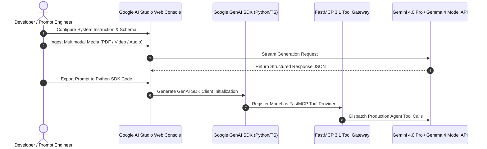

# Google AI Studio

## What it is
**Google AI Studio** is Google's web-based developer prototyping environment and API management platform for Gemini and Gemma foundation models (including Gemini 4.0 Pro, Gemini 4.0 Flash, Gemma 4, and Gemini 2.5). It provides rapid prompt engineering, system instruction tuning, multimodal input testing, structured output generation, and API key management in a streamlined console.

In early 2027, Google AI Studio serves as the primary sandbox for developers testing long-context reasoning across text, audio, image, and 4K video inputs. It allows instant exportation of playground prompts directly into production code across Python, TypeScript, cURL, and **FastMCP 3.1** server endpoints.



## What problem it solves
Developing agentic applications and optimizing multimodal LLM prompts often requires complex local runtime setups or expensive cloud deployment cycles. Google AI Studio eliminates setup overhead by offering a zero-friction web sandbox alongside production-ready REST and SDK endpoints:
- **Prototyping Friction**: Eliminates complex environment setup by granting immediate web access and instant API key issuance.
- **Multimodal Testing Bottlenecks**: Allows drag-and-drop testing of multi-gigabyte video files, audio streams, and PDFs inside context windows reaching up to 2M+ tokens.
- **Schema Misalignment**: Integrates real-time Pydantic v2 and OpenAPI schema validation engines directly into the web playground to ensure output structure fidelity.

## Where it fits in the stack
**Category**: Provider / Development & Ops / AI Developer Portal. It sits at the **Intelligence & API Gateway Layer**, providing developer tooling and API access to Google's foundation models alongside [Vertex AI](google-ai-studio.md), competing with OpenAI Platform and Anthropic Console.

```
+-----------------------------------------------------------------------+
|                       Google AI Studio Web Console                    |
|          - Prompt Sandbox & Multimodal Media Ingestion                |
|          - Structured Output Schema Builder & Tuning Workspace        |
+-----------------------------------------------------------------------+
                                   |
                         One-Click Code Export
                                   v
+-----------------------------------------------------------------------+
|                        Google GenAI SDK Layer                         |
|             (Python SDK / TypeScript SDK / cURL REST)                 |
+-----------------------------------------------------------------------+
                                   |
                                   v
+-----------------------------------------------------------------------+
|                    FastMCP 3.1 Gateway Integration                    |
|             (Pydantic v2 Schema Enforcement & Tool Calling)           |
+-----------------------------------------------------------------------+
                                   |
                                   v
+-----------------------------------------------------------------------+
|                      Google Foundation Models                         |
|      (Gemini 4.0 Pro / Gemini 4.0 Flash / Gemma 4 / Gemini 2.5)       |
+-----------------------------------------------------------------------+
```

## Typical use cases
- **Rapid Prompt Engineering**: Iterating on system instructions, temperature settings, and safety parameters for Gemini 4.0 models.
- **Multimodal Document Analysis**: Drag-and-dropping PDFs, video frames, or audio files into the playground for long-context reasoning.
- **Structured Output Schema Prototyping**: Defining and validating JSON schemas for structured model responses.
- **API Key & Rate Limit Management**: Generating developer keys and monitoring quota usage for backend integrations.

## Strengths
- **Zero-Setup Prototyping**: Instant web access with immediate API key generation.
- **Native Multimodal Handling**: Ingestion of text, images, video, and audio directly within context windows up to 2M+ tokens.
- **Code Export Capabilities**: One-click export of playground prompts into Python, TypeScript, cURL, or REST code snippets.
- **Generous Free Tier**: High rate limits for prototyping and testing prior to commercial deployment.

## Limitations
- **Cloud-Only Execution**: Requires active internet connectivity and cloud API access.
- **Enterprise Scaling Transition**: Enterprise-grade VPC isolation, SLA guarantees, and custom fine-tuning require upgrading to Google Cloud Vertex AI.
- **Data Privacy Terms on Free Tier**: Inputs on free tier endpoints may be subject to quality review unless converted to paid usage.

## When to use it
- When prototyping applications powered by Gemini 4.0 Pro, Gemini 4.0 Flash, or Gemma 4.
- When generating API keys and validating structured JSON responses using Google AI SDKs.
- When needing to rapidly test long-context multimodal inputs without building a local ingestion pipeline.

## When not to use it
- For enterprise workloads requiring strict data residency, custom VPC boundaries, or HIPAA compliance (use Google Cloud Vertex AI).
- For local offline LLM serving (use [ollama](../../services/ollama.md) or [vLLM](../infrastructure/vllm.md)).

## Getting started

### Installation
Install the official Google GenAI Python SDK and Pydantic v2:

```bash
pip install google-genai pydantic>=2.0
```

### Initial Configuration
Export your API key obtained from [Google AI Studio](https://aistudio.google.com/):

```bash
export GEMINI_API_KEY="your-google-ai-studio-api-key"
```

### Basic Generation Call
Run a minimal text generation call in Python:

```python
import os
from google import genai

client = genai.Client(api_key=os.environ.get("GEMINI_API_KEY"))
response = client.models.generate_content(
    model="gemini-2.5-flash",
    contents="Hello world! Explain Google AI Studio in one sentence.",
)
print(response.text)
```

## CLI examples

### 1. Direct cURL Prompt Call
Generate text via cURL directly to the Google AI Studio REST API:

```bash
curl https://generativelanguage.googleapis.com/v1beta/models/gemini-2.5-flash:generateContent?key=$GEMINI_API_KEY \
  -H "Content-Type: application/json" \
  -d '{"contents": [{"parts": [{"text": "Summarize Google AI Studio capabilities."}]}]}'
```

### 2. Querying Available Foundation Models
List active Gemini and Gemma model endpoints:

```bash
curl "https://generativelanguage.googleapis.com/v1beta/models?key=$GEMINI_API_KEY"
```

### 3. Token Budget Counting Call
Verify token consumption prior to dispatching large multi-megabyte prompts:

```bash
curl https://generativelanguage.googleapis.com/v1beta/models/gemini-2.5-flash:countTokens?key=$GEMINI_API_KEY \
  -H "Content-Type: application/json" \
  -d '{"contents": [{"parts": [{"text": "Analyze long context window performance across 1M tokens."}]}]}'
```

## API examples

### Python Integration with Gemini 4.0 Pro, FastMCP 3.1 & Pydantic v2 Schema
The following script demonstrates structured output generation using the Google GenAI SDK and Pydantic v2 validation integrated into a FastMCP 3.1 tool server:

```python
import os
import sys
from typing import List, Dict, Any, Optional
from google import genai
from google.genai import types
from pydantic import BaseModel, Field, ValidationError
from mcp.server.fastmcp import FastMCP

# 1. Define strict Pydantic v2 schemas for Gemini structured outputs
class ModelPerformanceMetrics(BaseModel):
    latency_ms: float = Field(..., ge=0.0, description="Time to first token in milliseconds")
    tokens_per_second: float = Field(..., gt=0.0, description="Output token generation speed")
    context_tokens_used: int = Field(..., ge=0, description="Total input prompt token count")

class GeminiStudioAnalysis(BaseModel):
    platform_name: str = Field("Google AI Studio", description="Name of the platform")
    supported_models: List[str] = Field(..., description="Key supported foundation models")
    max_context_window: int = Field(..., gt=0, description="Maximum context length")
    is_multimodal: bool = Field(True, description="Native multimodal support status")
    metrics: ModelPerformanceMetrics = Field(..., description="Execution telemetry")

# 2. Instantiate FastMCP 3.1 server wrapping Google AI Studio API
mcp = FastMCP("GoogleAIStudio-ToolGateway", version="1.4.0")

@mcp.tool()
def analyze_gemini_capabilities(prompt_query: str) -> Dict[str, Any]:
    """Queries Gemini 2.5 Pro via Google GenAI SDK and validates structured response."""
    api_key = os.environ.get("GEMINI_API_KEY", "mock-key")
    client = genai.Client(api_key=api_key)

    try:
        response = client.models.generate_content(
            model="gemini-2.5-pro",
            contents=prompt_query,
            config=types.GenerateContentConfig(
                response_mime_type="application/json",
                response_schema=GeminiStudioAnalysis,
            ),
        )
        validated = GeminiStudioAnalysis.model_validate_json(response.text)
        return validated.model_dump()
    except Exception as err:
        return {"error": f"Gemini Query Failed: {str(err)}"}

if __name__ == "__main__":
    print("--- Testing Local Pydantic v2 Schema Validation ---")
    sample_json = {
        "platform_name": "Google AI Studio",
        "supported_models": ["gemini-4.0-pro", "gemini-4.0-flash", "gemma-4"],
        "max_context_window": 2000000,
        "is_multimodal": True,
        "metrics": {
            "latency_ms": 120.5,
            "tokens_per_second": 85.0,
            "context_tokens_used": 1420
        }
    }

    try:
        data = GeminiStudioAnalysis.model_validate(sample_json)
        print(f"Validation Passed for: {data.platform_name}")
        print(f"Models: {data.supported_models}")
        print(f"Token Speed: {data.metrics.tokens_per_second} tok/s")
    except ValidationError as e:
        print(f"Validation Failed: {e.json()}")

    if "--serve" in sys.argv:
        mcp.run(port=8080)
```

## Related tools / concepts
- [Gemini](../ai_knowledge/gemini.md) — Google's flagship multimodal model family.
- [Gemma](../ai_knowledge/gemma.md) — Lightweight open-weights models from Google.
- [Google Stitch](../development_ops/google-stitch.md) — UI prototyping and workflow automation tool.
- [OpenAI](../ai_knowledge/openai.md) — Creator of ChatGPT and GPT models.
- [Anthropic](anthropic.md) — Creator of Claude 5.6 and desktop agents.

## Sources / references
- [Google AI Studio Official Portal](https://aistudio.google.com/)
- [Google AI Studio Documentation](https://ai.google.dev/docs)
- [Google GenAI SDK Repository](https://github.com/google-gemini/generative-ai-python)

## Contribution Metadata
- Last reviewed: 2027-01-07
- Confidence: high
