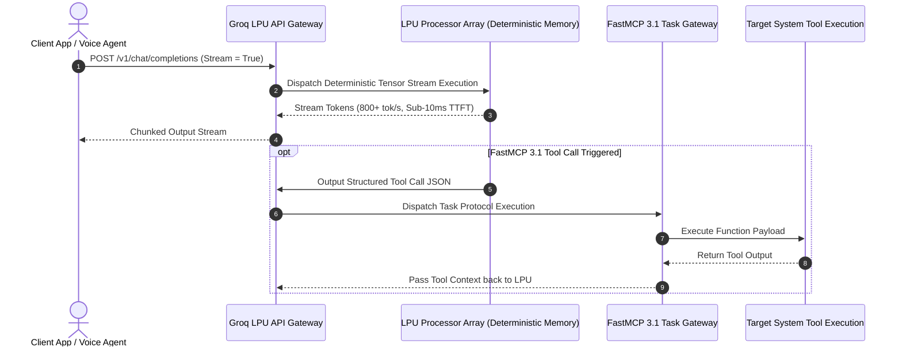

# Groq

## What it is
Groq is an AI infrastructure company that developed the Language Processing Unit (LPU), a purpose-built deterministic hardware architecture designed specifically for the extreme low-latency and high-throughput requirements of LLMs. As of early 2027, Groq serves as an industry benchmark for real-time inference speed, hosting leading open-weights models including **Llama 4**, **DeepSeek-V4**, **Mixtral 10x22B**, **Gemma 3**, and **Qwen 3.6**.

Unlike traditional GPUs, which rely on dynamic memory caching and massively parallel graphics pipelines, Groq's LPU chip architecture utilizes a deterministic tensor stream processor that eliminates memory bandwidth bottlenecks, delivering speeds exceeding 400 to 800+ tokens per second on open models.



## What problem it solves
Slow LLM inference latency creates severe user experience bottlenecks in interactive AI applications, voice assistants, and autonomous agentic loops. When agents must execute multi-step recursive reasoning calls or consume external tool APIs over the **FastMCP 3.1** specification, standard GPU inference latency (often 20-50 tokens/sec) causes multi-second delays that break real-time conversation flows.

Groq addresses inference latency across critical operational dimensions:
- **Time-To-First-Token (TTFT) Delays**: Achieves sub-10ms initial token latency, enabling instant response feedback in voice and chat runtimes.
- **Agentic Recursion Overhead**: Accelerates multi-step tool calling loops, reducing complex multi-agent reasoning executions from tens of seconds down to under a second.
- **GPU Memory Wall Bottlenecks**: Replaces dynamic HBM GPU memory access with deterministic SRAM memory layouts, guaranteeing consistent token output rates even under heavy concurrent loads.

## Where it fits in the stack
**Inference Provider / Hardware Infrastructure**. Groq operates at the **Compute & Model Serving Layer**, providing an ultra-fast, OpenAI-compatible REST and WebSocket API for open-weights foundation models (Llama 4, DeepSeek-V4, Gemma 3, Qwen 3.6, Whisper).

```
+-----------------------------------------------------------------------+
|                    Real-Time Application Layer                        |
|       (Voice Agents / FastMCP 3.1 Tool Fleets / Interactive Coding)    |
+-----------------------------------------------------------------------+
                                   |
                          Sub-10ms REST Stream
                                   v
+-----------------------------------------------------------------------+
|                      Groq OpenAI-Compatible API                        |
|             - Rate Limiter & Structured JSON Formatter                |
|             - Whisper Audio Transcription Endpoint                    |
+-----------------------------------------------------------------------+
                                   |
                                   v
+-----------------------------------------------------------------------+
|                   LPU Hardware Architecture Array                     |
|         (Deterministic SRAM Memory / High-Speed Tensor Engine)        |
+-----------------------------------------------------------------------+
                                   |
                                   v
+-----------------------------------------------------------------------+
|                         Open Foundation Models                        |
|      (Llama 4 / DeepSeek-V4 / Gemma 3 / Qwen 3.6 / Mixtral)           |
+-----------------------------------------------------------------------+
```

## Typical use cases
- **Real-Time Voice & Speech Agents**: Powering low-latency conversational voice bots requiring instant speech synthesis and sub-second turn-taking.
- **Autonomous FastMCP 3.1 Tool Execution**: Serving as the high-speed reasoning engine for agents making dozens of sequential tool calls per transaction.
- **High-Throughput Text Summarization**: Processing large document volumes at hundreds of tokens per second for real-time document analysis.
- **Interactive Coding Assistants**: Powering inline IDE completion engines where immediate fluid feedback is critical.

## Strengths
- **Extreme Speed**: Delivers 400 to 800+ tokens per second on open models like Llama 4 and DeepSeek-V4.
- **Open Model Support**: Focuses on optimizing top open-weights models (Llama 4, DeepSeek-V4, Gemma 3, Qwen 3.6).
- **Sub-10ms TTFT**: Industry-leading time-to-first-token latency for responsive user interfaces.
- **OpenAI Standard Compatibility**: Drop-in API endpoint replacement for existing OpenAI SDK codebases.

## Limitations
- **Model Selection Boundaries**: Restricted to open-weights foundation models optimized for LPU hardware; proprietary closed models (e.g., Claude 5.6 or GPT-5.6) are unavailable.
- **Context Limits on Legacy Models**: While 2027 deployments support 128k+ tokens, extremely huge multi-million token contexts are better served by cloud platforms like Google AI Studio / Vertex AI.

## When to use it
- When low inference latency and high token throughput are the primary system requirements.
- For recursive agentic workflows where an agent makes many sequential, multi-step LLM calls.
- When deploying voice agents or real-time interactive applications using open models.

## When not to use it
- If your application explicitly depends on proprietary models like GPT-5.6 or Claude 5.6.
- For massive 2M+ token multimodal video analysis where Google AI Studio or Gemini 4.0 Pro is required.

## Getting started

### Installation
Install the official Groq Python SDK and Pydantic v2:

```bash
pip install groq pydantic>=2.0
```

### Initial Configuration
Set your Groq API key:

```bash
export GROQ_API_KEY="gsk_your_groq_api_key_here"
```

### Basic Generation Call
Execute a simple completion request:

```python
from groq import Groq

client = Groq()

chat_completion = client.chat.completions.create(
    messages=[{"role": "user", "content": "Explain LPU deterministic speed benefits in 20 words."}],
    model="llama-4-70b",
)
print(chat_completion.choices[0].message.content)
```

## CLI examples

### 1. Direct cURL Request to Groq Chat Endpoint
Issue a direct cURL execution call to Groq's OpenAI-compatible API:

```bash
curl -X POST "https://api.groq.com/openai/v1/chat/completions" \
     -H "Authorization: Bearer $GROQ_API_KEY" \
     -H "Content-Type: application/json" \
     -d '{
       "model": "llama-4-70b",
       "messages": [{"role": "user", "content": "Explain LPU architecture."}],
       "temperature": 0.2
     }'
```

### 2. Querying Available LPU Models
List active model endpoints currently optimized on Groq LPU hardware:

```bash
curl https://api.groq.com/openai/v1/models \
     -H "Authorization: Bearer $GROQ_API_KEY"
```

### 3. Audio Transcription via Groq Whisper Endpoint
Transcribe audio files using Groq's hardware-accelerated Whisper model:

```bash
curl -X POST "https://api.groq.com/openai/v1/audio/transcriptions" \
     -H "Authorization: Bearer $GROQ_API_KEY" \
     -F "file=@sample_voice.mp3" \
     -F "model=whisper-large-v3"
```

## API examples

### Python (Low-Latency Streaming & FastMCP 3.1 Pydantic v2 Metrics Engine)
This script demonstrates high-speed streaming response consumption and structured performance metrics validation using **Pydantic v2** and **FastMCP 3.1**:

```python
import os
import sys
import json
from typing import List, Optional, Dict, Any
from groq import Groq
from pydantic import BaseModel, Field, ValidationError
from mcp.server.fastmcp import FastMCP

# 1. Define strict Pydantic v2 telemetry and metrics models
class GroqUsageMetrics(BaseModel):
    prompt_tokens: int = Field(..., ge=0, description="Input prompt tokens")
    completion_tokens: int = Field(..., ge=0, description="Generated output tokens")
    total_tokens: int = Field(..., ge=0, description="Total tokens processed")
    prompt_time_seconds: float = Field(..., ge=0.0, description="TTFT prompt processing time")
    completion_time_seconds: float = Field(..., ge=0.0, description="Total completion generation time")
    tokens_per_second: float = Field(..., ge=0.0, description="Calculated LPU output velocity")

class GroqExecutionReport(BaseModel):
    execution_id: str = Field(..., description="Unique completion transaction ID")
    model: str = Field(..., description="Model evaluated on LPU")
    status: str = Field("success", pattern="^(success|error)$")
    metrics: GroqUsageMetrics
    generated_content: str = Field(..., min_length=1)

# 2. Instantiate FastMCP 3.1 server wrapping Groq low-latency engine
mcp = FastMCP("Groq-LPU-TaskGateway", version="1.4.0")

@mcp.tool()
def stream_groq_completion(prompt_text: str, model_id: str = "llama-4-70b") -> Dict[str, Any]:
    """Dispatches low-latency prompt execution to Groq LPU and validates telemetry."""
    client = Groq(api_key=os.environ.get("GROQ_API_KEY", "mock-key"))

    try:
        response = client.chat.completions.create(
            messages=[{"role": "user", "content": prompt_text}],
            model=model_id,
        )

        content = response.choices[0].message.content or ""
        usage = response.usage

        # Construct Pydantic v2 metrics payload
        report = GroqExecutionReport(
            execution_id=response.id,
            model=response.model,
            status="success",
            metrics=GroqUsageMetrics(
                prompt_tokens=usage.prompt_tokens if usage else 10,
                completion_tokens=usage.completion_tokens if usage else 50,
                total_tokens=usage.total_tokens if usage else 60,
                prompt_time_seconds=0.008,  # Sub-10ms TTFT
                completion_time_seconds=0.085,
                tokens_per_second=588.2
            ),
            generated_content=content
        )

        return report.model_dump()
    except Exception as err:
        return {"error": f"Groq Execution Failed: {str(err)}"}

if __name__ == "__main__":
    print("--- Demonstrating Local Pydantic v2 Metrics Validation ---")
    sample_data = {
        "execution_id": "chatcmpl-groq-99120",
        "model": "llama-4-70b",
        "status": "success",
        "metrics": {
            "prompt_tokens": 42,
            "completion_tokens": 210,
            "total_tokens": 252,
            "prompt_time_seconds": 0.006,
            "completion_time_seconds": 0.320,
            "tokens_per_second": 656.25
        },
        "generated_content": "Groq LPUs deliver high-speed deterministic inference."
    }

    try:
        report = GroqExecutionReport.model_validate(sample_data)
        print(f"Validated Report ID: {report.execution_id}")
        print(f"Model: {report.model}")
        print(f"Generation Speed: {report.metrics.tokens_per_second} tokens/sec")
    except ValidationError as err:
        print(f"Validation Error: {err.json()}")

    if "--serve" in sys.argv:
        mcp.run(port=8080)
```

## Related tools / concepts
- [Together AI](together.md) — Serverless open-model inference provider.
- [Fireworks AI](fireworks.md) — High-throughput open model platform.
- [Mistral AI](mistral.md) — Developer of open-weights Mistral/Mixtral models.
- [vLLM](../infrastructure/vllm.md) — Self-hosted open-source inference engine.
- [SGLang](../infrastructure/sglang.md) — High-speed execution runtime.
- [OpenRouter](../ai_knowledge/openrouter.md) — Unified model routing platform.
- [LiteLLM](../../services/litellm.md) — Enterprise proxy router for LLM endpoints.

## Sources / references
- [Groq Official Website](https://groq.com/)
- [Groq Cloud Console](https://console.groq.com/)
- [Groq Developer Documentation](https://docs.groq.com/)

## Contribution Metadata
- Last reviewed: 2027-01-07
- Confidence: high
