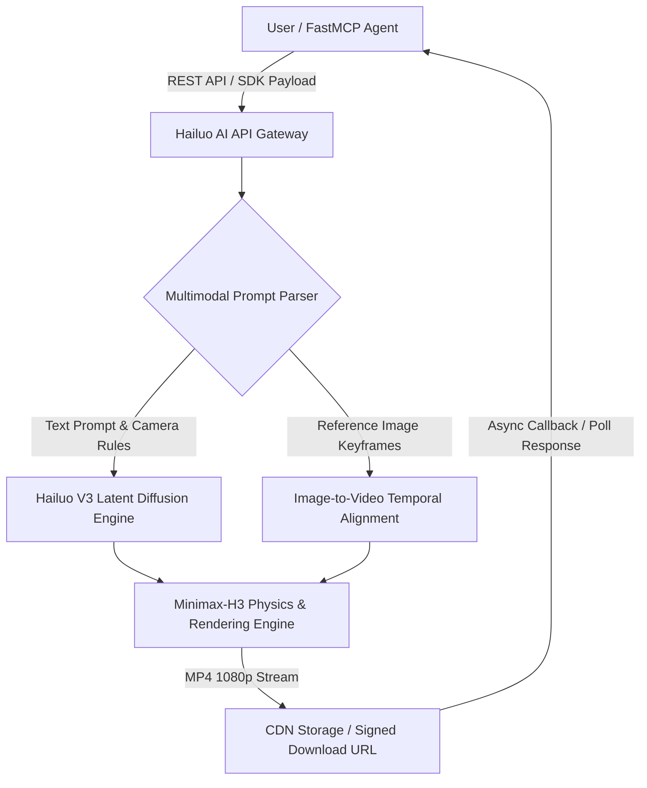

# Hailuo AI

## What it is
Hailuo AI (developed by MiniMax) is a premier AI generative video and multimodal media creation platform. Driven by MiniMax's proprietary **Hailuo V3** and **Minimax-H3** video synthesis foundation models, Hailuo AI enables high-fidelity, cinematic text-to-video, image-to-video, and camera motion control generation for creative production, virtual avatars, and automated agentic media pipelines.



## What problem it solves
Generative video models historically suffered from severe visual artifacts, anatomical unnaturalness, physics distortion, flickering frame transitions, and lack of controllable camera movements. Hailuo AI solves these core generative video constraints by offering:
- **Cinematic Quality**: Produces high-definition 1080p output featuring fluid lighting dynamics and precise camera controls (pan, zoom, orbit, roll, tracking shot).
- **Physical Realism & Temporal Consistency**: Accurately simulates real-world physical dynamics (water flow, fabric motion, wind interaction) and maintains subject identity across multi-second clips.
- **Programmatic FastMCP 3.1 & API Integration**: Provides structured REST endpoints and FastMCP 3.1 task protocol support for automated media rendering inside AI agent pipelines.
- **Cost-Effective Token-Based Video Rendering**: Scalable API architecture designed for programmatic batch video generation at production scale.

## Where it fits in the stack
**Providers / Generative Video & Multimodal AI**. Hailuo AI operates as a specialized generative media provider alongside video platforms ([Sora](../ai_knowledge/sora.md), Project Genie, Runway ML) and provider ecosystems ([MiniMax](minimax.md)).

## Typical use cases
- **Automated Video Content Generation**: Generating marketing promotional clips, social media visual assets, and news snippets from text scripts.
- **Agentic Media Production**: Animating static user-submitted images into 6-second high-resolution video clips via AI agents (e.g., Claude Code, AutoGen, CrewAI).
- **Concept Pre-visualization & Storyboarding**: Rendering photorealistic concept scenes and pre-vis animatics for film, animation, and game design teams.
- **Multimodal Video RAG**: Creating interactive visual avatars and video responses for next-generation digital twin assistants.

## Strengths
- **Superior Motion Quality**: Exceptional fluid camera movement and natural physical object dynamics compared to standard open-source text-to-video models.
- **Image-to-Video Fidelity**: Accurately preserves character facial features, textures, lighting cues, and artistic style when animating reference input images.
- **Native MiniMax Ecosystem Tie-in**: Seamless integration with MiniMax text models (M3) and neural audio synthesis (Music3 / neural TTS) for end-to-end multimodal production.
- **Production Developer API**: Robust async task management endpoints with webhooks for tracking video generation status.

## Limitations
- **Render Latency**: High-definition video synthesis requires async GPU rendering time (typically 30-90 seconds per scene).
- **Content Moderation Filters**: Strict safety filters applied to text prompts and reference keyframe images to prevent policy violations.

## When to use it
- When you require photorealistic or cinematic video generation for media applications or AI agent outputs.
- When animating static images into high-resolution clips using automated Python scripts or FastMCP 3.1 agent tools.
- When working within the MiniMax provider ecosystem for full multimodal generation (text, audio, and video).

## When not to use it
- When requiring real-time sub-second text generation or code completion (use text-focused LLM APIs like [MiniMax](minimax.md) directly).
- When operating under strict air-gapped local requirements without external cloud access to Hailuo API endpoints.

## Getting started

### Account Configuration & API Keys
1. Register an account on the Hailuo AI platform or obtain a MiniMax Developer API key.
2. Set your environment variable: `export HAILUO_API_KEY="your_minimax_hailuo_api_key"`.
3. Submit video generation tasks via REST API or SDKs.

## CLI examples

```bash
# Submit a text-to-video generation task via Curl
curl -X POST "https://api.minimax.chat/v1/video/generations" \
  -H "Authorization: Bearer $HAILUO_API_KEY" \
  -H "Content-Type: application/json" \
  -d '{
    "model": "hailuo-v3-cinematic",
    "prompt": "A futuristic camera drone sweeping over a neon-lit cyberpunk city in heavy rain, cinematic lighting, 4k",
    "camera_motion": "pan_right_and_zoom",
    "duration_seconds": 6
  }'

# Inspect video rendering task status by task ID
curl -X GET "https://api.minimax.chat/v1/video/tasks/$TASK_ID" \
  -H "Authorization: Bearer $HAILUO_API_KEY"
```

## API examples

### Python FastMCP 3.1 & Pydantic v2 Async Video Generation Server
The following code snippet demonstrates implementing an async Hailuo AI video generation tool using FastMCP 3.1 and Pydantic v2:

```python
import time
import requests
from typing import Optional
from pydantic import BaseModel, Field
from mcp.server.fastmcp import FastMCP

# Define Pydantic v2 schemas for Hailuo AI video requests and responses
class VideoGenerationRequest(BaseModel):
    prompt: str = Field(..., description="Detailed textual description of the scene to generate.")
    camera_motion: str = Field(default="pan_right_and_zoom", description="Camera movement trajectory (e.g., pan_right, zoom_in, orbit).")
    duration_seconds: int = Field(default=6, ge=2, le=10, description="Video clip duration in seconds.")
    reference_image_url: Optional[str] = Field(default=None, description="Optional image URL for image-to-video animation.")

class VideoTaskResponse(BaseModel):
    task_id: str = Field(..., description="Unique Hailuo task ID for polling.")
    status: str = Field(..., description="Current status of the video rendering task (e.g., processing, completed, failed).")
    download_url: Optional[str] = Field(default=None, description="Signed HTTP URL to download the generated MP4 video.")

# Initialize FastMCP 3.1 server
mcp = FastMCP("hailuo-video-generator")

HAILUO_API_KEY = "YOUR_HAILUO_MINIMAX_API_KEY"
API_BASE = "https://api.minimax.chat/v1/video"

@mcp.tool()
async def generate_hailuo_video(request: VideoGenerationRequest) -> VideoTaskResponse:
    """Submits an async video generation job to Hailuo AI (MiniMax) and polls until rendering completes."""
    headers = {
        "Authorization": f"Bearer {HAILUO_API_KEY}",
        "Content-Type": "application/json"
    }

    payload = {
        "model": "hailuo-v3-cinematic",
        "prompt": request.prompt,
        "camera_motion": request.camera_motion,
        "duration_seconds": request.duration_seconds
    }
    if request.reference_image_url:
        payload["first_frame_image"] = request.reference_image_url

    # Trigger video generation task
    init_res = requests.post(f"{API_BASE}/generations", json=payload, headers=headers)
    init_data = init_res.json()
    task_id = init_data.get("task_id", "")

    if not task_id:
        return VideoTaskResponse(task_id="error", status="failed", download_url=None)

    # Poll status until completed or timed out
    for _ in range(30):  # Poll up to 5 minutes (30 * 10s)
        time.sleep(10)
        status_res = requests.get(f"{API_BASE}/tasks/{task_id}", headers=headers)
        status_data = status_res.json()
        current_status = status_data.get("status")

        if current_status == "completed":
            return VideoTaskResponse(
                task_id=task_id,
                status="completed",
                download_url=status_data.get("download_url")
            )
        elif current_status == "failed":
            return VideoTaskResponse(task_id=task_id, status="failed", download_url=None)

    return VideoTaskResponse(task_id=task_id, status="timeout", download_url=None)

if __name__ == "__main__":
    mcp.run()
```

## Related tools / concepts
- [MiniMax](minimax.md) — Multi-modal foundation model provider ecosystem.
- [Sora](../ai_knowledge/sora.md) — OpenAI generative video model.
- [Project Genie](../ai_knowledge/project-genie.md) — Google DeepMind interactive world synthesis model.
- [Runway ML](runway.md) — Generative video and creative media suite.

## Sources / references
- [Hailuo AI Web Portal](https://hailuo.ai)
- [MiniMax Video API Documentation](https://platform.minimaxi.com/document/video-generation)

## Contribution Metadata
- Last reviewed: 2027-01-07
- Confidence: high
