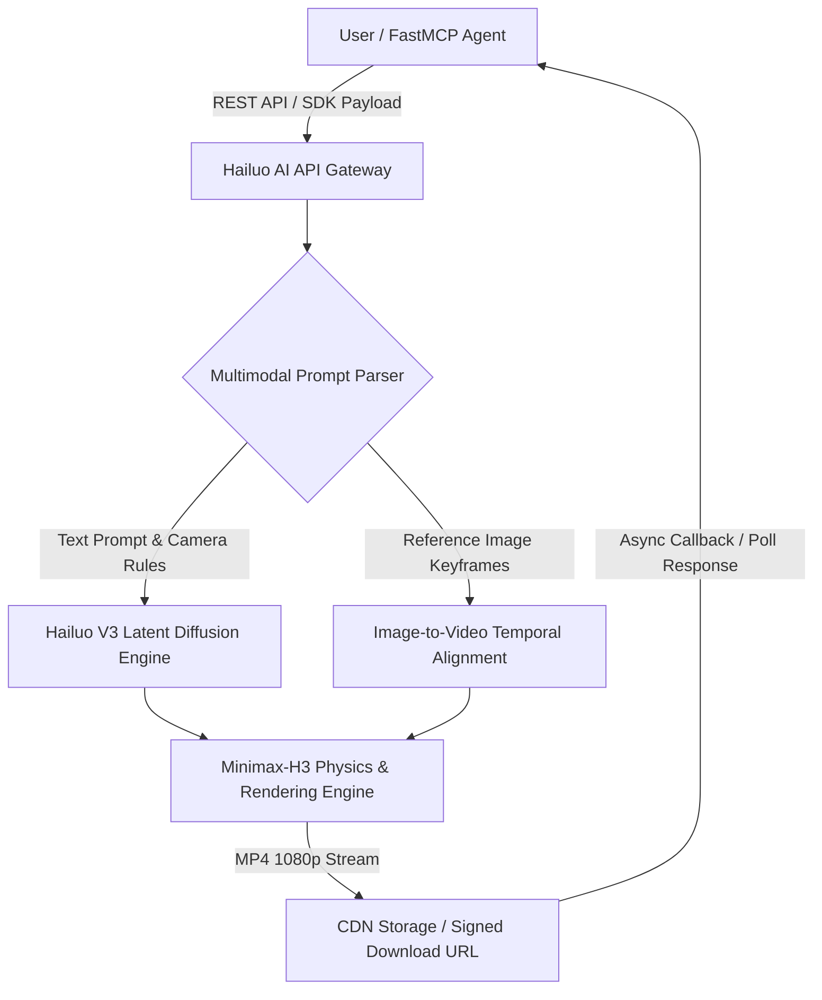

# Hailuo AI

## What it is
Hailuo AI (developed by MiniMax) is a premier AI generative video and multimodal media creation platform. Driven by MiniMax's proprietary **Hailuo V3** and **Minimax-H3** video synthesis foundation models, Hailuo AI enables high-fidelity, cinematic text-to-video, image-to-video, and camera motion control generation for creative production, virtual avatars, and automated agentic media pipelines.

In **early 2027**, Hailuo V3 natively integrates with **FastMCP 3.1 Task Protocols**, allowing autonomous agents (**Claude 5.6**, **Cursor**, **AutoGen**, **CrewAI**) to programmatically trigger 1080p high-definition video generation jobs, manage asynchronous render queues, and receive signed MP4 delivery URLs via Webhooks.

## What problem it solves
Generative video models historically suffered from severe visual artifacts, anatomical unnaturalness, physics distortion, flickering frame transitions, and lack of controllable camera movements.

Hailuo AI solves these core generative video constraints by offering:
- **Cinematic Quality**: Produces high-definition 1080p output featuring fluid lighting dynamics and precise 6-axis camera controls (pan, zoom, orbit, roll, tracking shot).
- **Physical Realism & Temporal Consistency**: Accurately simulates real-world physical dynamics (water flow, fabric motion, wind interaction) and maintains subject identity across multi-second clips.
- **Programmatic FastMCP 3.1 & API Integration**: Provides structured REST endpoints and FastMCP 3.1 task protocol support for automated media rendering inside AI agent pipelines.
- **Cost-Effective Token-Based Video Rendering**: Scalable API architecture designed for programmatic batch video generation at production scale.

## Architecture and Generation Pipeline

Hailuo AI operates through an asynchronous latent video diffusion pipeline that fuses multimodal prompts, camera trajectory rules, and keyframe image bindings before GPU cluster dispatch.

```
+-----------------------------------------------------------------------------------+
|                        Hailuo AI Media Synthesis Pipeline                         |
+-----------------------------------------------------------------------------------+
                                          |
 1. Input Submission                      |
 +-------------------------------+       |
 | Human Creator / FastMCP Agent |       |
 +---------------+---------------+       |
                 |                       |
                 v                       v
 2. API Gateway & Validation Layer       |
 +-----------------------------------------------+
 |  MiniMax API Gateway                          |
 |  - Multi-modal Prompt & Keyframe Binding      |
 +---------------+-------------------------------+
                 |
                 v
 3. Latent Video Synthesis Engine (Hailuo V3 / Minimax-H3)
 +-----------------------------------------------+
 |  3D Latent Diffusion & Physics Simulation     |
 |  - Camera Motion Vectoring (Pan/Zoom/Orbit)   |
 |  - Temporal Consistency Alignment             |
 +---------------+-------------------------------+
                 |
                 +-----------------------------------+
                 |                                   |
                 v                                   v
 4. Video Rendering & Encoding               5. Delivery & Storage
 +-------------------------------+           +-------------------------------+
 |  MP4 1080p Video Stream       |           |  CDN Edge Storage             |
 |  - 60fps Interpolation        |---------->|  - Signed Download URL        |
 |  - Audio Sync Layer (Music3)  |           |  - Webhook Callback Dispatch  |
 +-------------------------------+           +-------------------------------+
```

## Where it fits in the stack
**Providers / Generative Video & Multimodal AI**. Hailuo AI operates as a specialized generative media provider alongside video platforms ([Sora](../ai_knowledge/sora.md), Project Genie, Runway ML) and provider ecosystems ([MiniMax](minimax.md)).


```mermaid
graph TD
    A[User / FastMCP Agent] -->|REST API / SDK Payload| B[Hailuo AI API Gateway]
    B --> C{Multimodal Prompt Parser}
    C -->|Text Prompt & Camera Rules| D[Hailuo V3 Latent Diffusion Engine]
    C -->|Reference Image Keyframes| E[Image-to-Video Temporal Alignment]
    D --> F[Minimax-H3 Physics & Rendering Engine]
    E --> F
    F -->|MP4 1080p Stream| G[CDN Storage / Signed Download URL]
    G -->|Async Callback / Poll Response| A
```

## Generative Video Provider Feature Comparison Matrix

| Feature / Dimension | Hailuo AI (MiniMax) | OpenAI Sora | Runway Gen-3 Alpha | Luma Dream Machine |
| :--- | :--- | :--- | :--- | :--- |
| **Foundation Engine** | Hailuo V3 / Minimax-H3 | Sora Diffusion Transformer | Gen-3 Motion Model | Luma Dream Diffusion |
| **Max Resolution** | **1080p HD (60fps)** | 1080p / 4K Upscale | 1080p HD | 1080p HD |
| **Camera Controls** | Advanced 6-Axis Vectors | Natural Language Prompts | Direct Motion Brush / Pan | Camera Trajectory Presets |
| **FastMCP 3.1 Tool Sync**| Built-in Task API Wrappers| Native OpenAI SDK | API Webhooks | API Webhooks |
| **Ecosystem Synergy** | Text (M3), Voice (Music3) | ChatGPT / DALL-E 3 | Runway Studio Suite | Luma Interactive 3D |
| **Average Render Time** | ~30-60 seconds | ~60-120 seconds | ~30-45 seconds | ~40-60 seconds |

## Typical use cases
- **Automated Video Content Generation**: Generating marketing promotional clips, social media visual assets, and news snippets from text scripts.
- **Agentic Media Production**: Animating static user-submitted images into 6-second high-resolution video clips via AI agents (e.g., Claude Code, AutoGen, CrewAI).
- **Concept Pre-visualization & Storyboarding**: Rendering photorealistic concept scenes and pre-vis animatics for film, animation, and game design teams.
- **Multimodal Video RAG**: Creating interactive visual avatars and video responses for next-generation digital twin assistants.

## Strengths
- **Superior Motion Quality**: Exceptional fluid camera movement and natural physical object dynamics compared to standard open-source text-to-video models.
- **Image-to-Video Fidelity**: Accurately preserves character facial features, textures, lighting cues, and artistic style when animating reference input images.
- **Native MiniMax Ecosystem Tie-in**: Seamless integration with MiniMax text models (M3) and neural audio synthesis (Music3 / neural TTS) for end-to-end multimodal production.
- **Production Developer API**: Robust async task management endpoints with webhooks for tracking video generation status.

## Limitations
- **Render Latency**: High-definition video synthesis requires async GPU rendering time (typically 30-90 seconds per scene).
- **Content Moderation Filters**: Strict safety filters applied to text prompts and reference keyframe images to prevent policy violations.

## When to use it
- When you require photorealistic or cinematic video generation for media applications or AI agent outputs.
- When animating static images into high-resolution clips using automated Python scripts or FastMCP 3.1 agent tools.
- When working within the MiniMax provider ecosystem for full multimodal generation (text, audio, and video).

## When not to use it
- When requiring real-time sub-second text generation or code completion (use text-focused LLM APIs like [MiniMax](minimax.md) directly).
- When operating under strict air-gapped local requirements without external cloud access to Hailuo API endpoints.

## Systemd Queue Worker Configuration

For robust production background rendering and webhook processing, Hailuo AI video generation tasks can be managed via a dedicated systemd queue worker daemon (`hailuo-video-worker.service`).

```ini
[Unit]
Description=Hailuo AI Generative Video Queue Worker
After=network-online.target
Wants=network-online.target

[Service]
Type=simple
User=hailuo-worker
Group=hailuo-worker
WorkingDirectory=/opt/hailuo-worker
EnvironmentFile=/etc/hailuo/hailuo.env
ExecStart=/usr/bin/python3 -m worker.hailuo_task_processor --queue redis://localhost:6379/0 --max-concurrent 5
Restart=always
RestartSec=5s
MemoryMax=2G
ProtectSystem=full
PrivateTmp=true

[Install]
WantedBy=multi-user.target
```

## Production Multi-Container Docker Stack (`compose.yaml`)

To operate an enterprise-grade Hailuo AI rendering gateway with async Redis queue management, worker autoscaling, and S3 artifact mirroring, deploy the following multi-container topology:

```yaml
version: '3.8'

services:
  hailuo-mcp-gateway:
    image: python:3.11-slim
    container_name: hailuo-fastmcp-gateway
    restart: unless-stopped
    ports:
      - "8095:8095"
    environment:
      - HAILUO_API_KEY=${HAILUO_API_KEY}
      - REDIS_URL=redis://hailuo-redis:6379/0
      - MCP_TRANSPORT=sse
      - MCP_PORT=8095
      - S3_ENDPOINT=http://minio:9000
      - S3_BUCKET=hailuo-renders
      - S3_ACCESS_KEY=${MINIO_ACCESS_KEY}
      - S3_SECRET_KEY=${MINIO_SECRET_KEY}
    volumes:
      - ./server:/app:ro
      - ./config:/etc/hailuo:ro
    working_dir: /app
    command: python3 -m server.fastmcp_hailuo_server
    depends_on:
      hailuo-redis:
        condition: service_healthy
    networks:
      - hailuo-network
    deploy:
      resources:
        limits:
          cpus: '2.0'
          memory: 2048M
        reservations:
          cpus: '0.5'
          memory: 512M

  hailuo-queue-worker:
    image: python:3.11-slim
    container_name: hailuo-queue-worker
    restart: unless-stopped
    environment:
      - HAILUO_API_KEY=${HAILUO_API_KEY}
      - REDIS_URL=redis://hailuo-redis:6379/0
      - MAX_CONCURRENT_TASKS=8
      - POLL_INTERVAL_SECONDS=5
    volumes:
      - ./worker:/app:ro
    working_dir: /app
    command: python3 -m worker.hailuo_task_processor
    depends_on:
      hailuo-redis:
        condition: service_healthy
    networks:
      - hailuo-network

  hailuo-redis:
    image: redis:7.2-alpine
    container_name: hailuo-cache-broker
    restart: unless-stopped
    command: redis-server --appendonly yes --requirepass ${REDIS_PASSWORD:-securelocalredis}
    ports:
      - "6389:6379"
    volumes:
      - redis-data:/data
    healthcheck:
      test: ["CMD", "redis-cli", "-a", "${REDIS_PASSWORD:-securelocalredis}", "ping"]
      interval: 10s
      timeout: 3s
      retries: 5
    networks:
      - hailuo-network

  minio:
    image: minio/minio:RELEASE.2025-01-20T14-49-07Z
    container_name: hailuo-artifact-store
    restart: unless-stopped
    command: server /data --console-address ":9001"
    environment:
      - MINIO_ROOT_USER=${MINIO_ACCESS_KEY:-hailuo-admin}
      - MINIO_ROOT_PASSWORD=${MINIO_SECRET_KEY:-hailuo-supersecret-pass}
    volumes:
      - minio-data:/data
    ports:
      - "9000:9000"
      - "9001:9001"
    networks:
      - hailuo-network

networks:
  hailuo-network:
    driver: bridge

volumes:
  redis-data:
  minio-data:
```

## Getting started

### Account Configuration & API Keys
1. Register an account on the Hailuo AI platform or obtain a MiniMax Developer API key.
2. Set your environment variable: `export HAILUO_API_KEY="your_minimax_hailuo_api_key"`.
3. Submit video generation tasks via REST API or SDKs.

## CLI examples

```bash
# Submit a text-to-video generation task via Curl
curl -X POST "https://api.minimax.chat/v1/video/generations" \
  -H "Authorization: Bearer $HAILUO_API_KEY" \
  -H "Content-Type: application/json" \
  -d '{
    "model": "hailuo-v3-cinematic",
    "prompt": "A futuristic camera drone sweeping over a neon-lit cyberpunk city in heavy rain, cinematic lighting, 4k",
    "camera_motion": "pan_right_and_zoom",
    "duration_seconds": 6
  }'

# Inspect video rendering task status by task ID
curl -X GET "https://api.minimax.chat/v1/video/tasks/$TASK_ID" \
  -H "Authorization: Bearer $HAILUO_API_KEY"
```

## API examples

### Python FastMCP 3.1 & Pydantic v2 Async Video Generation Server
The following code snippet demonstrates implementing a production-grade async Hailuo AI video generation server using FastMCP 3.1 and strict Pydantic v2 schemas:

```python
import os
import time
import requests
from typing import Optional, Dict, Any, List
from pydantic import BaseModel, Field, field_validator, ValidationError, ConfigDict
from fastmcp import FastMCP, Context

# Initialize FastMCP 3.1 server
mcp = FastMCP("hailuo-video-generator", version="3.1.0")

HAILUO_API_KEY = os.getenv("HAILUO_API_KEY", "YOUR_HAILUO_MINIMAX_API_KEY")
API_BASE = os.getenv("HAILUO_API_BASE", "https://api.minimax.chat/v1/video")

class VideoGenerationRequest(BaseModel):
    model_config = ConfigDict(extra="forbid", validate_assignment=True)

    prompt: str = Field(..., description="Detailed textual description of the scene to generate.")
    camera_motion: str = Field(default="pan_right_and_zoom", description="Camera movement trajectory (e.g., pan_right, zoom_in, orbit, static).")
    duration_seconds: int = Field(default=6, ge=2, le=10, description="Video clip duration in seconds (2 to 10 seconds).")
    resolution: str = Field(default="1080p", description="Output video resolution target: 720p or 1080p.")
    reference_image_url: Optional[str] = Field(default=None, description="Optional HTTPS image URL for image-to-video animation.")
    motion_intensity: float = Field(default=0.7, ge=0.1, le=1.0, description="Speed and magnitude factor for visual elements in scene.")

    @field_validator("prompt")
    @classmethod
    def check_prompt_length(cls, v: str) -> str:
        cleaned = v.strip()
        if len(cleaned) < 10:
            raise ValueError("Prompt must contain at least 10 non-whitespace characters for quality generation.")
        return cleaned

    @field_validator("resolution")
    @classmethod
    def check_resolution(cls, v: str) -> str:
        if v not in ("720p", "1080p"):
            raise ValueError("Resolution must be either '720p' or '1080p'.")
        return v

class VideoTaskQuery(BaseModel):
    model_config = ConfigDict(extra="forbid")

    task_id: str = Field(..., description="Hailuo task UUID returned from initial job submission.")

class VideoTaskResponse(BaseModel):
    model_config = ConfigDict(extra="forbid")

    task_id: str = Field(..., description="Unique Hailuo task ID for polling.")
    status: str = Field(..., description="Current status: queued, processing, completed, failed, or timeout.")
    download_url: Optional[str] = Field(default=None, description="Signed HTTP URL to download the rendered MP4 file.")
    error_message: Optional[str] = Field(default=None, description="Error details if job failed or validation encountered issues.")
    execution_time_seconds: Optional[float] = Field(default=None, description="Total latency elapsed from submission to completion.")

class VideoBatchManifest(BaseModel):
    model_config = ConfigDict(extra="forbid")

    batch_name: str = Field(..., description="Identifier label for the generation batch.")
    tasks: List[VideoGenerationRequest] = Field(..., max_length=10, description="List of up to 10 video generation requests to queue.")

@mcp.tool(
    name="generate_hailuo_video",
    description="Submits an async video generation job to Hailuo AI (MiniMax) and polls until rendering completes."
)
async def generate_hailuo_video(
    request: VideoGenerationRequest,
    ctx: Optional[Context] = None
) -> VideoTaskResponse:
    """Submits an async video generation job to Hailuo AI (MiniMax) and polls until rendering completes."""
    start_time = time.time()
    if ctx:
        await ctx.info(f"Dispatching Hailuo video generation task: '{request.prompt[:40]}...' (Motion: {request.camera_motion})")

    headers = {
        "Authorization": f"Bearer {HAILUO_API_KEY}",
        "Content-Type": "application/json"
    }

    payload = {
        "model": "hailuo-v3-cinematic",
        "prompt": request.prompt,
        "camera_motion": request.camera_motion,
        "duration_seconds": request.duration_seconds,
        "resolution": request.resolution,
        "motion_intensity": request.motion_intensity
    }
    if request.reference_image_url:
        payload["first_frame_image"] = str(request.reference_image_url)

    try:
        init_res = requests.post(f"{API_BASE}/generations", json=payload, headers=headers, timeout=12)
        if init_res.status_code != 200:
            return VideoTaskResponse(
                task_id="http_error",
                status="failed",
                error_message=f"API responded with status {init_res.status_code}: {init_res.text}"
            )

        init_data = init_res.json()
        task_id = init_data.get("task_id", "")
        if not task_id:
            return VideoTaskResponse(
                task_id="unknown",
                status="failed",
                error_message=f"No task_id returned by MiniMax API: {init_data}"
            )

        if ctx:
            await ctx.info(f"Hailuo task queued successfully. Task ID: {task_id}. Beginning polling cycle...")

        # Poll status until completed or timed out (up to 300 seconds)
        for attempt in range(30):
            time.sleep(10)
            status_res = requests.get(f"{API_BASE}/tasks/{task_id}", headers=headers, timeout=10)
            if status_res.status_code != 200:
                continue

            status_data = status_res.json()
            current_status = status_data.get("status", "").lower()

            if current_status in ("completed", "success"):
                elapsed = time.time() - start_time
                if ctx:
                    await ctx.info(f"Task {task_id} completed successfully in {elapsed:.1f}s.")
                return VideoTaskResponse(
                    task_id=task_id,
                    status="completed",
                    download_url=status_data.get("download_url"),
                    execution_time_seconds=round(elapsed, 2)
                )
            elif current_status in ("failed", "error"):
                return VideoTaskResponse(
                    task_id=task_id,
                    status="failed",
                    error_message=status_data.get("error_msg", "Unknown rendering engine failure"),
                    execution_time_seconds=round(time.time() - start_time, 2)
                )

        return VideoTaskResponse(
            task_id=task_id,
            status="timeout",
            error_message="Task polling exceeded maximum timeout of 300 seconds.",
            execution_time_seconds=round(time.time() - start_time, 2)
        )
    except Exception as e:
        return VideoTaskResponse(
            task_id="exception",
            status="failed",
            error_message=f"Execution encountered exception: {str(e)}",
            execution_time_seconds=round(time.time() - start_time, 2)
        )

@mcp.tool(
    name="check_hailuo_task_status",
    description="Queries the immediate execution status and artifact URL of an existing Hailuo video render task."
)
async def check_hailuo_task_status(
    query: VideoTaskQuery,
    ctx: Optional[Context] = None
) -> VideoTaskResponse:
    """Queries status of an ongoing or completed Hailuo video render task."""
    headers = {
        "Authorization": f"Bearer {HAILUO_API_KEY}",
        "Content-Type": "application/json"
    }
    try:
        res = requests.get(f"{API_BASE}/tasks/{query.task_id}", headers=headers, timeout=10)
        data = res.json()
        return VideoTaskResponse(
            task_id=query.task_id,
            status=data.get("status", "unknown"),
            download_url=data.get("download_url"),
            error_message=data.get("error_msg")
        )
    except Exception as exc:
        return VideoTaskResponse(
            task_id=query.task_id,
            status="error",
            error_message=str(exc)
        )

if __name__ == "__main__":
    mcp.run()
```

## Diagnostic & Troubleshooting Matrix

| Issue / Symptom | Root Cause | Diagnostic Method | Remediation Action |
| :--- | :--- | :--- | :--- |
| **HTTP 400 Prompt Safety Trigger** | Prompt contains restricted terms violating content policy | Inspect API response body for moderation code (`MINIMAX_SAFETY_VIOLATION`) | Rephrase scene description to remove flagged terms, weapons, or violence triggers. |
| **Task Status Stuck at 'Processing'** | Peak GPU cluster congestion during high-traffic windows | Poll `/v1/video/tasks/$TASK_ID` every 15s using `check_hailuo_task_status` | Extend polling timeout window up to 10 minutes or configure webhook asynchronous callbacks. |
| **Keyframe Aspect Ratio Distortion** | Input reference image ratio differs from target video (16:9) | Check source image resolution metadata with `ffprobe` or Pillow | Pre-crop keyframe image to exact 1920x1080 (16:9) before submitting image URL. |
| **HTTP 401 Unauthorized** | Invalid or expired `HAILUO_API_KEY` environment token | Test key with curl request to MiniMax status API: `curl -H 'Authorization: Bearer $HAILUO_API_KEY' https://api.minimax.chat/v1/user/info` | Regenerate developer API key in MiniMax console and update `.env` / secret vaults. |
| **Camera Motion Jitter** | Conflicting motion vector commands in prompt and camera JSON | Compare natural language text vs `camera_motion` field | Simplify camera command parameter (e.g., stick to single vector `pan_right` instead of compound). |
| **HTTP 429 Rate Limit Exceeded** | Exceeded concurrency tier limits on concurrent video generation tasks | Inspect `Retry-After` header and Redis queue worker thread pool | Introduce Redis rate-limiting token bucket and configure worker `MAX_CONCURRENT_TASKS=4`. |
| **FastMCP Schema ValidationError** | Extra payload fields passed to MCP tool invocation | Review MCP gateway stderr logs for Pydantic v2 `extra_forbidden` errors | Strip unrecognized parameters from client LLM tool invocation payload before dispatch. |
| **Video Playback Codec Incompatibility** | Target embedded browser or client cannot decode H.265 profile | Run `ffprobe -v error -show_entries stream=codec_name video.mp4` | Re-encode artifact with local ffmpeg service using `-c:v libx264 -pix_fmt yuv420p`. |
| **MinIO S3 Artifact Upload Failure** | S3 bucket permissions or network timeout during worker asset sync | Inspect `hailuo-queue-worker` container logs: `docker logs hailuo-queue-worker` | Verify MinIO service health and credentials, ensure `hailuo-renders` bucket is created. |
| **SSL Handshake Failure on Webhook** | Expired TLS certificate or self-signed cert rejected by MiniMax webhook router | Verify endpoint certificate with `curl -Iv https://agent.example.com/hailuo/webhook` | Deploy valid Let's Encrypt certificate and ensure TLSv1.3 ciphers are active. |

## Related tools / concepts
- [MiniMax](minimax.md) — Multi-modal foundation model provider ecosystem.
- [Sora](../ai_knowledge/sora.md) — OpenAI generative video model.
- [Project Genie](../ai_knowledge/project-genie.md) — Google DeepMind interactive world synthesis model.
- [Runway ML](../ai_knowledge/runwayml.md) — Generative video and creative media suite.

## Sources / references
- [Hailuo AI Web Portal](https://hailuo.ai)
- [MiniMax Video API Documentation](https://platform.minimaxi.com/document/video-generation)
- [Model Context Protocol Specification v3.1](https://modelcontextprotocol.io)

## Contribution Metadata
- Last reviewed: 2027-01-07
- Confidence: high
