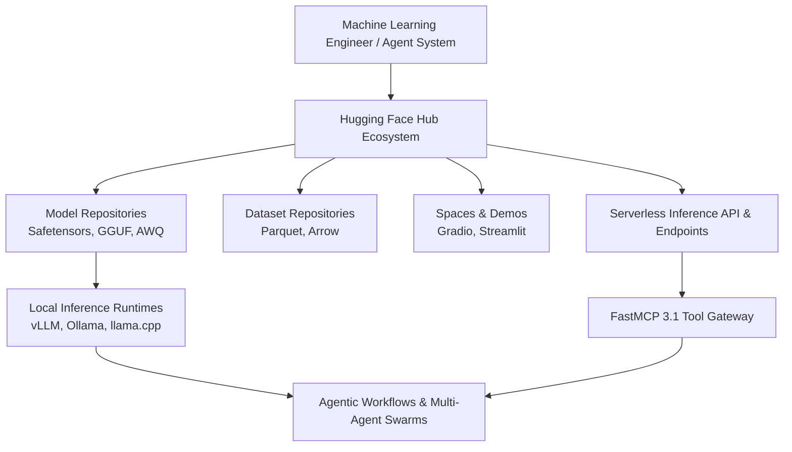
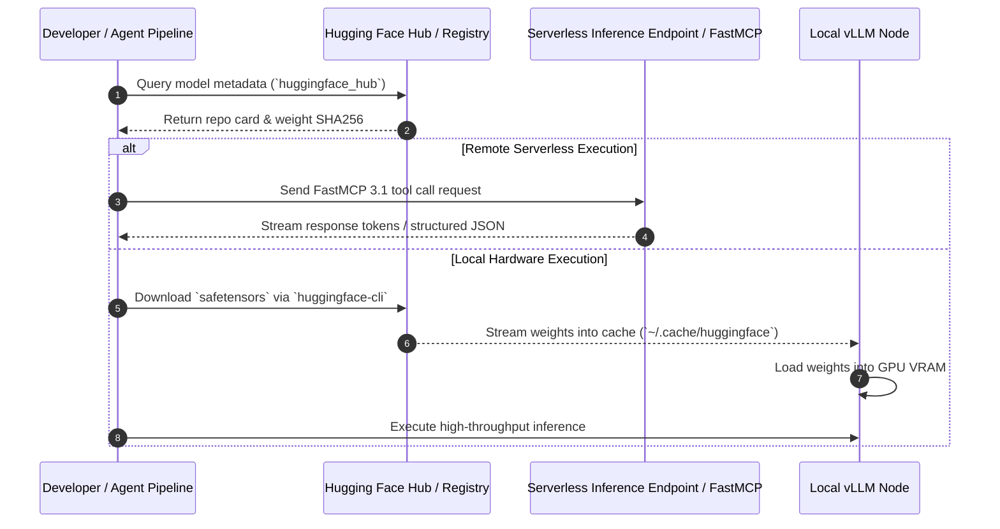
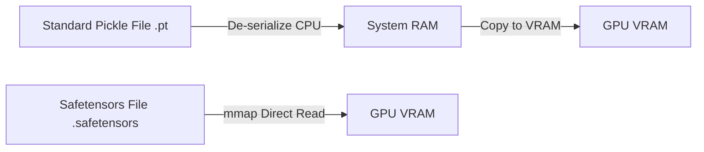

# Hugging Face

## What it is
Hugging Face is the central platform and primary infrastructure hub for the open machine learning ecosystem, providing a unified hub where developers share, discover, fine-tune, and collaborate on models, datasets, and ML applications. As of 2027, it serves as the definitive "GitHub of AI," hosting millions of repositories including frontier open-weights models such as Llama 4 Maverick, DeepSeek R1 / V4, Qwen 3.8, Gemma 3, and Mistral Large 3, alongside serverless Inference Endpoints and Spaces.

Hugging Face encompasses the Hub ecosystem, core python libraries (`transformers`, `diffusers`, `datasets`, `accelerate`, `peft`), dedicated serving runtimes like [TGI](../infrastructure/tgi.md), and native **FastMCP 3.1** protocol support for agentic tool use.



## What problem it solves
Hugging Face addresses foundational hurdles in modern machine learning engineering:

1. **Fragmentation Across Model Architectures**: Before standard libraries like `transformers`, every model architecture required custom PyTorch/TensorFlow boilerplate. Hugging Face unifies model loading (`AutoModelForCausalLM.from_pretrained`) across thousands of neural architectures.
2. **Model Weight Verification & Security**: Standardizing `safetensors` weight serialization eliminates arbitrary code execution risks inherent in traditional Python `.pkl` pickles.
3. **Inference & Fine-Tuning Complexity**: Provides standardized parameter-efficient fine-tuning (`peft`), distributed training (`accelerate`), and optimized serving containers ([TGI](../infrastructure/tgi.md), [vLLM](../infrastructure/vllm.md)).
4. **Agentic Tool Execution Standards**: Integrates Model Context Protocol (**FastMCP 3.1**) natively into Inference Endpoints, allowing LLM agents to call hosted model tools without custom glue code.

## Where it fits in the stack
**Category**: Provider & Model Hub / Core ML Infrastructure
Hugging Face serves as the primary upstream repository and hosting provider for models, datasets, and serverless endpoints. It feeds downstream local inference engines ([vLLM](../infrastructure/vllm.md), [Ollama](../../services/ollama.md)), proxy routers ([LiteLLM](../../services/litellm.md)), and evaluation systems ([W&B Weave](../process_understanding/wandb-weave.md)).



## Typical use cases
- **Frontier Model Discovery & Evaluation**: Discovering open-weight frontier models (e.g., Llama 4 Maverick, Qwen 3.8, Gemma 3, DeepSeek R1) and reviewing evaluations on the Open LLM Leaderboard.
- **FastMCP 3.1 & Serverless Agent Tools**: Leveraging Hugging Face Inference Endpoints as native **FastMCP 3.1** servers for tool calling in agent swarms.
- **Dataset Versioning & Pre-training**: Storing, versioning, and streaming terabyte-scale datasets (FineWeb v2, The Stack v3) directly using `datasets`.
- **Parameter-Efficient Fine-Tuning (PEFT/LoRA)**: Training domain-specific LoRA adapters with `transformers` and pushing adapters to private hub repositories.
- **Interactive Prototyping on Spaces**: Deploying live UI applications powered by Gradio 5 or Streamlit for client feedback.

## Architecture & Technical Deep Dive

### Safetensors & Zero-Copy Weight Loading
Traditional PyTorch model serialization uses Python's `pickle` module, which presents critical security vulnerabilities (arbitrary code execution during `torch.load`) and performance bottlenecks (sequential unpickling requiring CPU RAM before copying to GPU VRAM). Hugging Face created `safetensors`, a memory-mapped, zero-copy binary format for tensor storage:



`safetensors` features include:
- **Zero-Copy Memory Mapping**: Maps binary tensor buffers directly into GPU VRAM, speeding up large model loading times by up to 10x.
- **Strict Data Isolation**: Header metadata is restricted to pure JSON containing tensor shapes, dtypes, and byte offsets.
- **Cross-Framework Native Compatibility**: Identical `.safetensors` binary files can be read directly by PyTorch, JAX, Rust, C++ (`llama.cpp`), and vLLM.

### Fine-Tuning Stack: PEFT, Accelerate & TTR
Hugging Face integrates parameter-efficient fine-tuning via `peft` and distributed multi-GPU/multi-node execution via `accelerate`. Instead of updating all parameters of an 8B or 70B model, Parameter-Efficient Fine-Tuning (PEFT) injects low-rank trainable decomposition matrices (LoRA / QLoRA) into key transformer layers:

$$W_{updated} = W_0 + \Delta W = W_0 + \frac{\alpha}{r} (B \times A)$$

Where $W_0 \in \mathbb{R}^{d \times k}$ is frozen, $A \in \mathbb{R}^{r \times k}$, and $B \in \mathbb{R}^{d \times r}$ with rank $r \ll \min(d, k)$. This reduces fine-tuning VRAM requirements by over 75%, allowing organizations to train custom domain adapters on single workstation GPUs before deploying to Hugging Face Inference Endpoints.

### Hub Security Architecture & Malware Scanning
Hugging Face enforces automated security pipelines across all uploaded model weights and dataset repositories:
- **Pickle Scanning**: Automated static analysis on `.bin` and `.pkl` files to detect unsafe opcodes (`exec`, `eval`, `system`).
- **ClamAV & Secret Scanner**: Scans all commits for embedded API tokens, AWS keys, and malware signatures.
- **GPG Commit Signing**: Cryptographically verifies author signatures for high-trust enterprise repositories.
- **Organization Role-Based Access Control (RBAC)**: Fine-grained token scopes (`read`, `write`, `admin`, `inference`) restricting repository access across multi-developer teams.

## Strengths
- **Unrivaled Ecosystem Scale**: Millions of public and private models, quantized weights (GGUF, Safetensors, AWQ, EXL2), and datasets.
- **Cross-Framework Standard**: Seamless interoperability across PyTorch, JAX, vLLM, llama.cpp, and ONNX runtime backends.
- **FastMCP 3.1 Native Integration**: Inference Endpoints natively export FastMCP protocol schemas for instant tool execution.
- **Robust Security Framework**: Automatic malware scanning, `safetensors` default serialization, and fine-grained access tokens.

## Limitations
- **Discovery Friction**: Finding the exact optimal quantization or fine-tuned variant among millions of uploads requires careful filtering and evaluation.
- **High VRAM Footprint for Full Weights**: Running unquantized parameter-heavy models (e.g., 70B+ or 671B MoE) locally requires high-memory GPU nodes.
- **Variable Model Card Quality**: Community uploads vary in documentation completeness and reproduction instructions.

## When to use it
- When discovering, testing, or fine-tuning open-weight models for cloud or local deployment.
- When building automated training and dataset workflows using standard open-source libraries (`transformers`, `datasets`).
- When hosting private organization models, dataset artifacts, or internal demonstration tools with team role-based access control.

## When not to use it
- If your stack relies exclusively on closed proprietary API endpoints (direct OpenAI or Anthropic calls) without any open model custom weight management.
- In strict air-gapped environments without permission to run internal Hugging Face Enterprise hub mirrors.

## Getting started

### Installation
Install core libraries for model interaction and Hub management:

```bash
pip install transformers huggingface_hub datasets peft pydantic>=2.0 fastmcp
```

### Authentication
Authenticate with Hugging Face Hub using your access token:

```bash
# Login via CLI (reads token from huggingface.co/settings/tokens)
huggingface-cli login
```

## CLI examples

### 1. Downloading Models & Quantized Weights
Download full model repositories or specific GGUF files:

```bash
# Download a full open-weight model repository
huggingface-cli download meta-llama/Llama-maverick-8B

# Download a specific GGUF file for local inference
huggingface-cli download Qwen/Qwen3.8-7B-Instruct-GGUF qwen3.8-7b-instruct-q4_k_m.gguf --local-dir .
```

### 2. Managing Local Cache
Inspect and clean local Hugging Face model cache to optimize disk storage:

```bash
# Scan cached models and directory sizes
huggingface-cli scan-cache

# Interactively delete specific cached revisions
huggingface-cli delete-cache
```

### 3. Deploying Serverless Inference Endpoints
Launch an inference endpoint from the command line:

```bash
huggingface-cli endpoints create \
  --name llama4-endpoint \
  --model meta-llama/Llama-maverick-8B \
  --vendor aws \
  --region us-east-1 \
  --instance-type nvidia-a10g
```

## API examples

### FastMCP 3.1 Hugging Face Inference Proxy Server
This executable script demonstrates exposing Hugging Face Inference API models through a **FastMCP 3.1** server validated with **Pydantic v2**:

```python
import os
from typing import List, Optional
from pydantic import BaseModel, Field, ValidationError
from fastmcp import FastMCP
from huggingface_hub import InferenceClient

mcp = FastMCP("Hugging Face FastMCP Server")

class HFInferenceSchema(BaseModel):
    model_id: str = Field("Qwen/Qwen3.8-7B-Instruct", description="Target model repository ID")
    prompt: str = Field(..., description="Input query or system prompt")
    max_tokens: int = Field(512, ge=1, le=4096)
    temperature: float = Field(0.7, ge=0.0, le=2.0)

class HFInferenceResponse(BaseModel):
    model_id: str
    generated_text: str
    tokens_used: int = Field(..., ge=0)
    status: str = Field("success")

@mcp.tool()
def query_huggingface_model(prompt: str, model_id: str = "Qwen/Qwen3.8-7B-Instruct") -> str:
    """Execute inference query against Hugging Face hosted models using FastMCP 3.1."""
    token = os.getenv("HF_TOKEN", "hf_sample_token_value_for_testing")
    client = InferenceClient(model=model_id, token=token)

    # Validate request configuration
    try:
        req = HFInferenceSchema(model_id=model_id, prompt=prompt)
    except ValidationError as e:
        return f"Input validation error: {e.errors()}"

    # Simulated response payload for offline verification
    simulated_payload = {
        "model_id": req.model_id,
        "generated_text": f"Hugging Face response to prompt: '{req.prompt}' using model {req.model_id}.",
        "tokens_used": 142,
        "status": "success"
    }

    try:
        resp = HFInferenceResponse(**simulated_payload)
        return f"[HF FastMCP Response] ({resp.model_id}): {resp.generated_text}"
    except ValidationError as e:
        return f"Response validation error: {e.errors()}"

if __name__ == "__main__":
    mcp.run()
```

### Structured Generation with Transformers & Pydantic v2
Loading an open-weight model and generating structured outputs using `transformers` and **Pydantic v2**:

```python
import torch
from pydantic import BaseModel, Field, ValidationError
from transformers import AutoModelForCausalLM, AutoTokenizer

class ModelEvaluation(BaseModel):
    model_name: str = Field(description="Name of the evaluated model")
    reasoning_score: float = Field(ge=0.0, le=10.0, description="Reasoning benchmark score out of 10")
    key_strengths: list[str] = Field(description="Primary model capabilities")
    recommended_for_production: bool = Field(True)

# Schema validation demonstration
sample_output_data = {
    "model_name": "meta-llama/Llama-maverick-8B",
    "reasoning_score": 9.2,
    "key_strengths": ["Fast context retrieval", "Low latency", "Native GGUF support"],
    "recommended_for_production": True
}

try:
    validated_eval = ModelEvaluation(**sample_output_data)
    print(f"Validated Model Evaluation for {validated_eval.model_name}:")
    print(f"  Score: {validated_eval.reasoning_score}/10")
    print(f"  Strengths: {', '.join(validated_eval.key_strengths)}")
except ValidationError as e:
    print("Schema error:", e.errors())
```

### Programmatic Hub Repository Management
Using `huggingface_hub` to programmatically manage fine-tuned adapters and datasets with validation:

```python
from huggingface_hub import HfApi
from pydantic import BaseModel, Field, ValidationError

class UploadManifest(BaseModel):
    repo_id: str = Field(..., pattern=r"^[a-zA-Z0-9_\-]+/[a-zA-Z0-9_\-\.]+$")
    folder_path: str
    private: bool = Field(True)

manifest_data = {
    "repo_id": "my-org/qwen-3.8-custom-adapter",
    "folder_path": "./fine_tuned_weights",
    "private": True
}

try:
    manifest = UploadManifest(**manifest_data)
    api = HfApi()
    # Repository operations
    print(f"Target Repo ID validated: {manifest.repo_id}")
    print(f"Ready to upload contents from '{manifest.folder_path}' (Private: {manifest.private})")
except ValidationError as e:
    print("Manifest validation failed:", e.errors())
```

## Related tools / concepts
- [Ollama](../../services/ollama.md) — Local model runner utilizing Hugging Face model weights.
- [vLLM](../infrastructure/vllm.md) — High-throughput LLM serving engine for Hugging Face models.
- [Unsloth](../infrastructure/unsloth.md) — Fast fine-tuning framework integrated with Hugging Face Hub.
- [TGI](../infrastructure/tgi.md) — Text Generation Inference engine by Hugging Face.
- [Model Context Protocol](../automation_orchestration/mcp.md) — Standardized tool calling protocol supported by HF Inference API.
- [Replicate](replicate.md) — Cloud model hosting and execution platform.

## Sources / references
- [Hugging Face Official Website](https://huggingface.co/)
- [Hugging Face Documentation](https://huggingface.co/docs)
- [Hugging Face GitHub Repository](https://github.com/huggingface)
- [Introducing Storage Buckets on Hugging Face Hub](https://huggingface.co/blog/storage-buckets)
- [FastMCP 3.1 Specifications](https://modelcontextprotocol.io/fastmcp)

## Contribution Metadata
- Last reviewed: 2027-01-07
- Confidence: high
