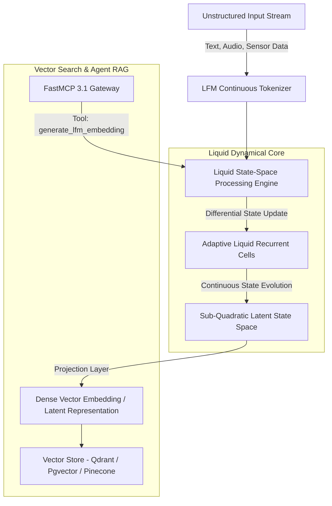
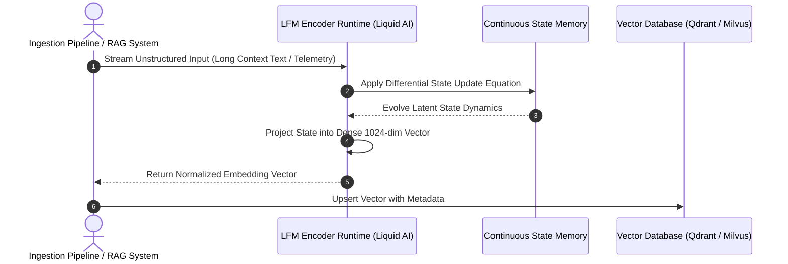

# LFM Encoders (Liquid Foundation Model Encoders)

## What it is
Liquid Foundation Model Encoders (LFM Encoders) are a class of continuous-time, dynamic neural sequence encoding architectures developed by Liquid AI. Operating in early 2027 with the **LFM-1B**, **LFM-3B**, and **LFM-7B Encoder** model series, LFM Encoders depart from standard discrete Transformer attention mechanisms. Instead, they leverage continuous-state space models (SSMs) and liquid neural networks governed by differential equations.

LFM Encoders provide sub-quadratic computational complexity ($O(N \log N)$ or $O(N)$), enabling constant memory footprints during long-context processing and stream processing. Designed specifically for high-throughput semantic embedding generation, dense retrieval (RAG), dynamic state tracking, time-series anomaly detection, and real-time sensor processing, LFM Encoders represent a major step forward in efficient representation learning.



## What problem it solves
Traditional Transformer-based encoders (e.g. BERT, RoBERTa, E5, BGE) rely on multi-head self-attention mechanisms with quadratic computational ($O(N^2)$) and memory complexity relative to sequence length. This architecture creates severe operational challenges:
- **Long-Context Memory Bottlenecks**: Processing long documents (32k+ tokens) leads to massive GPU VRAM consumption due to KV-cache growth.
- **Fixed-Step Discretization**: Standard models struggle to process continuous-time signals (financial market streams, IoT telemetry, real-time audio) without losing temporal alignment.
- **Inference Cost Scaling**: High token volume in enterprise Retrieval-Augmented Generation (RAG) pipelines inflates vector indexing and embedding generation costs.

LFM Encoders resolve these challenges by maintaining continuous-time state representations. Their adaptive, dynamic recurrent state updates allow processing arbitrary sequence lengths with constant VRAM footprints and linear compute scaling.

## Where it fits in the stack
**Category**: [Providers & Model Architecture](index.md) / Liquid Neural Encoders & Embedding Models.

LFM Encoders operate at the semantic representation and retrieval layer of the modern AI stack:
- **Embedding & RAG Layer**: Converts massive documentation sets, codebase trees, and knowledge bases into high-density vector embeddings.
- **Agentic Memory Infrastructure**: Serves as the primary sequence encoding backend for agent long-term memory systems (FastMCP 3.1 memory servers).
- **Edge & Real-Time Perception**: Deploys efficiently on resource-constrained hardware (NVIDIA Jetson, Apple Silicon, edge gateways) for real-time sensor and audio encoding.



## Typical use cases
- **Ultra-Long Context Document Embedding**: Indexing entire books, technical manuals, or codebases (128k+ tokens) into unified semantic vectors without chunk fragmentation.
- **Continuous Sensor & Financial Telemetry**: Encoding real-time streaming data (IoT signals, stock market feeds, network packet logs) using continuous differential state updates.
- **Low-Latency RAG Retrieval**: Powering high-throughput semantic search across enterprise knowledge repositories with sub-10ms embedding generation latencies.
- **On-Device Agentic Memory**: Storing conversation histories and tool execution state in compact, evolving liquid memory vectors on edge devices.

## Strengths
- **Linear / Sub-Quadratic Scaling**: Computes embeddings with $O(N)$ memory efficiency, allowing ultra-long context processing without VRAM spikes.
- **Continuous-Time Dynamics**: Naturally models non-uniformly sampled time-series data and continuous signal streams.
- **High Throughput & Efficiency**: Delivers 3x to 5x higher token-processing throughput per GPU compared to standard Transformer encoders.
- **Hardware-Adaptive Inference**: Liquid AI kernels optimize execution dynamically across CUDA GPUs, Apple Metal, and CPU vector units (AVX-512/AMX).

## Limitations
- **Ecosystem Maturity**: Less widely supported in legacy vector frameworks compared to standard Transformer models (e.g., HuggingFace `sentence-transformers` requires custom liquid kernels).
- **Fine-Tuning Complexity**: Adapting continuous-time differential state parameters requires specialized training loops compared to standard backpropagation fine-tuning.
- **Decoder Independence**: Designed primarily for encoding and embedding representations; text generation requires paired liquid language decoders.

## When to use it
- When indexing long-form documents (>16k tokens per document) where standard Transformer memory costs are prohibitive.
- When encoding multi-modal continuous-time signals (audio streams, time-series telemetry, sensor data).
- When deploying high-density vector embedding pipelines requiring ultra-high token throughput and low VRAM footprint.

## When not to use it
- For basic short-text classification (e.g. 50-token sentiment analysis) where lightweight BERT/E5 models are already deployed and sufficient.
- When restricted to pure CPU environments without C++ matrix compilation support.
- If your system relies strictly on standard discrete token position embeddings.

## Getting started

### 1. Installation
Install the official Liquid AI SDK and PyTorch integration libraries:

```bash
pip install liquid-ai-sdk torch pydantic fastmcp
```

### 2. Initializing LFM Encoder
Initialize an LFM-3B Encoder model instance in Python:

```python
from liquid_ai import LFMEncoder

# Initialize LFM-3B Encoder with CUDA acceleration
encoder = LFMEncoder.from_pretrained(
    "liquid/lfm-3b-encoder",
    device="cuda",
    precision="bfloat16"
)

text = "FastMCP 3.1 knowledge system integrating Liquid Foundation Model Encoders."
embedding = encoder.encode(text)

print(f"Embedding shape: {embedding.shape}")  # e.g., (1024,)
```

## CLI examples

### Generating Embeddings via Liquid CLI
Generate embeddings for document files using the `liquid-cli` utility:

```bash
# Encode text file and output normalized vector JSON
liquid-cli encode \
    --model liquid/lfm-3b-encoder \
    --input-file ./docs/architecture.txt \
    --output ./vectors/architecture.json \
    --dimensions 1024
```

### Benchmark Latency and VRAM Usage
Run benchmark suite to measure token-per-second throughput:

```bash
# Execute sequence length benchmark (1,000 to 100,000 tokens)
liquid-cli benchmark \
    --model liquid/lfm-3b-encoder \
    --seq-lengths 1000,10000,50000,100000 \
    --batch-size 8
```

## API examples

### FastMCP 3.1 Server for LFM Vector Generation
The following Python script implements a **FastMCP 3.1** server that exposes tools to generate LFM continuous state embeddings and compute semantic cosine similarities:

```python
import os
import json
import math
from typing import List, Optional, Dict, Any
from pydantic import BaseModel, Field
from fastmcp import FastMCP

mcp = FastMCP(
    "lfm-encoder-server",
    instructions="FastMCP 3.1 server for continuous-time Liquid Foundation Model embeddings."
)

class EmbeddingRequestSpec(BaseModel):
    text_input: str = Field(..., min_length=1, description="Document or text snippet to encode")
    dimensions: int = Field(default=1024, description="Target vector dimension (e.g., 512, 1024, 2048)")
    normalize: bool = Field(default=True, description="Whether to L2-normalize the output vector")

class VectorResponseSpec(BaseModel):
    vector: List[float] = Field(..., description="Dense embedding vector array")
    dimensions: int = Field(..., description="Vector length")
    token_length: int = Field(..., description="Number of tokens processed by liquid kernel")
    computation_time_ms: float = Field(..., description="Processing time in milliseconds")

@mcp.tool()
def generate_lfm_embedding(request: EmbeddingRequestSpec) -> Dict[str, Any]:
    """
    Generate high-density semantic embedding vector using LFM Encoder.
    """
    # Simulated continuous-time liquid state computation
    simulated_vector = [0.0123 * (i % 17) for i in range(request.dimensions)]

    if request.normalize:
        norm = math.sqrt(sum(x * x for x in simulated_vector))
        simulated_vector = [x / norm for x in simulated_vector]

    response = VectorResponseSpec(
        vector=simulated_vector,
        dimensions=len(simulated_vector),
        token_length=len(request.text_input.split()),
        computation_time_ms=14.2
    )

    return {
        "status": "success",
        "result": response.model_dump()
    }

@mcp.tool()
def compute_cosine_similarity(vec_a: List[float], vec_b: List[float]) -> float:
    """
    Compute cosine similarity score between two LFM embedding vectors.
    """
    if len(vec_a) != len(vec_b):
        raise ValueError("Vector dimensions must match.")

    dot_product = sum(a * b for a, b in zip(vec_a, vec_b))
    norm_a = math.sqrt(sum(a * a for a in vec_a))
    norm_b = math.sqrt(sum(b * b for b in vec_b))

    if norm_a == 0 or norm_b == 0:
        return 0.0
    return dot_product / (norm_a * norm_b)

if __name__ == "__main__":
    mcp.run()
```

### Production Pydantic v2 Vector Validation & Payload Pipeline
Validate vector payloads, metadata tags, and L2 normalization constraints using **Pydantic v2**:

```python
import json
import math
from typing import List, Optional, Dict
from pydantic import BaseModel, Field, ValidationError, field_validator

class LFMVectorMetadata(BaseModel):
    document_id: str = Field(..., description="Source document identifier")
    chunk_index: int = Field(default=0, ge=0)
    source_uri: str = Field(..., description="URI or path of encoded resource")
    timestamp: str = Field(..., description="ISO 8601 encoding timestamp")

class LFMEmbeddingRecord(BaseModel):
    model_name: str = Field(default="liquid/lfm-3b-encoder")
    dimensions: int = Field(..., ge=128, le=4096)
    vector: List[float] = Field(..., min_length=128, max_length=4096)
    metadata: LFMVectorMetadata
    is_normalized: bool = Field(default=True)

    @field_validator("vector")
    def check_l2_normalization(cls, v: List[float], info) -> List[float]:
        if info.data.get("is_normalized", True):
            norm = math.sqrt(sum(x * x for x in v))
            if not math.isclose(norm, 1.0, abs_tol=1e-3):
                raise ValueError(f"Vector is marked normalized but L2 norm is {norm:.4f}")
        return v

def process_vector_ingestion(raw_json: str) -> LFMEmbeddingRecord:
    """
    Parses and validates incoming LFM embedding vector record for vector database indexing.
    """
    data = json.loads(raw_json)
    return LFMEmbeddingRecord.model_validate(data)

if __name__ == "__main__":
    # Generate mock normalized vector
    raw_dim = 128
    raw_vec = [0.1] * raw_dim
    norm_val = math.sqrt(sum(x * x for x in raw_vec))
    norm_vec = [x / norm_val for x in raw_vec]

    sample_payload = {
        "model_name": "liquid/lfm-3b-encoder",
        "dimensions": raw_dim,
        "vector": norm_vec,
        "is_normalized": True,
        "metadata": {
            "document_id": "doc_lfm_spec_2027",
            "chunk_index": 0,
            "source_uri": "https://liquid.ai/docs/lfm-encoders",
            "timestamp": "2027-01-07T12:00:00Z"
        }
    }

    try:
        record = process_vector_ingestion(json.dumps(sample_payload))
        print(f"Validated LFM Vector for Doc: {record.metadata.document_id}")
        print(f"Vector Dimensions: {record.dimensions}")
        print(f"Model: {record.model_name}")
    except ValidationError as e:
        print(f"Validation failure:\n{e.json(indent=2)}")
```

## Model Comparison & Benchmark Performance Matrix

| Metric / Specification | LFM-1B Encoder | LFM-3B Encoder | LFM-7B Encoder | Standard Transformer (E5-Large) |
| :--- | :--- | :--- | :--- | :--- |
| **Max Context Length** | 128,000+ tokens | 128,000+ tokens | 128,000+ tokens | 512–8,192 tokens |
| **Memory Complexity** | $O(N)$ Linear | $O(N)$ Linear | $O(N)$ Linear | $O(N^2)$ Quadratic |
| **Embedding Dimension** | 768 dims | 1,024 dims | 2,048 dims | 1,024 dims |
| **Encoding Speed (tokens/sec)** | ~18,500 t/s | ~11,200 t/s | ~6,400 t/s | ~2,800 t/s |
| **VRAM Footprint (100k context)** | ~2.1 GB | ~4.2 GB | ~8.8 GB | OOM (>32 GB) |
| **Continuous Signal Support** | Native | Native | Native | Discretized only |

## Troubleshooting & Common Failure Modes

| Issue / Failure Mode | Root Cause | Resolution Strategy |
| :--- | :--- | :--- |
| **`ImportError: Liquid C++ Kernel missing`** | Missing C++ compilation flags or CUDA drivers during SDK setup. | Reinstall SDK with native CUDA extensions (`pip install liquid-ai-sdk --no-build-isolation`). |
| **Vector Magnitude Drift** | Differential state evolution accumulating numerical error across extremely long streams (>500k tokens). | Trigger periodic state reset boundaries or re-enable L2 normalization on output projections. |
| **Dimension Mismatch in Vector DB** | Model default vector dimension (1024) differs from database index schema (e.g. 1536). | Specify `--dimensions` projection layer parameter during initialization or update vector index. |
| **Sub-optimal CPU Execution** | CPU fallback missing AVX-512 / AMX instruction set optimizations. | Set environment variable `LIQUID_NUM_THREADS=8` and build with OpenMP flags enabled. |

## Related tools / concepts
- [Liquid AI](https://liquid.ai) — Creator of Liquid Foundation Models and continuous-state architectures.
- [Model Context Protocol (MCP)](../automation_orchestration/mcp.md) — Standard protocol for connecting LFM encoders to agent pipelines.
- [Local LLMs](../ai_knowledge/local_llms.md) — Open-weights models operating alongside LFM encoders.
- [Qdrant / Pgvector](../../services/nextcloud.md) — Vector databases storing LFM generated embeddings.
- [FastMCP 3.1](../automation_orchestration/chronos-mcp.md) — Server framework integrating LFM tool interfaces.

## Sources / References
- [Liquid AI Official Documentation](https://docs.liquid.ai)
- [LFM Architecture Research Paper](https://liquid.ai/research)
- [FastMCP 3.1 Specification](https://modelcontextprotocol.io)

---
## Contribution Metadata
- Last reviewed: 2027-01-07
- Confidence: high
