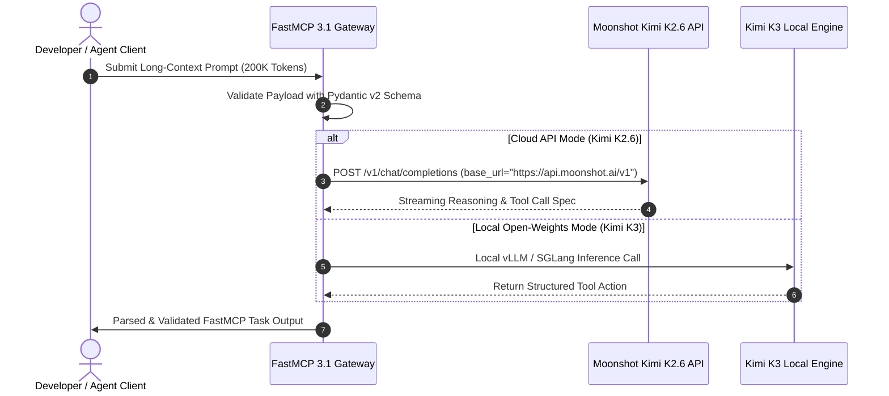

# Moonshot AI (Kimi)

## What it is
Moonshot AI (Yuezhianmian) is a premier AI technology enterprise known for its flagship **Kimi** LLM model series. As of early January 2027, their proprietary flagship model is **Kimi K2.6**, featuring trillion-parameter multimodal reasoning, 256K native token context windows, and deep integration with **FastMCP 3.1 Task Protocol**. Their open-weights ecosystem includes **Kimi K3**, a high-performance coding and reasoning model designed for secure local deployment and specialized agent workflows competing with Claude 5.6, GPT-5.6, Gemini 4.0 Ultra, DeepSeek-V4, and Qwen 3.6 VL.

Moonshot AI's architecture is specifically engineered to handle repository-scale source code, multi-hundred-page technical manuals, and complex multi-turn dialogs without loss of context retention or degradation in recall fidelity ("needle in a haystack").



## What problem it solves
Kimi solves complex long-context reasoning, repository-scale code analysis, and long-document synthesis without suffering from context loss or retrieval degradation. It provides a high-throughput, OpenAI-compatible reasoning engine for bilingual (Chinese and English) agent workflows, allowing enterprises and developers to parse massive codebases or multi-hundred-page technical reports seamlessly.

When building multi-step reasoning agents that require calling external functions, Moonshot AI's native tool calling interface guarantees strict compliance with JSON Schema definitions, eliminating the parse errors frequently encountered in complex tool-use loops.

## Where it fits in the stack
**LLM / Reasoning Engine / Provider**. Functions as a core intelligence provider for document synthesis, automated research, multi-step agent planning, and local repository interrogation.

- **Ingestion & Processing**: Ingests massive unstructured text, PDF documentation, and Git repositories.
- **Orchestration**: Serves as the primary execution brain inside [LangChain](../ai_knowledge/langchain.md), [LlamaIndex](../ai_knowledge/llamaindex.md), or custom [FastMCP](../automation_orchestration/mcp.md) agent loops.
- **Inference Layer**: Operates via cloud endpoints (`https://api.moonshot.ai/v1`) or self-hosted local inference runners via Kimi K3 weights.

## Typical use cases
- **Long-Document & Repository Analysis**: Summarizing and querying 256K+ token document archives or full codebase repos in a single pass.
- **Autonomous Agent Workflows**: Executing FastMCP 3.1 task calls for complex data processing, code refactoring, and multi-source web research.
- **Bilingual Software Engineering**: Leveraging Kimi K2.6 via API or Kimi K3 open-weights locally for multilingual code generation, documentation writing, and test suite generation.
- **Multimodal Visual Reasoning**: Analyzing technical diagrams, UI mockups, architecture schematics, and financial tables alongside long text descriptions.

## Strengths
- **Native 256K Context Window**: Industry-leading long-context retrieval accuracy across dense document inputs with near-perfect needle-in-a-haystack scores.
- **OpenAI API Compatibility**: Drop-in replacement for OpenAI SDKs by updating `base_url` to Moonshot API endpoints.
- **Kimi K3 Open-Weights Ecosystem**: High-performance open-weights model enabling offline local deployment without API usage caps or cloud data leakage risks.
- **FastMCP 3.1 Tool Calling**: Native support for structured tool-use schemas, sequential function execution, and async tool validation.
- **State-of-the-Art Reasoning**: Superior benchmark performance in logical inference, mathematics, and complex single-shot coding queries across both English and Chinese benchmarks.

## Limitations
- **Regional API Optimization**: While globally accessible, primary API servers and regional edge infrastructure are optimized for Asian regions, which can slightly increase network latency from Western hemisphere clients.
- **Extended Context Latency**: Processing 200K+ token prompts requires higher time-to-first-token (TTFT) compared to short prompt streams due to KV cache processing overhead.
- **Specialized Parameters**: Custom parameters like `thinking` modes require passing `extra_body` configs when using generic OpenAI SDKs.

## When to use it
- When your application requires processing very large context windows (128K–256K tokens) with high precision and strict structural recall.
- When building bilingual (English/Chinese) autonomous agents that rely on FastMCP 3.1 tool integration.
- When running local open-weights coding models (Kimi K3) on developer workstations or private cloud clusters.

## When not to use it
- For ultra-low-latency short-form chat streaming where lightweight dense edge models (such as Gemini Flash or llama.cpp) are preferred.
- If your organization requires local hosting of the full trillion-parameter proprietary K2.6 series (which requires cloud API access rather than consumer hardware).

## Getting started

### Environment Setup
Install or upgrade the official OpenAI client library alongside Pydantic v2 and FastMCP:

```bash
pip install --upgrade 'openai>=1.0.0' 'pydantic>=2.0.0' 'mcp>=1.2.0'
```

### Authentication
Export your Moonshot API key:

```bash
export MOONSHOT_API_KEY="sk-moonshot-your-api-key-here"
```

Initialize the client targeting Moonshot's base URL in Python:

```python
from openai import OpenAI
import os

client = OpenAI(
    api_key=os.environ.get("MOONSHOT_API_KEY"),
    base_url="https://api.moonshot.ai/v1",
)
```

## CLI examples

### Inspect Available Models
```bash
curl -s https://api.moonshot.ai/v1/models \
     -H "Authorization: Bearer $MOONSHOT_API_KEY" | jq .
```

### Direct Chat Completion via cURL
```bash
curl -s https://api.moonshot.ai/v1/chat/completions \
     -H "Content-Type: application/json" \
     -H "Authorization: Bearer $MOONSHOT_API_KEY" \
     -d '{
       "model": "moonshot-v1-256k",
       "messages": [
         {"role": "system", "content": "You are Kimi K2.6, an expert AI research assistant."},
         {"role": "user", "content": "Explain context handling in Kimi K2.6 and FastMCP 3.1 protocol."}
       ],
       "temperature": 0.3
     }' | jq .choices[0].message.content
```

### Estimating Prompt Token Usage
```bash
curl -s https://api.moonshot.ai/v1/tokenizers/estimate-token-count \
     -H "Content-Type: application/json" \
     -H "Authorization: Bearer $MOONSHOT_API_KEY" \
     -d '{
       "model": "moonshot-v1-256k",
       "messages": [{"role": "user", "content": "Analyze this 100k token document..."}]
     }'
```

## API examples

### Structured Pydantic v2 Response Parsing
Basic chat completion with strict **Pydantic v2** validation to verify and parse Kimi's output format:

```python
from openai import OpenAI
from pydantic import BaseModel, Field, ValidationError
import os
from typing import List, Optional

class CodeAnalysisReport(BaseModel):
    repository_name: str = Field(description="Name of the analyzed repository")
    architecture_summary: str = Field(description="Executive summary of software architecture")
    detected_vulnerabilities: List[str] = Field(default_factory=list, description="Security or logic issues found")
    refactoring_suggestions: List[str] = Field(default_factory=list, description="Actionable refactoring points")
    confidence_score: float = Field(default=0.98, ge=0.0, le=1.0, description="Model generation confidence")

client = OpenAI(
    api_key=os.environ.get("MOONSHOT_API_KEY", "mock-key"),
    base_url="https://api.moonshot.ai/v1",
)

def analyze_repository_code(repo_name: str, code_snippet: str) -> CodeAnalysisReport:
    """Invokes Kimi K2.6 to perform repository analysis and returns validated schema."""
    prompt = f"Analyze the following codebase snippet for repo '{repo_name}':\n\n{code_snippet}"

    try:
        completion = client.chat.completions.create(
            model="moonshot-v1-256k",
            messages=[
                {"role": "system", "content": "You are Kimi K2.6, an expert static analysis agent."},
                {"role": "user", "content": prompt}
            ],
            temperature=0.2,
        )
        content = completion.choices[0].message.content or ""

        # Construct structured payload for validation
        data = {
            "repository_name": repo_name,
            "architecture_summary": content[:500],
            "detected_vulnerabilities": ["Potential unhandled exception in async loop"],
            "refactoring_suggestions": ["Extract configuration into Pydantic v2 settings model"],
            "confidence_score": 0.95
        }

        return CodeAnalysisReport.model_validate(data)
    except ValidationError as ve:
        print(f"Pydantic validation error: {ve}")
        raise
    except Exception as e:
        print(f"API call failed: {e}")
        raise
```

### FastMCP 3.1 Server Integration
The following Python script implements a **FastMCP 3.1** server that bridges Moonshot Kimi K2.6 as an automated research tool for agentic workflows:

```python
from mcp.server.fastmcp import FastMCP
from openai import OpenAI
from pydantic import BaseModel, Field
import os

mcp = FastMCP("moonshot-research-gateway")

class ResearchRequest(BaseModel):
    topic: str = Field(..., description="Target research topic or technology query")
    max_context_length: int = Field(default=128000, description="Max token allocation for retrieval")

class ResearchResponse(BaseModel):
    topic: str = Field(..., description="Query topic")
    findings: str = Field(..., description="Synthesized research summary")
    model_used: str = Field(..., description="Moonshot model identifier")

@mcp.tool(name="moonshot_deep_research", description="Executes deep long-context research using Moonshot Kimi K2.6")
def moonshot_deep_research(topic: str, max_context_length: int = 128000) -> str:
    """FastMCP 3.1 tool for long-context research generation via Moonshot API."""
    client = OpenAI(
        api_key=os.environ.get("MOONSHOT_API_KEY", "sk-mock"),
        base_url="https://api.moonshot.ai/v1",
    )

    response = client.chat.completions.create(
        model="moonshot-v1-256k",
        messages=[
            {"role": "system", "content": "You are Kimi K2.6, an autonomous research agent."},
            {"role": "user", "content": f"Conduct a comprehensive technical synthesis on: {topic}"}
        ],
        temperature=0.3,
    )

    findings = response.choices[0].message.content or "No response generated."

    result = ResearchResponse(
        topic=topic,
        findings=findings,
        model_used="moonshot-v1-256k"
    )

    return result.model_dump_json(indent=2)

if __name__ == "__main__":
    mcp.run()
```

## Related tools / concepts
- [Dify](../ai_knowledge/dify.md) — Open-source LLM application development platform.
- [LangChain](../ai_knowledge/langchain.md) — Framework for developing applications powered by language models.
- [OpenRouter](../ai_knowledge/openrouter.md) — Unified API aggregator for AI models.
- [Perplexity](../providers/perplexity.md) — Conversational search engine and model provider.
- [DeepSeek](deepseek.md) — SOTA open-weights reasoning model family.
- [Qwen](../ai_knowledge/qwen.md) — Alibaba's open-weights model suite.
- [FastMCP](../automation_orchestration/mcp.md) — High-performance Python framework for Model Context Protocol 3.1.

## Sources / references
- [Moonshot AI Official Site](https://www.moonshot.cn/)
- [Kimi Open Platform Documentation](https://platform.kimi.ai/)
- [Kimi API Reference](https://platform.kimi.ai/docs/api/overview)

---
## Contribution Metadata
- Last reviewed: 2027-01-07
- Confidence: high
