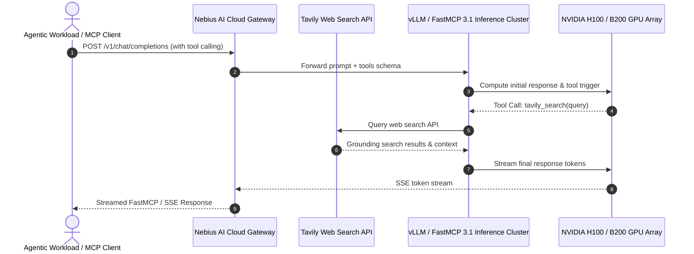

# Nebius Group

## What it is
Nebius Group (Nebius AI Cloud) is an AI infrastructure and cloud platform provider delivering high-performance GPU clusters (NVIDIA H100, H200, B200), managed Kubernetes, managed databases, and AI developer services (including [Tavily](tavily.md) for agentic web search). As of early January 2027, Nebius operates enterprise AI data centers across Europe and North America, supporting frontier model training, fine-tuning, and high-throughput FastMCP 3.1 inference workloads.



## What problem it solves
Training frontier models and deploying multi-agent applications requires specialized AI cloud infrastructure that traditional hyperscalers often struggle to deliver efficiently:
- **GPU Cluster Orchestration**: Delivers ultra-low latency InfiniBand inter-node connections for distributed model training (PyTorch, DeepSpeed).
- **Integrated Agent Services**: Hosts agentic search capabilities through parent ownership of [Tavily](tavily.md).
- **Cost-Optimized AI Compute**: Offers competitive GPU instance rates with flexible commitment terms for AI startups and enterprise AI labs.
- **FastMCP 3.1 & Model Serving**: Managed Slurm, Kubernetes, and inference server deployments optimized for FastMCP 3.1 tool-calling streaming APIs.

## Where it fits in the stack
**Providers / AI Cloud Infrastructure**. Nebius sits alongside GPU cloud providers (Lambda Labs, CoreWeave, RunPod, AWS Bedrock) and specialized AI service stacks.

## Architecture & Infrastructure Overview
Nebius AI Cloud is built specifically for large-scale GPU workloads:
1. **InfiniBand Network Architecture**: Nodes are interconnected via 3.2 Tbps NVIDIA Quantum-2 InfiniBand networking, enabling linear scaling for distributed FSDP and Megatron-LM model training across hundreds of GPUs.
2. **Managed Slurm & Kubernetes Clusters**: Developers can provision native Slurm clusters for batch HPC jobs or Kubernetes clusters (MK8S) equipped with GPU operator drivers and automated node scaling.
3. **Storage Tiering**: Delivers local NVMe scratch storage with up to 7 GB/s per node alongside persistent high-throughput object storage for dataset and checkpoint streaming.

## Typical use cases
- **Frontier LLM Training & Fine-Tuning**: Running large-scale distributed training jobs using Axolotl, Llama-Factory, or PyTorch FSDP across NVIDIA H100/B200 clusters.
- **Agentic Search Integration**: Deploying agent search workloads via Tavily API hosted on Nebius AI Cloud.
- **High-Throughput Inference Clusters**: Provisioning vLLM or Aphrodite Engine deployments on Nebius Kubernetes with FastMCP 3.1 streaming support.
- **Private Enterprise Deployment**: Hosting air-gapped AI workloads with GDPR and SOC2 compliance.

## Strengths
- **Bare-Metal & Managed GPU Compute**: Native InfiniBand connectivity with minimal virtualization overhead.
- **Developer-Friendly API & CLI**: Infrastructure provisioning via Terraform, Ansible, and the `nebius` CLI.
- **Ecosystem Integration**: Native parent-company integration with Tavily AI agent search services.
- **High Availability**: Redundant Tier-3 data centers across major European and American regions.

## Limitations
- **Focus on AI Compute**: Optimized specifically for AI/ML workloads rather than general web app hosting or legacy enterprise IT services.
- **Regional Footprint**: Geographic availability expands rapidly but is concentrated in key AI cloud hubs.

## When to use it
- When requiring multi-GPU or multi-node clusters for LLM training and fine-tuning.
- When seeking a cloud provider with native integration for agentic web search (Tavily).
- When looking for cost-effective NVIDIA H100/B200 GPU compute with InfiniBand interconnects.

## When not to use it
- When hosting general web applications, traditional monolithic SQL databases, or legacy non-AI enterprise software.
- When requiring local on-premise deployments without public cloud interconnects.

## Getting started
1. Create a Nebius AI Cloud account at [nebius.com](https://nebius.com).
2. Install the Nebius CLI or Terraform provider.
3. Authenticate with your cloud credentials: `nebius auth login`.

## CLI examples

### Authenticating via Nebius CLI
```bash
nebius auth login --iam-token $NEBIUS_IAM_TOKEN
```

### Listing Available GPU Instances via CLI
```bash
nebius compute instance list --folder-id $NEBIUS_FOLDER_ID
```

### Provisioning a Managed Kubernetes GPU Node Group
```bash
nebius k8s node-group create \
  --cluster-id $NEBIUS_K8S_CLUSTER_ID \
  --name gpu-h100-pool \
  --platform-id gpu-h100-sxm5 \
  --gpus-per-node 8 \
  --node-count 4
```

## API examples

### 1. Provisioning a Nebius GPU Instance via Terraform
```hcl
terraform {
  required_providers {
    nebius = {
      source = "nebius/nebius"
      version = ">= 0.4.0"
    }
  }
}

provider "nebius" {
  region = "eu-west-1"
}

resource "nebius_compute_instance" "gpu_node" {
  name        = "llm-training-h100-node"
  zone        = "eu-west-1-a"
  platform_id = "gpu-h100-sxm5"

  resources {
    cores  = 64
    memory = 512
    gpus   = 8
  }

  boot_disk {
    initialize_params {
      image_id = "ubuntu-24-04-cuda-12-8"
      size     = 1000
    }
  }

  network_interface {
    subnet_id = "subnet-ai-cluster-01"
    nat       = true
  }
}
```

### 2. Pydantic v2 Schema for Nebius Cluster Configuration
```python
from typing import List, Optional, Dict
from pydantic import BaseModel, ConfigDict, Field, field_validator

class NebiusGPUGroupSpec(BaseModel):
    model_config = ConfigDict(extra="forbid")

    platform_id: str = Field(..., description="GPU platform identifier (e.g., gpu-h100-sxm5)")
    gpus_per_node: int = Field(default=8, ge=1, le=8)
    nodes_count: int = Field(default=1, ge=1, le=64)
    infiniband_enabled: bool = Field(default=True, description="Enable 3.2Tbps InfiniBand interconnect")

    @field_validator("platform_id", mode="before")
    @classmethod
    def check_platform(cls, v: str) -> str:
        valid_platforms = ["gpu-h100-sxm5", "gpu-h200-sxm5", "gpu-b200-sxm5", "gpu-l40s"]
        if v not in valid_platforms:
            raise ValueError(f"platform_id must be one of {valid_platforms}")
        return v

class NebiusClusterConfig(BaseModel):
    model_config = ConfigDict(extra="forbid")

    cluster_name: str = Field(..., description="Name of Nebius AI Cloud cluster")
    folder_id: str = Field(..., description="Nebius IAM folder identifier")
    region: str = Field(default="eu-west-1", description="Cloud region")
    gpu_pool: NebiusGPUGroupSpec
    enable_tavily_agent_search: bool = Field(default=True)
    tags: Dict[str, str] = Field(default_factory=dict)

if __name__ == "__main__":
    cfg = NebiusClusterConfig(
        cluster_name="deepseek-r1-fine-tuning",
        folder_id="fld-nebius-12345",
        region="eu-west-1",
        gpu_pool=NebiusGPUGroupSpec(platform_id="gpu-h100-sxm5", gpus_per_node=8, nodes_count=4),
        tags={"owner": "ai-ops", "project": "rag-v2"}
    )
    print(f"Nebius cluster '{cfg.cluster_name}' configured with {cfg.gpu_pool.nodes_count * cfg.gpu_pool.gpus_per_node} GPUs.")
```

### 3. FastMCP 3.1 Task Protocol Integration
```python
from mcp.server.fastmcp import FastMCP, Context
import time

mcp = FastMCP("nebius-cloud-controller")

@mcp.tool()
async def provision_gpu_cluster(
    ctx: Context,
    cluster_name: str,
    gpu_type: str = "gpu-h100-sxm5",
    node_count: int = 1
) -> dict:
    """Provisions an InfiniBand-connected GPU cluster on Nebius AI Cloud."""
    ctx.info(f"Provisioning {node_count}x {gpu_type} nodes for cluster '{cluster_name}'")

    # Simulate API orchestration call
    time.sleep(0.1)

    return {
        "status": "provisioned",
        "cluster_name": cluster_name,
        "gpu_type": gpu_type,
        "total_gpus": node_count * 8,
        "infiniband": "active",
        "cluster_endpoint": f"https://{cluster_name}.k8s.nebius.cloud"
    }

@mcp.tool()
async def query_tavily_agent_search(
    ctx: Context,
    query: str,
    search_depth: str = "advanced"
) -> dict:
    """Executes a search query using Nebius-integrated Tavily Agentic Search API."""
    ctx.info(f"Executing Tavily search on Nebius Cloud: {query}")
    return {
        "query": query,
        "depth": search_depth,
        "results_count": 5,
        "grounding_sources": [
            "https://nebius.com/docs/ai-cloud",
            "https://tavily.com/mcp"
        ]
    }
```

## Related tools / concepts
- [Tavily](tavily.md)
- [vLLM](../infrastructure/vllm.md)
- [DeepSpeed](../frameworks/deepspeed.md)
- [Axolotl](../frameworks/axolotl.md)
- [CoreWeave](coreweave.md)

## Sources / references
- [Nebius Official Website](https://nebius.com)
- [Nebius Cloud Documentation](https://docs.nebius.com/)
- [Tavily Acquisition Notice](https://nebius.com/news/tavily-acquisition)

## Contribution Metadata
- Last reviewed: 2027-01-07
- Confidence: high
