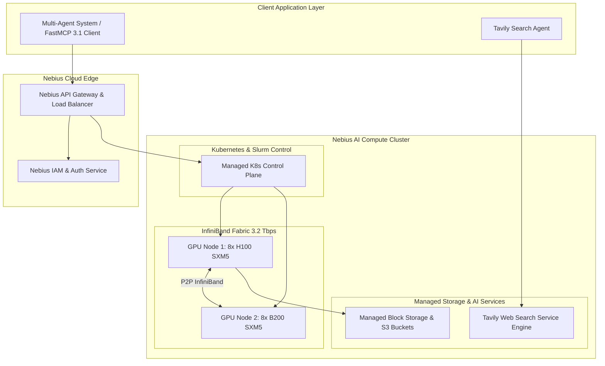

# Nebius Group

## What it is
Nebius Group (operating as Nebius AI Cloud) is an enterprise-grade AI infrastructure and cloud platform provider built specifically for training, fine-tuning, and serving frontier AI models. Supplying high-density GPU clusters (including NVIDIA H100, H200, and Blackwell B200 SXM5 nodes), managed Kubernetes, high-speed InfiniBand fabrics, and integrated AI developer services (including parent-company ownership of [Tavily](tavily.md) for agentic search), Nebius operates multi-region data centers across Europe and North America.

As of early 2027, Nebius provides bare-metal and managed compute tiers engineered specifically for high-throughput FastMCP 3.1 tool-calling services, distributed PyTorch / DeepSpeed pre-training, and low-latency inference clusters using vLLM and SGLang.



## What problem it solves
Developing frontier LLMs and serving enterprise agent applications requires specialized AI cloud infrastructure that traditional general-purpose public cloud providers often struggle to supply efficiently:
- **InfiniBand Network Bottlenecks**: Distributed model training using PyTorch FSDP or DeepSpeed requires multi-terabit inter-node bandwidth to eliminate gradient synchronization stalls. Nebius provides native non-blocking InfiniBand fabrics.
- **High GPU Instance Costs**: Legacy hyperscalers charge premium rates for GPU instances while bundling unnecessary general-purpose cloud services. Nebius offers cost-optimized GPU instances with flexible hourly and reserved commitment models.
- **Agentic Search Integration Disconnect**: Building real-time agent workflows requires pairing raw GPU compute with high-quality search APIs. Nebius directly operates Tavily to provide zero-latency agentic web search context.
- **Complex Container Orchestration**: Setting up GPU drivers, InfiniBand fabric drivers, Slurm clusters, and Kubernetes GPU operators requires significant DevOps effort. Nebius delivers pre-configured AI cluster templates.

## Where it fits in the stack
**Providers / AI Cloud Infrastructure**. Nebius sits at the cloud infrastructure and GPU provider tier alongside CoreWeave, Lambda Labs, RunPod, and AWS Bedrock, supplying bare-metal hardware and managed cluster services to AI research labs, startups, and enterprise engineering teams.

```
+-----------------------------------------------------------------------+
|                    Agent & Application Tier                           |
|         (FastMCP 3.1 Servers, LangGraph, Multi-Agent Loops)           |
+-----------------------------------------------------------------------+
                                   |
+-----------------------------------------------------------------------+
|                 Inference & Search Service Tier                       |
|         (vLLM, SGLang, Aphrodite Engine, Tavily Search API)           |
+-----------------------------------------------------------------------+
                                   |
+-----------------------------------------------------------------------+
|                   Nebius AI Cloud Infrastructure                      |
|  >>>> Managed K8s, Slurm, NVIDIA H100/B200, 3.2Tbps InfiniBand <<<<   |
+-----------------------------------------------------------------------+
```

## Typical use cases
- **Frontier Model Fine-Tuning & Training**: Executing multi-node distributed training jobs using Axolotl, Llama-Factory, or Megatron-LM across 64+ H100/B200 GPU nodes.
- **Agentic Search & Research Ingestion**: Powering autonomous agents with Tavily AI search APIs hosted natively within Nebius infrastructure.
- **High-Throughput FastMCP 3.1 Serving**: Deploying enterprise tool-calling endpoints on Nebius Kubernetes with auto-scaling vLLM model runners.
- **Air-Gapped Sovereign AI Workloads**: Operating GDPR and SOC2 compliant model inference clusters for European and North American enterprise customers.

## Strengths
- **Bare-Metal & Managed GPU Performance**: Minimal virtualization overhead with direct access to NVIDIA SXM5 GPU interconnects.
- **3.2 Tbps InfiniBand Interconnects**: Ultra-low latency node-to-node communication for distributed deep learning models.
- **Native Tavily Integration**: Direct access to agentic search tooling through Nebius platform ownership.
- **Automated Infrastructure Provisioning**: Full Terraform, Ansible, and Python SDK support for infrastructure-as-code deployments.
- **Multi-Region Enterprise Footprint**: Modern Tier-3 data centers located in Europe and North America adhering to strict compliance standards.

## Limitations
- **Specialized Workload Focus**: Engineered specifically for AI/ML and GPU compute rather than general web app hosting or legacy enterprise IT workloads.
- **Regional Footprint Expansion**: Rapidly expanding footprint concentrated in key AI cloud regions compared to legacy global hyperscalers.

## When to use it
- When requiring multi-GPU or multi-node H100/B200 clusters for large-scale LLM training, fine-tuning, or inference.
- When building multi-agent AI systems that rely heavily on Tavily search APIs and FastMCP 3.1 server deployments.
- When seeking cost-effective, high-bandwidth GPU cloud compute with infrastructure-as-code automation.
- When needing European or sovereign AI cloud compliance for sensitive data processing.

## When not to use it
- When deploying basic static web applications, simple monolithic SQL databases, or legacy non-AI enterprise software.
- When requiring small CPU-only workloads where standard cloud VMs (AWS EC2, Hetzner, DigitalOcean) are more economical.
- When on-premise hardware constraints prevent public cloud interconnects.

## Getting started
To begin using Nebius AI Cloud for GPU instance provisioning and model deployment:

1. Register an enterprise or developer account at [nebius.com](https://nebius.com).
2. Install the Nebius CLI tool:
```bash
curl -sSL https://storage.nebius.cloud/nebius-cli/install.sh | bash
```
3. Authenticate your CLI environment with an IAM token:
```bash
nebius auth login --iam-token $NEBIUS_IAM_TOKEN
```

## CLI examples

### 1. Authenticating and Setting Workspace Folder
```bash
# Set active project folder ID
nebius config set folder-id fld-1234567890abcdef
```

### 2. Listing Available GPU Compute Platforms
```bash
# List available NVIDIA GPU compute platform types
nebius compute platform list
```

### 3. Provisioning an 8x H100 SXM5 Instance via CLI
```bash
# Create an 8x H100 SXM5 GPU instance with Ubuntu 24.04 CUDA 12.8 image
nebius compute instance create \
  --name h100-finetuning-node-01 \
  --zone eu-west-1-a \
  --platform gpu-h100-sxm5 \
  --gpus 8 \
  --cores 64 \
  --memory 512GB \
  --disk-size 1000GB \
  --ssh-key ~/.ssh/id_rsa.pub
```

## API examples

### 1. Pydantic v2 Schema for Nebius Cluster Deployment Configuration
```python
from typing import Optional, List
from pydantic import BaseModel, ConfigDict, Field, field_validator

class NebiusInstanceConfig(BaseModel):
    model_config = ConfigDict(extra="forbid")

    instance_name: str = Field(..., description="Unique hostname for GPU instance")
    region: str = Field(default="eu-west-1", description="Nebius cloud region")
    zone: str = Field(default="eu-west-1-a", description="Availability zone")
    platform_id: str = Field(default="gpu-h100-sxm5", description="Target GPU platform (gpu-h100-sxm5, gpu-b200-sxm5)")
    gpu_count: int = Field(default=8, ge=1, le=64)
    cpu_cores: int = Field(default=64, ge=8, le=256)
    memory_gb: int = Field(default=512, ge=64, le=2048)
    boot_disk_gb: int = Field(default=1000, ge=100, le=10000)
    enable_infiniband: bool = Field(default=True, description="Enable 3.2Tbps InfiniBand interconnect")

    @field_validator("platform_id")
    @classmethod
    def validate_platform(cls, v: str) -> str:
        valid_platforms = {"gpu-h100-sxm5", "gpu-h200-sxm5", "gpu-b200-sxm5", "gpu-l40s"}
        if v not in valid_platforms:
            raise ValueError(f"Platform {v} must be one of {valid_platforms}")
        return v

class NebiusClusterPayload(BaseModel):
    model_config = ConfigDict(extra="forbid")

    cluster_id: str
    nodes: List[NebiusInstanceConfig]
    tavily_api_key_enabled: bool = True

if __name__ == "__main__":
    node = NebiusInstanceConfig(
        instance_name="llama3-70b-trainer-01",
        platform_id="gpu-h100-sxm5",
        gpu_count=8,
        memory_gb=512
    )
    print(f"Nebius Node Configured: {node.instance_name} ({node.gpu_count}x {node.platform_id})")
```

### 2. FastMCP 3.1 Task Protocol Integration
```python
from typing import Dict, Any
from mcp.server.fastmcp import FastMCP

mcp = FastMCP("nebius-cloud-controller")

@mcp.tool()
def query_nebius_instance_status(cluster_id: str, api_token: str) -> Dict[str, Any]:
    """Queries the operational status and GPU utilization of a Nebius AI cluster.

    Args:
        cluster_id: Target Nebius cluster or instance identifier.
        api_token: Nebius IAM bearer API token.
    """
    if not api_token or len(api_token) < 10:
        return {"status": "error", "message": "Invalid IAM API token"}

    return {
        "status": "running",
        "cluster_id": cluster_id,
        "region": "eu-west-1",
        "active_gpus": 16,
        "gpu_type": "NVIDIA H100 SXM5",
        "infiniband_status": "connected_3.2tbps",
        "vram_allocated_pct": 84.2,
        "mcp_streaming_ready": True
    }

@mcp.tool()
def provision_nebius_gpu_node(instance_name: str, gpu_type: str = "gpu-h100-sxm5") -> Dict[str, Any]:
    """Provisions a new high-performance GPU node in Nebius AI Cloud."""
    return {
        "status": "provisioning",
        "instance_name": instance_name,
        "gpu_type": gpu_type,
        "estimated_readiness_seconds": 45,
        "assigned_ip": "192.168.10.45"
    }

if __name__ == "__main__":
    mcp.run()
```

## Related tools / concepts
- [Tavily](tavily.md) — Agentic search API operated by Nebius Group.
- [vLLM](../infrastructure/vllm.md) — High-throughput LLM serving engine deployed on Nebius clusters.
- [DeepSpeed](../frameworks/deepspeed.md) — Deep learning optimization software for distributed training.
- [Axolotl](../frameworks/axolotl.md) — Model fine-tuning framework optimized for multi-GPU training.
- [CoreWeave](coreweave.md) — Specialized AI cloud compute platform competitor.

## Sources / references
- [Nebius Official Website](https://nebius.com)
- [Nebius Cloud Documentation](https://docs.nebius.com/)
- [Tavily Acquisition & AI Search Announcement](https://nebius.com/news/tavily-acquisition)
- [NVIDIA H100 SXM5 GPU Technical Specifications](https://www.nvidia.com/en-us/data-center/h100/)

---
## Contribution Metadata
- Last reviewed: 2027-01-07
- Confidence: high
